# SKILL: Diagramas BCE (Boundary-Control-Entity) — Robustez ICONIX Fase 3

## Propósito
Generar **Diagramas de Robustez (Boundary-Control-Entity)** para SISEXP-UPLA siguiendo la metodología **ICONIX (Fase 3)**. Los diagramas BCE son el puente entre los Casos de Uso (Fase 1-2) y los Diagramas de Secuencia (Fase 4), validando que la estructura del CU sea realizable.

## Metodología ICONIX — Fase 3: Diagramas de Robustez

Los diagramas de robustez utilizan 3 tipos de objetos:

| Símbolo | Tipo | Propósito | Color StarUML |
|:-------:|:----:|:----------|:-------------:|
| `<<boundary>>` | Boundary | Interfaz con el actor (formularios, vistas) | Azul claro |
| `<<control>>` | Control | Lógica de negocio, orquestación (Controllers + Services) | Amarillo |
| `<<entity>>` | Entity | Objetos de dominio persistidos (JPA Entities) | Verde claro |

### Reglas ICONIX para Diagramas de Robustez
1. Los **actores** solo se conectan a **Boundary** objects
2. Los **Boundary** objects solo se conectan a **Control** objects
3. Los **Control** objects se conectan a **Entity** objects y otros **Control** objects
4. Los **Entity** objects nunca se conectan directamente a **Boundary** objects
5. Cada CU produce al menos un diagrama BCE
6. Los diagramas BCE deben validar que el flujo del CU sea implementable

## Convenciones StarUML
- Usar `UMLClassDiagram` como tipo de diagrama
- Estereotipos: `<<boundary>>`, `<<control>>`, `<<entity>>`
- Asociaciones: línea simple con flecha abierta (→)
- Dependencias: línea punteada con flecha (⤍)

## Reglas de mapping Mermaid → StarUML para BCE

| Mermaid | StarUML |
|---------|---------|
| `classDiagram` | `UMLClassDiagram` |
| `<<Boundary>>` class | Class con estereotipo `<<boundary>>` |
| `<<Control>>` class | Class con estereotipo `<<control>>` |
| `<<Entity>>` class | Class con estereotipo `<<entity>>` |
| `..>` dependency | Association (dirigida) |
| `-->` association | Association (simple) |

## Diagramas BCE por Caso de Uso

### BCE01: Iniciar Sesión
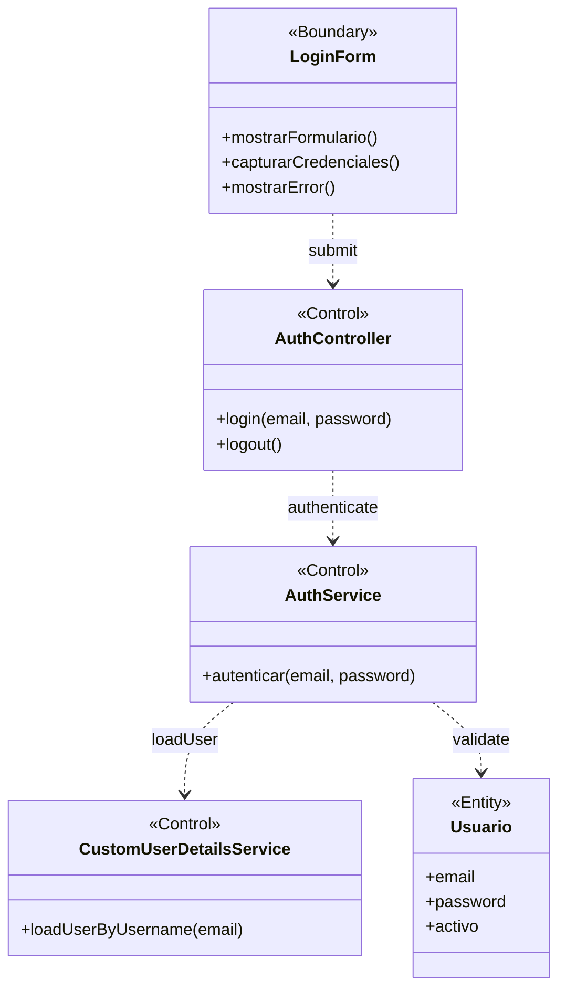

### BCE02: Ver Dashboard
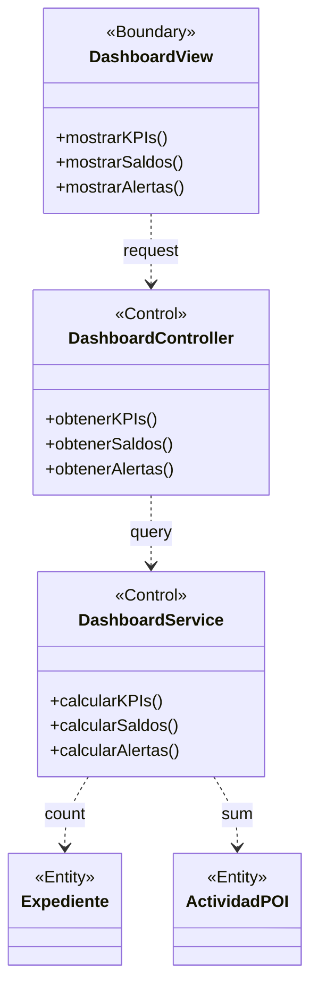

### BCE03: Crear Expediente
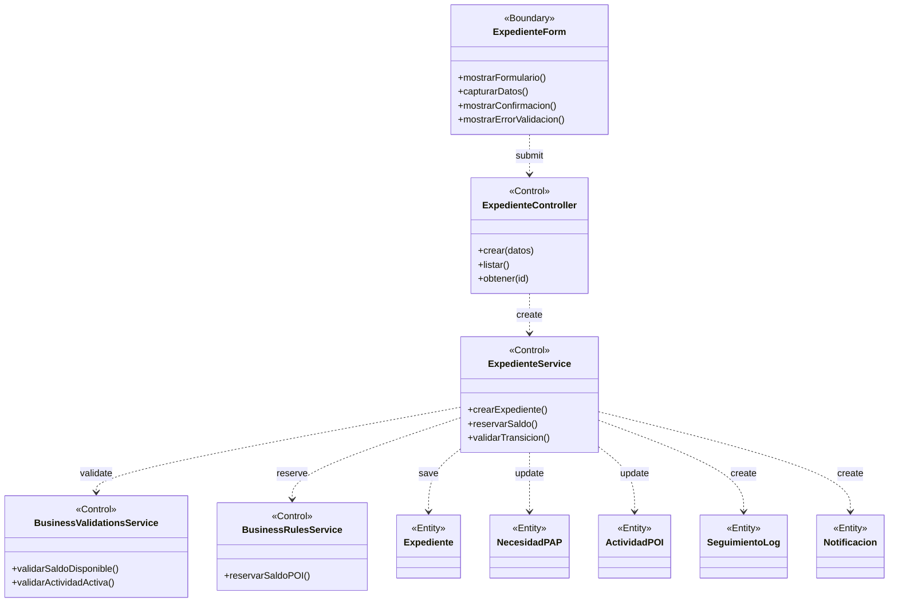

### BCE04: Cambiar Estado Expediente
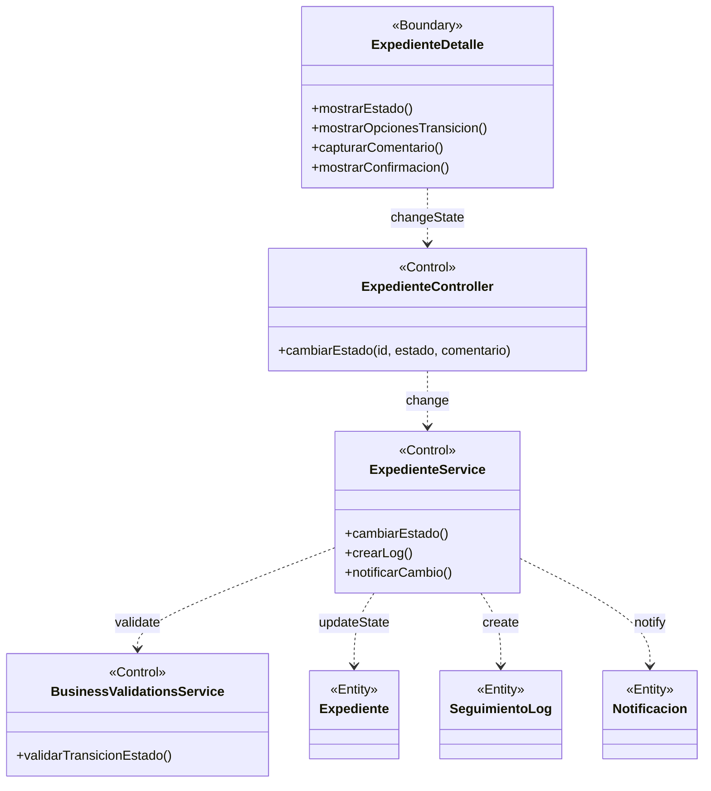

### BCE05: Adjuntar Documento
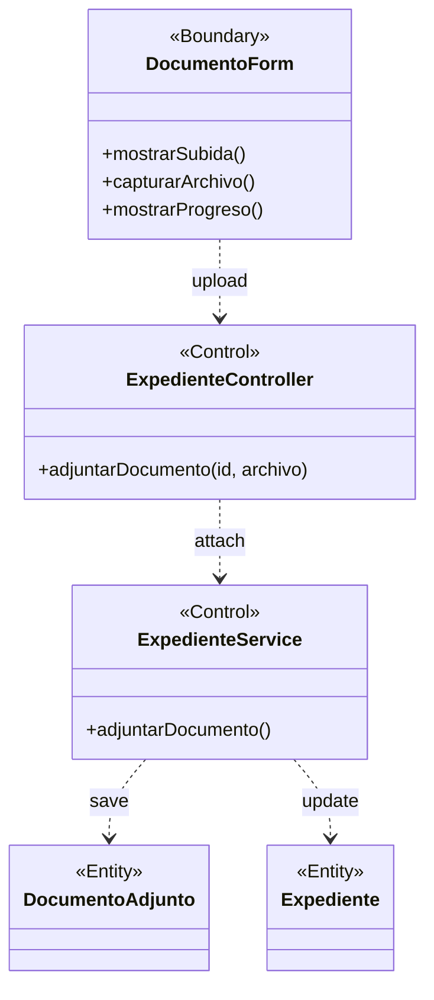

### BCE06: Gestionar Techo Presupuestal
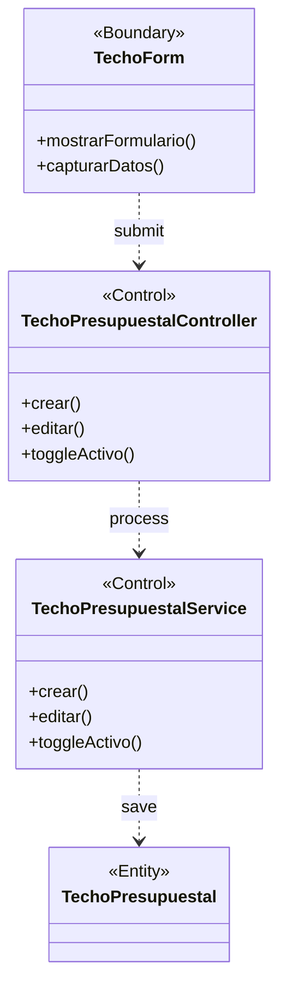

### BCE07: Gestionar Actividad POI
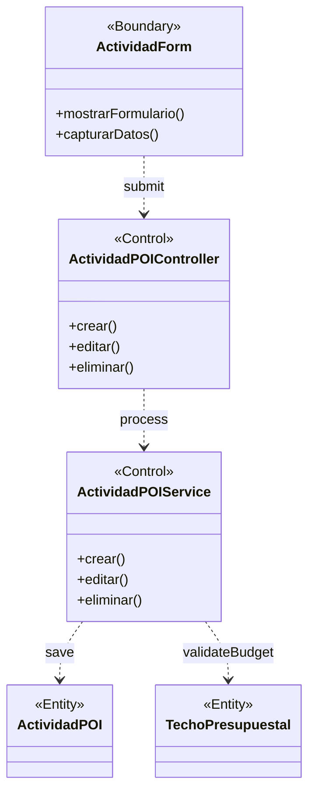

### BCE08: Gestionar Necesidad PAP
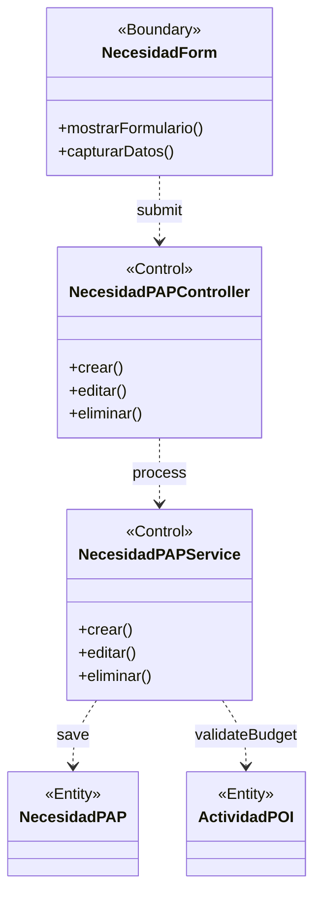

### BCE09: Gestionar Nota Modificatoria
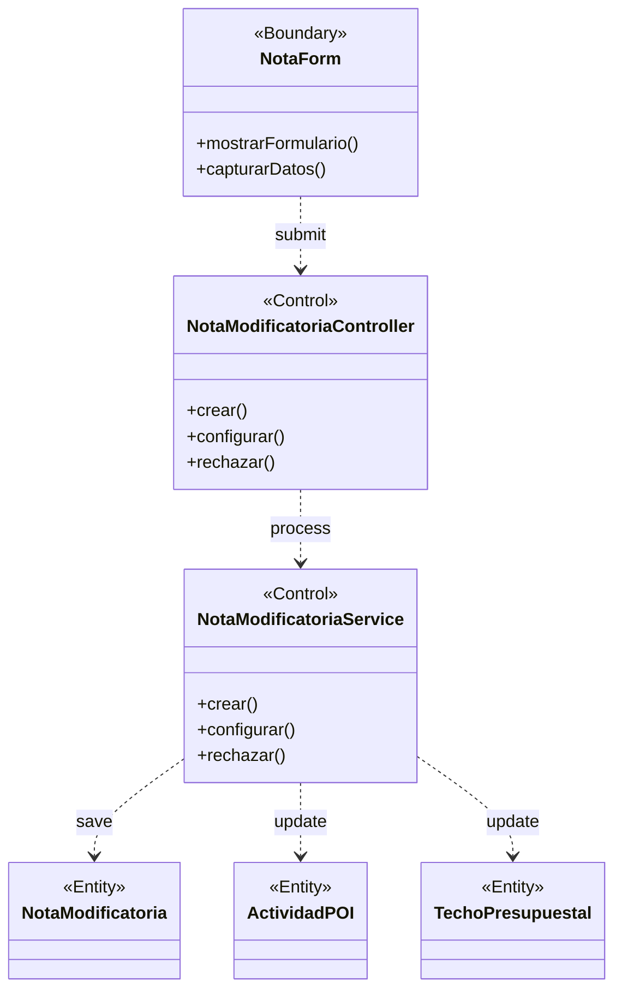

### BCE10: Ver Reportes
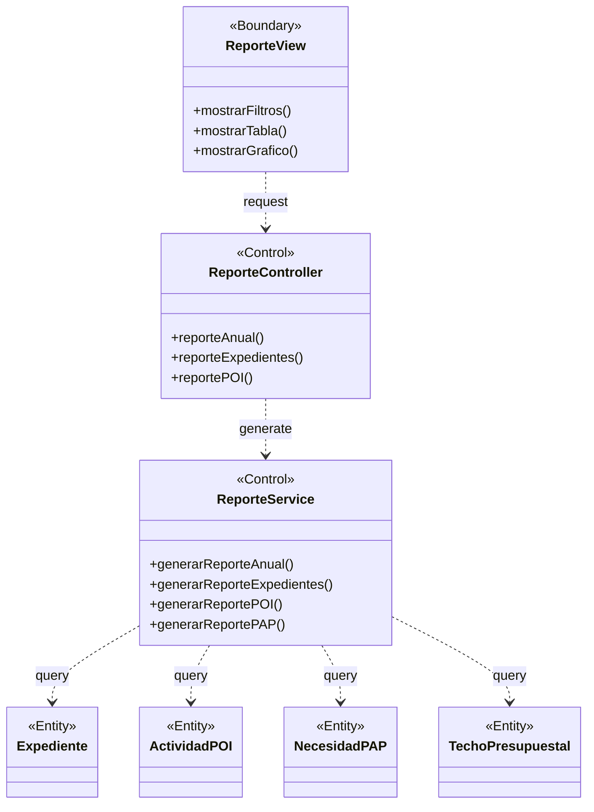

### BCE11: Gestionar Usuarios
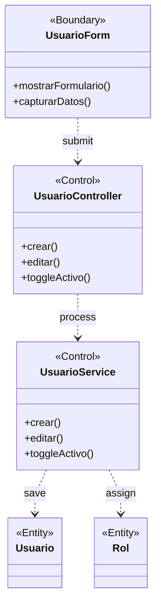

### BCE12: Gestionar Notificaciones
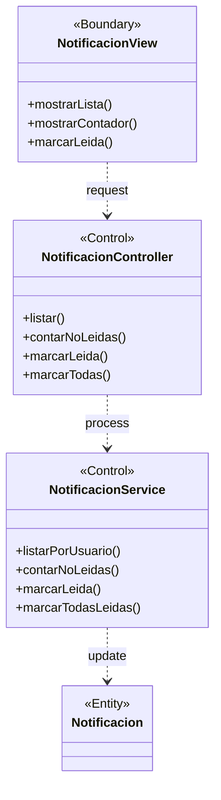

### BCE13: Rastrear Expediente (Público)
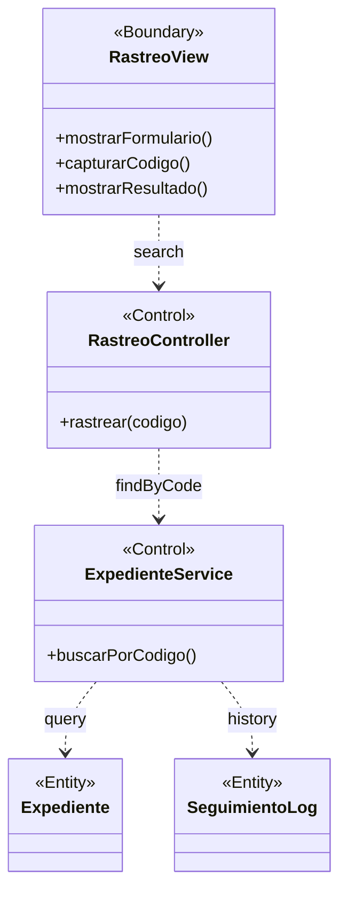

### BCE14: Cerrar Sesión
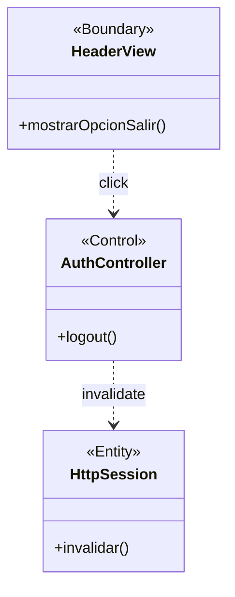

## Entregables
1. **BCE-{CU}.md** — Documento fuente por CU con diagrama BCE en Mermaid
2. **BCE-completo.md** — Documento agregado con los 14 diagramas
3. **BCE-completo.docx** — Documento Word generado con pandoc
4. **Archivos StarUML** — `.mdj` con diagramas de clase con estereotipos

## Verificación de calidad ICONIX
- [ ] Cada diagrama tiene al menos 1 Boundary, 1 Control, 1 Entity
- [ ] Actores solo se conectan a Boundary objects
- [ ] Boundary solo se conecta a Control objects
- [ ] Control se conecta a Entity y otros Control
- [ ] Entity nunca se conecta directamente a Boundary
- [ ] El diagrama cubre el flujo completo del CU (básico + alterno)
- [ ] Los nombres de los objetos reflejan su implementación real
- [ ] Existe trazabilidad: BCE-ID ↔ CU-ID ↔ RF-ID ↔ SSD-ID
