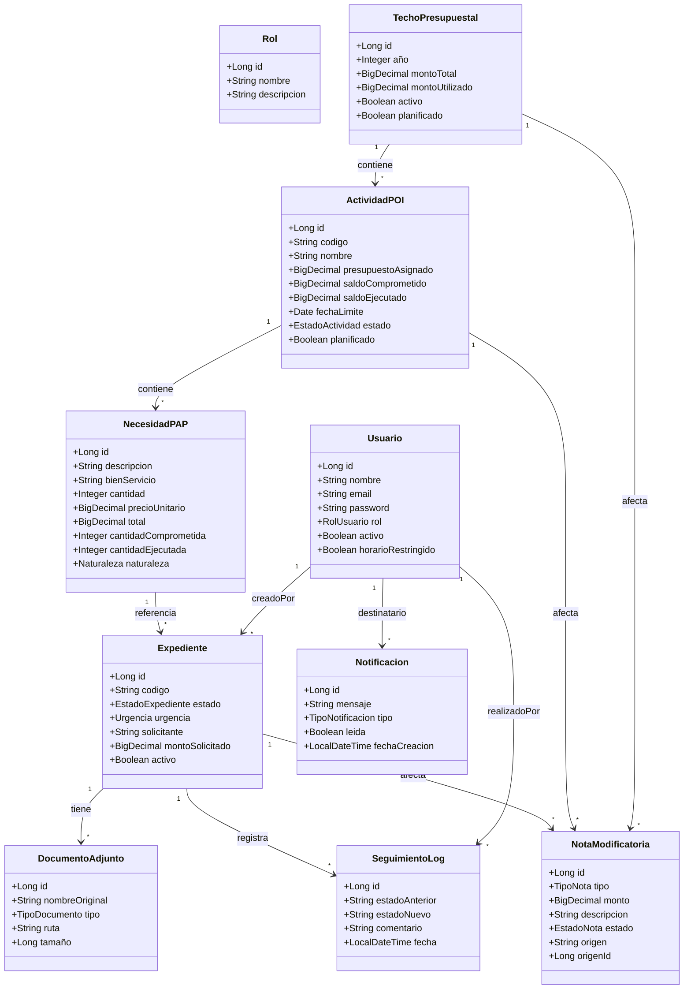

# SKILL: Diagramas ERS (Especificación de Requisitos de Software) — ISO 29148 + ICONIX Fase 1

## Propósito
Generar la **Especificación de Requisitos de Software (ERS/SRS)** completa para SISEXP-UPLA siguiendo la metodología **ICONIX (Fase 1)** y el estándar **ISO/IEC 29148:2018**. La ERS documenta actores, requisitos funcionales (RF), casos de uso (CU), y la trazabilidad entre ellos.

## Estructura ISO/IEC 29148:2018
La ERS debe contener las siguientes secciones (adaptado del estándar):

| Sección | Contenido | Estado SISEXP |
|---------|-----------|:--------:|
| 1. Introducción | Propósito, alcance, definiciones | ✅ Existe |
| 2. Descripción general | Perspectiva, funciones, características usuario | ✅ Existe |
| 3. Requisitos específicos | RF, RNF, interfaces | 🔄 Actualizar |
| 4. Modelo de casos de uso | Diagramas CU + especificaciones | 🔄 Actualizar |
| 5. Apéndices | Glosario, referencias | ✅ Existe |

## Metodología ICONIX — Fase 1: Análisis de Requisitos

### Artefactos ICONIX en Fase 1
1. **Modelo de Dominio** → `classDiagram` (entidades + relaciones)
2. **Diagrama de Casos de Uso** → `flowchart TD` (actores + CU)
3. **Especificación de CU** → texto estructurado por CU
4. **Matriz de trazabilidad** → RF ↔ CU ↔ Clases ↔ SSD ↔ BCE

### Reglas para Diagramas de Casos de Uso (StarUML)
- `usecaseDiagram` de Mermaid **NO** es compatible con StarUML
- Usar `flowchart TD` (top-down) para modelar Casos de Uso en StarUML
- Cada actor es un rectángulo con `[Actor]`
- Cada CU es un rectángulo con bordes redondeados `(CU-nombre)`
- Las flechas conectan actores con CU

## Actores del Sistema (6)

| Actor | Descripción | Rol asociado |
|-------|-------------|:--------:|
| Administrador | Gestión total del sistema, bypass horario 24/7 | Administrador |
| Coordinador | Gestión presupuestal (techos, POI, PAP) | Coordinacion |
| Secretaria | Creación y gestión de expedientes | Secretaria |
| Director | Aprobación/rechazo de expedientes | Director |
| Laboratorio | Creación de expedientes (solo propios) | Laboratorio |
| Decanato | Consulta de reportes y lectura | Decanato |
| Visitante | Rastreo público de expedientes | Sin autenticación |

## Requisitos Funcionales (RF) — 14 Casos de Uso

| ID | CU | Actor(es) | RF |
|:--:|:--:|-----------|:----:|
| RF01 | CU01: Iniciar Sesión | Todos | El sistema debe autenticar usuarios con email y password, y mantener sesión activa por 30 días (remember-me) |
| RF02 | CU02: Ver Dashboard | Todos | El sistema debe mostrar KPIs: total expedientes, distribución por estado, saldos POI, y alertas de vencimiento |
| RF03 | CU03: Crear Expediente | Laboratorio, Secretaria | El sistema debe crear expedientes con datos de solicitud, urgencia, y referencia a necesidad PAP, reservando saldo |
| RF04 | CU04: Cambiar Estado Expediente | Secretaria, Director | El sistema debe permitir transiciones de estado: Borrador→En_revision, En_revision→Aprobado/Rechazado/Observado, etc. |
| RF05 | CU05: Adjuntar Documento | Laboratorio, Secretaria | El sistema debe permitir adjuntar metadatos de documentos a un expediente |
| RF06 | CU06: Gestionar Techo Presupuestal | Admin, Coordinacion | El sistema debe CRUD de techos presupuestales por año con monto total |
| RF07 | CU07: Gestionar Actividad POI | Admin, Coordinacion | El sistema debe CRUD de actividades POI dentro de un techo |
| RF08 | CU08: Gestionar Necesidad PAP | Admin, Coordinacion | El sistema debe CRUD de necesidades PAP dentro de una actividad POI |
| RF09 | CU09: Gestionar Nota Modificatoria | Admin, Coordinacion, Secretaria, Lab, Director | El sistema debe crear y procesar notas modificatorias que alteren saldos |
| RF10 | CU10: Ver Reportes | Admin, Coordinacion, Director, Decanato | El sistema debe generar reportes anuales, por expediente, POI y PAP con detalle |
| RF11 | CU11: Gestionar Usuarios | Admin | El sistema debe CRUD de usuarios con asignación de roles |
| RF12 | CU12: Gestionar Notificaciones | Todos | El sistema debe notificar cambios de estado a los usuarios involucrados |
| RF13 | CU13: Rastrear Expediente | Visitante | El sistema debe permitir rastreo público de expedientes por código |
| RF14 | CU14: Cerrar Sesión | Todos | El sistema debe cerrar la sesión del usuario y redirigir al login |

## Requisitos No Funcionales (RNF)

| ID | Tipo | Descripción |
|:--:|:----:|:------------|
| RNF01 | Seguridad | Contraseñas almacenadas con BCrypt, sesión HTTP con cookie segura |
| RNF02 | Horario | Restricción de acceso 8am-8pm Lima, excepto Admin |
| RNF03 | Rendimiento | Carga de dashboard < 2 segundos, consultas optimizadas con índices |
| RNF04 | Disponibilidad | 99.5% uptime, deploy en Railway con PostgreSQL |
| RNF05 | Escalabilidad | Arquitectura Spring Boot stateless horizontalmente escalable |
| RNF06 | Mantenibilidad | Código documentado, pruebas unitarias en servicios críticos |
| RNF07 | Usabilidad | Interfaz responsive con Bootstrap 5.3, accesibilidad WCAG 2.1 |
| RNF08 | Integridad | Transacciones ACID en operaciones de saldo (reserva/ejecución/liberación) |

## Modelo de Dominio (classDiagram)

## Matriz de Trazabilidad ICONIX

| CU | RF | Clase(s) afectadas | SSD | BCE |
|:--:|:--:|:------------------:|:---:|:---:|
| CU01 | RF01 | Usuario | SSD01 | BCE01 |
| CU02 | RF02 | DashboardService | SSD02 | BCE02 |
| CU03 | RF03 | Expediente, NecesidadPAP | SSD03 | BCE03 |
| CU04 | RF04 | Expediente, SeguimientoLog | SSD04 | BCE04 |
| CU05 | RF05 | DocumentoAdjunto | SSD05 | BCE05 |
| CU06 | RF06 | TechoPresupuestal | SSD06 | BCE06 |
| CU07 | RF07 | ActividadPOI | SSD07 | BCE07 |
| CU08 | RF08 | NecesidadPAP | SSD08 | BCE08 |
| CU09 | RF09 | NotaModificatoria | SSD09 | BCE09 |
| CU10 | RF10 | ReporteService | SSD10 | BCE10 |
| CU11 | RF11 | Usuario, Rol | SSD11 | BCE11 |
| CU12 | RF12 | Notificacion | SSD12 | BCE12 |
| CU13 | RF13 | Expediente | SSD13 | BCE13 |
| CU14 | RF14 | — (sesión) | SSD14 | BCE14 |

## Entregables
1. **ERS.md** — Documento fuente en Markdown (incluye todas las secciones ISO 29148)
2. **ERS.docx** — Documento Word generado con pandoc
3. **Diagrama de Casos de Uso** — `flowchart TD` en Mermaid + StarUML
4. **Modelo de Dominio** — `classDiagram` en Mermaid + StarUML
5. **Matriz de trazabilidad** — Tabla completa RF ↔ CU ↔ Clases ↔ SSD ↔ BCE

## Verificación de calidad ISO 29148
- [ ] Cada requisito tiene ID único (RF01-RF14, RNF01-RNF08)
- [ ] Cada requisito es verificable y no ambiguo
- [ ] Los actores están claramente definidos
- [ ] Los casos de uso cubren todos los RF
- [ ] Existe trazabilidad bidireccional RF ↔ CU
- [ ] El modelo de dominio cubre todas las entidades
- [ ] Las relaciones entre entidades son correctas (cardinalidad, direccionalidad)
- [ ] El documento sigue la estructura ISO/IEC 29148
