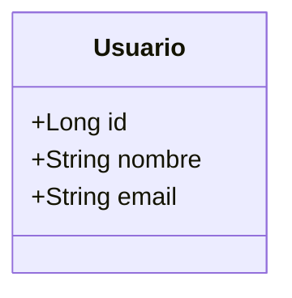
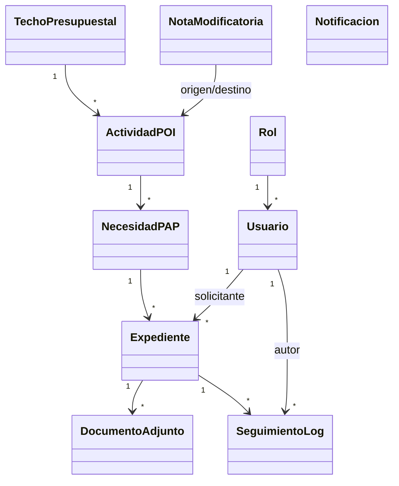
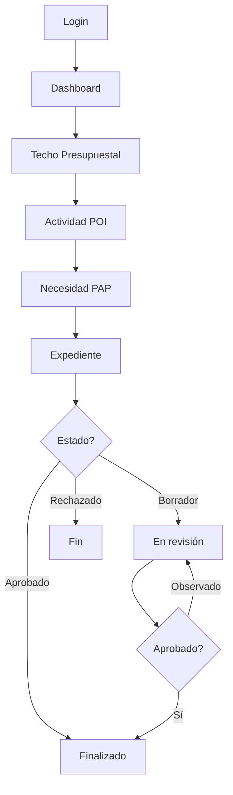

# Skill: Docs SISEXP-UPLA — Documentación Técnica Profesional

---

## 1. DOCUMENT FORMAT RULES

### 1.1 Headings
- **H1** (`#`): Black, bold, centered — main document title
- **H2** (`##`): Black, bold, left-aligned — section headers
- **H3** (`###`): Dark gray, bold — sub-section headers
- **H4** (`####`): Medium gray, bold — detail headers
- Always use `**` for bold in markdown

### 1.2 Tables — ALL BORDERS VISIBLE
```markdown
| Col A | Col B | Col C |
|:------|:-----:|------:|
| Left-aligned | Center | Right |
```

Rules:
- Header row ALWAYS has pipe separators
- Use `|:---|` for left, `|:---:|` for center, `|---:|` for right alignment
- Every row has complete borders (opening `|` and closing `|`)
- Include separator line after header: `|-----|-----|-----|`
- Multi-word cells: leave spaces around content for readability

### 1.3 Page Configuration (for pandoc → DOCX)
Add this at top of every document:
```html
<!--
pandoc config:
  papersize: a4
  margin-left: 2cm
  margin-right: 2cm
  margin-top: 2cm
  margin-bottom: 2cm
  fontsize: 11pt
-->
```

Pandoc command:
```bash
pandoc documento.md -o documento.docx \
  --from=markdown --to=docx \
  --reference-doc=template.docx \
  -V lang=es
```

### 1.4 Diagrams (Mermaid)
Embed in markdown code blocks:
````markdown

````

Supported types: `classDiagram`, `flowchart TD/LR`, `sequenceDiagram`, `erDiagram`

**NO** `%%{init}...` blocks (rejected by StarUML).
**NO** `usecaseDiagram` (use flowchart instead).

---

## 2. STANDARD DOCUMENT SECTIONS

Every project document should include:

### 2.1 Cover Page
```
# SISEXP-UPLA
## [Document Title]
### Universidad Peruana Los Andes
#### Arquitectura de Software — 2026
```

### 2.2 Table of Contents
Auto-generated by pandoc from headings.

### 2.3 Introduction
- Project purpose: Sistema de Seguimiento y Control de Expedientes
- Tech stack: Spring Boot 3.4.1 + Java 17 + PostgreSQL + Thymeleaf + React SPA
- Deployment: Railway (Docker multi-stage)

### 2.4 Domain Model


### 2.5 Entity Catalog
Table format with ALL borders:
```markdown
| Entidad | Tabla | Descripción | Atributos clave |
|:--------|:------|:------------|:----------------|
| Usuario | usuarios | Usuarios del sistema con roles | id, nombre, email, password, rol, activo, horarioRestringido |
...
```

### 2.6 API Reference
Table format:
```markdown
| Método | Endpoint | Auth | Descripción | Rol mínimo |
|:-------|:---------|:----:|:------------|:-----------|
| POST | /api/auth/login | No | Iniciar sesión | - |
...
```

### 2.7 Flow Diagrams


### 2.8 Role-Permission Matrix
```markdown
| Módulo | Admin | Coord | Secretaria | Director | Lab | Decanato |
|:-------|:-----:|:-----:|:----------:|:--------:|:---:|:--------:|
| Dashboard | ✓ | ✓ | ✓ | ✓ | ✓ | ✓ |
| Expedientes | ✓ | ✓ | ✓ | ✓ | ✓ | — |
...
```

---

## 3. SPRING BOOT USAGE GUIDE

### 3.1 Project Setup
```bash
# Clone
git clone https://github.com/LuchitoAE/Sisexp-Upla-SpringBoot.git
cd Sisexp-Upla-SpringBoot

# Run locally (H2 in-memory)
cd sisexp
./mvnw spring-boot:run

# Access
http://localhost:8080/login
```

### 3.2 Credentials (seed data)
| Rol | Email | Password |
|:----|:------|:---------|
| Administrador | jefe@upla.edu.pe | jefe123 |
| Coordinacion | coord@upla.edu.pe | coord123 |
| Secretaria | secretaria@upla.edu.pe | secretaria123 |
| Director | director@upla.edu.pe | director123 |
| Laboratorio | lab@upla.edu.pe | lab123 |
| Decanato | decanato@upla.edu.pe | decanato123 |

### 3.3 Workflow: Crear Expediente
1. **Admin/Coord**: crea Techo Presupuestal (año + monto)
2. **Admin/Coord**: crea Actividad POI vinculada al techo
3. **Admin/Coord**: añade Necesidades PAP a la actividad
4. **Admin/Coord**: finaliza el PAP y el POI
5. **Lab/Director/Secretaria**: crea Expediente seleccionando techo → actividad → ítem PAP
6. **Coordinacion**: revisa, aprueba, observa o rechaza
7. **Secretaria**: finaliza o deriva

### 3.4 Horario Laboral
- 8:00 AM — 8:00 PM (hora Perú, UTC-5)
- Admin tiene bypass 24/7 (`horarioRestringido = false`)
- Otros roles ven pantalla "Sistema fuera de horario" fuera del rango

### 3.5 Base de Datos
- **Desarrollo**: H2 en memoria (`jdbc:h2:mem:sisexp`)
- **Producción**: PostgreSQL en Railway
- **Reset automático**: cada deploy ejecuta `TRUNCATE CASCADE` y reinserta seed data
- **Sin datos de prueba**: 0 necesidades, 0 expedientes, 0 logs, 0 notificaciones al iniciar

---

## 4. EXPORT TO DOCX

```bash
pandoc docs/NOMBRE_DOCUMENTO.md -o docs/NOMBRE_DOCUMENTO.docx \
  --from=markdown --to=docx \
  -V lang=es \
  --toc --toc-depth=3 \
  -V papersize=a4 \
  -V margin-left=2cm -V margin-right=2cm \
  -V margin-top=2cm -V margin-bottom=2cm
```

---

## 5. TEMPLATE: Full Project Doc

For a complete project documentation, generate a single .md file with:

1. Portada
2. Índice
3. Introducción y objetivos
4. Stack tecnológico
5. Modelo de dominio (diagrama + catálogo de entidades)
6. Diagrama de arquitectura (flowchart)
7. Catálogo de endpoints API
8. Matriz de roles y permisos
9. Flujo de negocio: Techo → POI → PAP → Expediente
10. Guía de instalación y ejecución
11. Guía de despliegue (Railway + Docker)
12. Credenciales y acceso
13. Horario laboral y restricciones
14. Mantenimiento y troubleshooting
