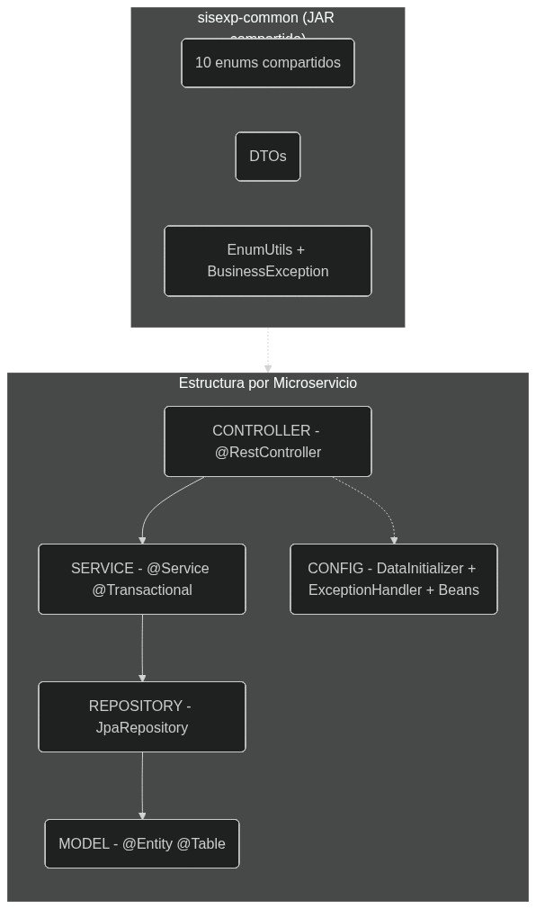
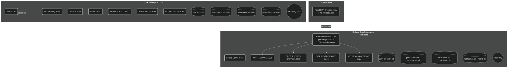

# **SISEXP-UPLA — Arquitectura Global**

Documentacion de los 3 diagramas de arquitectura global del sistema SISEXP-UPLA.

---

## **1. Diagrama de Arquitectura de Microservicios**


12 contenedores Docker Compose con 4 bases de datos PostgreSQL independientes, 4 microservicios Spring Boot, API Gateway, Eureka Server, RabbitMQ y NGINX como proxy inverso + servidor de la SPA React.

### Topologia de red

```
Browser (http://localhost:80)
  → NGINX (:80) — React SPA + proxy /api/*
    → API Gateway (:8080) — JWT + CORS + ActivityLog + Monitor
      ├── AUTH-SERVICE (:8081) ──── auth-db (:5433)
      ├── PRESUPUESTO-SERVICE (:8082) ──── presupuesto-db (:5434)
      ├── EXPEDIENTE-SERVICE (:8083) ──── expediente-db (:5435)
      │     └── RabbitMQ (:5672)
      │           └── NOTIFICACION-SERVICE (:8084) ──── notificacion-db (:5436)
      └── EUREKA (:8761) ← registran todos los servicios
```

### Tipos de conexiones

| **Linea** | **Protocolo** | **Entre** |
|:----------|:-------------|:----------|
| Solida azul | HTTP REST | nginx → gateway → servicios |
| Punteada naranja | HTTP REST | Servicios → Eureka (registro/heartbeat) |
| Segmentada verde | JDBC | Servicios → bases de datos PostgreSQL |
| Punteada morada | AMQP | Expediente → RabbitMQ → Notificacion |

### Contenedores

| **#** | **Contenedor** | **Puerto** | **Tecnologia** |
|:------|:---------------|:----------:|:---------------|
| 1 | sisexp-nginx | 80 | nginx:alpine + React 19 SPA |
| 2 | sisexp-api-gateway | 8080 | Spring Cloud Gateway + JwtAuthFilter |
| 3 | sisexp-eureka | 8761 | Netflix Eureka |
| 4 | sisexp-auth-service | 8081 | Spring Boot + PostgreSQL |
| 5 | sisexp-presupuesto-service | 8082 | Spring Boot + PostgreSQL + Apache POI |
| 6 | sisexp-expediente-service | 8083 | Spring Boot + PostgreSQL + RabbitMQ |
| 7 | sisexp-notificacion-service | 8084 | Spring Boot + PostgreSQL + RabbitMQ |
| 8 | sisexp-auth-db | 5433 | postgres:16-alpine (auth_db) |
| 9 | sisexp-presupuesto-db | 5434 | postgres:16-alpine (presupuesto_db) |
| 10 | sisexp-expediente-db | 5435 | postgres:16-alpine (expediente_db) |
| 11 | sisexp-notificacion-db | 5436 | postgres:16-alpine (notific_db) |
| 12 | sisexp-rabbitmq | 5672 | rabbitmq:3-management-alpine |

---

## **2. Diagrama de Componentes**



Cada microservicio implementa la misma estructura de capas Clean Architecture:

| **Capa** | **Anotacion** | **Responsabilidad** |
|:---------|:--------------|:--------------------|
| Controller | @RestController | Recibir peticiones HTTP, validar input, retornar DTOs/JSON |
| Service | @Service, @Transactional | Logica de negocio, reglas de validacion, orquestacion |
| Repository | extends JpaRepository | Acceso a datos, queries JPQL/nativas, paginacion |
| Model/Entity | @Entity, @Table | Mapeo objeto-relacional (JPA/Hibernate) |
| Config | @Configuration | Beans, DataInitializer (seed), GlobalExceptionHandler, RestTemplate, RabbitMQ |

### sisexp-common (JAR compartido)

Libreria interna importada por los 4 microservicios:

| **Paquete** | **Contenido** |
|:------------|:--------------|
| `enums/` | 10 enums compartidos (EstadoExpediente, Urgencia, Naturaleza, TipoNota, EstadoNota, TipoDocumento, EstadoActividad, TipoNotificacion, RolUsuario) |
| `dto/` | DTOs para transferencia entre servicios |
| `exception/` | BusinessException |
| `util/` | EnumUtils (parseSafe para evitar IllegalArgumentException) |

### Capas por tecnologia

| **Capa** | **Auth** | **Presupuesto** | **Expediente** | **Notificacion** |
|:---------|:---------|:----------------|:---------------|:-----------------|
| Controller | 3 clases | 6 clases | 1 clase | 1 clase |
| Service | 1 clase | 2 clases | 1 clase | 1 consumer |
| Repository | 1 interfaz | 4 interfaces | 3 interfaces | 1 interfaz |
| Entity | 1 entidad | 4 entidades | 3 entidades | 1 entidad |
| Config | Security + JWT + Exception | RestTemplate + Exception + DataInit | RabbitMQ + RestTemplate + Exception + DataInit | RabbitMQ + Exception |

---

## **3. Diagrama de Despliegue**



### Entornos

| **Entorno** | **Plataforma** | **Componentes** |
|:------------|:---------------|:----------------|
| **Produccion Backend** | Railway (PaaS, proyecto `38350e4a`) | 11 servicios: API Gateway (:8080), Eureka (:8761), 4 microservicios, 4 DBs PostgreSQL, RabbitMQ |
| **Produccion Frontend** | Vercel (CDN global) | React 19 SPA desde `frontend-ivory-nine-43.vercel.app` |
| **Desarrollo Local** | Docker Compose (Windows/Linux) | 12 contenedores en red `sisexp-net` |

### Railway — Variables criticas por servicio

| **Servicio** | **Variable** | **Valor** |
|:-------------|:-------------|:----------|
| TODOS | EUREKA_CLIENT_SERVICEURL_DEFAULTZONE | `http://sisexp-upla-springboot.railway.internal:8761/eureka` |
| TODOS | JWT_SECRET | `SisexpJwtSecret2026MicroservicesKey!` |
| auth-service | EUREKA_INSTANCE_HOSTNAME | `auth-service.railway.internal` |
| auth-service | SPRING_DATASOURCE_URL | `jdbc:postgresql://auth-db.railway.internal:5432/auth_db` |
| presupuesto-service | EUREKA_INSTANCE_HOSTNAME | `presupuesto-service.railway.internal` |
| presupuesto-service | SPRING_DATASOURCE_URL | `jdbc:postgresql://presupuesto-db.railway.internal:5432/presupuesto_db` |
| expediente-service | EUREKA_INSTANCE_HOSTNAME | `heartfelt-wonder.railway.internal` |
| expediente-service | SPRING_DATASOURCE_URL | `jdbc:postgresql://expediente-db.railway.internal:5432/expediente_db` |
| expediente-service | SPRING_RABBITMQ_HOST | `rabbitmq.railway.internal` |
| expediente-service | PRESUPUESTO_SERVICE_URL | `http://presupuesto-service.railway.internal:8082` |
| notificacion-service | EUREKA_INSTANCE_HOSTNAME | `notificacion-service.railway.internal` |
| notificacion-service | SPRING_DATASOURCE_URL | `jdbc:postgresql://notificacion-db.railway.internal:5432/notific_db` |
| notificacion-service | SPRING_RABBITMQ_HOST | `rabbitmq.railway.internal` |

### Vercel — Deteccion de entorno

```js
// public/config.js
if (localhost) → API_URL = "/api"          // nginx → gateway
else           → API_URL = "https://api-gateway-production-e01a.up.railway.app/api"
```

### Docker Compose local

```bash
# Construir y levantar
docker compose build && docker compose up -d

# Smoke test (20 endpoints)
docker compose -f docker-compose.yml -f docker-compose.test.yml run --rm tester

# Detener
docker compose down
```

---

## **4. API Gateway — Rutas (14)**

| **#** | **Path** | **Backend (Eureka LB)** | **Auth** |
|:------|:---------|:------------------------|:--------:|
| 0 | /api/auth/** | lb://auth-service | Mixto |
| 1 | /api/usuarios/** | lb://auth-service | JWT |
| 2 | /api/techos-presupuestales/** | lb://presupuesto-service | JWT |
| 3 | /api/actividades-poi/** | lb://presupuesto-service | JWT |
| 4 | /api/necesidades-pap/** | lb://presupuesto-service | JWT |
| 5 | /api/notas-modificatorias/** | lb://presupuesto-service | JWT |
| 6 | /api/expedientes/** | lb://expediente-service | Mixto |
| 7 | /api/dashboard/** | lb://presupuesto-service | JWT |
| 8 | /api/reportes/** | lb://presupuesto-service | JWT |
| 9 | /api/notificaciones/** | lb://notificacion-service | JWT |
| 10 | /api/health | lb://auth-service | No |
| 11 | /api/status | lb://auth-service | No |
| 12 | /api/admin/reset-presupuesto | lb://presupuesto-service | Admin |
| 13 | /api/admin/reset-expedientes | lb://expediente-service | Admin |

---

## **5. Resumen de Artefactos**

| **Artefacto** | **Cantidad** |
|:--------------|:------------:|
| Contenedores Docker | 12 |
| Microservicios Spring Boot | 4 |
| Bases de Datos PostgreSQL | 4 |
| API Gateway (Spring Cloud) | 1 |
| Service Discovery (Eureka) | 1 |
| Message Broker (RabbitMQ) | 1 |
| Endpoints REST | 44 |
| Entidades JPA | 9 |
| Enums compartidos | 10 |
| Actores del sistema | 8 |
| Casos de Uso documentados | 18 |
| Diagramas ICONIX totales | 23 |
| Tecnologias en el stack | 18 |

---

<div style="text-align: center; margin-top: 40px; padding: 20px; border-top: 3px solid #1e3a5f;">

**SISEXP-UPLA** — Arquitectura Global — Documentacion ICONIX

Universidad Peruana Los Andes — Arquitectura de Software — VIII Ciclo — Julio 2026

</div>
