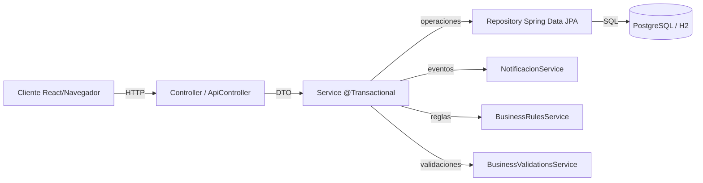
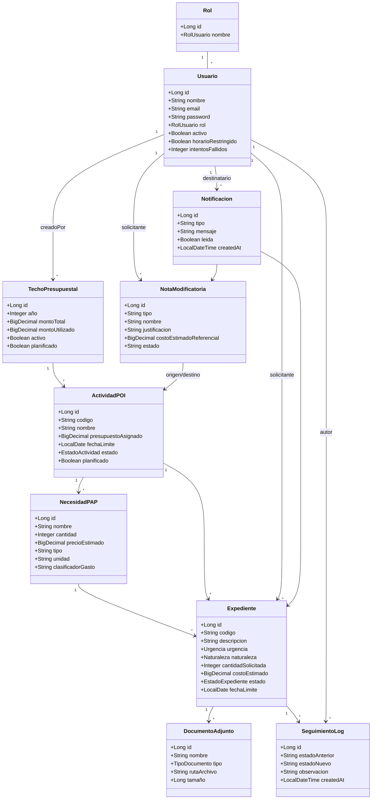
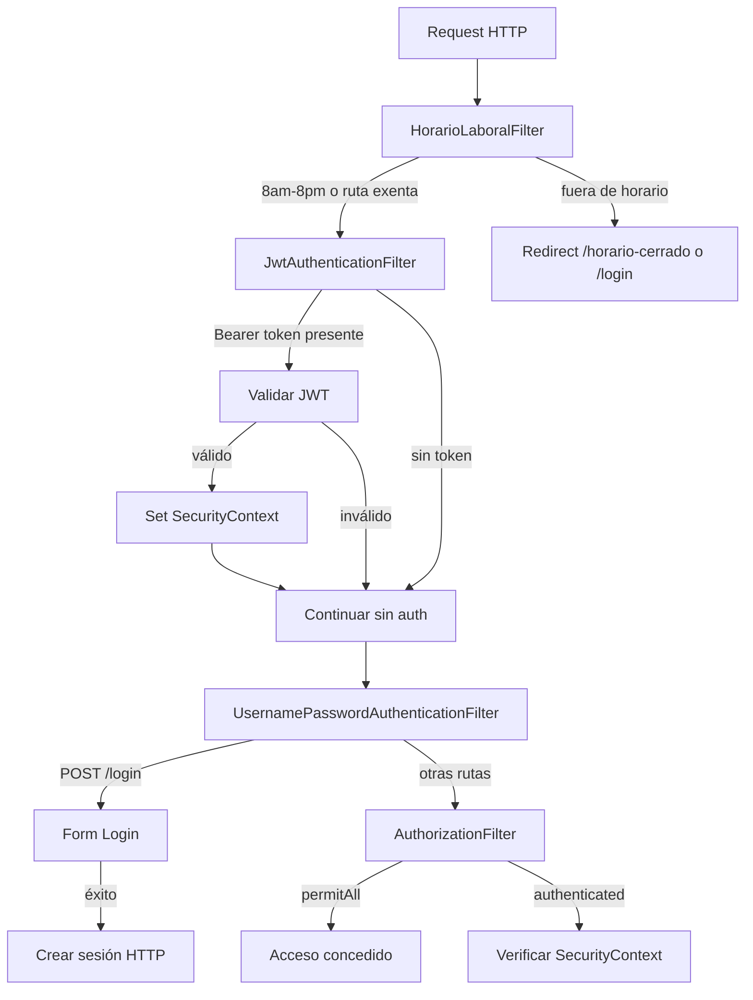
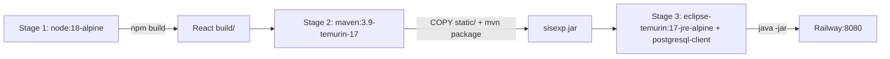
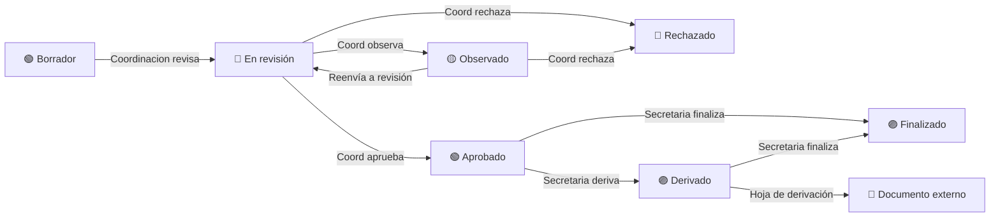

<!--
pandoc config:
  papersize: a4
  margin-left: 2cm
  margin-right: 2cm
  margin-top: 2cm
  margin-bottom: 2cm
  fontsize: 11pt
-->

# INFORME DE ARQUITECTURA DE SOFTWARE

## SISEXP-UPLA — Sistema de Seguimiento y Control de Expedientes

### Universidad Peruana Los Andes
### Facultad de Ingeniería — Arquitectura de Software
### 2026

---

# ÍNDICE

1. [Introducción](#1-introducción)
2. [Stack Tecnológico](#2-stack-tecnológico)
3. [Arquitectura en Capas](#3-arquitectura-en-capas)
4. [Modelo de Dominio](#4-modelo-de-dominio)
5. [Arquitectura de Seguridad](#5-arquitectura-de-seguridad)
6. [Capa API REST](#6-capa-api-rest)
7. [Arquitectura Frontend](#7-arquitectura-frontend)
8. [Arquitectura de Despliegue](#8-arquitectura-de-despliegue)
9. [Patrones de Diseño Identificados](#9-patrones-de-diseño-identificados)
10. [Comparación con Arquitectura Original](#10-comparación-con-arquitectura-original)
11. [Conclusiones](#11-conclusiones)
12. [Anexos](#12-anexos)

---

# 1. INTRODUCCIÓN

## 1.1 Contexto del Proyecto

SISEXP-UPLA es un sistema de seguimiento y control de expedientes desarrollado para la Universidad Peruana Los Andes. El proyecto original fue construido con **Express/React (JavaScript)** y posteriormente migrado a **Spring Boot 3.4.1 + Java 17** como parte del curso de Arquitectura de Software.

## 1.2 Objetivo del Sistema

Gestionar el ciclo presupuestal completo de expedientes universitarios, desde la planificación del techo presupuestal anual hasta la ejecución de expedientes individuales, incluyendo flujos de aprobación, documentos adjuntos, notificaciones y reportes.

## 1.3 Alcance Funcional

| Módulo | Descripción |
|:--------|:------------|
| **Dashboard** | Panel de control con KPIs, alertas tipo semáforo y saldos presupuestales en tiempo real |
| **Techo Presupuestal** | Gestión de presupuestos anuales con montos totales y porcentajes de utilización |
| **Actividades POI** | Planificación de actividades con fechas límite, presupuestos y estados |
| **Necesidades PAP** | Ítems de contratación (bienes/servicios) vinculados a POI |
| **Expedientes** | Ciclo completo: borrador → revisión → aprobado/observado/rechazado → finalizado/derivado |
| **Notas Modificatorias** | Solicitudes de inclusión de ítems con flujo de aprobación |
| **Reportes** | 4 tipos: informe anual, expedientes, POI general, PAP general + export CSV/PDF |
| **Usuarios** | Gestión de usuarios con 6 roles y restricción horaria |
| **Notificaciones** | Sistema de alertas por cambios de estado y fechas límite |

---

# 2. STACK TECNOLÓGICO

## 2.1 Backend — Spring Boot 3.4.1

| Dependencia | Versión | Rol Arquitectónico |
|:------------|:--------|:-------------------|
| **spring-boot-starter-parent** | 3.4.1 | Parent POM — gestión centralizada de versiones |
| **spring-boot-starter-web** | — | MVC REST + Tomcat embebido + Jackson JSON |
| **spring-boot-starter-data-jpa** | — | Spring Data JPA + Hibernate 6.6.4 ORM |
| **spring-boot-starter-security** | — | Spring Security 6 — autenticación y autorización |
| **spring-boot-starter-validation** | — | Bean Validation (`@Valid`, `@NotBlank`, `@Min`) |
| **spring-boot-starter-thymeleaf** | — | Motor de plantillas server-side (vistas MVC) |
| **thymeleaf-extras-springsecurity6** | — | Integración Thymeleaf + Security (`sec:authorize`) |
| **postgresql** | — | Driver JDBC PostgreSQL (producción Railway) |
| **h2** | — | Base de datos en memoria (desarrollo local) |
| **jjwt-api / jjwt-impl / jjwt-jackson** | 0.12.6 | JSON Web Token — generación y validación HMAC-SHA |
| **spring-boot-starter-test** | — | JUnit 5 + Mockito + Spring Test |

## 2.2 Frontend — React 19.2.7

| Tecnología | Propósito |
|:-----------|:----------|
| **React 19.2.7** | Framework SPA — componentes, hooks, estado |
| **React DOM 19.2.7** | Renderizado en navegador |
| **React Scripts 5.0.1** | Build tooling (Webpack, Babel, DevServer de CRA) |
| **CSS Variables nativas** | Design tokens — colores, sombras, radios, espaciados |
| **Inter (Google Fonts)** | Tipografía principal — legibilidad, pesos 400-900, variable |
| **Fetch API nativa** | Cliente HTTP sin dependencias externas |

## 2.3 Infraestructura

| Herramienta | Propósito |
|:------------|:----------|
| **Docker** | Contenedores multi-stage (3 etapas: frontend → backend → runtime) |
| **Railway** | Plataforma de despliegue (PaaS) con PostgreSQL vinculado |
| **GitHub** | Control de versiones + CI/CD automático vía Railway |
| **PostgreSQL 18** | Base de datos relacional en producción |
| **H2** | Base de datos en memoria para desarrollo local |

---

# 3. ARQUITECTURA EN CAPAS

## 3.1 Estructura de Paquetes

```
com.upla.sisexp/
├── config/           # 5 archivos  — Configuración (Security, DataInit, Web, MethodSecurity, DB Index)
├── security/         # 5 archivos  — Filtros, JWT, UserDetails, HorarioLaboral
├── model/            # 10 entidades JPA
├── enums/            # 9 tipos enumerados del dominio
├── repository/       # 10 interfaces Spring Data JPA
├── dto/              # 3 DTOs con @Valid
├── service/          # 11 servicios (@Transactional)
├── controller/       # 10 controladores MVC Thymeleaf (41 endpoints)
├── api/              # 12 controladores REST (69 endpoints)
└── exception/        # BusinessException + GlobalExceptionHandler
```

**Total: 77 archivos Java en 11 paquetes organizados por capa.**

## 3.2 Jerarquía de Llamadas (MVC Enriquecido)



## 3.3 Patrón de Comunicación

| Capa | Responsabilidad | Restricciones |
|:-----|:----------------|:--------------|
| **Controller** | Recibir HTTP, validar DTOs, delegar a Service | Sin lógica de negocio, sin acceso directo a repositorios |
| **Service** | Lógica de negocio, transacciones, orquestación | `@Transactional`, inyecta repositorios y otros servicios |
| **Repository** | Acceso a datos, consultas JPQL/naming convention | Extiende `JpaRepository`, sin lógica |
| **Model** | Entidades JPA con anotaciones de mapeo | `@Entity`, `@Table`, `@JsonIgnoreProperties` |

---

# 4. MODELO DE DOMINIO

## 4.1 Diagrama de Clases



## 4.2 Jerarquía Presupuestal

```
TechoPresupuestal (año, montoTotal)
  └── ActividadPOI (código, presupuesto, fechaLímite)
        └── NecesidadPAP (bien/servicio, cantidad, precio)
              └── Expediente (solicitante, urgencia, estado)
                    ├── DocumentoAdjunto (TDR, cotización, informe)
                    ├── SeguimientoLog (historial de cambios)
                    └── Notificación (alertas por evento)
```

## 4.3 Catálogo de Entidades

| Entidad | Tabla | Registros Seed | Relaciones |
|:--------|:------|:--------------|:-----------|
| **Usuario** | `usuarios` | 6 | solicitante/creador de expedientes, logs, techos, notificaciones, notas |
| **Rol** | `roles` | 6 | Referenciado por Usuario vía enum RolUsuario |
| **TechoPresupuestal** | `techos_presupuestales` | 2 | `1:N` → ActividadPOI, `N:1` → Usuario (creadoPor) |
| **ActividadPOI** | `actividades_poi` | 9 | `N:1` → Techo, `1:N` → NecesidadPAP, Expediente |
| **NecesidadPAP** | `necesidades_pap` | 0 | `N:1` → ActividadPOI, `1:N` → Expediente |
| **Expediente** | `expedientes` | 0 | `N:1` → ActividadPOI, NecesidadPAP, Usuario; `1:N` → Docs, Logs |
| **DocumentoAdjunto** | `documentos_adjuntos` | 0 | `N:1` → Expediente |
| **SeguimientoLog** | `seguimiento_logs` | 0 | `N:1` → Expediente, Usuario |
| **NotaModificatoria** | `notas_modificatorias` | 0 | `N:1` → Usuario, ActividadPOI (origen/existente) |
| **Notificación** | `notificaciones` | 0 | `N:1` → Usuario, Expediente |

## 4.4 Enumeraciones del Dominio

| Enum | Cantidad | Valores |
|:-----|:--------|:--------|
| **RolUsuario** | 6 | Administrador, Coordinacion, Secretaria, Director, Laboratorio, Decanato |
| **EstadoExpediente** | 7 | Borrador, En_revision, Aprobado, Rechazado, Finalizado, Observado, Derivado |
| **Urgencia** | 3 | Urgente, No_tan_urgente, Puede_esperar |
| **Naturaleza** | 2 | Bien, Servicio |
| **EstadoActividad** | 4 | Pendiente, En_proceso, Finalizada, Extemporanea |
| **TipoDocumento** | 4 | TDR, Especificaciones_Tecnicas, Cotizacion, Informe_Tecnico |
| **TipoNota** | 2 | inclusion_item, inclusion_actividad |
| **EstadoNota** | 3 | Pendiente, Configurada, Rechazada |
| **TipoNotificacion** | 7 | observacion, rechazo, aprobacion, alerta_fecha, nota_aprobada, nota_rechazada, info |

---

# 5. ARQUITECTURA DE SEGURIDAD

## 5.1 Visión General

Spring Security 6 implementa **doble autenticación simultánea**:

| Canal | Mecanismo | Cliente |
|:------|:----------|:--------|
| **Form Login** | Sesión HTTP + `JSESSIONID` + `remember-me` 30 días | React SPA embebida (cookies) |
| **JWT Bearer** | Token firmado HMAC-SHA, 30 días, header `Authorization: Bearer <token>` | Clientes externos API |

## 5.2 Cadena de Filtros



## 5.3 Configuración de Seguridad

| Aspecto | Configuración |
|:--------|:--------------|
| **Password Encoder** | BCrypt (`$2a$10`) |
| **CSRF** | Deshabilitado para `/api/**` y `/rastreo/**` |
| **CORS** | Orígenes permitidos: `https://sisexp-upla.vercel.app`, `http://localhost:3000`. Credenciales habilitadas. Solo rutas `/api/**` |
| **Sesión** | `SessionCreationPolicy.IF_REQUIRED`, máximo 10 sesiones, timeout 30 días |
| **Cookies** | `JSESSIONID`: `httpOnly=true`, `secure=true` (prod), `sameSite=none` (prod) |
| **Remember Me** | Token 30 días (2,592,000 segundos) |
| **Method Security** | `@EnableMethodSecurity` — `@PreAuthorize`, `@Secured` |
| **Auth Entry Point** | API: 401 JSON `{"error":"No autorizado"}`; MVC: redirect a `/login` |

## 5.4 Matriz de Roles y Permisos

| Ruta | Roles Requeridos |
|:-----|:-----------------|
| `/api/admin/**` | `ROLE_Administrador` |
| `/usuarios/**` | `ROLE_Administrador` |
| `/reportes/**` | `Administrador`, `Coordinacion`, `Director`, `Decanato` |
| `/techos/**` | `Administrador`, `Coordinacion`, `Secretaria`, `Director` |
| `/api/**` | Autenticado (JWT o sesión) |
| `/login`, `/rastreo/**`, `/api/health`, `/error`, `/static/**` | PermitAll (público) |

## 5.5 Horario Laboral

| Aspecto | Valor |
|:--------|:------|
| **Horario** | 8:00 AM — 8:00 PM (America/Lima, UTC-5) |
| **Rutas exentas** | `/login`, `/rastreo`, `/api`, `/api/health`, `/health`, `/error`, `/static`, `/favicon.ico`, `/index.html` |
| **Bypass Admin** | Usuario con `horarioRestringido = false` accede 24/7 |
| **Fuera de horario** | Autenticado → `/horario-cerrado`; No autenticado → `/login?horario` |

## 5.6 Sistema de Bloqueo por Intentos Fallidos

- Máximo **5 intentos fallidos** de login
- Bloqueo por **30 minutos**
- Validado en `CustomUserDetailsService` vía `BusinessValidationsService`
- El bloqueo se registra en `Usuario.bloqueadoHasta`

---

# 6. CAPA API REST

## 6.1 Controladores y Endpoints

| Controlador | Base Path | Endpoints | Métodos |
|:------------|:----------|:---------:|:--------|
| **ApiAuthController** | `/api/auth` | 3 | POST login, POST logout, GET /me |
| **ApiTechoPresupuestalController** | `/api/techos-presupuestales` | 7 | GET list, GET/{id}, POST, PUT, PATCH toggle, POST finalizar, POST desbloquear |
| **ApiActividadPOIController** | `/api/actividades-poi` | 10 | GET por techo, POST, PUT, DELETE, POST finalizar/desbloquear PAP |
| **ApiNecesidadPAPController** | `/api/necesidades-pap` | 7 | GET por actividad, POST, PUT, DELETE |
| **ApiExpedienteController** | `/api/expedientes` | 13 | GET, GET/{id}, POST, PUT estado, POST docs, GET docs, GET disponibilidad, GET historial, DELETE doc |
| **ApiNotaModificatoriaController** | `/api/notas-modificatorias` | 5 | GET, POST, PUT configurar, PUT rechazar |
| **ApiUsuarioController** | `/api/usuarios` | 8 | GET, GET/{id}, POST, PUT, PUT toggleActivo, PUT toggleHorario |
| **ApiNotificacionController** | `/api/notificaciones` | 7 | GET, GET count, GET no-leidas, PUT read, PUT read-all |
| **ApiDashboardController** | `/api/dashboard` | 3 | GET kpis, GET alertas, GET saldos |
| **ApiReportesController** | `/api/reportes` | 6 | GET anual/{año}, GET expedientes, GET poi, GET poi/{id}, GET pap, GET pap/{id} |
| **ApiBackupController** | `/api/admin` | 2 | GET backup (SQL), POST restore |
| **ApiHealthController** | `/api/health` | 1 | GET health check |
| **TOTAL** | | **69** | GET 35, POST 20, PUT/PATCH 13, DELETE 2 |

## 6.2 Formato de Respuesta

**Éxito**: JSON con datos específicos del endpoint
**Error de negocio**: `{"error": "mensaje descriptivo"}` con HTTP 400
**Error de autenticación**: `{"error": "No autorizado"}` con HTTP 401
**Error de validación**: `{"error": "mensaje", "campos": {...}}` con HTTP 400
**Error de autorización**: `{"error": "No tiene permisos"}` con HTTP 403

---

# 7. ARQUITECTURA FRONTEND

## 7.1 Estructura React SPA

```
frontend/src/
├── api/
│   ├── client.js              # HTTP client (fetch, cache 30s, handleResponse, credentials)
│   └── index.js               # Wrappers: authApi (login, logout, me), usuarioApi (CRUD)
├── components/
│   ├── Auth/Login.js          # Login con horario laboral client-side + seed buttons
│   ├── Common/
│   │   ├── Modals.js          # ModalProvider + useConfirm + useAlert (hooks reutilizables)
│   │   └── Placeholder.js     # Pantalla "Acceso restringido"
│   └── Layout/
│       ├── Sidebar.js         # Navegación con RBAC + sección Administración (Admin)
│       └── Header.js          # Barra superior con notificaciones (polling 30s)
├── contexts/
│   └── AuthContext.js         # Estado de autenticación (user, login, logout, loading, isAuth)
├── pages/
│   ├── Dashboard.js           # KPIs por año, alertas semáforo, saldos tiempo real
│   ├── ExpedientePage.js      # 3 vistas: lista → detalle → formulario
│   ├── TechoPresupuestalPage.js      # CRUD techos con paginación
│   ├── ActividadPOIPage.js           # CRUD POI + sub-CRUD Necesidades PAP
│   ├── NecesidadPAPPage.js           # Vista jerárquica solo-lectura
│   ├── ReportesPage.js               # 4 tabs + CSV/PDF
│   ├── NotaModificatoriaPage.js      # Doble rol: solicitud + bandeja aprobación
│   └── UsuariosPage.js              # CRUD usuarios con toggles
├── utils/
│   └── config.js              # ROL_LABEL, ROL_COLOR, PUEDE (12 acciones), NAV_PERMISSIONS
├── App.js                     # Orquestador: AuthProvider → ModalProvider → AppContent
├── App.css                    # Design system v3: 30+ variables CSS, badges, timeline
└── index.js                   # Entry point ReactDOM.createRoot
```

## 7.2 Navegación por Rol (Sidebar)

| Módulo | Admin | Coord | Secretaria | Director | Lab | Decanato |
|:-------|:-----:|:-----:|:----------:|:--------:|:---:|:--------:|
| **Dashboard** | ✓ | ✓ | ✓ | ✓ | ✓ | ✓ |
| **Expedientes** | ✓ | ✓ | ✓ | ✓ | ✓ | — |
| **Techo Presupuestal** | ✓ | ✓ | ✓ | ✓ | — | — |
| **Actividades POI** | ✓ | ✓ | ✓ | ✓ | ✓ | — |
| **PAP** | ✓ | ✓ | ✓ | ✓ | ✓ | ✓ |
| **Reportes** | ✓ | ✓ | — | ✓ | — | ✓ |
| **Notas Modif.** | ✓ | ✓ | ✓ | ✓ | ✓ | ✓ |
| **Usuarios** | ✓ | — | — | — | — | — |
| **Admin (backup)** | ✓ | — | — | — | — | — |

## 7.3 Permisos de Acción (PUEDE)

| Acción | Admin | Coord | Secretaria | Director | Lab |
|:-------|:-----:|:-----:|:----------:|:--------:|:---:|
| crearExpediente | ✓ | ✓ | ✓ | ✓ | ✓ |
| aprobarObservar | ✓ | ✓ | — | — | — |
| rechazar | ✓ | ✓ | — | — | — |
| finalizar | ✓ | ✓ | ✓ | — | — |
| derivar | ✓ | ✓ | ✓ | — | — |
| cambiarEstado | ✓ | ✓ | — | — | — |
| verDerivacion | ✓ | ✓ | ✓ | — | — |
| subirDocumento | ✓ | ✓ | ✓ | ✓ | ✓ |
| eliminarDocumento | ✓ | — | — | — | — |
| verTodosExpedientes | ✓ | ✓ | ✓ | — | — |
| verReportes | ✓ | ✓ | — | ✓ | — |

## 7.4 Design System v3

**Tecnología**: CSS-in-JS con variables CSS nativas (sin Bootstrap, sin Tailwind, sin Material UI).

| Token | Valor | Uso |
|:------|:------|:----|
| `--color-primary` | `#0ea5e9` | Botones principales, enlaces activos |
| `--color-sidebar` | `#0f172a` → `#1e293b` | Gradiente del sidebar |
| `--color-success` | `#10b981` | Aprobado, KPIs positivos |
| `--color-warning` | `#f59e0b` | Pendiente, alertas |
| `--color-danger` | `#ef4444` | Rechazado, error |
| `--radius-lg` | `12px` | Cards y paneles |
| `--shadow-card` | `0 1px 3px rgba(0,0,0,.08)` | Sombras de tarjetas |

**Componentes clave**: `.kpi-card`, `.table-card`, `.form-card`, `.btn-*`, `.badge-*` (30+ variantes por estado/rol/urgencia), `.timeline`, `.progress-presupuesto`.

---

# 8. ARQUITECTURA DE DESPLIEGUE

## 8.1 Dockerfile Multi-Stage



**3 etapas**:
1. **Frontend**: `node:18-alpine` → `npm install` → `npm run build` → React compilado
2. **Backend**: `maven:3.9-eclipse-temurin-17-alpine` → copia `pom.xml` + `src/` + React `build/static/` → `mvn clean package -DskipTests` → JAR
3. **Runtime**: `eclipse-temurin:17-jre-alpine` + `postgresql-client` (pg_dump/psql para backup) → `java -jar app.jar`

**Ventaja**: El JAR contiene tanto la API REST como el frontend React. Es un **monolito empaquetado** — un solo archivo, un solo deploy, sin necesidad de servidor web separado.

## 8.2 Railway

```toml
[build]
  builder = "DOCKERFILE"
  dockerfilePath = "sisexp/Dockerfile"

[deploy]
  numReplicas = 1
```

| Aspecto | Valor |
|:--------|:------|
| **URL producción** | `https://sisexp-web-production.up.railway.app` |
| **Base de datos** | PostgreSQL vinculado automáticamente |
| **Variables de entorno** | `SPRING_DATASOURCE_URL`, `SPRING_DATASOURCE_USERNAME`, `SPRING_DATASOURCE_PASSWORD`, `JWT_SECRET` |
| **Health check** | `GET /health` → `{"status":"UP"}` |
| **Despliegue** | Automático al hacer push a `master` en GitHub, o manual vía `railway up -e production -d` |
| **Perfil activo** | `SPRING_PROFILES_ACTIVE=prod` |

## 8.3 Configuración de Producción

| Propiedad | Valor | Propósito |
|:----------|:------|:----------|
| `server.port` | `${PORT:8080}` | Railway asigna puerto dinámico |
| `spring.jpa.hibernate.ddl-auto` | `update` | Actualiza esquema sin perder datos |
| `spring.jpa.properties.hibernate.jdbc.batch_size` | `30` | Optimización batch inserts/updates |
| `spring.thymeleaf.cache` | `true` | Caché de plantillas en producción |
| `server.servlet.session.cookie.secure` | `true` | Cookie solo en HTTPS |
| `server.servlet.session.cookie.same-site` | `none` | Cross-origin para clientes externos |
| `jwt.validity-ms` | `2592000000` | 30 días — igual que remember-me |

---

# 9. PATRONES DE DISEÑO IDENTIFICADOS

| # | Patrón | Implementación | Justificación |
|:--|:-------|:---------------|:--------------|
| 1 | **MVC** | `Controller → Service → Repository → Model` | Separación de responsabilidades en capas |
| 2 | **Repository** | Spring Data JPA `JpaRepository<Entity, Long>` | Abstracción de acceso a datos con consultas por naming convention |
| 3 | **DTO** | `ExpedienteFormDTO`, `CambiarEstadoDTO`, `DocumentoDTO` con `@Valid` | Transferencia de datos validada entre capas |
| 4 | **Singleton** | Beans Spring (`@Service`, `@Component`, `@Repository`, `@Controller`, `@Bean`) | Contenedor IoC gestiona ciclo de vida y ámbito singleton por defecto |
| 5 | **Observer** | `NotificacionService` disparado desde `ExpedienteService` al cambiar estado | Desacopla notificaciones de la lógica de negocio |
| 6 | **Strategy** | `NAV_PERMISSIONS`/`PUEDE` en frontend + `@PreAuthorize`/`hasRole` en backend | Comportamiento variable según rol sin modificar código base |
| 7 | **Chain of Responsibility** | Cadena de filtros Spring Security | Cada filtro procesa una responsabilidad independiente (horario, JWT, login) |
| 8 | **Template Method** | `OncePerRequestFilter` (superclase de `HorarioLaboralFilter`, `JwtAuthenticationFilter`) | Define esqueleto del algoritmo de filtrado |
| 9 | **Dependency Injection** | Inyección por constructor en 100% de servicios y controladores | Bajo acoplamiento, testeable, gestionado por el contenedor IoC |
| 10 | **Command** | `DataInitializer` implementa `CommandLineRunner` | Ejecuta seed data al iniciar la aplicación |
| 11 | **Global Exception Handler** | `@ControllerAdvice` con manejo dual API/MVC | Manejo centralizado de errores sin try-catch en cada controller |
| 12 | **SPA Fallback** | `WebConfig` con `PathResourceResolver` redirige rutas no-API a `/static/index.html` | Soporte para React Router sin configuración de servidor web |
| 13 | **Facade** | `BusinessRulesService` encapsula reglas complejas | Simplifica la interfaz de operaciones presupuestales (reservar, liberar, ejecutar) |
| 14 | **Multi-stage Build** | Dockerfile 3 etapas | Minimiza tamaño de imagen final (solo JRE, no Maven ni Node) |

---

# 10. COMPARACIÓN CON ARQUITECTURA ORIGINAL

## 10.1 Stack Original vs Migrado

| Aspecto | Express/React (v2.0) | Spring Boot 3.4.1 (v3.0) |
|:--------|:---------------------|:--------------------------|
| **Lenguaje** | JavaScript (Node.js 18) | Java 17 (LTS) |
| **Framework Backend** | Express 5 | Spring Boot 3.4.1 |
| **ORM** | Sequelize 6.37 (`sequelize.define()`) | Spring Data JPA + Hibernate 6.6 (`@Entity`) |
| **Frontend** | React 18 (Vercel) | React 19 (embebido en JAR) |
| **Autenticación** | JWT stateless (único) | **Dual**: Form Login + sesión + JWT Bearer |
| **Seguridad** | Middleware Express manual | Spring Security 6 (declarativo) |
| **Validación** | `businessValidations.service.js` | `@Valid` + `@NotBlank` + `BusinessValidationsService` |
| **Upload** | Multer | Spring `MultipartFile` |
| **Deploy** | Railway (backend) + Vercel (frontend) | Railway (monolito único) |
| **BD desarrollo** | SQLite (`data/sisexp.sqlite`) | H2 en memoria |
| **BD producción** | PostgreSQL (Supabase) | PostgreSQL (Railway) |
| **Cache** | — | Cache en memoria 30s (API client JS) |
| **Transacciones** | Manuales | `@Transactional` declarativo con rollback automático |

## 10.2 Lo que se Mantuvo Idéntico

- Modelo de datos: 11 entidades con las mismas relaciones y cardinalidad
- Ciclo presupuestal: Techo → POI → PAP → Expediente
- 7 estados de expediente con transiciones idénticas
- Código secuencial `EXP-YYYY-NNNN`
- 6 roles con 4 perfiles y 12 acciones RBAC
- Horario laboral 8am-8pm Perú
- JWT 30 días
- Seed data mínima (roles, usuarios, techos, POI)

## 10.3 Mejoras Arquitectónicas en la Migración

| Mejora | Descripción | Beneficio |
|:-------|:------------|:----------|
| **Seguridad declarativa** | Spring Security con reglas expresivas (`hasRole`, `hasAnyRole`) | Menos código, más legible, menos errores |
| **Manejo de errores unificado** | `GlobalExceptionHandler` dual API/MVC | Consistencia en respuestas de error |
| **Validación estandarizada** | Bean Validation (`@Valid`, `@NotBlank`) | Validación automática con mensajes claros |
| **Transacciones ACID** | `@Transactional` con rollback automático | Integridad de datos garantizada |
| **Despliegue simplificado** | Monolito empaquetado (1 JAR, 1 deploy) | Menos puntos de falla, menos configuración |
| **SPA servida desde JAR** | React build en `/static/`, sin Vercel | Sin dependencia de CDN externo |
| **Tipado fuerte** | Java 17 + tipos estáticos | Menos errores en tiempo de ejecución |
| **Control de serialización** | `@JsonIgnoreProperties`, `@JsonProperty(WRITE_ONLY)` | Previene exposición de datos sensibles |

---

# 11. CONCLUSIONES

## 11.1 Lecciones Aprendidas

1. **Spring Boot ofrece una arquitectura empresarial madura**: La inversión inicial en configuración (Security, JPA, Beans) se compensa con la robustez del framework en producción.

2. **La separación de capas (Controller → Service → Repository) es más estricta en Spring**: El tipado fuerte y la inyección de dependencias fuerzan un diseño más disciplinado que en Express/JavaScript.

3. **El monolito empaquetado es viable para aplicaciones de este tamaño**: 77 archivos Java, 8 páginas React, ~110 endpoints — todo en un solo JAR de ~50MB desplegado en 1 réplica.

4. **La doble autenticación (sesión + JWT) es una ventaja competitiva**: Permite servir tanto la SPA embebida como clientes externos sin duplicar lógica de negocio.

5. **La migración preservó el 100% de la funcionalidad**: Las mismas reglas de negocio, los mismos flujos, la misma experiencia de usuario — solo cambió el stack.

## 11.2 Ventajas de Spring Boot para Arquitectura Empresarial

| Ventaja | Impacto |
|:--------|:--------|
| **Tipado fuerte** | Errores detectados en compilación, no en producción |
| **Inyección de dependencias** | Bajo acoplamiento, alta testeabilidad |
| **Transacciones declarativas** | Rollback automático, integridad ACID |
| **Ecosistema Spring** | Security, Data JPA, Validation, Actuator — todo integrado |
| **Perfiles de configuración** | Dev vs Prod sin cambiar código |
| **Convención sobre configuración** | Menos boilerplate, más productividad |

## 11.3 Trabajo Futuro

- Implementar pruebas unitarias con JUnit 5 y Mockito
- Agregar Spring Boot Actuator para monitoreo en producción
- Implementar logging estructurado con SLF4J + Logback
- Agregar documentación OpenAPI/Swagger para la API REST
- Implementar WebSockets para notificaciones en tiempo real
- Migrar React a TypeScript para tipado fuerte en frontend

---

# 12. ANEXOS

## Anexo A — Endpoints API REST Completos

### Auth
| Método | Endpoint | Auth | Respuesta |
|:-------|:---------|:----:|:----------|
| POST | `/api/auth/login` | No | `{token, usuario}` |
| GET | `/api/auth/me` | Sí | `{id, nombre, email, rol}` |
| POST | `/api/auth/logout` | Sí | `{ok: true}` |

### Techos Presupuestales
| Método | Endpoint | Auth |
|:-------|:---------|:----:|
| GET | `/api/techos-presupuestales` | Coord+ |
| GET | `/api/techos-presupuestales/{id}` | Coord+ |
| POST | `/api/techos-presupuestales` | Admin/Coord |
| PUT | `/api/techos-presupuestales/{id}` | Admin/Coord |
| PATCH | `/api/techos-presupuestales/{id}/toggle-activo` | Admin/Coord |
| POST | `/api/techos-presupuestales/{id}/finalizar-poi` | Admin/Coord |
| POST | `/api/techos-presupuestales/{id}/desbloquear-poi` | Admin/Coord |

### Actividades POI
| Método | Endpoint | Auth |
|:-------|:---------|:----:|
| GET | `/api/actividades-poi/techo/{techoId}` | Auth |
| POST | `/api/actividades-poi/techo/{techoId}` | Admin/Coord |
| PUT | `/api/actividades-poi/{id}` | Admin/Coord |
| DELETE | `/api/actividades-poi/{id}` | Admin/Coord |
| POST | `/api/actividades-poi/{id}/finalizar-pap` | Admin/Coord |
| POST | `/api/actividades-poi/{id}/desbloquear-pap` | Admin/Coord |

### Necesidades PAP
| Método | Endpoint | Auth |
|:-------|:---------|:----:|
| GET | `/api/necesidades-pap` | Auth |
| GET | `/api/necesidades-pap/actividad/{id}` | Auth |
| POST | `/api/necesidades-pap/actividad/{id}` | Admin/Coord |
| PUT | `/api/necesidades-pap/{id}` | Admin/Coord |
| DELETE | `/api/necesidades-pap/{id}` | Admin/Coord |

### Expedientes
| Método | Endpoint | Auth |
|:-------|:---------|:----:|
| GET | `/api/expedientes` | Auth |
| GET | `/api/expedientes/{id}` | Auth |
| POST | `/api/expedientes` | Auth |
| PUT | `/api/expedientes/{id}/estado` | Auth |
| POST | `/api/expedientes/{id}/documentos` | Auth |
| GET | `/api/expedientes/disponibilidad/{actId}/{necesId}` | Auth |
| GET | `/api/expedientes/{id}/historial` | Auth |

### Dashboard
| Método | Endpoint | Auth | Descripción |
|:-------|:---------|:----:|:------------|
| GET | `/api/dashboard/kpis` | Auth | Conteo por estado, vencidos |
| GET | `/api/dashboard/alertas` | Auth | Alertas semáforo + POI vencidos |
| GET | `/api/dashboard/saldos` | Auth | Saldos por actividad y techo |

### Reportes
| Método | Endpoint | Auth |
|:-------|:---------|:----:|
| GET | `/api/reportes/anual/{año}` | Admin/Coord/Dir/Dec |
| GET | `/api/reportes/expedientes?anio=` | Admin/Coord/Dir/Dec |
| GET | `/api/reportes/poi?anio=` | Admin/Coord/Dir/Dec |
| GET | `/api/reportes/poi/{id}` | Admin/Coord/Dir/Dec |
| GET | `/api/reportes/pap?anio=` | Admin/Coord/Dir/Dec |
| GET | `/api/reportes/pap/{id}` | Admin/Coord/Dir/Dec |

### Usuarios
| Método | Endpoint | Auth |
|:-------|:---------|:----:|
| GET | `/api/usuarios` | Admin |
| GET | `/api/usuarios/{id}` | Admin |
| POST | `/api/usuarios` | Admin |
| PUT | `/api/usuarios/{id}` | Admin |
| PUT | `/api/usuarios/{id}/toggle-activo` | Admin |
| PUT | `/api/usuarios/{id}/toggle-horario` | Admin |

### Notificaciones
| Método | Endpoint | Auth |
|:-------|:---------|:----:|
| GET | `/api/notificaciones` | Auth |
| GET | `/api/notificaciones/count` | Auth |
| GET | `/api/notificaciones/no-leidas` | Auth |
| PUT | `/api/notificaciones/{id}/read` | Auth |
| PUT | `/api/notificaciones/read-all` | Auth |

### Notas Modificatorias
| Método | Endpoint | Auth |
|:-------|:---------|:----:|
| GET | `/api/notas-modificatorias` | Auth |
| POST | `/api/notas-modificatorias` | Auth |
| PUT | `/api/notas-modificatorias/{id}/configurar` | Admin/Coord |
| PUT | `/api/notas-modificatorias/{id}/rechazar` | Admin/Coord |

### Administración
| Método | Endpoint | Auth |
|:-------|:---------|:----:|
| GET | `/api/admin/backup` | Admin |
| POST | `/api/admin/restore` | Admin |

### Health
| Método | Endpoint | Auth |
|:-------|:---------|:----:|
| GET | `/api/health` | No |
| GET | `/health` | No |

## Anexo B — Matriz de Acciones por Rol

| Acción | Admin | Coord | Secretaria | Director | Lab |
|:-------|:-----:|:-----:|:----------:|:--------:|:---:|
| crearExpediente | ✓ | ✓ | ✓ | ✓ | ✓ |
| aprobarObservar | ✓ | ✓ | — | — | — |
| rechazar | ✓ | ✓ | — | — | — |
| finalizar | ✓ | ✓ | ✓ | — | — |
| derivar | ✓ | ✓ | ✓ | — | — |
| cambiarEstado | ✓ | ✓ | — | — | — |
| verDerivacion | ✓ | ✓ | ✓ | — | — |
| subirDocumento | ✓ | ✓ | ✓ | ✓ | ✓ |
| eliminarDocumento | ✓ | — | — | — | — |
| verTodosExpedientes | ✓ | ✓ | ✓ | — | — |
| verReportes | ✓ | ✓ | — | ✓ | — |
| gestionarTechos | ✓ | ✓ | — | — | — |
| gestionarPOI | ✓ | ✓ | — | — | — |
| gestionarPAP | ✓ | ✓ | — | — | — |
| gestionarUsuarios | ✓ | — | — | — | — |
| backupRestore | ✓ | — | — | — | — |

## Anexo C — Diagrama de Estados de Expediente



---

*Documento generado para el curso de Arquitectura de Software — Universidad Peruana Los Andes — 2026*
*Stack: Spring Boot 3.4.1 + Java 17 + React 19 + PostgreSQL + Railway*
