# SISEXP-UPLA — Informe de Arquitectura de Software

## Sistema de Seguimiento y Control de Expedientes — Spring Boot 3.4

| Campo | Valor |
|---|---|
| Proyecto | SISEXP-UPLA |
| Universidad | Universidad Peruana Los Andes |
| Curso | Arquitectura de Software — VIII Ciclo |
| Metodologia | ICONIX (5 fases) |
| Stack | Spring Boot 3.4.1 + Java 17 + PostgreSQL + React 19 |
| Despliegue | Railway (Docker multi-stage) |
| Repositorio | https://github.com/LuchitoAE/Sisexp-Upla-SpringBoot |
| URL | https://sisexp-web-production.up.railway.app |
| Fecha | 23 de junio de 2026 |

---

# 1. ARQUITECTURA SPRING BOOT

## Diagrama de Arquitectura

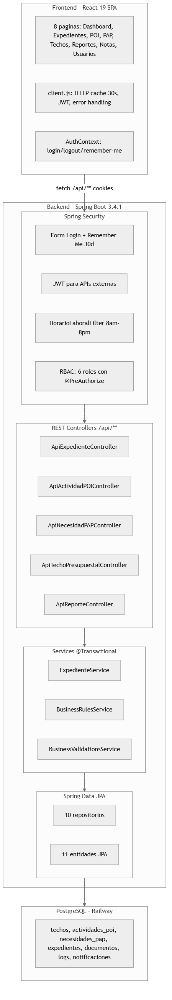

## Estructura del Proyecto

```
sisexp/
├── pom.xml                              # Maven: Spring Boot 3.4.1
├── Dockerfile                           # 3-stage: node -> maven -> jre-alpine
├── frontend/                            # React 19 SPA (pnpm)
│   └── src/
│       ├── api/client.js               # HTTP client con cache 30s
│       ├── contexts/AuthContext.js      # Estado global de autenticacion
│       └── pages/                       # 8 paginas
└── src/main/
    ├── java/com/upla/sisexp/
    │   ├── config/SecurityConfig.java   # Spring Security
    │   ├── security/                    # HorarioLaboralFilter, JWT
    │   ├── model/                       # 11 entidades JPA
    │   ├── enums/                       # 8 enumeraciones
    │   ├── repository/                  # 10 repositorios
    │   ├── dto/                         # DTOs
    │   ├── service/                     # 7 servicios @Transactional
    │   ├── api/                         # 7 REST controllers
    │   └── exception/                   # GlobalExceptionHandler
    └── resources/application.properties
```

## Componentes Spring Usados

| Componente | Uso en SISEXP |
|---|---|
| **Spring Security** | Form login + Remember Me 30d + JWT + control horario + RBAC 6 roles |
| **Spring Data JPA** | 11 entidades mapeadas, 10 repositorios sin SQL manual |
| **@Transactional** | Atomicidad en operaciones presupuestales (reservar, ejecutar, liberar) |
| **@ControllerAdvice** | Manejo global de excepciones (BusinessException, MaxUploadSize, 500) |
| **Jackson** | Serializacion JSON con @JsonIgnoreProperties para evitar ciclos |
| **Bean Validation** | @Valid en DTOs para validacion declarativa |
| **Multipart** | Upload de documentos PDF con max-file-size 20MB |

## Ejemplo 1: Crear Expediente (flujo completo)

```
Usuario (Lab) -> click "Nuevo Expediente"
  -> GET /expedientes/nuevo -> React carga formulario
  -> Selecciona Techo 2026 -> GET /api/actividades-poi/techo/2 -> lista POI
  -> Selecciona POI-2.02 -> GET /api/necesidades-pap/actividad/5 -> lista PAP
  -> Selecciona "Computadoras Core i7" -> GET disponibilidad -> muestra saldo
  -> Llena formulario -> POST /api/expedientes -> Backend:
      1. validarActividadActiva(5)
      2. validarLimiteMontoPorRol(Laboratorio, costo)
      3. validarTopeExpediente(5, costo)
      4. validarSaldoDisponible(5, costo)
      5. generarNumeroExpediente() -> "EXP-2026-0007"
      6. expedienteRepo.save() + seguimientoRepo.save()
  -> 201 Created -> React muestra detalle del expediente
```

## Ejemplo 2: Cambiar Estado (flujo presupuestal)

```
Coordinador abre EXP-2026-0007 (Borrador)
  -> Click "Enviar a revision"
  -> PUT /api/expedientes/7/estado {estado:"En_revision"}
  -> Backend: Borrador -> En_revision:
      businessRules.reservarSaldo(poiId, costo)    -> POI.saldoComprometido += costo
      businessRules.reservarSaldoPAP(papId, cant)  -> PAP.cantidadDisponible -= cant

  -> Click "Aprobar"
  -> PUT /api/expedientes/7/estado {estado:"Aprobado"}
  -> Backend: En_revision -> Aprobado:
      businessRules.ejecutarSaldo(poiId, costo, papId, cant)
        -> POI.saldoEjecutado += costo
        -> Techo.montoUtilizado += costo
        -> PAP.cantidadEjecutada += cant
```

## Ejemplo 3: Control de Horario Laboral

```java
// HorarioLaboralFilter - se ejecuta en CADA request
protected void doFilterInternal(HttpServletRequest request, ...) {
    String path = request.getServletPath();

    // Rutas exentas: login, rastreo, api, static
    if (path.startsWith("/login") || path.startsWith("/api")) return;

    // Verificar hora actual en Lima, Peru
    int hora = ZonedDateTime.now(ZoneId.of("America/Lima")).getHour();
    if (hora >= 8 && hora < 20) return;  // Dentro del horario

    // Admin tiene bypass 24/7
    if (user != null && !user.isHorarioRestringido()) return;

    // Fuera de horario -> redirigir
    response.sendRedirect("/horario-cerrado");
}
```

## Ejemplo 4: Cache HTTP en Frontend

```javascript
// client.js - cache en memoria con TTL de 30 segundos
const cache = new Map();
const CACHE_TTL = 30_000;

async function get(path) {
    const cached = cacheGet(path);
    if (cached !== undefined) return cached;  // Hit

    const res = await fetch(`/api${path}`, { credentials: 'include' });
    const data = await handleResponse(res);
    return cacheSet(path, data);  // Guarda 30s
}
```

---

# 2. METODOLOGIA ICONIX

ICONIX combina casos de uso con un enfoque dirigido por el dominio. Consta de 5 fases:

| Fase | Objetivo | Diagramas | Entregable |
|---|---|---|---|
| 1. ERS | Especificar requisitos | Flowchart CU, RF/RNF | ISO 29148 |
| 2. Analisis | Modelar el dominio | Diagrama de Clases | Modelo Conceptual |
| 3. Robustez | Validar casos de uso | Boundary-Control-Entity (BCE) | 14 diagramas BCE |
| 4. Secuencias | Detallar interacciones | Diagramas de Secuencia (SSD) | 4 diagramas SSD |
| 5. Codigo | Implementar | Clases Java + React | Codigo fuente |

## Fase 1 - ERS: Requisitos

### Diagrama de Actores y Casos de Uso

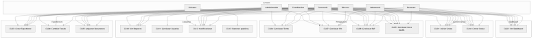

### Requisitos Funcionales (14 RF)

| ID | Requisito | Actor Principal |
|---|---|---|
| RF-01 | Iniciar sesion con email y password | Todos |
| RF-02 | Ver dashboard con KPIs, saldos y alertas | Todos autenticados |
| RF-03 | Crear expediente vinculado a POI y PAP | Admin, Coord, Lab, Director, Sec |
| RF-04 | Cambiar estado de expediente (7 estados) | Admin, Coord, Sec |
| RF-05 | Adjuntar documentos PDF al expediente | Admin, Coord, Sec, Lab, Director |
| RF-06 | Gestionar techos presupuestales | Admin, Coord |
| RF-07 | Gestionar actividades POI | Admin, Coord |
| RF-08 | Gestionar necesidades PAP | Admin, Coord |
| RF-09 | Gestionar notas modificatorias | Admin, Coord |
| RF-10 | Ver reportes (anual, expedientes, POI, PAP) | Admin, Coord, Director, Decanato |
| RF-11 | Gestionar usuarios (CRUD) | Admin |
| RF-12 | Gestionar notificaciones | Todos autenticados |
| RF-13 | Rastrear expediente por codigo (publico) | Visitante |
| RF-14 | Cerrar sesion | Todos autenticados |

---

## Fase 2 - Analisis: Modelo de Dominio

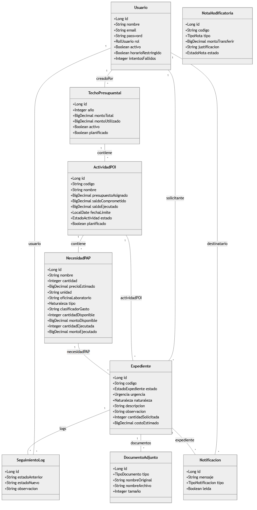

**11 entidades** con relaciones JPA bidireccionales usando @OneToMany/@ManyToOne con FetchType.LAZY y @JsonIgnoreProperties para evitar referencias circulares en serializacion JSON.

---

## Fase 3 - Robustez: Diagramas BCE

Los BCE (Boundary-Control-Entity) validan que cada caso de uso tenga:
- **Boundary**: Interfaz de usuario (React pages, forms)
- **Control**: Logica de negocio (Spring services)
- **Entity**: Modelo de datos (JPA entities)

### BCE-01: Iniciar Sesion

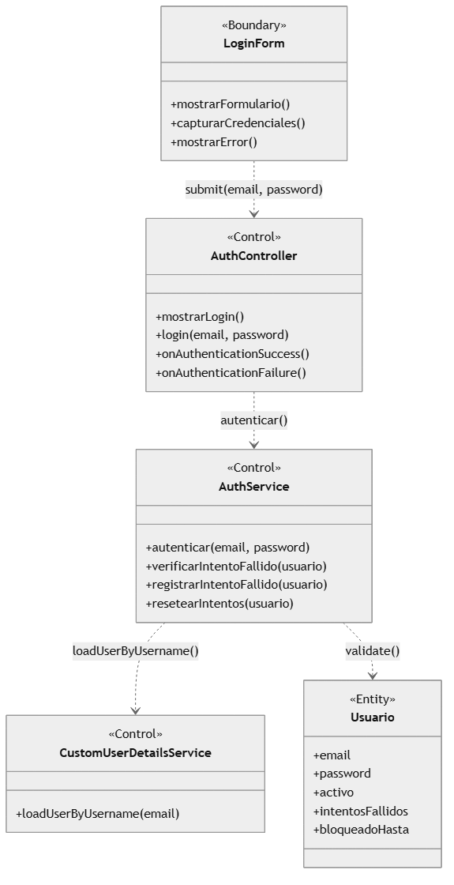

### BCE-02: Ver Dashboard

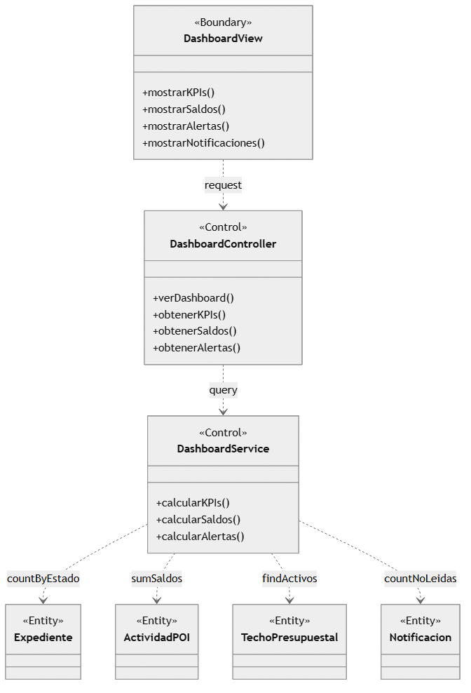

### BCE-03: Crear Expediente

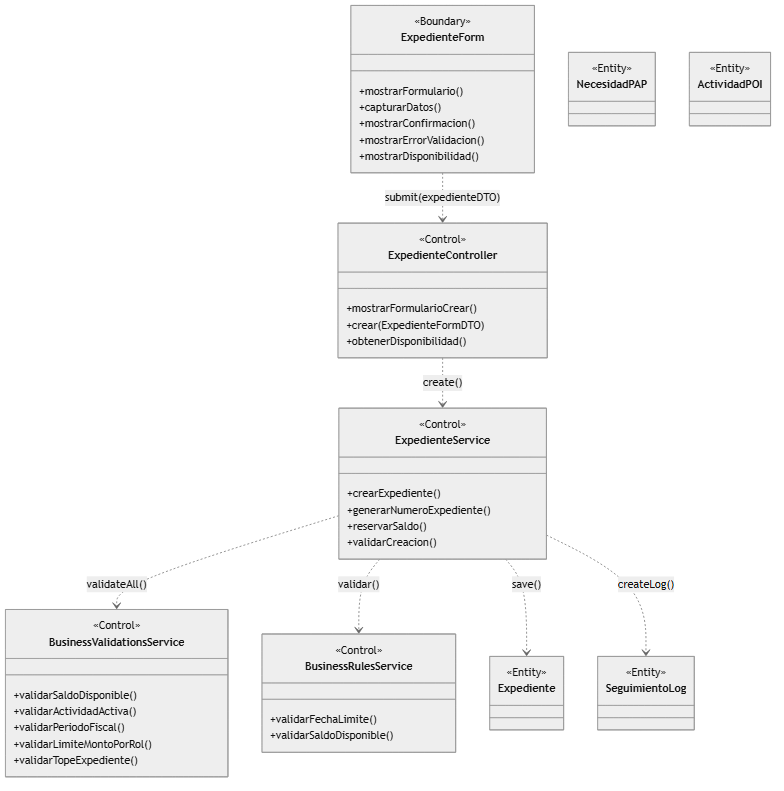

### BCE-04: Cambiar Estado Expediente

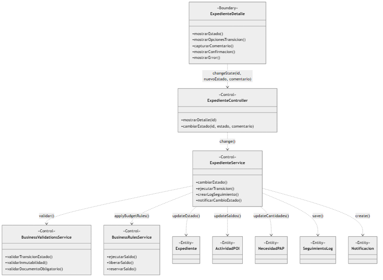

### BCE-05: Adjuntar Documento

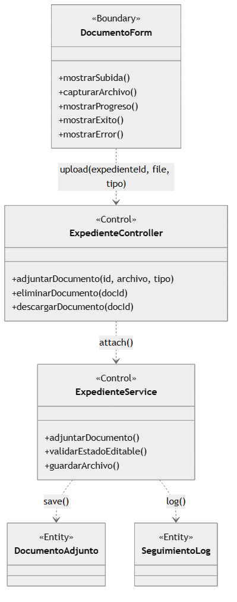

### BCE-06: Gestionar Techo Presupuestal

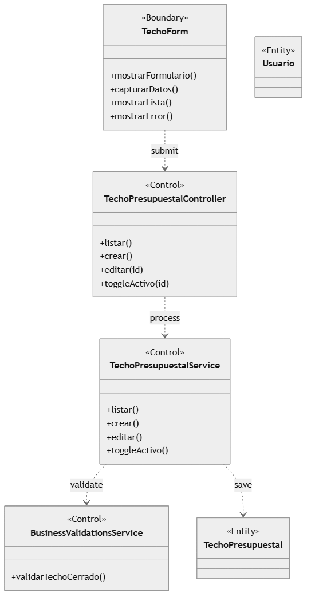

### BCE-07: Gestionar Actividad POI

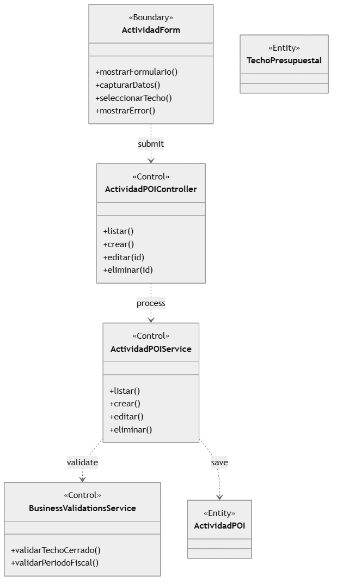

### BCE-08: Gestionar Necesidad PAP

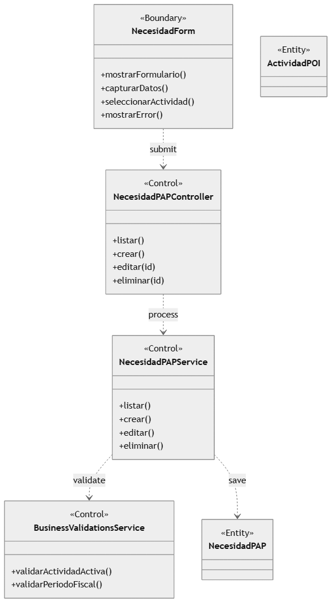

### BCE-09: Gestionar Nota Modificatoria

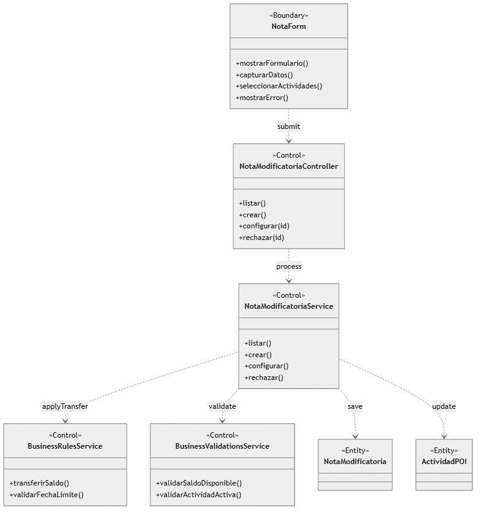

### BCE-10: Ver Reportes

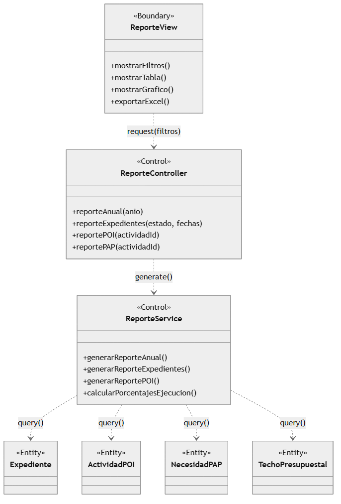

### BCE-11: Gestionar Usuarios

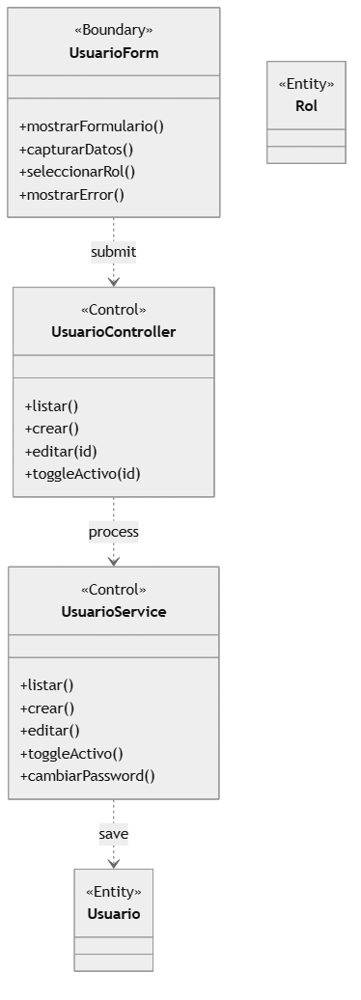

### BCE-13: Rastrear Expediente

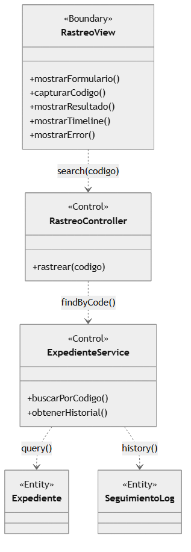

---

## Fase 4 - Secuencias: Diagramas SSD

### SSD-01: Iniciar Sesion

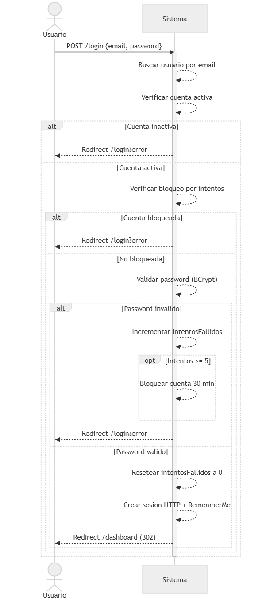

### SSD-04: Cambiar Estado Expediente

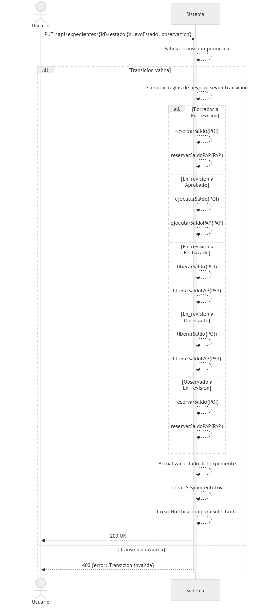

---

## Flujo de Estados del Expediente

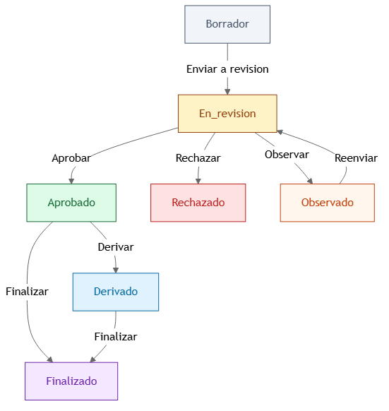

Transiciones definidas en el backend:

| Desde | Hacia |
|---|---|
| Borrador | En_revision |
| En_revision | Aprobado, Rechazado, Observado |
| Observado | En_revision |
| Aprobado | Finalizado, Derivado |
| Derivado | Finalizado |

---

# 3. GUIA DE USO

## Roles y Permisos

| Rol | Acceso principal |
|---|---|
| Administrador | Todo el sistema, bypass horario 24/7 |
| Coordinacion | Techos, POI, PAP, aprobar/rechazar, reportes |
| Secretaria | Crear/editar expedientes, cambiar estados, adjuntar docs |
| Director | Crear expedientes, ver reportes, adjuntar documentos |
| Laboratorio | Crear expedientes (solo los suyos), adjuntar docs |
| Decanato | Solo lectura: reportes, consultas |

## Credenciales

| Email | Password | Rol |
|---|---|---|
| jefe@upla.edu.pe | jefe123 | Administrador |
| coord@upla.edu.pe | coord123 | Coordinacion |
| secretaria@upla.edu.pe | secretaria123 | Secretaria |
| director@upla.edu.pe | director123 | Director |
| lab@upla.edu.pe | lab123 | Laboratorio |
| decanato@upla.edu.pe | decanato123 | Decanato |

## Flujo de Trabajo

1. **Admin/Coord** -> Crear Techo Presupuestal (monto anual)
2. **Admin/Coord** -> Crear Actividad POI (asignar presupuesto del techo)
3. **Admin/Coord** -> Crear Necesidad PAP (items con precio unitario)
4. **Lab/Director/Secretaria** -> Crear Expediente (seleccionar POI + PAP)
5. **Subir documentos** PDF (TDR, Esp. Tecnicas, Cotizacion, Informe Tecnico)
6. **Coord/Admin** -> Cambiar estados (Enviar a revision -> Aprobar -> Finalizar)
7. **Publico** -> Rastrear expediente en /rastreo con el codigo

---

# 4. DATOS DE PRUEBA

| Entidad | Cantidad |
|---|---|
| Usuarios | 6 (uno por rol) |
| Techos | 2 (2025 cerrado, 2026 abierto S/115,000) |
| Actividades POI | 16 (12 vigentes 2026) |
| Necesidades PAP | ~36 (2-3 items por actividad) |
| Expedientes | 0 (sistema limpio) |

---

# 5. LECCIONES APRENDIDAS

| # | Problema | Causa | Solucion |
|---|---|---|---|
| 1 | @Transactional(readOnly=true) en controller | "cannot execute INSERT" en PostgreSQL | Mover a solo @GetMapping |
| 2 | Pantallazo blanco al seleccionar PAP | backend devolvia estructura flat, frontend esperaba nested | Reescrito getDisponibilidad() con estructura nested |
| 3 | Upload docs: "Sin conexion" | max-file-size 1MB default + @RequestParam sin nombre | 20MB + name="tipo" explicito |
| 4 | "Presupuesto: S/ NaN" | Jackson serializa getter como "actividadPOI", frontend usaba "actividad" | Usar nombre exacto (actividadPOI) |
| 5 | "En revision" sin botones | Enum usa underscore, frontend usaba espacio | Unificar a "En_revision" |
| 6 | Doble click en cambio de estado | Botones sin disabled | changingEstado state + disabled |
| 7 | Documentos no aparecian | Faltaba @OneToMany en Expediente | Agregar relacion con @JsonIgnoreProperties |
| 8 | Techo no descontaba al aprobar | ejecutarSaldo no actualizaba TechoPresupuestal | techo.setMontoUtilizado() |
| 9 | @Lob String en PostgreSQL | Mapea a OID que falla | @Column(columnDefinition="TEXT") |
| 10 | Form login + JWT conflicto | Doble autenticacion | SessionCreationPolicy.IF_REQUIRED |

---

**Fin del informe. 18 diagramas generados como imagenes PNG.**
