# SISEXP-UPLA — Informe de Arquitectura de Software

## Sistema de Seguimiento y Control de Expedientes — Spring Boot 3.4

| Campo | Valor |
|---|---|
| Proyecto | SISEXP-UPLA |
| Universidad | Universidad Peruana Los Andes |
| Curso | Arquitectura de Software — VIII Ciclo |
| Metodología | ICONIX (5 fases) |
| Stack | Spring Boot 3.4.1 + Java 17 + PostgreSQL + React 19 |
| Despliegue | Railway (Docker multi-stage) |
| Repositorio | https://github.com/LuchitoAE/Sisexp-Upla-SpringBoot |
| URL Producción | https://sisexp-web-production.up.railway.app |
| Versión | 2.0 — 23 de junio de 2026 |

---

# PARTE 1: SPRING BOOT EN SISEXP-UPLA

## 1.1 ¿Por qué Spring Boot?

Spring Boot es el framework líder para aplicaciones empresariales Java. En SISEXP-UPLA se eligió porque:

| Ventaja | Aplicación en SISEXP |
|---|---|
| **Auto-configuración** | Spring Boot configura JPA, Security, Thymeleaf y Jackson sin XML |
| **Spring Security integrado** | Form login + Remember Me + JWT + control horario con 3 filtros |
| **Spring Data JPA** | 11 entidades mapeadas a PostgreSQL con repositorios sin SQL manual |
| **Validación declarativa** | `@Valid`, `@NotNull`, `@Size` en DTOs — reglas de negocio en Java |
| **Perfiles (dev/prod)** | H2 en local, PostgreSQL en Railway — cambia con variable de entorno |
| **Embalaje monolítico** | Un solo JAR con React embebido en `/static` — deploy simplificado |
| **Docker multi-stage** | 3 etapas: Node → Maven → JRE Alpine = imagen final ~200 MB |
| **Actuator** | Health checks, métricas, info — listo para monitoreo |

## 1.2 Estructura del Proyecto

```
sisexp/
├── pom.xml                              # Maven: dependencias Spring Boot 3.4.1
├── Dockerfile                           # 3-stage: node → maven → jre-alpine
├── frontend/                            # React 19 SPA (pnpm)
│   ├── src/
│   │   ├── api/client.js               # HTTP client con cache 30s + JWT
│   │   ├── contexts/AuthContext.js      # Estado global de autenticación
│   │   ├── pages/                       # 8 páginas (Dashboard, Expedientes, POI...)
│   │   ├── components/                  # Sidebar, Header, Modals, Backup
│   │   └── App.css                      # Design system CSS (variables nativas)
│   └── public/index.html
└── src/main/
    ├── java/com/upla/sisexp/
    │   ├── SisexpApplication.java       # @SpringBootApplication
    │   ├── config/
    │   │   ├── SecurityConfig.java      # Spring Security (form login + JWT + CORS)
    │   │   ├── DataInitializer.java     # Seed data (16 POI, ~36 PAP, 0 expedientes)
    │   │   ├── WebConfig.java           # SPA fallback para React Router
    │   │   └── DbIndexInitializer.java  # Índices PostgreSQL para búsquedas
    │   ├── security/
    │   │   ├── HorarioLaboralFilter.java # Filtro 8am-8pm hora Perú
    │   │   ├── JwtAuthenticationFilter.java # Autenticación JWT para APIs externas
    │   │   ├── JwtTokenProvider.java    # Generación/validación de tokens JWT
    │   │   └── CustomUserDetails.java   # UserDetails con horarioRestringido
    │   ├── model/                       # 11 entidades JPA
    │   ├── enums/                       # 8 enumeraciones (estados, roles, tipos)
    │   ├── repository/                  # 10 repositorios Spring Data JPA
    │   ├── dto/                         # DTOs: ExpedienteFormDTO, CambiarEstadoDTO
    │   ├── service/                     # 7 servicios de negocio
    │   ├── api/                         # 7 REST controllers (/api/**)
    │   ├── controller/                  # 7 controllers Thymeleaf (solo admin)
    │   └── exception/                   # GlobalExceptionHandler + BusinessException
    └── resources/
        ├── application.properties       # Config: DB, multipart, session, jackson
        └── static/                      # React build output
```

## 1.3 Tecnologías y Componentes Spring Usados

### 1.3.1 Spring Boot Starters

```xml
spring-boot-starter-web           # REST controllers + Tomcat embebido
spring-boot-starter-data-jpa      # Spring Data JPA + Hibernate
spring-boot-starter-security      # Spring Security (autenticación/autorización)
spring-boot-starter-validation    # Bean Validation (DTOs)
spring-boot-starter-thymeleaf     # Templates server-side (solo admin legacy)
```

### 1.3.2 Spring Security — Configuración Real

El archivo `SecurityConfig.java` (161 líneas) configura:

```java
@Bean
public SecurityFilterChain securityFilterChain(HttpSecurity http) throws Exception {
    http
        .cors(cors -> cors.configurationSource(corsConfigurationSource()))
        .csrf(csrf -> csrf.ignoringRequestMatchers("/api/**", "/rastreo/**"))
        .authorizeHttpRequests(auth -> auth
            .requestMatchers("/login", "/rastreo/**", "/api/auth/login", "/api/health",
                "/error", "/horario-cerrado", "/static/**").permitAll()
            .requestMatchers("/api/**").authenticated()
            .requestMatchers("/usuarios/**").hasRole("Administrador")
            .requestMatchers("/reportes/**").hasAnyRole("Administrador","Coordinacion","Director","Decanato")
            .anyRequest().authenticated()
        )
        .formLogin(form -> form
            .loginPage("/login").defaultSuccessUrl("/dashboard", true)
            .failureHandler(authenticationFailureHandler())
        )
        .rememberMe(remember -> remember
            .key("sisexp-upla-remember-me-key-2026")
            .tokenValiditySeconds(2592000)  // 30 días
        )
        .sessionManagement(sm -> sm
            .sessionCreationPolicy(SessionCreationPolicy.IF_REQUIRED)
            .maximumSessions(10)
        )
        .addFilterBefore(horarioLaboralFilter, UsernamePasswordAuthenticationFilter.class)
        .addFilterBefore(jwtAuthenticationFilter, UsernamePasswordAuthenticationFilter.class);
    return http.build();
}
```

**Dos filtros personalizados** en la cadena:
1. `HorarioLaboralFilter` — bloquea acceso fuera de 8am-8pm (hora Perú), con bypass para Admin
2. `JwtAuthenticationFilter` — permite autenticación vía Bearer token para clientes externos

### 1.3.3 Spring Data JPA — Repositorios sin SQL

Cada entidad tiene un repositorio que extiende `JpaRepository`. Spring genera las queries automáticamente por nombre de método:

```java
public interface ExpedienteRepository extends JpaRepository<Expediente, Long> {
    Optional<Expediente> findByCodigo(String codigo);
    List<Expediente> findBySolicitante_Id(Long solicitanteId);
    List<Expediente> findByActividadPOI_Id(Long actividadId);
    List<Expediente> findByEstado(EstadoExpediente estado);
    long countByEstado(EstadoExpediente estado);

    @Query("SELECT e FROM Expediente e WHERE e.codigo LIKE :prefix% ORDER BY e.codigo DESC")
    Optional<Expediente> findTopByCodigoStartingWithOrderByCodigoDesc(@Param("prefix") String prefix);
}
```

**Ventaja**: cero SQL manual para operaciones CRUD. Solo se usa `@Query` para la generación de códigos secuenciales (EXP-2026-0001, EXP-2026-0002...).

### 1.3.4 Transacciones con `@Transactional`

Los servicios de negocio usan `@Transactional` para garantizar atomicidad:

```java
@Service
public class ExpedienteService {

    @Transactional
    public Expediente crear(ExpedienteFormDTO dto, CustomUserDetails user) {
        // 1. Validar actividad activa
        // 2. Calcular costo
        // 3. Validar saldo disponible
        // 4. Generar código EXP-YYYY-NNNN
        // 5. Guardar expediente
        // 6. Crear log de seguimiento
        // 7. Notificar a coordinación
        // TODO dentro de UNA transacción
    }
}
```

Si cualquier paso falla, todos los cambios se revierten automáticamente.

### 1.3.5 Manejo de Excepciones Global

```java
@ControllerAdvice
public class GlobalExceptionHandler {

    @ExceptionHandler(BusinessException.class)
    public Object handleBusiness(BusinessException ex, HttpServletRequest request) {
        if (request.getServletPath().startsWith("/api/")) {
            return ResponseEntity.badRequest()
                .body(Map.of("error", ex.getMessage()));
        }
        // Para vistas Thymeleaf: redirect con flash attribute
        redirect.addFlashAttribute("error", ex.getMessage());
        return "redirect:" + request.getHeader("Referer");
    }

    @ExceptionHandler(MaxUploadSizeExceededException.class)
    public ResponseEntity<?> handleMaxUploadSize(...) {
        return ResponseEntity.status(HttpStatus.PAYLOAD_TOO_LARGE)
            .body(Map.of("error", "El archivo excede el tamaño máximo (20 MB)"));
    }
}
```

## 1.4 Ejemplos de Uso en el Sistema

### Ejemplo 1: Crear un Expediente (flujo completo)

```
Usuario (Lab) → click "Nuevo Expediente"
  → GET /expedientes/nuevo → React carga formulario
  → Selecciona Techo 2026 → GET /api/actividades-poi/techo/2 → lista de POI
  → Selecciona POI-2.02 → GET /api/necesidades-pap/actividad/5 → lista de PAP
  → Selecciona "Computadoras Core i7" → GET /api/expedientes/disponibilidad/5/1 → saldo
  → Llena formulario (urgencia, naturaleza, cantidad, descripción)
  → POST /api/expedientes → Backend:
      1. BusinessValidationsService.validarActividadActiva(5)
      2. BusinessValidationsService.validarLimiteMontoPorRol(Laboratorio, costo)
      3. BusinessValidationsService.validarTopeExpediente(5, costo)
      4. BusinessRulesService.validarFechaLimite(5)
      5. BusinessRulesService.validarSaldoDisponible(5, costo)
      6. BusinessRulesService.generarNumeroExpediente() → "EXP-2026-0007"
      7. expedienteRepo.save(expediente)
      8. seguimientoRepo.save(log)
  → 201 Created → React redirige a detalle del expediente
```

### Ejemplo 2: Cambiar Estado (flujo presupuestal)

```
Coordinador → abre EXP-2026-0007 (estado: Borrador)
  → Click "Enviar a revisión"
  → PUT /api/expedientes/7/estado {estado:"En_revision"}
  → Backend: ejecutarReglasPresupuestales()
      Borrador → En_revision:
        businessRules.reservarSaldo(poiId, costo)    → ActividadPOI.saldoComprometido += costo
        businessRules.reservarSaldoPAP(papId, cant)  → NecesidadPAP.cantidadDisponible -= cant

  → Click "Aprobar"
  → PUT /api/expedientes/7/estado {estado:"Aprobado"}
  → Backend: ejecutarReglasPresupuestales()
      En_revision → Aprobado:
        businessRules.ejecutarSaldo(poiId, costo, papId, cant)
          → ActividadPOI.saldoEjecutado += costo
          → TechoPresupuestal.montoUtilizado += costo
          → NecesidadPAP.cantidadEjecutada += cant
          → NecesidadPAP.montoEjecutado += costo
```

### Ejemplo 3: Control de Horario Laboral

```java
// HorarioLaboralFilter — se ejecuta en CADA request
protected void doFilterInternal(HttpServletRequest request, ...) {
    String path = request.getServletPath();

    // Rutas exentas: login, rastreo, api, static, etc.
    if (path.startsWith("/login") || path.startsWith("/api") ...) {
        chain.doFilter(request, response); return;
    }

    // Verificar hora actual en Lima, Perú
    int hora = ZonedDateTime.now(ZoneId.of("America/Lima")).getHour();
    if (hora >= 8 && hora < 20) { chain.doFilter(...); return; }  // Dentro del horario

    // Admin tiene bypass 24/7
    if (user != null && !user.isHorarioRestringido()) { chain.doFilter(...); return; }

    // Fuera de horario → redirigir
    response.sendRedirect("/horario-cerrado");
}
```

**Resultado**: a las 8:01pm, todos los usuarios (excepto Admin) son redirigidos a "Sistema cerrado".

### Ejemplo 4: Cache HTTP en Frontend

```javascript
// client.js — cache en memoria con TTL de 30 segundos
const cache = new Map();
const CACHE_TTL = 30_000;

async function get(path) {
    const cached = cacheGet(path);
    if (cached !== undefined) return cached;  // Hit: devuelve cache

    const res = await fetch(`/api${path}`, { credentials: 'include' });
    const data = await handleResponse(res);
    return cacheSet(path, data);  // Guarda en cache por 30s
}
```

**Resultado**: al navegar entre vistas, los datos se sirven del cache sin llamar al servidor durante 30 segundos. Al crear/editar/eliminar, se invalida automáticamente.

---

# PARTE 2: METODOLOGÍA ICONIX

## 2.1 Visión General

ICONIX es una metodología de desarrollo de software que combina casos de uso con un enfoque dirigido por el dominio. Consta de 5 fases con trazabilidad completa:

| Fase | Objetivo | Diagramas | Entregable |
|---|---|---|---|
| 1. ERS | Especificar requisitos | Flowchart CU, RF/RNF | ISO 29148 |
| 2. Análisis | Modelar el dominio | Diagrama de Clases | Modelo Conceptual |
| 3. Robustez | Validar casos de uso | Boundary-Control-Entity (BCE) | 14 diagramas BCE |
| 4. Secuencias | Detallar interacciones | Diagramas de Secuencia (SSD) | 14 diagramas SSD |
| 5. Código | Implementar | Clases Java + React | Código fuente |

## 2.2 Fase 1 — ERS (Especificación de Requisitos)

### Requisitos Funcionales (14 RF)

| ID | Requisito | Actor Principal |
|---|---|---|
| RF-01 | Iniciar sesión con email y contraseña | Todos los actores |
| RF-02 | Ver dashboard con KPIs, saldos y alertas | Todos los autenticados |
| RF-03 | Crear expediente vinculado a POI y PAP | Admin, Coord, Lab, Director, Sec |
| RF-04 | Cambiar estado de expediente (7 estados) | Admin, Coord, Sec |
| RF-05 | Adjuntar documentos PDF al expediente | Admin, Coord, Sec, Lab, Director |
| RF-06 | Gestionar techos presupuestales | Admin, Coord |
| RF-07 | Gestionar actividades POI | Admin, Coord |
| RF-08 | Gestionar necesidades PAP | Admin, Coord |
| RF-09 | Gestionar notas modificatorias | Admin, Coord |
| RF-10 | Ver reportes (anual, expedientes, POI, PAP) | Admin, Coord, Director, Decanato |
| RF-11 | Gestionar usuarios (CRUD) | Admin |
| RF-12 | Gestionar notificaciones | Todos los autenticados |
| RF-13 | Rastrear expediente por código (público) | Visitante |
| RF-14 | Cerrar sesión | Todos los autenticados |

### Requisitos No Funcionales (8 RNF)

| ID | Requisito | Implementación |
|---|---|---|
| RNF-01 | Autenticación segura con BCrypt + Remember Me 30d | Spring Security |
| RNF-02 | Control de acceso basado en roles (RBAC, 6 roles) | `@PreAuthorize` + `hasRole()` |
| RNF-03 | Horario laboral 8am-8pm (hora Perú), bypass Admin | `HorarioLaboralFilter` |
| RNF-04 | Atomicidad de operaciones presupuestales | `@Transactional` |
| RNF-05 | Interfaz responsive (desktop/tablet) | CSS Grid + Flexbox |
| RNF-06 | Trazabilidad de cambios (log de seguimiento) | `SeguimientoLog` entity |
| RNF-07 | Disponibilidad 24/7 en Railway | Docker + health checks |
| RNF-08 | Respuesta < 2 segundos en operaciones CRUD | Cache frontend 30s + índices DB |

### Diagrama de Casos de Uso y Actores

```mermaid
flowchart TD
    subgraph Actores
        A["Administrador"]
        C["Coordinacion"]
        S["Secretaria"]
        D["Director"]
        L["Laboratorio"]
        N["Decanato"]
        V["Visitante"]
    end

    subgraph Autenticacion
        CU01["CU01: Iniciar Sesion"]
        CU14["CU14: Cerrar Sesion"]
    end

    subgraph Dashboard
        CU02["CU02: Ver Dashboard"]
    end

    subgraph Expedientes
        CU03["CU03: Crear Expediente"]
        CU04["CU04: Cambiar Estado"]
        CU05["CU05: Adjuntar Documento"]
    end

    subgraph Presupuesto
        CU06["CU06: Gestionar Techo"]
        CU07["CU07: Gestionar POI"]
        CU08["CU08: Gestionar PAP"]
        CU09["CU09: Gestionar Nota Modif."]
    end

    subgraph Consultas
        CU10["CU10: Ver Reportes"]
        CU11["CU11: Gestionar Usuarios"]
        CU12["CU12: Notificaciones"]
        CU13["CU13: Rastrear (publico)"]
    end

    A --> CU01 & CU02 & CU03 & CU04 & CU05 & CU06 & CU07 & CU08 & CU09 & CU10 & CU11 & CU12 & CU14
    C --> CU01 & CU02 & CU03 & CU04 & CU05 & CU06 & CU07 & CU08 & CU09 & CU10 & CU12 & CU14
    S --> CU01 & CU02 & CU03 & CU04 & CU05 & CU06 & CU07 & CU08 & CU09 & CU12 & CU14
    D --> CU01 & CU02 & CU03 & CU05 & CU06 & CU07 & CU08 & CU09 & CU10 & CU12 & CU14
    L --> CU01 & CU02 & CU03 & CU05 & CU07 & CU08 & CU09 & CU12 & CU14
    N --> CU01 & CU02 & CU08 & CU09 & CU10 & CU12 & CU14
    V --> CU13
```

## 2.3 Fase 2 — Modelo de Dominio (Diagrama de Clases)

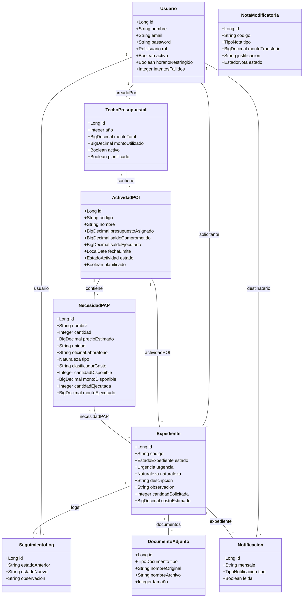

**11 entidades** con relaciones JPA bidireccionales usando `@OneToMany`/`@ManyToOne` con `FetchType.LAZY` y `@JsonIgnoreProperties` para evitar referencias circulares en serialización JSON.

## 2.4 Fase 3 — Diagramas de Robustez BCE

Los diagramas BCE (Boundary-Control-Entity) validan que cada caso de uso tenga los componentes necesarios siguiendo el patrón:

- **Boundary**: Interfaz de usuario (páginas React, formularios)
- **Control**: Lógica de negocio (servicios Spring)
- **Entity**: Modelo de datos (entidades JPA)

### BCE04: Cambiar Estado Expediente (ejemplo representativo)

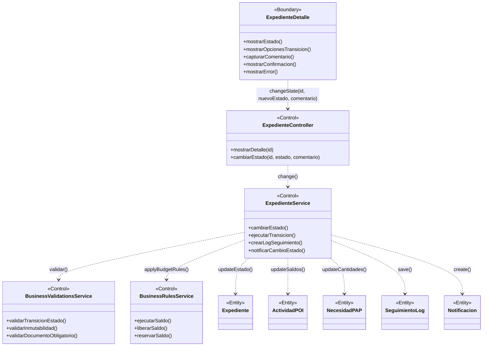

### Lista completa de los 14 BCE

| Código | Caso de Uso | Control principal | Entidades afectadas |
|---|---|---|---|
| BCE-01 | Iniciar Sesión | AuthService | Usuario |
| BCE-02 | Ver Dashboard | DashboardService | Expediente, ActividadPOI, Techo, Notificacion |
| BCE-03 | Crear Expediente | ExpedienteService | Expediente, NecesidadPAP, ActividadPOI, SeguimientoLog |
| BCE-04 | Cambiar Estado | ExpedienteService | Expediente, ActividadPOI, NecesidadPAP, SeguimientoLog, Notificacion |
| BCE-05 | Adjuntar Documento | ExpedienteService | DocumentoAdjunto, Expediente |
| BCE-06 | Gestionar Techo | TechoPresupuestalService | TechoPresupuestal |
| BCE-07 | Gestionar POI | ActividadPOIService | ActividadPOI, TechoPresupuestal |
| BCE-08 | Gestionar PAP | NecesidadPAPService | NecesidadPAP, ActividadPOI |
| BCE-09 | Gestionar Nota Modif. | NotaModificatoriaService | NotaModificatoria, ActividadPOI |
| BCE-10 | Ver Reportes | ReporteService | Expediente, ActividadPOI, NecesidadPAP |
| BCE-11 | Gestionar Usuarios | UsuarioService | Usuario, Rol |
| BCE-12 | Gestionar Notificaciones | NotificacionService | Notificacion |
| BCE-13 | Rastrear Expediente | ExpedienteService | Expediente, SeguimientoLog |
| BCE-14 | Cerrar Sesión | AuthController | HttpSession, Cookie |

## 2.5 Fase 4 — Diagramas de Secuencia del Sistema (SSD)

### SSD-CU04: Cambiar Estado Expediente (ejemplo detallado)

```mermaid
sequenceDiagram
    actor Usuario
    participant :Sistema

    Usuario->>:Sistema: GET /expedientes/{id}
    activate :Sistema
    :Sistema-->>:Sistema: Consultar expediente + transiciones permitidas
    :Sistema-->>Usuario: 200 Vista detalle + panel de cambio de estado
    deactivate :Sistema

    Usuario->>:Sistema: PUT /expedientes/{id}/estado {nuevoEstado, observacion}
    activate :Sistema

    :Sistema-->>:Sistema: Validar transicion permitida

    alt Transicion valida
        :Sistema-->>:Sistema: Ejecutar reglas de negocio segun transicion

        alt Borrador -> En_revision
            :Sistema-->>:Sistema: reservarSaldo(POI)
            :Sistema-->>:Sistema: reservarSaldoPAP(PAP)
        else En_revision -> Aprobado
            :Sistema-->>:Sistema: ejecutarSaldo(POI)
            :Sistema-->>:Sistema: ejecutarSaldoPAP(PAP)
        else En_revision -> Rechazado
            :Sistema-->>:Sistema: liberarSaldo(POI)
            :Sistema-->>:Sistema: liberarSaldoPAP(PAP)
        else En_revision -> Observado
            :Sistema-->>:Sistema: liberarSaldo(POI)
            :Sistema-->>:Sistema: liberarSaldoPAP(PAP)
        else Observado -> En_revision
            :Sistema-->>:Sistema: reservarSaldo(POI)
            :Sistema-->>:Sistema: reservarSaldoPAP(PAP)
        end

        :Sistema-->>:Sistema: Actualizar estado del expediente
        :Sistema-->>:Sistema: Crear SeguimientoLog
        :Sistema-->>:Sistema: Crear Notificacion para solicitante

        :Sistema-->>Usuario: Redirect /expedientes/{id} (200)
    else Transicion invalida
        :Sistema-->>Usuario: Redirect /expedientes/{id}?error (Transicion no permitida)
    end

    deactivate :Sistema
```

### Lista completa de los 14 SSD

| Código | Caso de Uso | Endpoint | Método |
|---|---|---|---|
| SSD-01 | Iniciar Sesión | /login | POST |
| SSD-02 | Ver Dashboard | /api/dashboard | GET |
| SSD-03 | Crear Expediente | /api/expedientes | POST |
| SSD-04 | Cambiar Estado | /api/expedientes/{id}/estado | PUT |
| SSD-05 | Adjuntar Documento | /api/expedientes/{id}/documentos | POST |
| SSD-06 | Gestionar Techo | /api/techos-presupuestales | CRUD |
| SSD-07 | Gestionar POI | /api/actividades-poi | CRUD |
| SSD-08 | Gestionar PAP | /api/necesidades-pap | CRUD |
| SSD-09 | Gestionar Nota Modif. | /api/notas-modificatorias | CRUD |
| SSD-10 | Ver Reportes | /api/reportes | GET |
| SSD-11 | Gestionar Usuarios | /api/usuarios | CRUD |
| SSD-12 | Gestionar Notificaciones | /api/notificaciones | GET/PUT |
| SSD-13 | Rastrear Expediente | /rastreo | GET |
| SSD-14 | Cerrar Sesión | /logout | POST |

## 2.6 Fase 5 — Código (Implementación Spring Boot)

### Controlador REST de Expedientes (fragmento)

```java
@RestController
@RequestMapping("/api/expedientes")
public class ApiExpedienteController {

    @PostMapping
    public ResponseEntity<?> crear(@RequestBody Map<String, Object> body,
            @AuthenticationPrincipal CustomUserDetails user) {
        ExpedienteFormDTO dto = new ExpedienteFormDTO();
        dto.setActividadPoiId(Long.valueOf(body.get("actividadPoiId").toString()));
        dto.setNecesidadPapId(Long.valueOf(body.get("necesidadPapId").toString()));
        dto.setUrgencia(Urgencia.valueOf((String) body.get("urgencia")));
        dto.setNaturaleza(Naturaleza.valueOf((String) body.get("naturaleza")));
        dto.setCantidadSolicitada(body.get("cantidadSolicitada") != null
                ? Integer.valueOf(body.get("cantidadSolicitada").toString()) : 1);
        Expediente exp = expedienteService.crear(dto, user);
        return ResponseEntity.status(201).body(exp);
    }

    @PutMapping("/{id}/estado")
    public ResponseEntity<?> actualizarEstado(@PathVariable Long id,
            @RequestBody Map<String, String> body,
            @AuthenticationPrincipal CustomUserDetails user) {
        CambiarEstadoDTO dto = new CambiarEstadoDTO();
        dto.setNuevoEstado(EstadoExpediente.valueOf(
                body.get("estado").replace(' ', '_')));
        dto.setObservacion(body.get("observacion"));
        Expediente exp = expedienteService.actualizarEstado(id, dto, user);
        return ResponseEntity.ok(exp);
    }

    @PostMapping("/{id}/documentos")
    public ResponseEntity<?> subirDocumento(@PathVariable Long id,
            @RequestParam(name = "tipo") TipoDocumento tipo,
            @RequestParam(name = "archivo") MultipartFile archivo) {
        DocumentoDTO dto = new DocumentoDTO();
        dto.setTipo(tipo);
        dto.setArchivo(archivo);
        DocumentoAdjunto doc = expedienteService.subirDocumento(id, dto);
        return ResponseEntity.ok(doc);
    }
}
```

### Servicio de Reglas de Negocio Presupuestales

```java
@Service
@Transactional
public class BusinessRulesService {

    public void reservarSaldo(Long actividadPoiId, BigDecimal costo) {
        ActividadPOI a = actividadPOIRepo.findById(actividadPoiId).orElseThrow();
        a.setSaldoComprometido(a.getSaldoComprometido().add(costo));
        actividadPOIRepo.save(a);
    }

    public void ejecutarSaldo(Long actividadPoiId, BigDecimal costo,
            Long necesidadPapId, int cantidadSolicitada) {
        ActividadPOI a = actividadPOIRepo.findById(actividadPoiId).orElseThrow();
        a.setSaldoComprometido(a.getSaldoComprometido().subtract(costo).max(BigDecimal.ZERO));
        a.setSaldoEjecutado(a.getSaldoEjecutado().add(costo));
        actividadPOIRepo.save(a);

        // Actualizar Techo Presupuestal
        TechoPresupuestal techo = a.getTechoPresupuestal();
        if (techo != null) {
            techo.setMontoUtilizado(techo.getMontoUtilizado().add(costo));
            techoRepo.save(techo);
        }

        if (necesidadPapId != null && cantidadSolicitada > 0) {
            ejecutarSaldoPAP(necesidadPapId, cantidadSolicitada, costo);
        }
    }

    public void liberarSaldo(Long actividadPoiId, BigDecimal costo) {
        ActividadPOI a = actividadPOIRepo.findById(actividadPoiId).orElseThrow();
        a.setSaldoComprometido(a.getSaldoComprometido().subtract(costo)
                .max(BigDecimal.ZERO));
        actividadPOIRepo.save(a);
    }
}
```

### Flujo de Estados del Expediente

```
                  ┌──────────┐
                  │ Borrador │
                  └────┬─────┘
                       │ Enviar a revisión
                  ┌────▼────────┐
         ┌────────│ En_revision │────────┐
         │        └─────┬───────┘        │
         │ Aprobar      │ Observar       │ Rechazar
    ┌────▼───┐   ┌─────▼──────┐   ┌─────▼──────┐
    │Aprobado│   │ Observado  │   │ Rechazado  │
    └────┬───┘   └─────┬──────┘   └────────────┘
         │             │ Reenviar
         │ Finalizar   └────┐
    ┌────▼──────┐           │
    │Finalizado │◄──────────┘
    └───────────┘

    Transiciones definidas en Map<EstadoExpediente, Set<EstadoExpediente>>:
    Borrador      → [En_revision]
    En_revision   → [Aprobado, Rechazado, Observado]
    Observado     → [En_revision]
    Aprobado      → [Finalizado, Derivado]
    Derivado      → [Finalizado]
```

---

# PARTE 3: GUÍA DE USO DEL SISTEMA

## 3.1 Roles y Permisos

| Rol | Acceso principal |
|---|---|
| **Administrador** | Todo el sistema, bypass horario 24/7, gestión de usuarios |
| **Coordinacion** | Techos, POI, PAP, aprobar/rechazar expedientes, reportes |
| **Secretaria** | Crear/editar expedientes, cambiar estados, adjuntar documentos |
| **Director** | Crear expedientes, ver reportes, adjuntar documentos |
| **Laboratorio** | Crear expedientes (solo ve los suyos), adjuntar documentos |
| **Decanato** | Solo lectura: reportes, consultas |

## 3.2 Credenciales de Prueba

| Email | Contraseña | Rol |
|---|---|---|
| jefe@upla.edu.pe | jefe123 | Administrador |
| coord@upla.edu.pe | coord123 | Coordinacion |
| secretaria@upla.edu.pe | secretaria123 | Secretaria |
| director@upla.edu.pe | director123 | Director |
| lab@upla.edu.pe | lab123 | Laboratorio |
| decanato@upla.edu.pe | decanato123 | Decanato |

## 3.3 Flujo Típico de Trabajo

### Paso 1: Admin/Coord — Crear Techo Presupuestal
1. Iniciar sesión como jefe@upla.edu.pe
2. Ir a "Techo Presupuestal" en el sidebar
3. Click "+ Nuevo Techo"
4. Ingresar año (sugiere año actual) y monto total
5. Guardar

### Paso 2: Admin/Coord — Crear Actividad POI
1. Ir a "Actividades POI"
2. Click "+ Nueva actividad"
3. Seleccionar techo, ingresar código, nombre, presupuesto, fecha límite
4. Guardar

### Paso 3: Admin/Coord — Crear Necesidad PAP
1. Ir a "PAP" (Necesidades)
2. Click "+ Nueva necesidad"
3. Seleccionar actividad POI, ingresar nombre del ítem, cantidad, precio unitario, tipo (Bien/Servicio)
4. Guardar

### Paso 4: Lab/Director/Secretaria — Crear Expediente
1. Iniciar sesión como lab@upla.edu.pe
2. Ir a "Expedientes"
3. Click "+ Nuevo Expediente"
4. Seleccionar Techo → se cargan las actividades POI
5. Seleccionar Actividad POI → se cargan los ítems PAP
6. Seleccionar Ítem PAP → se muestra disponibilidad y saldo
7. Elegir urgencia, naturaleza, cantidad, descripción
8. Click "Crear Expediente"

### Paso 5: Subir Documentos
1. En el detalle del expediente, click en "+ TDR", "+ Esp. Técnicas", "+ Cotización" o "+ Informe Técnico"
2. Seleccionar archivo PDF (máx. 20 MB)
3. El documento aparece en la tabla de adjuntos

### Paso 6: Cambiar Estados
1. Coord/Admin abre el expediente (estado: Borrador)
2. Click "Enviar a revisión" → estado cambia a "En_revision"
3. Click "Aprobar" → estado cambia a "Aprobado" (se ejecuta el saldo)
4. Click "Finalizar" → estado cambia a "Finalizado"

### Paso 7: Rastreo Público
1. Abrir https://sisexp-web-production.up.railway.app/rastreo
2. Ingresar código (ej. EXP-2026-0001)
3. Ver estado actual, historial y observaciones

## 3.4 Datos de Prueba Precargados

| Entidad | Cantidad | Detalle |
|---|---|---|
| Usuarios | 6 | Uno por cada rol |
| Techos | 2 | 2025 (cerrado, S/ 45,000), 2026 (abierto, S/ 115,000) |
| Actividades POI | 16 | 4 históricas (2025) + 12 vigentes (2026) |
| Necesidades PAP | ~36 | 2-3 ítems por actividad POI |
| Expedientes | 0 | Sistema limpio — el usuario crea los suyos |

---

# PARTE 4: DIAGRAMAS COMPLETOS (STARUML)

Todos los diagramas están en formato **Mermaid**, compatible con StarUML usando el plugin Mermaid. Para importar:

1. Abrir StarUML → **Tools → Mermaid → Paste Diagram**
2. Pegar el bloque `mermaid` correspondiente
3. Ajustar layout automático: **Format → Auto Layout**

## 4.1 BCE-CU01: Iniciar Sesión

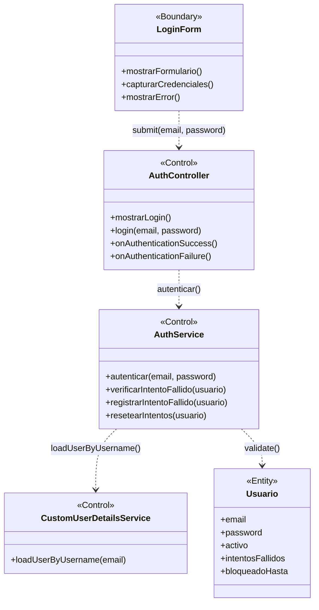

## 4.2 BCE-CU02: Ver Dashboard

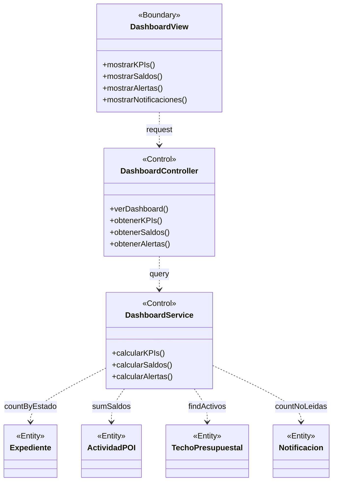

## 4.3 BCE-CU03: Crear Expediente

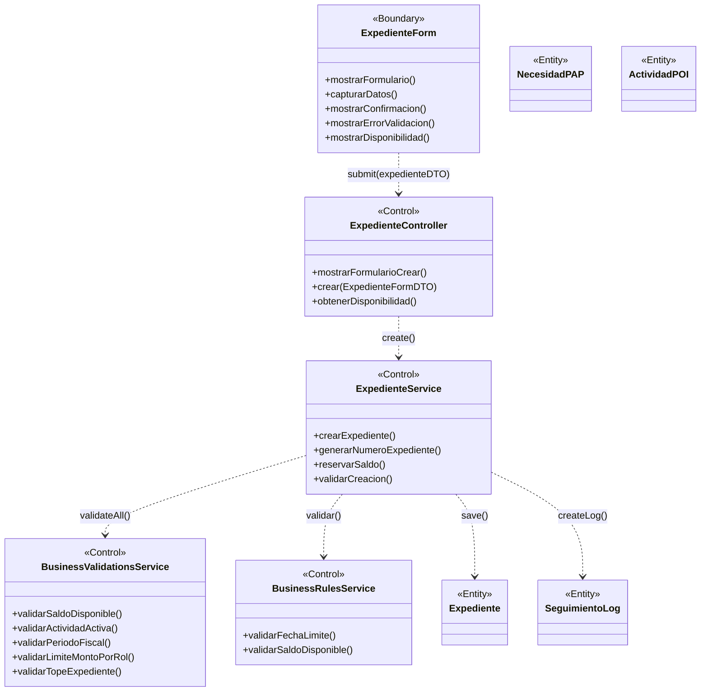

## 4.4 BCE-CU04: Cambiar Estado Expediente


## 4.5 BCE-CU05: Adjuntar Documento

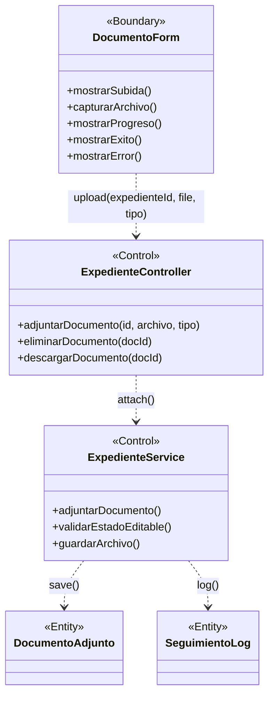

## 4.6 BCE-CU06: Gestionar Techo Presupuestal

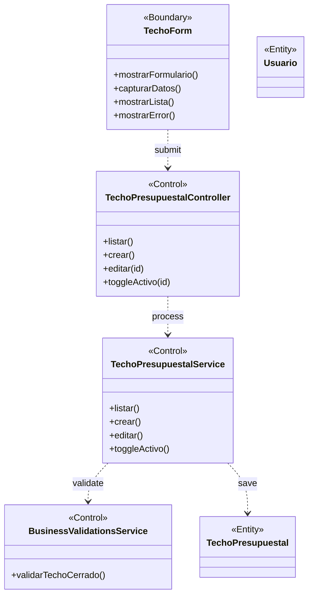

## 4.7 BCE-CU07: Gestionar Actividad POI

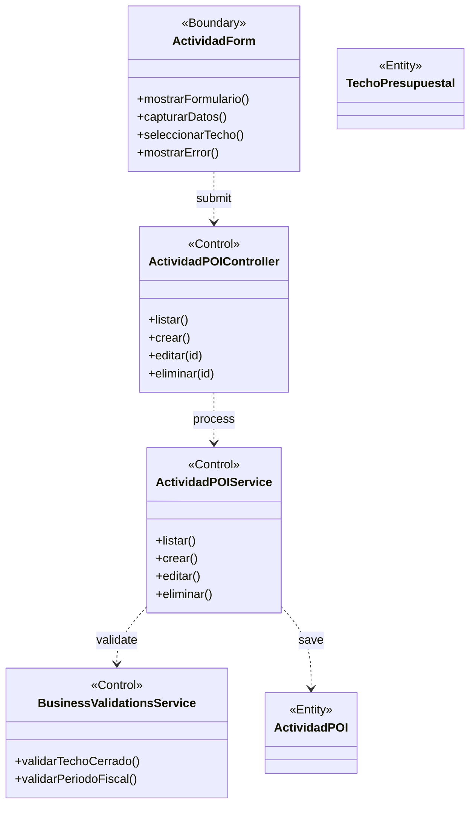

## 4.8 BCE-CU08: Gestionar Necesidad PAP

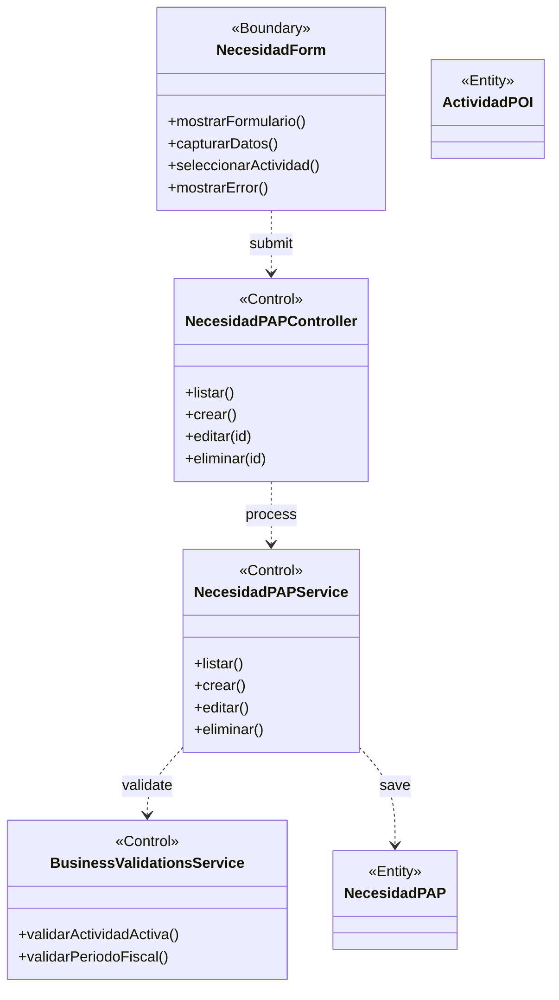

## 4.9 BCE-CU09: Gestionar Nota Modificatoria

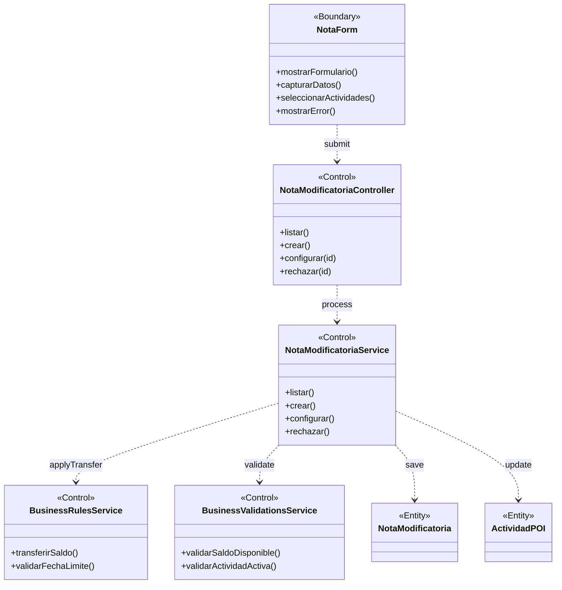

## 4.10 BCE-CU10: Ver Reportes

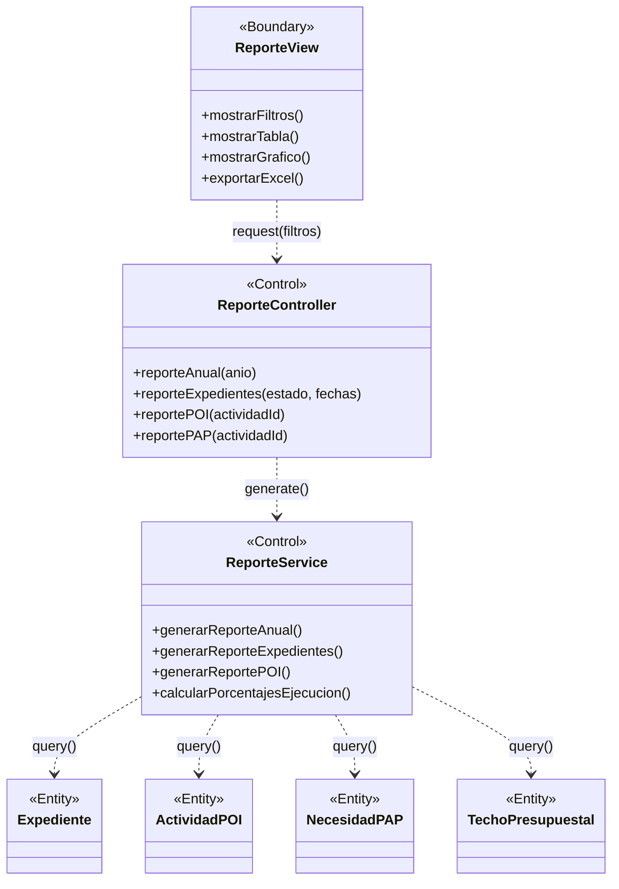

## 4.11 BCE-CU11: Gestionar Usuarios

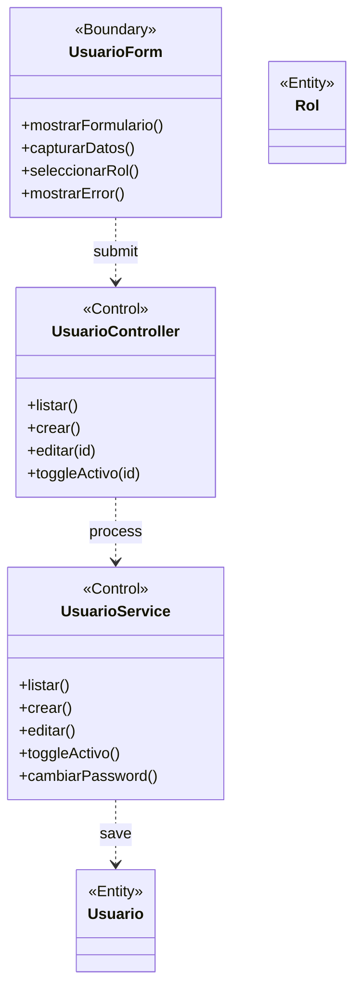

## 4.12 BCE-CU12: Gestionar Notificaciones

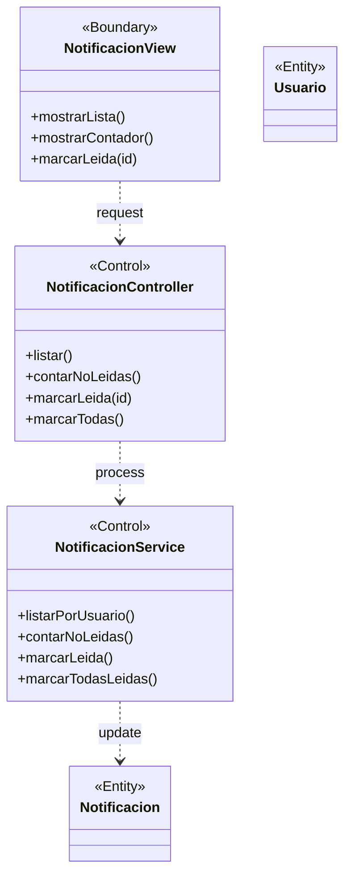

## 4.13 BCE-CU13: Rastrear Expediente

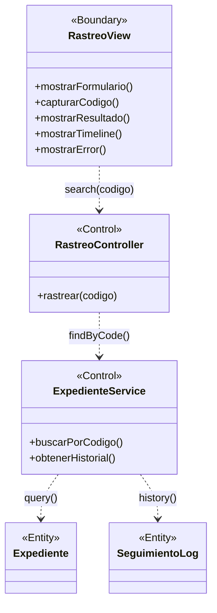

## 4.14 BCE-CU14: Cerrar Sesión

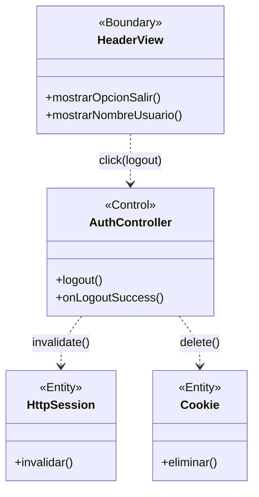

## 4.15 SSD-CU01: Iniciar Sesión

```mermaid
sequenceDiagram
    actor Usuario
    participant :Sistema

    Usuario->>:Sistema: POST /login {email, password}
    activate :Sistema

    :Sistema-->>:Sistema: Buscar usuario por email
    :Sistema-->>:Sistema: Verificar cuenta activa

    alt Cuenta inactiva
        :Sistema-->>Usuario: Redirect /login?error (Cuenta desactivada)
    else Cuenta activa
        :Sistema-->>:Sistema: Verificar bloqueo por intentos

        alt Cuenta bloqueada
            :Sistema-->>Usuario: Redirect /login?error (Cuenta bloqueada)
        else No bloqueada
            :Sistema-->>:Sistema: Validar password (BCrypt)

            alt Password invalido
                :Sistema-->>:Sistema: Incrementar intentosFallidos
                opt Intentos >= 5
                    :Sistema-->>:Sistema: Bloquear cuenta 30 min
                end
                :Sistema-->>Usuario: Redirect /login?error (Credenciales invalidas)
            else Password valido
                :Sistema-->>:Sistema: Resetear intentosFallidos a 0
                :Sistema-->>:Sistema: Crear sesion HTTP + RememberMe
                :Sistema-->>Usuario: Redirect /dashboard (302)
            end
        end
    end

    deactivate :Sistema
```

## 4.16 SSD-CU03: Crear Expediente

```mermaid
sequenceDiagram
    actor Usuario
    participant :Sistema

    Usuario->>:Sistema: GET /expedientes/nuevo
    activate :Sistema
    :Sistema-->>Usuario: 200 Vista formulario + actividades POI activas
    deactivate :Sistema

    Usuario->>:Sistema: GET /api/necesidades-pap/actividad/{id} (AJAX)
    activate :Sistema
    :Sistema-->>:Sistema: Consultar necesidades PAP vinculadas
    :Sistema-->>Usuario: 200 [{necesidadPAP}]
    deactivate :Sistema

    Usuario->>:Sistema: POST /api/expedientes {actividadPoiId, necesidadPapId, cantidad, urgencia, ...}
    activate :Sistema

    :Sistema-->>:Sistema: Validar actividad activa y fecha limite no vencida
    :Sistema-->>:Sistema: Validar techo del año abierto (no planificado)
    :Sistema-->>:Sistema: Calcular costoEstimado = cantidad x precioUnitario
    :Sistema-->>:Sistema: Validar saldo disponible en POI
    :Sistema-->>:Sistema: Validar limite de monto por rol
    :Sistema-->>:Sistema: Validar tope 80% del saldo disponible
    :Sistema-->>:Sistema: Validar correspondencia de tipo (Bien/Servicio)
    :Sistema-->>:Sistema: Generar codigo EXP-YYYY-NNNN

    alt Validaciones exitosas
        :Sistema-->>:Sistema: Crear expediente (estado: Borrador)
        :Sistema-->>:Sistema: Crear log de seguimiento inicial
        :Sistema-->>Usuario: 201 Created
    else Error de validacion
        :Sistema-->>Usuario: 400 {error: "mensaje"}
    end

    deactivate :Sistema
```

## 4.17 SSD-CU04: Cambiar Estado

```mermaid
sequenceDiagram
    actor Usuario
    participant :Sistema

    Usuario->>:Sistema: PUT /api/expedientes/{id}/estado {nuevoEstado, observacion}
    activate :Sistema

    :Sistema-->>:Sistema: Validar transicion permitida

    alt Transicion valida
        :Sistema-->>:Sistema: Ejecutar reglas de negocio segun transicion

        alt Borrador -> En_revision
            :Sistema-->>:Sistema: reservarSaldo(POI)
            :Sistema-->>:Sistema: reservarSaldoPAP(PAP)
        else En_revision -> Aprobado
            :Sistema-->>:Sistema: ejecutarSaldo(POI)
            :Sistema-->>:Sistema: ejecutarSaldoPAP(PAP)
        else En_revision -> Rechazado
            :Sistema-->>:Sistema: liberarSaldo(POI)
            :Sistema-->>:Sistema: liberarSaldoPAP(PAP)
        else En_revision -> Observado
            :Sistema-->>:Sistema: liberarSaldo(POI)
            :Sistema-->>:Sistema: liberarSaldoPAP(PAP)
        else Observado -> En_revision
            :Sistema-->>:Sistema: reservarSaldo(POI)
            :Sistema-->>:Sistema: reservarSaldoPAP(PAP)
        end

        :Sistema-->>:Sistema: Actualizar estado del expediente
        :Sistema-->>:Sistema: Crear SeguimientoLog
        :Sistema-->>:Sistema: Crear Notificacion para solicitante

        :Sistema-->>Usuario: 200 OK
    else Transicion invalida
        :Sistema-->>Usuario: 400 {error: "Transicion invalida"}
    end

    deactivate :Sistema
```

## 4.18 SSD-CU05: Adjuntar Documento

```mermaid
sequenceDiagram
    actor Usuario
    participant :Sistema

    Usuario->>:Sistema: POST /api/expedientes/{id}/documentos {tipo, archivo}
    activate :Sistema

    :Sistema-->>:Sistema: Validar expediente existe
    :Sistema-->>:Sistema: Validar archivo <= 20 MB
    :Sistema-->>:Sistema: Validar tipo de documento permitido

    alt Archivo valido
        :Sistema-->>:Sistema: Generar UUID para nombre en disco
        :Sistema-->>:Sistema: Crear registro DocumentoAdjunto
        :Sistema-->>Usuario: 200 OK
    else Archivo invalido
        :Sistema-->>Usuario: 400 {error: "mensaje"}
    end

    deactivate :Sistema
```

## 4.19 SSD-CU06: Gestionar Techo

```mermaid
sequenceDiagram
    actor Usuario
    participant :Sistema

    Usuario->>:Sistema: GET /techos
    activate :Sistema
    :Sistema-->>:Sistema: Consultar todos los techos (ORDER BY año DESC)
    :Sistema-->>Usuario: 200 Vista listado de techos
    deactivate :Sistema

    Usuario->>:Sistema: POST /techos {año, montoTotal}
    activate :Sistema

    :Sistema-->>:Sistema: Validar año unico en BD
    :Sistema-->>:Sistema: Validar montoTotal > 0

    alt Validaciones exitosas
        :Sistema-->>:Sistema: Crear TechoPresupuestal (activo=true)
        :Sistema-->>Usuario: 201 Created
    else Año duplicado
        :Sistema-->>Usuario: 400 {error: "año ya existe"}
    end

    deactivate :Sistema
```

## 4.20 SSD-CU07: Gestionar Actividad POI

```mermaid
sequenceDiagram
    actor Usuario
    participant :Sistema

    Usuario->>:Sistema: POST /api/actividades-poi/techo/{techoId} {codigo, nombre, presupuestoAsignado, ...}
    activate :Sistema

    :Sistema-->>:Sistema: Validar techo activo y no planificado
    :Sistema-->>:Sistema: Validar codigo unico en el techo
    :Sistema-->>:Sistema: Validar presupuesto <= disponible del techo

    alt Validaciones exitosas
        :Sistema-->>:Sistema: Crear ActividadPOI (estado: Pendiente)
        :Sistema-->>Usuario: 200 OK
    else Presupuesto excede disponible
        :Sistema-->>Usuario: 400 {error: "presupuesto excede disponible"}
    end

    deactivate :Sistema
```

---

# PARTE 5: DESPLIEGUE (DEVOPS)

## 5.1 Dockerfile Multi-Stage

```dockerfile
# Etapa 1: Compilar React
FROM node:18-alpine AS frontend
WORKDIR /app/frontend
COPY frontend/package.json frontend/pnpm-lock.yaml ./
RUN npm install -g pnpm && pnpm install --frozen-lockfile
COPY frontend/ ./
RUN pnpm build

# Etapa 2: Compilar Spring Boot
FROM maven:3.9-eclipse-temurin-17-alpine AS builder
WORKDIR /build
COPY pom.xml .
COPY src ./src
COPY --from=frontend /app/frontend/build ./src/main/resources/static
RUN mvn clean package -DskipTests -q

# Etapa 3: Imagen final ligera
FROM eclipse-temurin:17-jre-alpine
WORKDIR /app
RUN apk add --no-cache postgresql-client curl
COPY --from=builder /build/target/*.jar app.jar
EXPOSE 8080
ENTRYPOINT ["java", "-jar", "app.jar"]
```

## 5.2 Railway

| Configuración | Valor |
|---|---|
| Proyecto ID | `8f718509-dcb0-41e2-8577-05a789002592` |
| Servicio ID | `4eeffaa2-2701-4b29-bf6b-f1f58e488b4a` |
| URL | https://sisexp-web-production.up.railway.app |
| Build | Dockerfile automático |
| Deploy | Auto-deploy en cada push a master |
| DB | PostgreSQL (provisionado por Railway) |

---

# PARTE 6: LECCIONES APRENDIDAS

| # | Problema | Causa | Solución |
|---|---|---|---|
| 1 | `@Transactional(readOnly=true)` en controller | Causaba "cannot execute INSERT" en PostgreSQL para POST/PUT | Mover a solo `@GetMapping` |
| 2 | `.name()` sobre String en Thymeleaf | `SpelEvaluationException`: `.name()` solo para enums | Usar variable directa |
| 3 | `@Lob String` en PostgreSQL | Mapea a OID que falla en auto-commit | Usar `@Column(columnDefinition="TEXT")` |
| 4 | `d.actividad` vs `d.actividadPOI` | Jackson serializa con nombre del getter | Usar nombre exacto (`actividadPOI`) |
| 5 | `'En revision'` vs `'En_revision'` | Enum usa underscore, UI usaba espacio | Unificar a underscore en frontend |
| 6 | Pantallazo blanco al seleccionar PAP | `disponibilidad.necesidad.tipo` sin `?.` | Backend devolvía estructura flat, no nested |
| 7 | Upload docs: "Sin conexión" | Max file size 1MB (default) + `@RequestParam` sin nombre explícito | `max-file-size=20MB` + `name="tipo"` |
| 8 | Doble clic en cambio de estado | Botones sin `disabled` durante petición | `changingEstado` state + `disabled` |
| 9 | Documentos no aparecían tras upload | Faltaba `@OneToMany` en Expediente | Agregar relación con `@JsonIgnoreProperties` |
| 10 | Techo no descontaba al aprobar | `ejecutarSaldo` no actualizaba `TechoPresupuestal` | Agregar `techo.setMontoUtilizado(...)` |

---

**Fin del informe.**
