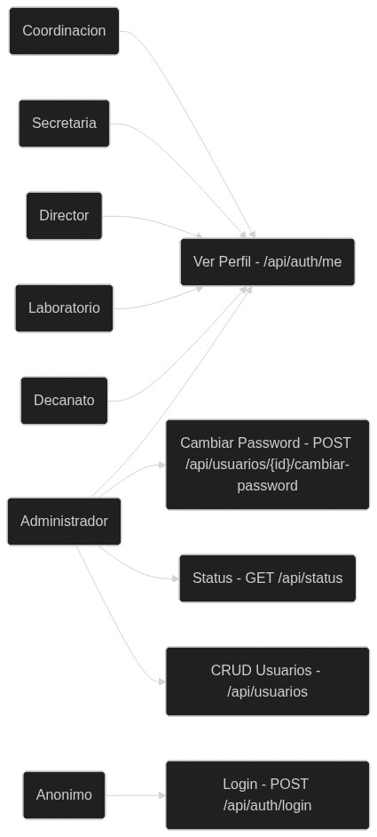
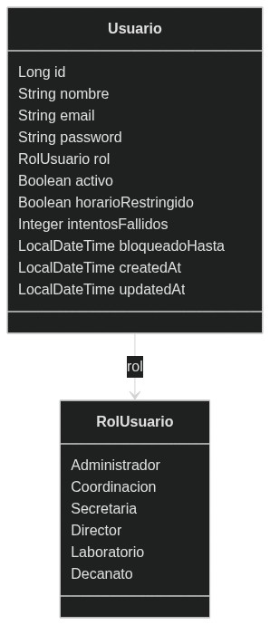
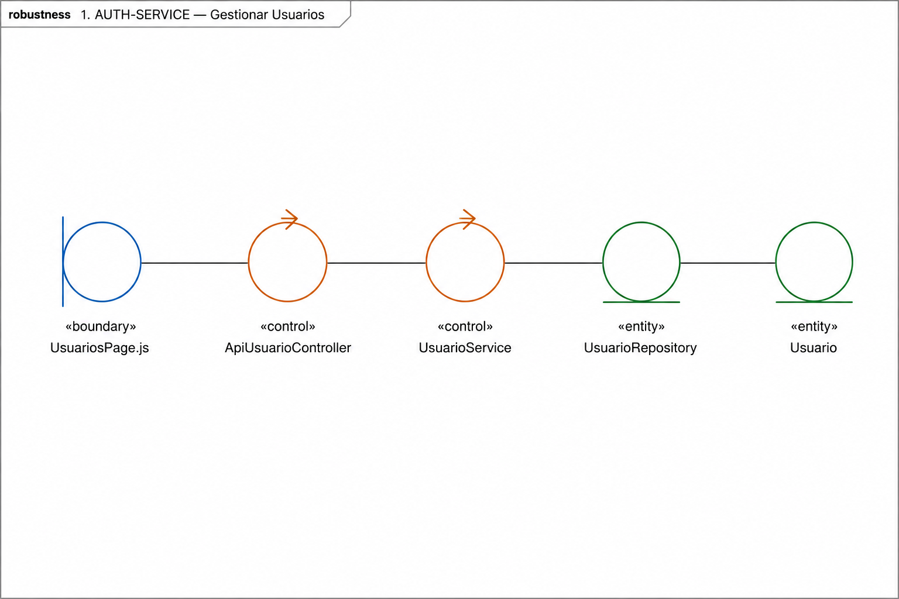
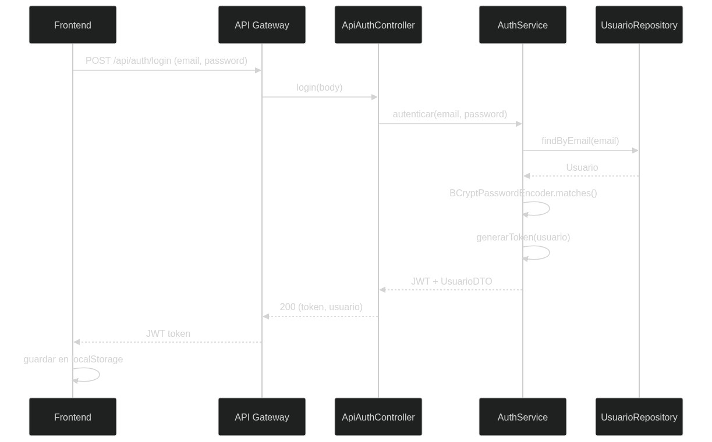
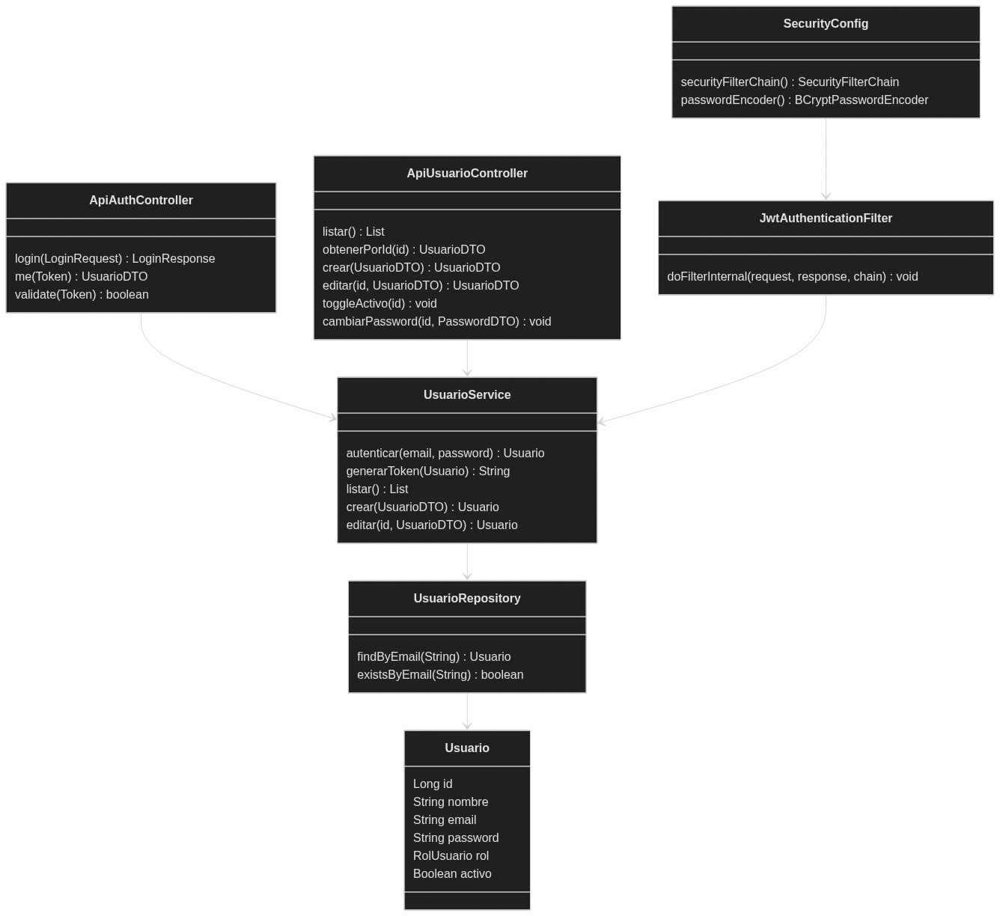

# **AUTH-SERVICE (:8081)**

## **1. Descripcion**

Servicio responsable de la autenticacion JWT y la gestion de usuarios del sistema SISEXP-UPLA.

| **Propiedad** | **Valor** |
|:--------------|:----------|
| Puerto | 8081 |
| Base de Datos | PostgreSQL `auth_db` (:5433) |
| Bounded Context | Autenticacion |
| Tecnologia | Spring Boot 3.4 + Spring Security + JJWT 0.12.6 |
| Dependencias | Eureka Server, auth-db |

---

## **2. Actores**

| **Actor** | **Acceso** |
|:----------|:-----------|
| Administrador | Gestiona usuarios, ve perfil, cambia passwords |
| Coordinacion, Secretaria, Director, Laboratorio, Decanato | Ven su perfil |
| Anonimo | Login (sin autenticacion previa) |

---

## **3. ICONIX — Casos de Uso**



| **CU** | **Actor** | **Descripcion** | **Endpoint** |
|:-------|:----------|:----------------|:-------------|
| CU-01 Login JWT | Anonimo | Autenticacion email/password, retorna JWT | `POST /api/auth/login` |
| CU-02 Gestionar Usuarios | Admin | CRUD completo de usuarios | `GET/POST/PUT /api/usuarios` |
| CU-03 Ver Perfil | Todos | Obtener datos del usuario autenticado | `GET /api/auth/me` |
| CU-04 Validar Token | Sistema | Validar JWT para otros servicios | `GET /api/auth/validate` |

---

## **4. ICONIX — Modelo del Dominio**



**Entidad unica:** Usuario

| **Campo** | **Tipo** | **Restricciones** |
|:----------|:---------|:------------------|
| id | Long | PK, autogenerado |
| nombre | String(150) | NOT NULL |
| email | String(254) | NOT NULL, UNIQUE |
| password | String | NOT NULL, BCrypt |
| rol | RolUsuario (enum) | NOT NULL |
| activo | Boolean | Default true |
| horarioRestringido | Boolean | Default true |
| intentosFallidos | Integer | Default 0 |
| bloqueadoHasta | LocalDateTime | — |
| createdAt | LocalDateTime | @PrePersist |
| updatedAt | LocalDateTime | @PrePersist/@PreUpdate |

**Enum RolUsuario:** Administrador, Coordinacion, Secretaria, Director, Laboratorio, Decanato

---

## **5. ICONIX — Diagrama de Robustez**



**CU-01: Gestionar Usuarios**

```
Boundary: UsuariosPage.js (React Form)
  → Controller: ApiUsuarioController (GET/POST/PUT /api/usuarios)
    → Service: UsuarioService (listar, crear, editar, toggleActivo)
      → Repository: UsuarioRepository (findByEmail, existsByEmail)
        → Entity: Usuario
```

---

## **6. ICONIX — Diagrama de Secuencia**



**Login JWT:**

```
Frontend → POST /api/auth/login {email, password}
  → ApiAuthController.login()
    → UsuarioService.autenticar(email, password)
      → UsuarioRepository.findByEmail(email)
        → BCryptPasswordEncoder.matches(password, hash)
          → Jwts.builder().signWith(key).compact()
            ← 200 { token, usuario }
              → Frontend guarda JWT en localStorage
```

---

## **7. ICONIX — Diagrama de Clases**



| **Clase** | **Tipo** | **Metodos clave** |
|:----------|:---------|:------------------|
| ApiAuthController | @RestController | login(LoginRequest), me(Token), validate(Token) |
| ApiUsuarioController | @RestController | listar(), crear(), editar(), toggleActivo(), cambiarPassword() |
| StatusController | @RestController | getStatus() — health de 7 nodos |
| UsuarioService | @Service | autenticar(), generarToken(), listar(), crear(), editar() |
| UsuarioRepository | JpaRepository | findByEmail(String), existsByEmail(String) |
| SecurityConfig | @Configuration | securityFilterChain(), passwordEncoder(), authManager() |
| JwtAuthenticationFilter | OncePerRequestFilter | doFilterInternal(request, response, chain) |
| GlobalExceptionHandler | @ControllerAdvice | Captura BusinessException→400, 404, 409, 500 |
| DataInitializer | @Component | Seed 6 usuarios (1 por rol) al iniciar |
| Usuario | @Entity | 11 campos, @PrePersist, @PreUpdate |

---

## **8. Endpoints API**

| **Metodo** | **Ruta** | **Auth** | **Descripcion** |
|:-----------|:---------|:--------:|:----------------|
| POST | /api/auth/login | No | Login, retorna JWT |
| GET | /api/auth/me | JWT | Perfil del usuario autenticado |
| GET | /api/auth/validate | Bearer | Validar token |
| GET | /api/usuarios | JWT | Listar todos los usuarios |
| GET | /api/usuarios/{id} | JWT | Obtener usuario por ID |
| POST | /api/usuarios | JWT | Crear usuario |
| PUT | /api/usuarios/{id} | JWT | Editar usuario |
| PUT | /api/usuarios/{id}/toggle-activo | JWT | Activar/desactivar |
| POST | /api/usuarios/{id}/cambiar-password | JWT | Cambiar password |
| GET | /api/status | No | Estado de los 7 nodos |
| GET | /api/health | No | Health actuator |

---

## **9. Dependencias**

| **Dependencia** | **Tipo** | **Detalle** |
|:----------------|:---------|:------------|
| Eureka Server | Registro | `eureka-server:8761` |
| auth-db | Base de Datos | `postgres:16-alpine`, puerto 5433 |
| sisexp-common | JAR compartido | Enums, DTOs, EnumUtils, BusinessException |

---

## **10. Configuracion**

| **Variable** | **Valor** | **Descripcion** |
|:-------------|:----------|:----------------|
| SPRING_DATASOURCE_URL | `jdbc:postgresql://auth-db:5432/auth_db` | Conexion a BD |
| SPRING_DATASOURCE_USERNAME | `postgres` | Usuario BD |
| SPRING_DATASOURCE_PASSWORD | `sisexp` | Password BD |
| EUREKA_CLIENT_SERVICEURL_DEFAULTZONE | `http://eureka-server:8761/eureka` | Discovery |
| JWT_SECRET | `SisexpJwtSecret2026MicroservicesKey!` | Clave JJWT |
| JWT_EXPIRATION | `86400000` | 24 horas |
| EUREKA_INSTANCE_HOSTNAME | `auth-service.railway.internal` | Railway |
| server.port | `8081` | Puerto HTTP |

---

<div style="text-align: center; margin-top: 40px; padding: 20px; border-top: 3px solid #1e3a5f;">

**SISEXP-UPLA** — AUTH-SERVICE — Documentacion ICONIX

Universidad Peruana Los Andes — Arquitectura de Software — VIII Ciclo — Julio 2026

</div>
