# SISEXP-UPLA - Documentación Completa ICONIX

## Contenido

1. **ERS** — Especificación de Requisitos de Software (ISO 29148 + ICONIX Fase 1)
2. **BCE** — Diagramas de Robustez Boundary-Control-Entity (ICONIX Fase 3)
3. **SSD** — Diagramas de Secuencia del Sistema (ICONIX Fase 4)

---


# ERS — Especificación de Requisitos de Software

## Sistema de Seguimiento y Control de Expedientes — SISEXP-UPLA

---

| Campo | Valor |
|---|---|
| **Proyecto** | SISEXP-UPLA — Sistema de Seguimiento y Control de Expedientes |
| **Estándar** | ISO/IEC 29148:2018 — Ingeniería de Sistemas y Software |
| **Metodología** | ICONIX — Fase 1: Análisis de Requisitos |
| **Versión** | 1.0 |
| **Fecha** | 23 de junio de 2026 |
| **Autor** | Equipo de Arquitectura de Software — VIII Ciclo — UPLA |
| **Dominio** | Gestión presupuestal de expedientes académico-administrativos |
| **Entidades** | 11 (Usuario, Rol, TechoPresupuestal, ActividadPOI, NecesidadPAP, Expediente, DocumentoAdjunto, SeguimientoLog, NotaModificatoria, Notificacion) |
| **Roles** | 6 (Administrador, Coordinacion, Secretaria, Director, Laboratorio, Decanato) |
| **Estados expediente** | 7 (Borrador, En_revision, Aprobado, Rechazado, Finalizado, Observado, Derivado) |

---

## Índice

1. [Introducción](#1-introducción)
   - 1.1 Propósito
   - 1.2 Alcance
   - 1.3 Definiciones, acrónimos y abreviaturas
   - 1.4 Referencias
   - 1.5 Visión general del documento
2. [Descripción General](#2-descripción-general)
   - 2.1 Perspectiva del producto
   - 2.2 Funciones del producto
   - 2.3 Características de los usuarios (actores)
   - 2.4 Restricciones
   - 2.5 Suposiciones y dependencias
3. [Requisitos Específicos](#3-requisitos-específicos)
   - 3.1 Requisitos Funcionales (RF01–RF14)
   - 3.2 Requisitos No Funcionales (RNF01–RNF08)
   - 3.3 Interfaces Externas
4. [Modelo de Casos de Uso](#4-modelo-de-casos-de-uso)
   - 4.1 Diagrama de Actores
   - 4.2 Especificación Detallada de Casos de Uso (CU01–CU14)
5. [Modelo de Dominio](#5-modelo-de-dominio)
   - 5.1 Diagrama de Clases
   - 5.2 Descripción de Entidades
6. [Matriz de Trazabilidad](#6-matriz-de-trazabilidad)
7. [Apéndices](#7-apéndices)
   - 7.1 Glosario de términos
   - 7.2 Referencias a documentos originales

---

## 1. Introducción

### 1.1 Propósito

Este documento constituye la **Especificación de Requisitos de Software (ERS)** para el sistema **SISEXP-UPLA** (Sistema de Seguimiento y Control de Expedientes de la Universidad Peruana Los Andes), elaborado siguiendo el estándar **ISO/IEC 29148:2018** y la metodología **ICONIX (Fase 1: Análisis de Requisitos)**.

El propósito de este documento es establecer una descripción completa, no ambigua y verificable de los requisitos del sistema, incluyendo:

- Requisitos funcionales (RF) y no funcionales (RNF)
- Modelo de casos de uso con especificaciones detalladas
- Modelo de dominio con entidades y relaciones
- Matriz de trazabilidad bidireccional entre requisitos, casos de uso y entidades

Este documento servirá como base contractual entre el equipo de desarrollo y los stakeholders, y como guía para las fases posteriores de ICONIX (Análisis, Diseño, Implementación y Pruebas).

### 1.2 Alcance

El sistema **SISEXP-UPLA** automatiza la gestión presupuestal de expedientes administrativos de la Oficina de Asuntos Administrativos, Planificación y Presupuesto de la Facultad de Ingeniería de la UPLA. Cubre el ciclo presupuestal completo:

```
Techo Presupuestal → Actividades POI → Necesidades PAP → Expedientes
```

**Incluye:**
- Autenticación y control de acceso basado en roles (RBAC) con 6 roles
- Gestión del ciclo presupuestal: techos, POI, PAP, expedientes
- Flujo de trabajo de expedientes con 7 estados y reglas de negocio de saldos
- Control de horario laboral (8am–8pm, hora Perú) con bypass para Administrador
- Notificaciones automáticas por cambio de estado
- Reportes institucionales (expedientes, POI, PAP, informe anual)
- Rastreo público de expedientes por código
- Notas modificatorias para redistribución presupuestal

**Excluye:**
- Módulo de firmas digitales o certificación electrónica
- Integración con sistemas externos de tesorería o contabilidad gubernamental
- Almacenamiento físico de archivos PDF (solo metadatos)
- Módulo de planilla o recursos humanos

### 1.3 Definiciones, acrónimos y abreviaturas

| Término | Definición |
|---|---|
| **ERS** | Especificación de Requisitos de Software (equivalente a SRS — Software Requirements Specification) |
| **ICONIX** | Metodología ágil de desarrollo de software basada en UML, con 4 fases: Análisis de Requisitos, Análisis y Diseño Preliminar, Diseño Detallado, Implementación |
| **ISO/IEC 29148** | Estándar internacional para la especificación de requisitos de sistemas y software |
| **RF** | Requisito Funcional |
| **RNF** | Requisito No Funcional |
| **CU** | Caso de Uso |
| **RBAC** | Role-Based Access Control — Control de acceso basado en roles |
| **POI** | Plan Operativo Institucional |
| **PAP** | Plan Anual de Contrataciones |
| **KPI** | Key Performance Indicator — Indicador clave de rendimiento |
| **BCrypt** | Algoritmo de hash para almacenamiento seguro de contraseñas |
| **JWT** | JSON Web Token — Token de autenticación |
| **SSD** | System Sequence Diagram — Diagrama de secuencia del sistema |
| **BCE** | Boundary-Control-Entity — Patrón de robustez ICONIX |
| **UPLA** | Universidad Peruana Los Andes |
| **Techo** | Techo Presupuestal — presupuesto anual asignado a la facultad |
| **Bypass horario** | Excepción a la restricción de horario laboral (solo Administrador) |
| **Saldo comprometido** | Monto reservado para expedientes en revisión |
| **Saldo ejecutado** | Monto ya gastado en expedientes aprobados/finalizados |

### 1.4 Referencias

| ID | Documento | Fuente |
|---|---|---|
| [R1] | ISO/IEC 29148:2018 — Systems and software engineering — Life cycle processes — Requirements engineering | Estándar internacional |
| [R2] | ICONIX: Use Case Driven Object Modeling with UML — Doug Rosenberg | Libro de referencia metodológica |
| [R3] | SDD SISEXP-UPLA v4.0 — Documento de Diseño de Software (IEEE 1016-2009) | `docs/referencia/doc/` |
| [R4] | DOMINIO_SISEXP.md — Modelo de dominio completo extraído del código original Express/React v2.0 | `docs/referencia/DOMINIO_SISEXP.md` |
| [R5] | FUNCIONALIDADES_SISEXP.md — Manual de funcionalidades del sistema | `docs/FUNCIONALIDADES_SISEXP.md` |
| [R6] | Informe_Trazabilidad_v4.md — Trazabilidad entre casos de uso e implementación v2.0 | `docs/referencia/doc/Informe_Trazabilidad_v4.md` |
| [R7] | Informe_Inconsistencias_SDD_ERS.md — Inconsistencias entre documentos originales | `docs/referencia/doc/Informe_Inconsistencias_SDD_ERS.md` |
| [R8] | PLAN.md — Plan detallado de implementación por fases | `PLAN.md` |
| [R9] | AGENTS.md — Memoria del proyecto Spring Boot | `AGENTS.md` |

### 1.5 Visión general del documento

Este documento está organizado siguiendo la estructura recomendada por ISO/IEC 29148:2018 (Sección 5.1.6 — Contenido de la ERS). La **Sección 1** presenta la introducción. La **Sección 2** describe el sistema de forma general. La **Sección 3** detalla los requisitos específicos (funcionales, no funcionales e interfaces). La **Sección 4** presenta el modelo de casos de uso completo. La **Sección 5** describe el modelo de dominio. La **Sección 6** contiene la matriz de trazabilidad. La **Sección 7** incluye apéndices.

---

## 2. Descripción General

### 2.1 Perspectiva del producto

SISEXP-UPLA es un **sistema web de gestión presupuestal** que reemplaza el proceso manual de registro y seguimiento de expedientes de gasto. El sistema permite a los diferentes actores (desde personal de laboratorio hasta el decanato) crear, revisar, aprobar y dar seguimiento a solicitudes de gasto, con control automático de saldos presupuestales en tiempo real.

**Ciclo presupuestal que automatiza:**

1. La facultad recibe un **Techo Presupuestal** anual (ej: S/ 115,000 para 2026).
2. Este monto se distribuye en **Actividades POI** (ej: equipamiento de laboratorios, licencias de software).
3. Cada actividad contiene **Necesidades PAP** (ítems específicos: computadoras, microscopios, etc.).
4. Los usuarios crean **Expedientes** que solicitan recursos de una necesidad PAP específica.
5. Cada expediente pasa por un flujo de **7 estados** con reglas de negocio automáticas de reserva/liberación/ejecución de saldos.

**Arquitectura objetivo:**

- Backend: Spring Boot 3.4.1 + Java 17
- Frontend: Thymeleaf + Bootstrap 5.3 (server-side rendering MVC)
- Base de datos: PostgreSQL (producción) / H2 (desarrollo local)
- Seguridad: Spring Security con form login + Remember Me 30 días
- Despliegue: Railway (Docker)

### 2.2 Funciones del producto (lista de RF)

El sistema implementa **14 requisitos funcionales** agrupados en 5 áreas:

| Área | RF | Descripción |
|---|---|---|
| **Autenticación** | RF01 | Iniciar Sesión |
| | RF14 | Cerrar Sesión |
| **Dashboard** | RF02 | Ver Dashboard (KPIs) |
| **Gestión de Expedientes** | RF03 | Crear Expediente |
| | RF04 | Cambiar Estado de Expediente |
| | RF05 | Adjuntar Documento a Expediente |
| **Gestión Presupuestal** | RF06 | Gestionar Techo Presupuestal |
| | RF07 | Gestionar Actividad POI |
| | RF08 | Gestionar Necesidad PAP |
| | RF09 | Gestionar Nota Modificatoria |
| **Reportes y Consultas** | RF10 | Ver Reportes |
| | RF11 | Gestionar Usuarios |
| | RF12 | Gestionar Notificaciones |
| | RF13 | Rastrear Expediente (público) |

### 2.3 Características de los usuarios (actores)

| Actor | Rol en sistema | Perfil | Descripción | Módulos visibles | Acceso horario |
|---|---|---|---|---|---|
| **Administrador** | Administrador | admin_planificacion | Gestión total del sistema, bypass horario 24/7 | 8 (todos) | Bypass 24/7 |
| **Coordinador** | Coordinacion | admin_planificacion | Gestión presupuestal (techos, POI, PAP, aprueba/rechaza) | 7 (excepto Usuarios) | Restringido (8am–8pm) |
| **Secretaria** | Secretaria | secretarial | Creación y gestión de expedientes, documentos, finalización | 6 (sin Reportes, sin Usuarios) | Restringido (8am–8pm) |
| **Director** | Director | solicitante | Crea expedientes, aprueba/rechaza (límite S/ 15,000), ve reportes | 7 (sin Usuarios) | Restringido (8am–8pm) |
| **Laboratorio** | Laboratorio | solicitante | Crea expedientes propios (límite S/ 5,000) | 5 (sin Techos, Reportes, Usuarios) | Restringido (8am–8pm) |
| **Decanato** | Decanato | consulta | Solo consulta de reportes y lectura | 4 (Dashboard, PAP, Reportes, Notas) | Restringido (8am–8pm) |
| **Visitante** | Sin autenticación | — | Rastreo público de expedientes por código | 1 (Rastreo) | Público |

**Permisos granulares por rol (18 acciones):**

| Acción | Admin | Coord | Sec | Dir | Lab | Dec |
|---|---|---|---|---|---|---|
| `EXP_CREAR` | ✅ | ✅ | ✅ | ✅ | ✅ | ❌ |
| `EXP_APROBAR_OBSERVAR` | ✅ | ✅ | ❌ | ❌ | ❌ | ❌ |
| `EXP_RECHAZAR` | ✅ | ✅ | ❌ | ❌ | ❌ | ❌ |
| `EXP_FINALIZAR` | ✅ | ✅ | ✅ | ❌ | ❌ | ❌ |
| `EXP_DERIVAR` | ✅ | ✅ | ✅ | ❌ | ❌ | ❌ |
| `EXP_CAMBIAR_ESTADO` | ✅ | ✅ | ❌ | ❌ | ❌ | ❌ |
| `EXP_SUBIR_DOCUMENTO` | ✅ | ✅ | ✅ | ✅ | ✅ | ❌ |
| `EXP_ELIMINAR_DOCUMENTO` | ✅ | ❌ | ❌ | ❌ | ❌ | ❌ |
| `EXP_VER_TODOS` | ✅ | ✅ | ✅ | ❌ | ❌ | ❌ |
| `POI_CREAR_EDITAR` | ✅ | ❌ | ❌ | ❌ | ❌ | ❌ |
| `POI_VER` | ✅ | ✅ | ✅ | ✅ | ✅ | ✅ |
| `PAP_CREAR_EDITAR` | ✅ | ✅ | ❌ | ❌ | ❌ | ❌ |
| `PAP_ELIMINAR` | ✅ | ❌ | ❌ | ❌ | ❌ | ❌ |
| `TECHO_CREAR_EDITAR` | ✅ | ✅ | ❌ | ❌ | ❌ | ❌ |
| `TECHO_VER` | ✅ | ✅ | ✅ | ✅ | ✅ | ✅ |
| `USUARIO_ADMIN` | ✅ | ❌ | ❌ | ❌ | ❌ | ❌ |
| `REPORTES_VER` | ✅ | ✅ | ❌ | ✅ | ❌ | ✅ |

**Límites de monto por rol:**

| Rol | Límite máximo por expediente |
|---|---|
| Administrador | Ilimitado |
| Coordinacion | Ilimitado |
| Director | S/ 15,000 |
| Secretaria | S/ 5,000 |
| Laboratorio | S/ 5,000 |
| Decanato | S/ 0 (solo consulta) |

### 2.4 Restricciones

| ID | Restricción | Descripción |
|---|---|---|
| **R01** | Horario laboral | El sistema solo es accesible de 8:00 AM a 8:00 PM (hora Perú, `America/Lima`). Usuarios con `horarioRestringido = true` no pueden acceder fuera de este horario. El Administrador tiene bypass. |
| **R02** | Stack tecnológico | Backend: Spring Boot 3.4.1 + Java 17. Frontend: Thymeleaf + Bootstrap 5.3. BD: PostgreSQL (prod) / H2 (dev). Seguridad: Spring Security. |
| **R03** | Autenticación | Form login con Spring Security. Remember Me con validez de 30 días. Contraseñas almacenadas con BCrypt. |
| **R04** | Control de intentos | Máximo 5 intentos fallidos de login. Luego, bloqueo automático por 30 minutos. |
| **R05** | Base de datos | PostgreSQL 15 en producción. H2 en memoria para desarrollo local. Transacciones ACID obligatorias en operaciones de saldo. |
| **R06** | CSRF | Las rutas `/api/**` están exentas de protección CSRF. El resto de rutas Thymeleaf tienen CSRF activado. |
| **R07** | Despliegue | Docker multi-stage, despliegue en Railway. Puerto 8081. |

### 2.5 Suposiciones y dependencias

- El sistema asume que existe una conexión de red estable entre el frontend y el backend.
- La base de datos PostgreSQL debe estar configurada con codificación UTF-8.
- El archivo `application.properties` debe contener las credenciales de BD como variables de entorno (no hardcodeadas).
- Se asume que los usuarios tienen un correo electrónico válido y único como identificador de login.
- El seed data se carga automáticamente en cada deploy (mientras la BD esté vacía).
- No se requiere integración con Active Directory, LDAP ni SSO.
- El sistema no almacena archivos PDF físicos; solo metadatos de documentos.

---

## 3. Requisitos Específicos

### 3.1 Requisitos Funcionales (RF01–RF14)

---

#### RF01: Iniciar Sesión

| Propiedad | Valor |
|---|---|
| **ID** | RF01 |
| **Título** | Iniciar Sesión |
| **Descripción** | El sistema debe autenticar usuarios mediante formulario de login con email y contraseña, verificar el estado de la cuenta (activa, no bloqueada), y establecer una sesión HTTP con remember-me configurable de 30 días. Debe controlar intentos fallidos (máximo 5, luego bloqueo de 30 minutos). |
| **Prioridad** | Alta |
| **Estabilidad** | Alta |
| **Actor(es)** | Todos los actores autenticables (Administrador, Coordinacion, Secretaria, Director, Laboratorio, Decanato) |
| **Caso de Uso** | CU01 |

---

#### RF02: Ver Dashboard

| Propiedad | Valor |
|---|---|
| **ID** | RF02 |
| **Título** | Ver Dashboard (KPIs) |
| **Descripción** | El sistema debe mostrar una página de inicio con KPIs: total de expedientes, distribución por estado (7 estados), expedientes vencidos, barras de ejecución presupuestal por Actividad POI (ejecutado/comprometido/disponible), y lista de alertas de expedientes próximos a vencer. |
| **Prioridad** | Alta |
| **Estabilidad** | Alta |
| **Actor(es)** | Todos los actores autenticados |
| **Caso de Uso** | CU02 |

---

#### RF03: Crear Expediente

| Propiedad | Valor |
|---|---|
| **ID** | RF03 |
| **Título** | Crear Expediente |
| **Descripción** | El sistema debe permitir crear expedientes con: selección de Actividad POI, carga dinámica de Necesidad PAP (vía AJAX), cálculo automático de costo (cantidad × precio unitario), selección de urgencia, naturaleza, cantidad solicitada, fecha límite y descripción. Debe generar código único EXP-YYYY-NNNN, validar saldo disponible, fecha límite de actividad, límite por rol, tope 80% del disponible, correspondencia Bien/Servicio y período fiscal abierto. Al crear, debe registrar el estado inicial "Borrador" y crear un registro en SeguimientoLog. |
| **Prioridad** | Alta |
| **Estabilidad** | Alta |
| **Actor(es)** | Laboratorio, Secretaria, Administrador, Coordinacion, Director |
| **Caso de Uso** | CU03 |

---

#### RF04: Cambiar Estado de Expediente

| Propiedad | Valor |
|---|---|
| **ID** | RF04 |
| **Título** | Cambiar Estado de Expediente |
| **Descripción** | El sistema debe permitir cambiar el estado de un expediente respetando las transiciones permitidas: Borrador→En_revision, En_revision→Aprobado/Rechazado/Observado, Observado→En_revision, Aprobado→Finalizado/Derivado, Derivado→Finalizado. Cada transición debe ejecutar automáticamente las reglas de negocio de saldo: reservar (En_revision), liberar (Rechazado/Observado), ejecutar (Aprobado). Estados Rechazado y Finalizado son terminales. Debe generar una notificación automática al solicitante y registrar en SeguimientoLog. |
| **Prioridad** | Alta |
| **Estabilidad** | Alta |
| **Actor(es)** | Secretaria, Director, Administrador, Coordinacion |
| **Caso de Uso** | CU04 |

---

#### RF05: Adjuntar Documento a Expediente

| Propiedad | Valor |
|---|---|
| **ID** | RF05 |
| **Título** | Adjuntar Documento a Expediente |
| **Descripción** | El sistema debe permitir adjuntar documentos (metadatos) a un expediente en estado Borrador u Observado. Los tipos de documento son: TDR, Especificaciones_Tecnicas, Cotizacion, Informe_Tecnico. Solo el Administrador puede eliminar documentos de cualquier expediente. Se requiere al menos un documento adjunto para enviar el expediente a revisión. |
| **Prioridad** | Media |
| **Estabilidad** | Alta |
| **Actor(es)** | Laboratorio, Secretaria, Administrador, Coordinacion, Director |
| **Caso de Uso** | CU05 |

---

#### RF06: Gestionar Techo Presupuestal

| Propiedad | Valor |
|---|---|
| **ID** | RF06 |
| **Título** | Gestionar Techo Presupuestal |
| **Descripción** | El sistema debe permitir CRUD completo de techos presupuestales por año. Cada techo tiene: año (único), monto total, monto utilizado (cálculo automático), activo/inactivo, planificado/abierto. Un techo planificado no permite modificaciones. El año se auto-sugiere como año actual + 1 al crear. |
| **Prioridad** | Alta |
| **Estabilidad** | Alta |
| **Actor(es)** | Administrador, Coordinacion |
| **Caso de Uso** | CU06 |

---

#### RF07: Gestionar Actividad POI

| Propiedad | Valor |
|---|---|
| **ID** | RF07 |
| **Título** | Gestionar Actividad POI |
| **Descripción** | El sistema debe permitir CRUD de actividades POI dentro de un techo presupuestal. Cada actividad tiene: código, nombre, presupuesto asignado, saldo comprometido, saldo ejecutado, fecha límite, estado (Pendiente/En_Ejecucion/Ejecutado/Cerrado), planificado. La disponibilidad real se calcula como: `presupuestoAsignado - saldoComprometido - saldoEjecutado`. |
| **Prioridad** | Alta |
| **Estabilidad** | Alta |
| **Actor(es)** | Administrador, Coordinacion |
| **Caso de Uso** | CU07 |

---

#### RF08: Gestionar Necesidad PAP

| Propiedad | Valor |
|---|---|
| **ID** | RF08 |
| **Título** | Gestionar Necesidad PAP |
| **Descripción** | El sistema debe permitir CRUD de necesidades PAP dentro de una actividad POI. Cada necesidad tiene: nombre, cantidad planificada, precio unitario, unidad, oficina/laboratorio destino, tipo (Bien/Servicio), clasificador de gasto, cantidad disponible, monto disponible, cantidad ejecutada, monto ejecutado. Los saldos se actualizan automáticamente al crear/cambiar estado de expedientes. |
| **Prioridad** | Alta |
| **Estabilidad** | Alta |
| **Actor(es)** | Administrador, Coordinacion |
| **Caso de Uso** | CU08 |

---

#### RF09: Gestionar Nota Modificatoria

| Propiedad | Valor |
|---|---|
| **ID** | RF09 |
| **Título** | Gestionar Nota Modificatoria |
| **Descripción** | El sistema debe permitir crear y procesar notas modificatorias para redistribución presupuestal. Tipos: inclusión de ítem (nuevo ítem en actividad existente) e inclusión de actividad (nueva actividad). Flujo: solicitud (pendiente) → configuración (Admin/Coordinación asignan origen y monto) → configurada (aprobada) o rechazada. Soporta adjunto PDF de sustento. |
| **Prioridad** | Media |
| **Estabilidad** | Media |
| **Actor(es)** | Administrador, Coordinacion, Secretaria, Laboratorio, Director |
| **Caso de Uso** | CU09 |

---

#### RF10: Ver Reportes

| Propiedad | Valor |
|---|---|
| **ID** | RF10 |
| **Título** | Ver Reportes |
| **Descripción** | El sistema debe generar reportes institucionales con 4 vistas: (1) expedientes: KPI por estado + tabla detalle + exportar CSV; (2) POI: tabla con % ejecución + barra de progreso + exportar CSV; (3) PAP: tabla detallada cantidades + exportar CSV; (4) Informe anual: comparativa entre años fiscales con cards y barras de progreso. |
| **Prioridad** | Media |
| **Estabilidad** | Alta |
| **Actor(es)** | Administrador, Coordinacion, Director, Decanato |
| **Caso de Uso** | CU10 |

---

#### RF11: Gestionar Usuarios

| Propiedad | Valor |
|---|---|
| **ID** | RF11 |
| **Título** | Gestionar Usuarios |
| **Descripción** | El sistema debe permitir CRUD completo de usuarios (solo Administrador). Incluye: crear (nombre, email, contraseña, rol, horario), editar (excepto contraseña), cambiar contraseña (modal independiente), activar/desactivar (toggle soft delete). Validación de email único. Colores por rol: Admin=rojo, Coord=azul, Sec=violeta, Dir=cyan, Lab=naranja, Dec=gris. |
| **Prioridad** | Alta |
| **Estabilidad** | Alta |
| **Actor(es)** | Administrador |
| **Caso de Uso** | CU11 |

---

#### RF12: Gestionar Notificaciones

| Propiedad | Valor |
|---|---|
| **ID** | RF12 |
| **Título** | Gestionar Notificaciones |
| **Descripción** | El sistema debe generar notificaciones automáticas al cambiar el estado de un expediente. Tipos: observacion, rechazo, aprobacion, alerta_fecha, nota_aprobada, nota_rechazada, info. Debe mostrar un badge en el header con el conteo de no leídas (actualización vía AJAX cada 60s). Debe permitir marcar individual o masivamente como leídas. |
| **Prioridad** | Media |
| **Estabilidad** | Media |
| **Actor(es)** | Todos los actores autenticados |
| **Caso de Uso** | CU12 |

---

#### RF13: Rastrear Expediente (público)

| Propiedad | Valor |
|---|---|
| **ID** | RF13 |
| **Título** | Rastrear Expediente |
| **Descripción** | El sistema debe permitir consulta pública de expedientes por código (formato EXP-YYYY-NNNN) sin autenticación. Debe mostrar: código, estado (badge de color), actividad POI, ítem PAP, urgencia, fecha límite, última actualización. No debe exponer montos exactos ni datos del solicitante. Ruta exenta de horario laboral y autenticación. |
| **Prioridad** | Baja |
| **Estabilidad** | Alta |
| **Actor(es)** | Visitante (sin autenticación) |
| **Caso de Uso** | CU13 |

---

#### RF14: Cerrar Sesión

| Propiedad | Valor |
|---|---|
| **ID** | RF14 |
| **Título** | Cerrar Sesión |
| **Descripción** | El sistema debe cerrar la sesión del usuario, invalidar la sesión HTTP, eliminar las cookies JSESSIONID y remember-me, y redirigir a la página de login con mensaje de cierre exitoso. |
| **Prioridad** | Alta |
| **Estabilidad** | Alta |
| **Actor(es)** | Todos los actores autenticados |
| **Caso de Uso** | CU14 |

---

### 3.2 Requisitos No Funcionales (RNF01–RNF08)

---

#### RNF01: Seguridad

| Propiedad | Valor |
|---|---|
| **ID** | RNF01 |
| **Título** | Seguridad |
| **Descripción** | El sistema debe almacenar contraseñas con BCrypt (costo $2a$10). Las sesiones HTTP deben utilizar cookie segura con flag HttpOnly y SameSite=Lax. El endpoint de login debe protegerse contra fuerza bruta (máximo 5 intentos fallidos, bloqueo 30 minutos). Las contraseñas no deben exponerse en respuestas JSON (anotación `@JsonProperty(access = WRITE_ONLY)`). RBAC implementado con Spring Security `@PreAuthorize`. |
| **Prioridad** | Alta |
| **Estabilidad** | Alta |

---

#### RNF02: Horario Laboral

| Propiedad | Valor |
|---|---|
| **ID** | RNF02 |
| **Título** | Restricción de horario laboral |
| **Descripción** | El sistema debe restringir el acceso fuera del horario laboral (8:00 AM – 8:00 PM, hora Perú, `America/Lima`). Usuarios con `horarioRestringido = true` no pueden acceder fuera de ese horario. El Administrador (`horarioRestringido = false`) tiene bypass. Rutas exentas: `/login`, `/rastreo/**`, `/api/health`, `/error`, `/css/**`, `/js/**`, `/vendor/**`, `/favicon.ico`. |
| **Prioridad** | Alta |
| **Estabilidad** | Alta |

---

#### RNF03: Rendimiento

| Propiedad | Valor |
|---|---|
| **ID** | RNF03 |
| **Título** | Rendimiento |
| **Descripción** | La carga del dashboard no debe exceder 2 segundos. Las consultas de listado de expedientes deben responder en menos de 1 segundo. Las tablas deben tener índices en columnas de búsqueda frecuente (código, estado, año, email). Las consultas AJAX de notificaciones deben completarse en menos de 500ms. |
| **Prioridad** | Media |
| **Estabilidad** | Media |

---

#### RNF04: Disponibilidad

| Propiedad | Valor |
|---|---|
| **ID** | RNF04 |
| **Título** | Disponibilidad |
| **Descripción** | El sistema debe tener un 99.5% de uptime. El despliegue en Railway debe incluir PostgreSQL como servicio gestionado. La aplicación debe iniciar en menos de 30 segundos en un contenedor Docker. |
| **Prioridad** | Media |
| **Estabilidad** | Alta |

---

#### RNF05: Escalabilidad

| Propiedad | Valor |
|---|---|
| **ID** | RNF05 |
| **Título** | Escalabilidad |
| **Descripción** | La arquitectura debe ser horizontalmente escalable (Spring Boot stateless). La sesión no debe almacenar estado en memoria del servidor (solo en cookie). Debe soportar hasta 100 usuarios concurrentes sin degradación. |
| **Prioridad** | Baja |
| **Estabilidad** | Media |

---

#### RNF06: Mantenibilidad

| Propiedad | Valor |
|---|---|
| **ID** | RNF06 |
| **Título** | Mantenibilidad |
| **Descripción** | El código debe seguir la estructura de paquetes definida (`config/`, `security/`, `model/`, `enums/`, `repository/`, `dto/`, `service/`, `controller/`, `exception/`). Los servicios críticos (BusinessRulesService, cambio de estado) deben tener pruebas unitarias. La documentación del código debe mantenerse en AGENTS.md. |
| **Prioridad** | Media |
| **Estabilidad** | Alta |

---

#### RNF07: Usabilidad

| Propiedad | Valor |
|---|---|
| **ID** | RNF07 |
| **Título** | Usabilidad |
| **Descripción** | La interfaz debe ser responsive con Bootstrap 5.3. Los badges de estado deben tener colores distintivos: Borrador=gris, En_revision=amarillo, Aprobado=verde, Rechazado=rojo, Finalizado=azul, Observado=rosa, Derivado=púrpura. Los formularios deben tener validación en tiempo real con mensajes de error claros. Los modales deben tener confirmación para acciones destructivas. |
| **Prioridad** | Media |
| **Estabilidad** | Alta |

---

#### RNF08: Integridad de Datos

| Propiedad | Valor |
|---|---|
| **ID** | RNF08 |
| **Título** | Integridad de datos |
| **Descripción** | Todas las operaciones de saldo (reserva/liberación/ejecución) deben ejecutarse dentro de transacciones ACID. Las operaciones de cambio de estado y actualización de saldos deben ser atómicas (si falla una, falla todo). Los saldos no pueden volverse negativos (validación con `max(BigDecimal.ZERO, nuevoSaldo)`). |
| **Prioridad** | Alta |
| **Estabilidad** | Alta |

---

### 3.3 Interfaces Externas

#### 3.3.1 Interfaz de Usuario (Thymeleaf + Bootstrap 5.3)

La interfaz de usuario se implementa con templates Thymeleaf (server-side rendering) y Bootstrap 5.3. Las vistas principales son:

| Vista | Ruta | Descripción |
|---|---|---|
| Login | `/login` | Página de inicio de sesión con diseño card + gradiente |
| Dashboard | `/dashboard` | KPIs, barras de progreso, alertas |
| Expedientes lista | `/expedientes` | Tabla paginada con filtros |
| Expediente detalle | `/expedientes/{id}` | Detalle + timeline + docs + cambio estado |
| Techos | `/techos` | CRUD de techos presupuestales |
| POI | `/poi` | CRUD de actividades POI |
| PAP | `/pap` | CRUD de necesidades PAP |
| Notas Modificatorias | `/notas` | Flujo de notas |
| Reportes | `/reportes` | 4 vistas en tabs |
| Usuarios | `/usuarios` | CRUD de usuarios (solo Admin) |
| Notificaciones | `/notificaciones` | Lista de notificaciones |
| Rastreo | `/rastreo` | Público, sin autenticación |

#### 3.3.2 API REST (`/api/**`)

Endpoints para consumo programático (React SPA original, mantenidos para compatibilidad):

| Método | Ruta | Uso |
|---|---|---|
| `GET` | `/api/expedientes` | Listar expedientes |
| `POST` | `/api/expedientes` | Crear expediente |
| `GET` | `/api/expedientes/{id}` | Obtener detalle |
| `PUT` | `/api/expedientes/{id}/estado` | Cambiar estado |
| `POST` | `/api/expedientes/{id}/documentos` | Subir documento |
| `DELETE` | `/api/expedientes/documentos/{docId}` | Eliminar documento |
| `GET` | `/api/expedientes/disponibilidad/{actividadId}/{necesidadId}` | Consultar disponibilidad |
| `GET` | `/api/techos` | Listar techos |
| `GET` | `/api/techos/{id}` | Obtener techo |
| `GET` | `/api/poi` | Listar actividades POI |
| `GET` | `/api/poi/{id}` | Obtener actividad POI |
| `GET` | `/api/pap` | Listar necesidades PAP |
| `GET` | `/api/pap/{id}` | Obtener necesidad PAP |
| `GET` | `/api/notificaciones/count` | Conteo no leídas |
| `POST` | `/api/notificaciones/{id}/leer` | Marcar como leída |
| `POST` | `/api/notificaciones/leer-todas` | Marcar todas leídas |
| `GET` | `/api/usuarios` | Listar usuarios (Admin) |
| `GET` | `/api/usuarios/{id}` | Obtener usuario |
| `POST` | `/api/usuarios` | Crear usuario |
| `PUT` | `/api/usuarios/{id}` | Actualizar usuario |
| `GET` | `/api/dashboard/alertas` | Alertas dashboard |
| `GET` | `/api/dashboard/saldos` | Saldos dashboard |
| `GET` | `/api/reportes/expedientes` | Reporte expedientes |
| `GET` | `/api/reportes/poi` | Reporte POI general |
| `GET` | `/api/reportes/pap` | Reporte PAP general |
| `GET` | `/api/reportes/anual/{anio}` | Informe anual |

#### 3.3.3 Base de Datos

- **Producción:** PostgreSQL 15 en Railway
- **Desarrollo local:** H2 en memoria (perfil `dev`)
- **ORM:** Spring Data JPA / Hibernate 6.6.4
- **DDL:** `spring.jpa.hibernate.ddl-auto=update` (en desarrollo), migraciones manuales en producción
- **Conexión:** Configurada vía `application.properties` con variables de entorno para credenciales

---

## 4. Modelo de Casos de Uso

### 4.1 Diagrama de Actores

```mermaid
flowchart TD
    subgraph Actores
        A["Administrador"]
        C["Coordinacion"]
        S["Secretaria"]
        D["Director"]
        L["Laboratorio"]
        N["Decanato"]
        V["Visitante\n(sin autenticación)"]
    end

    subgraph "CU01: Autenticación"
        CU01["(Iniciar Sesión)"]
        CU14["(Cerrar Sesión)"]
    end

    subgraph "CU02: Dashboard"
        CU02["(Ver Dashboard)"]
    end

    subgraph "Gestión de Expedientes"
        CU03["(Crear Expediente)"]
        CU04["(Cambiar Estado)"]
        CU05["(Adjuntar Documento)"]
    end

    subgraph "Gestión Presupuestal"
        CU06["(Gestionar Techo)"]
        CU07["(Gestionar Actividad POI)"]
        CU08["(Gestionar Necesidad PAP)"]
        CU09["(Gestionar Nota Modificatoria)"]
    end

    subgraph "Reportes y Consultas"
        CU10["(Ver Reportes)"]
        CU11["(Gestionar Usuarios)"]
        CU12["(Gestionar Notificaciones)"]
        CU13["(Rastrear Expediente)"]
    end

    A --> CU01 & CU02 & CU03 & CU04 & CU05 & CU06 & CU07 & CU08 & CU09 & CU10 & CU11 & CU12 & CU14
    C --> CU01 & CU02 & CU03 & CU04 & CU05 & CU06 & CU07 & CU08 & CU09 & CU10 & CU12 & CU14
    S --> CU01 & CU02 & CU03 & CU04 & CU05 & CU06 & CU07 & CU08 & CU09 & CU12 & CU14
    D --> CU01 & CU02 & CU03 & CU05 & CU06 & CU07 & CU08 & CU09 & CU10 & CU12 & CU14
    L --> CU01 & CU02 & CU03 & CU05 & CU07 & CU08 & CU09 & CU12 & CU14
    N --> CU01 & CU02 & CU08 & CU09 & CU10 & CU12 & CU14
    V --> CU13
```

### 4.2 Especificación Detallada de Casos de Uso

---

#### CU01: Iniciar Sesión

| Propiedad | Valor |
|---|---|
| **ID** | CU01 |
| **Nombre** | Iniciar Sesión |
| **Actor(es)** | Administrador, Coordinacion, Secretaria, Director, Laboratorio, Decanato |
| **Descripción** | El usuario ingresa su email y contraseña en el formulario de login. El sistema verifica las credenciales, el estado de la cuenta (activa, no bloqueada), y establece una sesión HTTP. Si el usuario marca "Recordarme", se genera una cookie con validez de 30 días. |
| **Precondición** | El usuario debe tener una cuenta activa en el sistema. |
| **Postcondición** | El usuario queda autenticado y es redirigido al Dashboard. Se registra la sesión. |

**Flujo básico:**

1. El actor navega a la página de login (`/login`).
2. El sistema muestra el formulario de login con campos email y contraseña, más checkbox "Recordarme (30 días)".
3. El actor ingresa su email y contraseña.
4. El actor hace clic en "Iniciar Sesión".
5. El sistema valida que los campos no estén vacíos.
6. El sistema busca al usuario por email en la base de datos.
7. El sistema verifica que el usuario esté activo (`activo = true`).
8. El sistema verifica que la cuenta no esté bloqueada (5 intentos fallidos en los últimos 30 minutos).
9. El sistema compara la contraseña ingresada con el hash BCrypt almacenado.
10. Si coincide, el sistema:
    - Resetea `intentosFallidos = 0` y `bloqueadoHasta = NULL`.
    - Crea la sesión HTTP.
    - Si marcó "Recordarme", genera cookie remember-me con validez 30 días.
    - Redirige al Dashboard.
11. El sistema muestra la página de Dashboard con los KPIs del usuario.

**Flujo alterno A — Credenciales inválidas:**

1. En el paso 9, si la contraseña no coincide.
2. El sistema incrementa `intentosFallidos` en 1.
3. Si `intentosFallidos >= 5`, el sistema establece `bloqueadoHasta = now() + 30 min`.
4. El sistema muestra mensaje de error: "Credenciales inválidas" o "Cuenta bloqueada. Intente nuevamente en 30 minutos."

**Flujo alterno B — Cuenta inactiva:**

1. En el paso 7, si `activo = false`.
2. El sistema muestra mensaje: "Su cuenta ha sido desactivada. Contacte al administrador."

**Flujo alterno C — Fuera de horario laboral:**

1. Si la solicitud se realiza fuera del horario 8am–8pm.
2. El sistema verifica si el usuario tiene `horarioRestringido = false` (Administrador).
3. Si no tiene bypass, redirige a `/login?horario` con mensaje: "El sistema solo está disponible de 8:00 AM a 8:00 PM."

| Requisitos asociados | RF01 |
|---|---|
| **Reglas de negocio** | RN01: Máximo 5 intentos fallidos, luego bloqueo 30 min. RN02: Horario laboral 8am–8pm. RN03: Admin tiene bypass horario. |

---

#### CU02: Ver Dashboard

| Propiedad | Valor |
|---|---|
| **ID** | CU02 |
| **Nombre** | Ver Dashboard |
| **Actor(es)** | Administrador, Coordinacion, Secretaria, Director, Laboratorio, Decanato |
| **Descripción** | El usuario visualiza la página principal del sistema con indicadores clave: total de expedientes, distribución por estado, barras de ejecución presupuestal por actividad POI, y alertas de expedientes vencidos/próximos a vencer. |
| **Precondición** | El usuario debe estar autenticado. |
| **Postcondición** | Se muestran los KPIs actualizados al momento de la consulta. |

**Flujo básico:**

1. El actor inicia sesión exitosamente (CU01) o navega a `/dashboard`.
2. El sistema carga los KPIs de expedientes (total, por estado).
3. El sistema calcula expedientes vencidos (fechaLímite < hoy, estado ≠ Finalizado/Rechazado).
4. El sistema consulta las actividades POI con sus saldos (presupuesto asignado, comprometido, ejecutado).
5. El sistema renderiza: 6 tarjetas KPI, barras de progreso por actividad y lista de alertas.

**Flujo alterno A — Sin datos:**

1. Si no hay expedientes registrados, se muestran tarjetas en cero y mensaje "No hay expedientes registrados."

| Requisitos asociados | RF02 |
|---|---|
| **Reglas de negocio** | RN04: Dashboard visible para todos los roles autenticados. |

---

#### CU03: Crear Expediente

| Propiedad | Valor |
|---|---|
| **ID** | CU03 |
| **Nombre** | Crear Expediente |
| **Actor(es)** | Laboratorio, Secretaria, Administrador, Coordinacion, Director |
| **Descripción** | El actor crea un nuevo expediente seleccionando actividad POI, necesidad PAP (carga dinámica), completando campos (urgencia, cantidad, descripción, fecha límite). El sistema valida reglas de negocio, genera código secuencial EXP-YYYY-NNNN, reserva saldo, y establece estado "Borrador". |
| **Precondición** | El usuario debe tener permiso `EXP_CREAR`. Debe existir al menos un techo presupuestal activo con actividades POI y necesidades PAP. |
| **Postcondición** | Se crea un expediente en estado Borrador con código único. Se registra en SeguimientoLog. Se reserva saldo en ActividadPOI y NecesidadPAP. |

**Flujo básico:**

1. El actor navega a "Crear Expediente".
2. El sistema carga la lista de actividades POI activas con saldo disponible.
3. El actor selecciona una actividad POI.
4. El sistema carga vía AJAX las necesidades PAP de esa actividad (nombre, precio unitario, cantidad disponible).
5. El actor selecciona una necesidad PAP e ingresa: cantidad solicitada, urgencia, descripción, fecha límite (opcional).
6. El sistema calcula automáticamente: `costoEstimado = cantidad × precioUnitario`.
7. El sistema valida:
    - Actividad no cerrada/planificada.
    - Fecha límite de actividad no vencida.
    - Saldo disponible suficiente (`costoEstimado <= disponible`).
    - Límite de monto del rol del solicitante.
    - Tope 80% del disponible.
    - Correspondencia Bien/Servicio entre PAP y expediente.
    - Período fiscal abierto (techo del año no cerrado/planificado).
8. El sistema genera código: `EXP-YYYY-NNNN` (secuencial por año).
9. El sistema reserva saldo en ActividadPOI (`saldoComprometido += costoEstimado`).
10. El sistema descuenta en NecesidadPAP (`cantidadDisponible -= cantidad`, `montoDisponible -= costoEstimado`).
11. El sistema crea el expediente con estado "Borrador".
12. El sistema registra en SeguimientoLog: "Expediente registrado", estadoNuevo = "Borrador".
13. El sistema redirige al detalle del expediente creado.

**Flujo alterno A — Saldo insuficiente:**

1. En el paso 7, si el saldo disponible es menor que el costo estimado.
2. El sistema muestra mensaje: "Saldo insuficiente en la actividad. Disponible: S/ X."

**Flujo alterno B — Límite de rol excedido:**

1. En el paso 7, si el costo estimado excede el límite del rol.
2. El sistema muestra mensaje: "El monto solicitado (S/ X) excede su límite de S/ Y."

**Flujo alterno C — Sin necesidades PAP disponibles:**

1. Si la actividad seleccionada no tiene necesidades PAP con cantidad disponible > 0.
2. El sistema muestra mensaje: "No hay necesidades PAP disponibles en esta actividad."

| Requisitos asociados | RF03 |
|---|---|
| **Reglas de negocio** | RN05: validar fecha límite actividad. RN06: validar saldo disponible. RN07: reservar saldo POI. RN08: reservar saldo PAP. RN09: límite de monto por rol. RN10: tope 80%. RN11: correspondencia Bien/Servicio. RN12: período fiscal abierto. RN13: documento obligatorio para enviar a revisión. |

---

#### CU04: Cambiar Estado de Expediente

| Propiedad | Valor |
|---|---|
| **ID** | CU04 |
| **Nombre** | Cambiar Estado de Expediente |
| **Actor(es)** | Secretaria (parcial), Director (parcial), Administrador, Coordinacion |
| **Descripción** | El actor cambia el estado de un expediente respetando las transiciones permitidas. Cada transición ejecuta reglas de negocio de saldo automáticas y genera notificación al solicitante. |
| **Precondición** | El usuario debe tener permiso `EXP_CAMBIAR_ESTADO` (Admin/Coord) o acciones específicas (Secretaria: finalizar/derivar; Director: aprobar/rechazar con límite S/ 15,000). |
| **Postcondición** | El expediente cambia de estado. Se actualizan saldos según reglas de negocio. Se registra en SeguimientoLog. Se genera notificación. |

**Flujo básico:**

1. El actor visualiza el detalle del expediente.
2. El sistema muestra el panel de cambio de estado con los estados permitidos según el estado actual y el rol del usuario.
3. El actor selecciona el nuevo estado y opcionalmente ingresa una observación.
4. El sistema valida que la transición esté permitida.
5. El sistema ejecuta las reglas de negocio según la transición:
    - **Borrador → En_revision:** `reservarSaldo()` en POI + PAP. Validar que tenga al menos 1 documento adjunto.
    - **En_revision → Aprobado:** `ejecutarSaldo()` en POI + PAP.
    - **En_revision → Rechazado:** `liberarSaldo()` en POI + PAP.
    - **En_revision → Observado:** `liberarSaldo()` en POI + PAP.
    - **Observado → En_revision:** `reservarSaldo()` en POI + PAP.
    - **Aprobado → Finalizado:** sin cambio de saldo.
    - **Aprobado → Derivado:** sin cambio de saldo.
    - **Derivado → Finalizado:** sin cambio de saldo.
6. El sistema actualiza el estado del expediente.
7. El sistema registra en SeguimientoLog: estadoAnterior, estadoNuevo, observación, usuarioId.
8. El sistema genera notificación al solicitante del expediente.
9. El sistema redirige al detalle del expediente actualizado.

**Flujo alterno A — Transición no permitida:**

1. En el paso 4, si la transición no está en la matriz de estados permitidos.
2. El sistema muestra mensaje: "No se puede cambiar de {estadoActual} a {estadoNuevo}."

**Flujo alterno B — Documento obligatorio faltante:**

1. En el paso 5, si se intenta pasar de Borrador a En_revision sin tener al menos un documento adjunto.
2. El sistema muestra mensaje: "Debe adjuntar al menos un documento antes de enviar a revisión."

**Matriz de transiciones permitidas:**

| Estado actual | Estados destino permitidos |
|---|---|
| Borrador | En_revision |
| En_revision | Aprobado, Rechazado, Observado |
| Observado | En_revision |
| Aprobado | Finalizado, Derivado |
| Derivado | Finalizado |
| Rechazado | (terminal) |
| Finalizado | (terminal) |

| Requisitos asociados | RF04 |
|---|---|
| **Reglas de negocio** | RN07: reservarSaldo. RN08: reservarSaldoPAP. RN14: ejecutarSaldo. RN15: liberarSaldo. RN16: inmutabilidad de estados terminales. RN13: documento obligatorio. RN17: generación de notificación automática. |

---

#### CU05: Adjuntar Documento a Expediente

| Propiedad | Valor |
|---|---|
| **ID** | CU05 |
| **Nombre** | Adjuntar Documento a Expediente |
| **Actor(es)** | Laboratorio, Secretaria, Administrador, Coordinacion, Director |
| **Descripción** | El actor adjunta metadatos de un documento a un expediente en estado Borrador u Observado. Tipos: TDR, Especificaciones_Tecnicas, Cotizacion, Informe_Tecnico. |
| **Precondición** | El expediente debe existir y estar en estado Borrador, En_revision, Observado o Derivado (estados editables). El usuario debe tener permiso `EXP_SUBIR_DOCUMENTO`. |
| **Postcondición** | Se crea un registro en DocumentoAdjunto. Se registra en SeguimientoLog. |

**Flujo básico:**

1. El actor visualiza el detalle del expediente.
2. El sistema muestra la sección de documentos con lista de adjuntos existentes y botón "Subir documento".
3. El actor hace clic en "Subir documento".
4. El sistema muestra un modal con: selector de tipo de documento (TDR, Especificaciones_Tecnicas, Cotizacion, Informe_Tecnico) e input de archivo.
5. El actor selecciona el tipo y el archivo (solo PDF, máximo 15 MB).
6. El sistema valida el tipo de archivo y el tamaño.
7. El sistema guarda los metadatos en DocumentoAdjunto.
8. El sistema registra en SeguimientoLog: "Documento adjuntado: [nombreOriginal]".
9. El sistema actualiza la lista de documentos visible en el detalle.

**Flujo alterno A — Expediente en estado no editable:**

1. Si el expediente está en Aprobado, Finalizado o Rechazado.
2. El sistema muestra mensaje: "El expediente no permite modificaciones en este estado."

**Flujo alterno B — Archivo no es PDF:**

1. En el paso 6, si el archivo no es PDF.
2. El sistema muestra mensaje: "Solo se permiten archivos PDF."

**Flujo alterno C — Archivo excede 15 MB:**

1. En el paso 6, si el archivo supera 15 MB.
2. El sistema muestra mensaje: "El archivo excede el tamaño máximo de 15 MB."

| Requisitos asociados | RF05 |
|---|---|
| **Reglas de negocio** | RN18: solo Admin puede eliminar documentos de cualquier expediente. RN13: se requiere al menos 1 documento para enviar a revisión. |

---

#### CU06: Gestionar Techo Presupuestal

| Propiedad | Valor |
|---|---|
| **ID** | CU06 |
| **Nombre** | Gestionar Techo Presupuestal |
| **Actor(es)** | Administrador, Coordinacion |
| **Descripción** | El actor gestiona los techos presupuestales anuales: crear, editar, activar/desactivar, cerrar planificación. |
| **Precondición** | El usuario debe tener permiso `TECHO_CREAR_EDITAR`. |
| **Postcondición** | Se crea/modifica/desactiva un techo presupuestal. |

**Flujo básico:**

1. El actor navega a "Techos Presupuestales".
2. El sistema muestra lista de techos en cards con barra de progreso de utilización.
3. El actor hace clic en "Nuevo Techo".
4. El sistema muestra modal con: año (auto-sugerido: año actual + 1), monto total.
5. El actor completa los campos y guarda.
6. El sistema valida que el año no esté duplicado.
7. El sistema crea el techo con estado activo y no planificado.

**Flujo alterno A — Editar techo:**

1. El actor hace clic en editar sobre un techo existente.
2. Si el techo está planificado, el sistema bloquea la edición.
3. El sistema muestra modal con campos editables.
4. El actor modifica y guarda.

**Flujo alterno B — Cerrar planificación:**

1. El actor hace clic en "Cerrar planificación".
2. El sistema confirma la acción.
3. El sistema marca el techo como `planificado = true` (no modificable).

| Requisitos asociados | RF06 |
|---|---|
| **Reglas de negocio** | RN19: techo planificado no permite modificaciones. RN20: año único. |

---

#### CU07: Gestionar Actividad POI

| Propiedad | Valor |
|---|---|
| **ID** | CU07 |
| **Nombre** | Gestionar Actividad POI |
| **Actor(es)** | Administrador, Coordinacion |
| **Descripción** | El actor gestiona actividades POI dentro de un techo presupuestal: crear, editar, cambiar estado. |
| **Precondición** | Debe existir al menos un techo presupuestal activo. El usuario debe tener permiso `POI_CREAR_EDITAR`. |
| **Postcondición** | Se crea/modifica una actividad POI. |

**Flujo básico:**

1. El actor navega a "Actividades POI".
2. El sistema muestra tabla con actividades filtrables por techo.
3. El actor hace clic en "Nueva Actividad".
4. El sistema muestra modal con: techo presupuestal (selector), código, nombre, presupuesto asignado, fecha límite.
5. El actor completa y guarda.
6. El sistema valida que el código sea único dentro del techo.
7. El sistema crea la actividad con estado "Pendiente".

**Flujo alterno A — Editar actividad:**

1. El actor edita una actividad existente.
2. Si techo está planificado o actividad está Cerrada, el sistema bloquea edición.
3. El sistema muestra modal y guarda cambios.

| Requisitos asociados | RF07 |
|---|---|
| **Reglas de negocio** | RN21: código único por techo. RN19: techo planificado bloquea edición de actividades. |

---

#### CU08: Gestionar Necesidad PAP

| Propiedad | Valor |
|---|---|
| **ID** | CU08 |
| **Nombre** | Gestionar Necesidad PAP |
| **Actor(es)** | Administrador, Coordinacion |
| **Descripción** | El actor gestiona necesidades PAP dentro de una actividad POI: crear, editar, eliminar. Se actualizan saldos automáticamente. |
| **Precondición** | Debe existir al menos una actividad POI activa. El usuario debe tener permiso `PAP_CREAR_EDITAR`. |
| **Postcondición** | Se crea/modifica/elimina una necesidad PAP. |

**Flujo básico:**

1. El actor navega a "Necesidades PAP".
2. El sistema muestra tabla filtrable por actividad POI.
3. El actor hace clic en "Nueva Necesidad".
4. El sistema muestra modal con: actividad POI, nombre, cantidad, precio unitario, unidad, tipo (Bien/Servicio), clasificador de gasto, oficina/laboratorio.
5. El actor completa y guarda.
6. El sistema calcula automáticamente: `total = cantidad × precioUnitario`, `montoDisponible = total`.
7. El sistema crea la necesidad PAP.

**Flujo alterno A — Eliminar necesidad:**

1. Si la necesidad tiene expedientes asociados, el sistema bloquea la eliminación.
2. El sistema muestra mensaje: "No se puede eliminar: tiene expedientes asociados."

| Requisitos asociados | RF08 |
|---|---|
| **Reglas de negocio** | RN22: no eliminar si tiene expedientes asociados. RN08: actualización automática de saldos PAP. |

---

#### CU09: Gestionar Nota Modificatoria

| Propiedad | Valor |
|---|---|
| **ID** | CU09 |
| **Nombre** | Gestionar Nota Modificatoria |
| **Actor(es)** | Administrador, Coordinacion, Secretaria, Laboratorio, Director |
| **Descripción** | El actor crea una solicitud de redistribución presupuestal. Admin/Coordinación la configuran (aprueban) o rechazan. |
| **Precondición** | Debe existir al menos una actividad POI activa. El usuario debe tener permisos según el rol. |
| **Postcondición** | Se crea una nota modificatoria. Puede quedar configurada (aprobada), rechazada o pendiente. |

**Flujo básico:**

1. El actor navega a "Notas Modificatorias".
2. El sistema muestra tabla con notas existentes.
3. El actor hace clic en "Nueva Nota".
4. El sistema muestra formulario: tipo (inclusión ítem/actividad), actividad existente, nombre nuevo ítem/actividad, justificación, costo estimado referencial, archivo PDF (opcional).
5. El actor completa y envía.
6. El sistema crea la nota en estado "pendiente".

**Flujo alterno A — Configurar nota (Admin/Coordinación):**

1. El actor (Admin/Coordinación) hace clic en "Configurar" sobre una nota pendiente.
2. El sistema muestra modal con: actividad origen (de dónde se transfiere), monto a transferir, nuevo clasificador de gasto, nuevo tipo (Bien/Servicio).
3. El actor completa y confirma.
4. El sistema cambia estado a "configurada" y ejecuta la redistribución.

**Flujo alterno B — Rechazar nota (Admin/Coordinación):**

1. El actor hace clic en "Rechazar".
2. El sistema solicita motivo de rechazo.
3. El actor ingresa el motivo.
4. El sistema cambia estado a "rechazada".

| Requisitos asociados | RF09 |
|---|---|
| **Reglas de negocio** | RN23: nota pendiente puede ser configurada o rechazada. RN24: nota configurada ejecuta transferencia presupuestal. |

---

#### CU10: Ver Reportes

| Propiedad | Valor |
|---|---|
| **ID** | CU10 |
| **Nombre** | Ver Reportes |
| **Actor(es)** | Administrador, Coordinacion, Director, Decanato |
| **Descripción** | El actor visualiza reportes institucionales con 4 vistas: expedientes, POI, PAP e informe anual. Incluye exportación a CSV. |
| **Precondición** | El usuario debe tener permiso `REPORTES_VER`. |
| **Postcondición** | Se muestran los datos agregados correspondientes al tipo de reporte seleccionado. |

**Flujo básico:**

1. El actor navega a "Reportes".
2. El sistema muestra 4 pestañas (tabs Bootstrap): Expedientes, POI, PAP, Informe Anual.
3. El actor selecciona una pestaña.
4. El sistema carga los datos correspondientes y los renderiza.

| Requisitos asociados | RF10 |
|---|---|
| **Reglas de negocio** | RN25: solo Admin, Coordinacion, Director y Decanato pueden ver reportes. |

---

#### CU11: Gestionar Usuarios

| Propiedad | Valor |
|---|---|
| **ID** | CU11 |
| **Nombre** | Gestionar Usuarios |
| **Actor(es)** | Administrador |
| **Descripción** | El Administrador gestiona los usuarios del sistema: crear, editar, cambiar contraseña, activar/desactivar. |
| **Precondición** | El usuario debe tener rol Administrador (permiso `USUARIO_ADMIN`). |
| **Postcondición** | Se crea/modifica/desactiva un usuario. |

**Flujo básico:**

1. El actor navega a "Usuarios".
2. El sistema muestra tabla con todos los usuarios.
3. El actor hace clic en "Nuevo Usuario".
4. El sistema muestra modal con: nombre, email, contraseña, rol, horario (restringido/bypass).
5. El actor completa y guarda.
6. El sistema valida email único y crea el usuario.

**Flujo alterno A — Editar usuario:**

1. El actor edita un usuario existente (excepto contraseña).
2. El sistema muestra modal sin campo contraseña.

**Flujo alterno B — Cambiar contraseña:**

1. El actor hace clic en "Cambiar Contraseña".
2. El sistema muestra modal con solo campo de nueva contraseña.

**Flujo alterno C — Desactivar usuario:**

1. El actor hace clic en el toggle de activo/inactivo.
2. El sistema confirma y cambia el estado.

| Requisitos asociados | RF11 |
|---|---|
| **Reglas de negocio** | RN26: email único. RN27: solo Admin puede gestionar usuarios. |

---

#### CU12: Gestionar Notificaciones

| Propiedad | Valor |
|---|---|
| **ID** | CU12 |
| **Nombre** | Gestionar Notificaciones |
| **Actor(es)** | Todos los actores autenticados |
| **Descripción** | El sistema genera notificaciones automáticas por cambios de estado. El usuario puede verlas, marcarlas como leídas individual o masivamente. |
| **Precondición** | El usuario debe estar autenticado. |
| **Postcondición** | Las notificaciones se muestran en la interfaz. Las notificaciones marcadas cambian a leídas. |

**Flujo básico:**

1. El actor visualiza el badge de notificaciones en el header (número de no leídas).
2. El actor hace clic en el badge o navega a `/notificaciones`.
3. El sistema muestra lista de notificaciones ordenadas por fecha descendente.
4. Las filas no leídas aparecen resaltadas.
5. El actor hace clic en "Marcar como leída" en una notificación individual.
6. El sistema actualiza el estado de esa notificación.

| Requisitos asociados | RF12 |
|---|---|
| **Reglas de negocio** | RN28: notificaciones generadas automáticamente al cambiar estado. RN29: badge actualiza conteo vía AJAX cada 60s. |

---

#### CU13: Rastrear Expediente (público)

| Propiedad | Valor |
|---|---|
| **ID** | CU13 |
| **Nombre** | Rastrear Expediente |
| **Actor(es)** | Visitante (sin autenticación) |
| **Descripción** | El visitante consulta el estado de un expediente mediante su código único sin necesidad de autenticación. |
| **Precondición** | Ninguna (ruta pública). |
| **Postcondición** | Se muestra información pública del expediente. |

**Flujo básico:**

1. El visitante navega a `/rastreo`.
2. El sistema muestra campo de búsqueda para código de expediente.
3. El visitante ingresa un código (ej: `EXP-2026-0001`).
4. El sistema busca el expediente por código.
5. Si existe, el sistema muestra: código, estado (badge de color), actividad POI, ítem PAP, urgencia, fecha límite, última actualización.
6. No se muestran montos exactos ni datos del solicitante.

**Flujo alterno A — Código no encontrado:**

1. En el paso 5, si no existe expediente con ese código.
2. El sistema muestra: "No se encontró ningún expediente con el código ingresado."

| Requisitos asociados | RF13 |
|---|---|
| **Reglas de negocio** | RN30: ruta pública, sin autenticación ni restricción horaria. RN31: no exponer montos ni datos personales. |

---

#### CU14: Cerrar Sesión

| Propiedad | Valor |
|---|---|
| **ID** | CU14 |
| **Nombre** | Cerrar Sesión |
| **Actor(es)** | Todos los actores autenticados |
| **Descripción** | El usuario cierra su sesión explícitamente. |
| **Precondición** | El usuario debe estar autenticado. |
| **Postcondición** | Sesión HTTP invalidada. Cookies JSESSIONID y remember-me eliminadas. Redirección a login. |

**Flujo básico:**

1. El actor hace clic en "Cerrar Sesión" en el menú de usuario.
2. El sistema invalida la sesión HTTP.
3. El sistema elimina las cookies JSESSIONID y remember-me.
4. El sistema redirige a `/login?logout` con mensaje: "Sesión cerrada exitosamente."

| Requisitos asociados | RF14 |
|---|---|
| **Reglas de negocio** | RN32: cierre de sesión siempre accesible. |

---

## 5. Modelo de Dominio

### 5.1 Diagrama de Clases

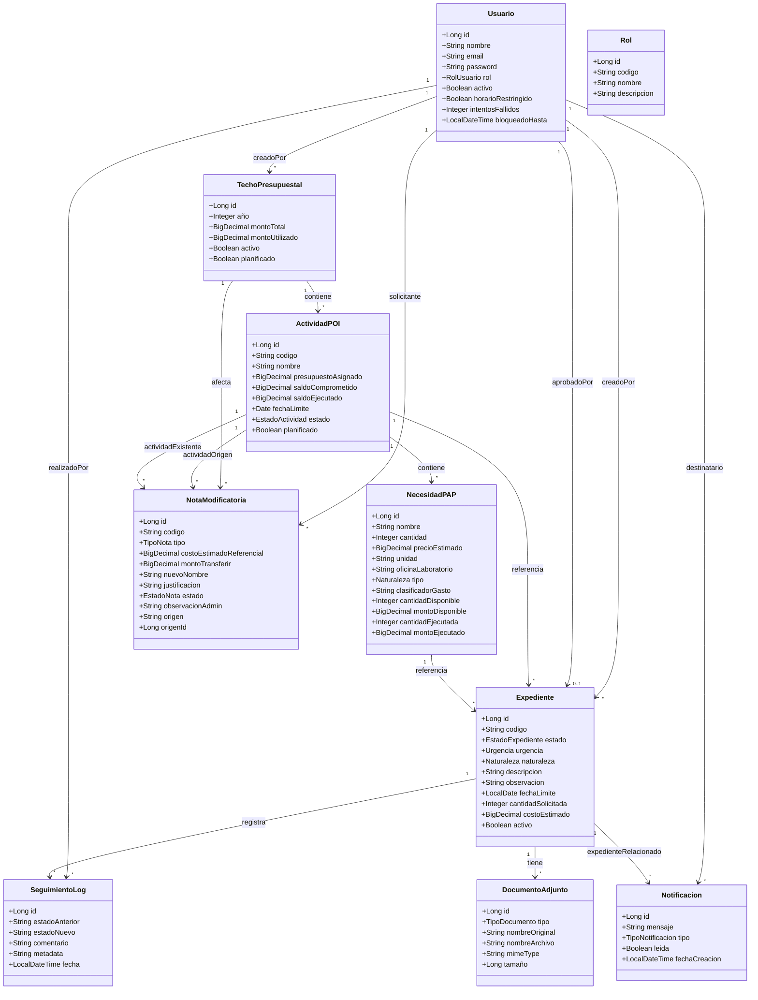

### 5.2 Descripción de Entidades

#### 5.2.1 Usuario
Representa una cuenta de acceso al sistema. Cada usuario tiene un email único como identificador de login, una contraseña almacenada con BCrypt y un rol que determina sus permisos. El campo `horarioRestringido` controla si el usuario puede acceder fuera del horario laboral (8am–8pm). El sistema controla intentos fallidos de login: después de 5 intentos fallidos, el campo `bloqueadoHasta` se establece por 30 minutos.

**Relaciones:** creador de expedientes, realizador de seguimiento logs, destinatario de notificaciones, solicitante de notas modificatorias.

#### 5.2.2 Rol
Catálogo de roles del sistema. Define el código, nombre y descripción de cada uno de los 6 roles. Se usa como referencia para el RBAC.

#### 5.2.3 TechoPresupuestal
Representa el presupuesto anual total asignado a la facultad. El campo `año` es único. `montoTotal` es el presupuesto asignado, `montoUtilizado` se calcula automáticamente como suma de saldos ejecutados de actividades POI. `planificado = true` bloquea modificaciones.

**Relaciones:** contiene actividades POI, es afectado por notas modificatorias, es creado por un usuario.

#### 5.2.4 ActividadPOI
Distribución del presupuesto del techo en actividades específicas del Plan Operativo Institucional. La disponibilidad real se calcula como `presupuestoAsignado - saldoComprometido - saldoEjecutado`. El estado puede ser: Pendiente, En_Ejecucion, Ejecutado, Cerrado.

**Relaciones:** pertenece a un techo, contiene necesidades PAP, referencia expedientes, es origen/destino de notas modificatorias.

#### 5.2.5 NecesidadPAP
Ítems específicos del Plan Anual de Contrataciones. Define bienes o servicios a adquirir con cantidad planificada, precio unitario estimado y saldos disponibles/ejecutados. Los campos `cantidadDisponible` y `montoDisponible` se actualizan automáticamente al crear o cambiar estado de expedientes.

**Relaciones:** pertenece a una actividad POI, referencia expedientes.

#### 5.2.6 Expediente
Solicitud formal de gasto con flujo de aprobación de 7 estados. El código se genera automáticamente con formato `EXP-YYYY-NNNN` (secuencial por año). El costo se calcula como `cantidadSolicitada × precioEstimado` de la necesidad PAP. Almacena la urgencia, naturaleza (Bien/Servicio), y estado actual. Es la entidad central del dominio.

**Relaciones:** pertenece a actividad POI y necesidad PAP, tiene documentos, registra seguimiento logs, genera notificaciones.

#### 5.2.7 DocumentoAdjunto
Metadatos de documentos PDF adjuntos a expedientes. No almacena el archivo binario físicamente, solo el nombre original, nombre en disco (UUID), tipo MIME y tamaño. Tipos: TDR, Especificaciones_Tecnicas, Cotizacion, Informe_Tecnico.

**Relaciones:** pertenece a un expediente.

#### 5.2.8 SeguimientoLog
Historial completo e inmutable de cambios de estado del expediente. Cada registro almacena el estado anterior y nuevo como String (no enum, para flexibilidad), el usuario que realizó el cambio, observación y metadatos adicionales en formato JSON.

**Relaciones:** pertenece a un expediente, realizado por un usuario.

#### 5.2.9 NotaModificatoria
Solicitud de redistribución presupuestal entre actividades. Puede ser de tipo `inclusion_item` (nuevo ítem en actividad existente) o `inclusion_actividad` (nueva actividad completa). Tiene un flujo propio: pendiente → configurada/rechazada. La configuración asigna actividad origen y monto a transferir.

**Relaciones:** solicitada por un usuario, afecta actividades POI y techo presupuestal.

#### 5.2.10 Notificacion
Notificación automática generada al cambiar el estado de un expediente. Tipos: observacion, rechazo, aprobacion, alerta_fecha, nota_aprobada, nota_rechazada, info. Puede estar asociada a un expediente específico.

**Relaciones:** dirigida a un usuario, opcionalmente asociada a un expediente.

---

## 6. Matriz de Trazabilidad

### 6.1 RF ↔ CU ↔ Entidades

| RF | CU | Actor(es) | Entidad(es) afectadas | SSD | BCE |
|:--:|:--:|-----------|:---------------------:|:---:|:---:|
| RF01 | CU01 | Todos (autenticables) | Usuario | SSD01 | BCE01 |
| RF02 | CU02 | Todos (autenticados) | Expediente, ActividadPOI, TechoPresupuestal | SSD02 | BCE02 |
| RF03 | CU03 | Lab, Sec, Admin, Coord, Dir | Expediente, NecesidadPAP, ActividadPOI, SeguimientoLog | SSD03 | BCE03 |
| RF04 | CU04 | Sec, Dir, Admin, Coord | Expediente, ActividadPOI, NecesidadPAP, SeguimientoLog, Notificacion | SSD04 | BCE04 |
| RF05 | CU05 | Lab, Sec, Admin, Coord, Dir | DocumentoAdjunto, Expediente, SeguimientoLog | SSD05 | BCE05 |
| RF06 | CU06 | Admin, Coord | TechoPresupuestal, Usuario | SSD06 | BCE06 |
| RF07 | CU07 | Admin, Coord | ActividadPOI, TechoPresupuestal | SSD07 | BCE07 |
| RF08 | CU08 | Admin, Coord | NecesidadPAP, ActividadPOI | SSD08 | BCE08 |
| RF09 | CU09 | Admin, Coord, Sec, Lab, Dir | NotaModificatoria, ActividadPOI, TechoPresupuestal | SSD09 | BCE09 |
| RF10 | CU10 | Admin, Coord, Dir, Dec | Expediente, ActividadPOI, NecesidadPAP, TechoPresupuestal | SSD10 | BCE10 |
| RF11 | CU11 | Admin | Usuario, Rol | SSD11 | BCE11 |
| RF12 | CU12 | Todos (autenticados) | Notificacion, Usuario, Expediente | SSD12 | BCE12 |
| RF13 | CU13 | Visitante (público) | Expediente | SSD13 | BCE13 |
| RF14 | CU14 | Todos (autenticados) | — (sesión HTTP) | SSD14 | BCE14 |

### 6.2 RF ↔ RNF

| RNF | RF01 | RF02 | RF03 | RF04 | RF05 | RF06 | RF07 | RF08 | RF09 | RF10 | RF11 | RF12 | RF13 | RF14 |
|:---:|:----:|:----:|:----:|:----:|:----:|:----:|:----:|:----:|:----:|:----:|:----:|:----:|:----:|:----:|
| RNF01 (Seguridad) | ✅ | | | | | | | | | | ✅ | | | |
| RNF02 (Horario) | ✅ | ✅ | ✅ | ✅ | ✅ | ✅ | ✅ | ✅ | ✅ | ✅ | ✅ | ✅ | | ✅ |
| RNF03 (Rendimiento) | ✅ | ✅ | | | | | | | | ✅ | | ✅ | | |
| RNF04 (Disponibilidad) | ✅ | ✅ | ✅ | ✅ | ✅ | ✅ | ✅ | ✅ | ✅ | ✅ | ✅ | ✅ | ✅ | ✅ |
| RNF05 (Escalabilidad) | ✅ | ✅ | ✅ | ✅ | ✅ | ✅ | ✅ | ✅ | ✅ | ✅ | ✅ | ✅ | ✅ | ✅ |
| RNF06 (Mantenibilidad) | ✅ | ✅ | ✅ | ✅ | ✅ | ✅ | ✅ | ✅ | ✅ | ✅ | ✅ | ✅ | ✅ | ✅ |
| RNF07 (Usabilidad) | ✅ | ✅ | ✅ | ✅ | ✅ | ✅ | ✅ | ✅ | ✅ | ✅ | ✅ | ✅ | ✅ | ✅ |
| RNF08 (Integridad) | | | ✅ | ✅ | | ✅ | ✅ | ✅ | ✅ | | | | | |

### 6.3 Matriz Bidireccional RF ↔ CU

| | CU01 | CU02 | CU03 | CU04 | CU05 | CU06 | CU07 | CU08 | CU09 | CU10 | CU11 | CU12 | CU13 | CU14 |
|:---:|:----:|:----:|:----:|:----:|:----:|:----:|:----:|:----:|:----:|:----:|:----:|:----:|:----:|:----:|
| RF01 | ✅ | | | | | | | | | | | | | |
| RF02 | | ✅ | | | | | | | | | | | | |
| RF03 | | | ✅ | | | | | | | | | | | |
| RF04 | | | | ✅ | | | | | | | | | | |
| RF05 | | | | | ✅ | | | | | | | | | |
| RF06 | | | | | | ✅ | | | | | | | | |
| RF07 | | | | | | | ✅ | | | | | | | |
| RF08 | | | | | | | | ✅ | | | | | | |
| RF09 | | | | | | | | | ✅ | | | | | |
| RF10 | | | | | | | | | | ✅ | | | | |
| RF11 | | | | | | | | | | | ✅ | | | |
| RF12 | | | | | | | | | | | | ✅ | | |
| RF13 | | | | | | | | | | | | | ✅ | |
| RF14 | | | | | | | | | | | | | | ✅ |

---

## 7. Apéndices

### 7.1 Glosario de términos

| Término | Definición |
|---|---|
| **Actividad POI** | Distribución del presupuesto del techo en actividades específicas del Plan Operativo Institucional |
| **BCE** | Boundary-Control-Entity — patrón de robustez ICONIX para análisis de casos de uso |
| **Bypass horario** | Excepción a la restricción de horario laboral; solo el Administrador tiene esta capacidad |
| **Clasificador de gasto** | Código estándar de clasificación presupuestal (ej: 2.3.1.2.1.1) |
| **Código de expediente** | Identificador único con formato EXP-YYYY-NNNN (año + secuencial de 4 dígitos) |
| **Expediente** | Solicitud formal de gasto que sigue un flujo de aprobación de 7 estados |
| **Horario restringido** | Usuarios que solo pueden acceder al sistema dentro del horario laboral (8am–8pm) |
| **ICONIX** | Metodología ágil de desarrollo basada en UML con 4 fases: Análisis de Requisitos, Análisis y Diseño Preliminar, Diseño Detallado, Implementación |
| **Necesidad PAP** | Ítem específico del Plan Anual de Contrataciones (bien o servicio) |
| **Nota Modificatoria** | Solicitud de redistribución presupuestal entre actividades |
| **POI** | Plan Operativo Institucional — distribución del presupuesto anual |
| **PAP** | Plan Anual de Contrataciones — detalle de bienes y servicios a adquirir |
| **RBAC** | Role-Based Access Control — control de acceso basado en roles del usuario |
| **Saldo comprometido** | Monto reservado para expedientes en revisión, no disponible para nuevos gastos |
| **Saldo ejecutado** | Monto ya gastado en expedientes aprobados o finalizados |
| **SSD** | System Sequence Diagram — diagrama de secuencia del sistema ICONIX |
| **SeguimientoLog** | Registro histórico e inmutable de cada cambio de estado de un expediente |
| **Techo Presupuestal** | Presupuesto anual total asignado a la facultad |
| **Timeline** | Línea de tiempo visual del historial de cambios del expediente |

### 7.2 Referencias a documentos originales

| Archivo | Ruta relativa | Descripción |
|---|---|---|
| `PLAN.md` | `/PLAN.md` | Plan detallado de implementación por fases |
| `AGENTS.md` | `/AGENTS.md` | Memoria del proyecto Spring Boot con lecciones aprendidas |
| `DOMINIO_SISEXP.md` | `docs/referencia/DOMINIO_SISEXP.md` | Modelo de dominio completo extraído del código original Express/React v2.0 |
| `FUNCIONALIDADES_SISEXP.md` | `docs/FUNCIONALIDADES_SISEXP.md` | Manual detallado de funcionalidades del sistema |
| `Informe_Trazabilidad_v4.md` | `docs/referencia/doc/Informe_Trazabilidad_v4.md` | Trazabilidad entre casos de uso e implementación v2.0 |
| `Informe_Inconsistencias_SDD_ERS.md` | `docs/referencia/doc/Informe_Inconsistencias_SDD_ERS.md` | Inconsistencias detectadas entre SDD y ERS originales |
| `SDD_SISEXP.md` | `docs/referencia/doc/SDD_SISEXP.md` | Documento de Diseño de Software (IEEE 1016-2009) |
| `ERS_v4.md` | `docs/referencia/doc/ERS_v4.md` | Versión anterior de la ERS |
| SKILL.md | `.opencode/skills/diagramas-ers/SKILL.md` | Skill de diagramas ERS para generación de documentación |

---

## Registro de cambios

| Versión | Fecha | Cambios realizados | Autor |
|---|---|---|---|
| 1.0 | 23/06/2026 | Versión inicial completa del ERS según ISO/IEC 29148:2018 y metodología ICONIX Fase 1 | Equipo Arquitectura de Software — UPLA |

---

# SISEXP-UPLA — Diagramas BCE (Boundary-Control-Entity)
## ICONIX Fase 3: Robustness Analysis

---

**Proyecto:** SISEXP-UPLA — Sistema de Seguimiento y Control de Expedientes
**Facultad:** Ingeniería — Universidad Peruana Los Andes (UPLA)
**Metodología:** ICONIX (Fase 3 — Diagramas de Robustez)
**Total diagramas:** 14 (BCE01–BCE14)
**Fecha:** 2026-06-23

---

## Introducción

### Propósito de los Diagramas de Robustez (BCE)

Los diagramas de robustez son el puente entre los Casos de Uso (Fase 1-2) y los Diagramas de Secuencia (Fase 4) en la metodología ICONIX. Validan que la estructura de cada Caso de Uso sea realizable desde el punto de vista arquitectónico antes de proceder a la implementación.

### Reglas ICONIX para Diagramas BCE

1. Los **actores** solo se conectan a objetos **Boundary**
2. Los objetos **Boundary** solo se conectan a objetos **Control**
3. Los objetos **Control** se conectan a objetos **Entity** y a otros objetos **Control**
4. Los objetos **Entity** nunca se conectan directamente a objetos **Boundary**
5. Cada Caso de Uso produce al menos un diagrama BCE
6. Los diagramas BCE deben validar que el flujo completo del CU sea implementable

### Los 3 Estereotipos UML

| Estereotipo | Tipo | Propósito | Color recomendado (StarUML) |
|:-----------:|:----:|:----------|:---------------------------:|
| `<<Boundary>>` | Interfaz | Formularios, vistas, páginas HTML con las que interactúa el actor | Azul claro (#D4E6F1) |
| `<<Control>>` | Lógica | Controllers + Services de Spring Boot que orquestan la lógica de negocio | Amarillo (#F9E79F) |
| `<<Entity>>` | Datos | Entidades JPA persistentes (tablas en PostgreSQL) | Verde claro (#D5F5E3) |

### Convenciones de Diagramación

- **Tipo de diagrama:** `UMLClassDiagram` en StarUML
- **Notación:** Clases con estereotipos UML (`<<Boundary>>`, `<<Control>>`, `<<Entity>>`)
- **Dependencias:** Línea discontinua con flecha abierta (→) que va del cliente al proveedor
- **Dirección de dependencia:** `Boundary → Control → Entity` (nunca Boundary → Entity directo)

### Entidades JPA del Sistema (11)

Las entidades que aparecen como `<<Entity>>` en los diagramas BCE corresponden a las 11 tablas del modelo de datos:

1. **Usuario** — Usuarios del sistema (6 roles)
2. **Rol** — Roles RBAC (Administrador, Coordinacion, Secretaria, Director, Laboratorio, Decanato)
3. **TechoPresupuestal** — Techo presupuestal por año
4. **ActividadPOI** — Actividades del Plan Operativo Institucional
5. **NecesidadPAP** — Necesidades del Plan Anual de Presupuesto
6. **Expediente** — Expedientes administrativos (7 estados)
7. **DocumentoAdjunto** — Documentos adjuntos a expedientes
8. **SeguimientoLog** — Historial de cambios de estado
9. **NotaModificatoria** — Notas modificatorias presupuestales
10. **Notificacion** — Notificaciones a usuarios
11. — (HttpSession se usa como pseudo-entidad en BCE14)

---

## BCE01: Iniciar Sesión

### Identificación

| Campo | Valor |
|-------|-------|
| **ID** | BCE-CU01 |
| **Caso de Uso** | CU01: Iniciar Sesión |
| **Diagram Type** | UML Class Diagram con estereotipos |
| **Actores** | Usuario (Administrador, Coordinacion, Secretaria, Director, Laboratorio, Decanato) |

### Objetos involucrados

| Tipo | Nombre | Descripción |
|:----:|:------|:------------|
| `<<Boundary>>` | LoginForm | Formulario de login (Thymeleaf: `login.html`) |
| `<<Control>>` | AuthController | `AuthController.java` — maneja GET `/login` y POST `/login` |
| `<<Control>>` | AuthService | `AuthService.java` — autentica credenciales vía Spring Security |
| `<<Control>>` | CustomUserDetailsService | `CustomUserDetailsService.java` — carga usuario desde BD |
| `<<Entity>>` | Usuario | Entidad JPA con email, password, activo, intentosFallidos |

### Dependencias

| Origen | Destino | Descripción |
|:------|:--------|:------------|
| LoginForm | AuthController | Envío de credenciales (submit) |
| AuthController | AuthService | Delegación de autenticación |
| AuthService | CustomUserDetailsService | Carga de usuario por email |
| AuthService | Usuario | Validación de credenciales y estado del usuario |

### Diagrama Mermaid

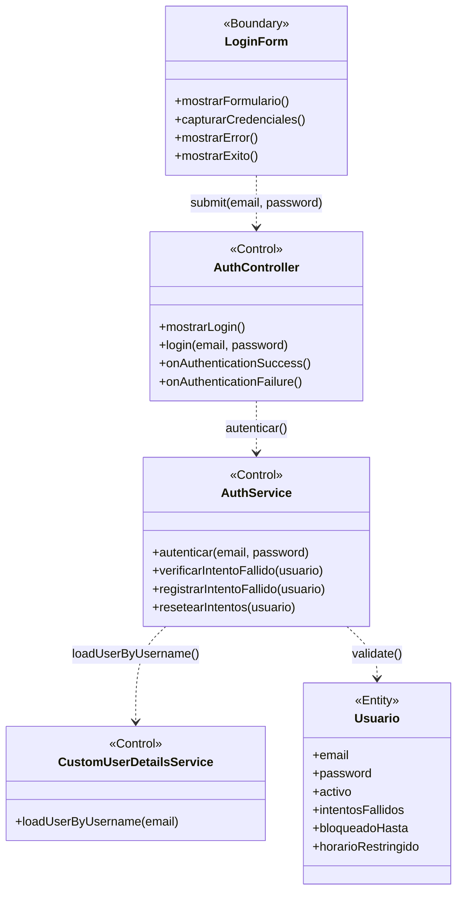

### Instrucciones para StarUML

1. Crear un nuevo `UMLClassDiagram` con nombre "BCE-CU01-IniciarSesion"
2. Crear 1 clase `<<Boundary>>`: **LoginForm** (color azul claro `#D4E6F1`)
3. Crear 3 clases `<<Control>>`: **AuthController**, **AuthService**, **CustomUserDetailsService** (color amarillo `#F9E79F`)
4. Crear 1 clase `<<Entity>>`: **Usuario** (color verde claro `#D5F5E3`)
5. Agregar atributos y métodos según la especificación de cada clase
6. Crear asociaciones dirigidas (flecha simple):
   - `LoginForm` → `AuthController`
   - `AuthController` → `AuthService`
   - `AuthService` → `CustomUserDetailsService`
   - `AuthService` → `Usuario`
7. Verificar que ninguna Entity se conecta directamente a una Boundary

---

## BCE02: Ver Dashboard

### Identificación

| Campo | Valor |
|-------|-------|
| **ID** | BCE-CU02 |
| **Caso de Uso** | CU02: Ver Dashboard |
| **Diagram Type** | UML Class Diagram con estereotipos |
| **Actores** | Usuario autenticado (cualquier rol) |

### Objetos involucrados

| Tipo | Nombre | Descripción |
|:----:|:------|:------------|
| `<<Boundary>>` | DashboardView | Página principal del dashboard (Thymeleaf: `dashboard.html`) |
| `<<Control>>` | DashboardController | `DashboardController.java` — endpoints de KPIs y saldos |
| `<<Control>>` | DashboardService | `DashboardService.java` — cálculos de KPIs, alertas y saldos |
| `<<Entity>>` | Expediente | Entidad para conteos por estado y detección de vencidos |
| `<<Entity>>` | ActividadPOI | Entidad para sumarizar saldos presupuestales |
| `<<Entity>>` | TechoPresupuestal | Entidad para mostrar el techo anual |
| `<<Entity>>` | Notificacion | Entidad para contar no-leídas del usuario |

### Dependencias

| Origen | Destino | Descripción |
|:------|:--------|:------------|
| DashboardView | DashboardController | Solicitud de KPIs del dashboard |
| DashboardController | DashboardService | Consulta de datos agregados |
| DashboardService | Expediente | Conteo por estado, detección de vencidos |
| DashboardService | ActividadPOI | Suma de presupuestos y saldos |
| DashboardService | TechoPresupuestal | Consulta de techos activos |
| DashboardService | Notificacion | Conteo de notificaciones no leídas |

### Diagrama Mermaid

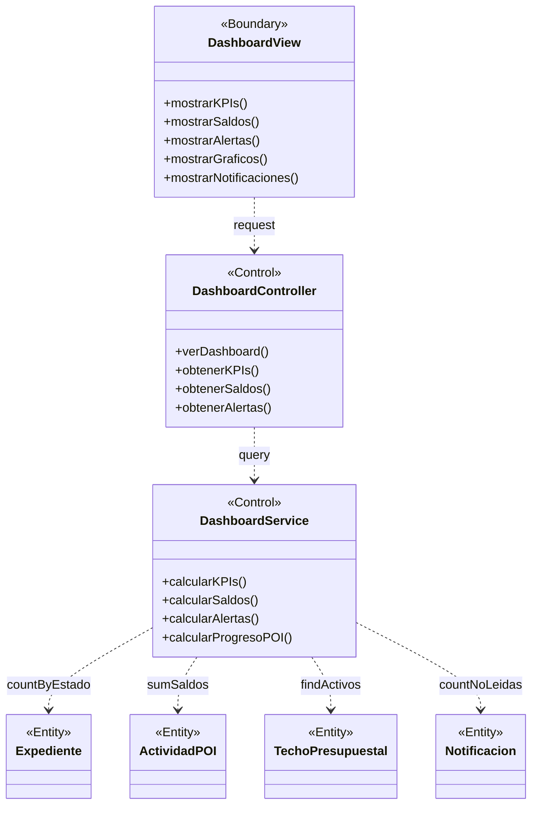

### Instrucciones para StarUML

1. Crear `UMLClassDiagram` "BCE-CU02-VerDashboard"
2. Crear 1 `<<Boundary>>`: **DashboardView** (azul claro)
3. Crear 2 `<<Control>>`: **DashboardController**, **DashboardService** (amarillo)
4. Crear 4 `<<Entity>>`: **Expediente**, **ActividadPOI**, **TechoPresupuestal**, **Notificacion** (verde claro)
5. Asociaciones dirigidas: DashboardView → DashboardController, DashboardController → DashboardService, DashboardService → cada Entity

---

## BCE03: Crear Expediente

### Identificación

| Campo | Valor |
|-------|-------|
| **ID** | BCE-CU03 |
| **Caso de Uso** | CU03: Crear Expediente |
| **Diagram Type** | UML Class Diagram con estereotipos |
| **Actores** | Laboratorio, Secretaria, Director, Coordinacion, Administrador |

### Objetos involucrados

| Tipo | Nombre | Descripción |
|:----:|:------|:------------|
| `<<Boundary>>` | ExpedienteForm | Formulario de creación de expediente (Thymeleaf) |
| `<<Control>>` | ExpedienteController | `ExpedienteController.java` — recibe datos, genera código |
| `<<Control>>` | ExpedienteService | `ExpedienteService.java` — lógica de creación y reserva de saldo |
| `<<Control>>` | BusinessValidationsService | Validaciones: fecha límite, saldo, período fiscal, documento |
| `<<Control>>` | BusinessRulesService | Reglas: reservar/liberar saldo en POI y PAP |
| `<<Entity>>` | Expediente | Nuevo expediente a persistir |
| `<<Entity>>` | NecesidadPAP | Necesidad asociada (actualiza saldos) |
| `<<Entity>>` | ActividadPOI | Actividad asociada (actualiza saldos) |
| `<<Entity>>` | SeguimientoLog | Log de creación |
| `<<Entity>>` | Notificacion | Notificación a coordinación |

### Dependencias

| Origen | Destino | Descripción |
|:------|:--------|:------------|
| ExpedienteForm | ExpedienteController | Submit del formulario con datos del expediente |
| ExpedienteController | ExpedienteService | Delegación de creación |
| ExpedienteService | BusinessValidationsService | Validación de reglas de negocio |
| ExpedienteService | BusinessRulesService | Aplicación de reglas presupuestales |
| ExpedienteService | Expediente | Persistencia del nuevo expediente |
| ExpedienteService | NecesidadPAP | Reserva de saldo en PAP |
| ExpedienteService | ActividadPOI | Reserva de saldo en POI |
| ExpedienteService | SeguimientoLog | Creación de log de seguimiento |
| ExpedienteService | Notificacion | Creación de notificación |

### Diagrama Mermaid

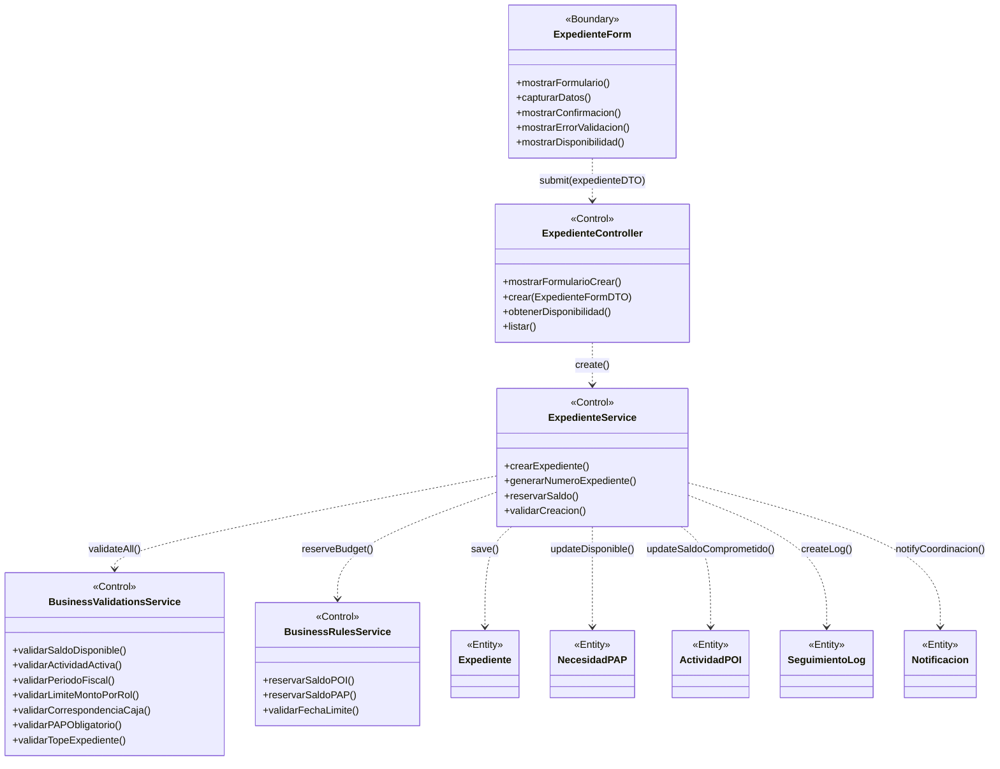

### Instrucciones para StarUML

1. Crear `UMLClassDiagram` "BCE-CU03-CrearExpediente"
2. Crear 1 `<<Boundary>>`: **ExpedienteForm** (azul claro)
3. Crear 4 `<<Control>>`: **ExpedienteController**, **ExpedienteService**, **BusinessValidationsService**, **BusinessRulesService** (amarillo)
4. Crear 5 `<<Entity>>`: **Expediente**, **NecesidadPAP**, **ActividadPOI**, **SeguimientoLog**, **Notificacion** (verde claro)
5. Asociaciones dirigidas desde Boundary → Control → Entity

---

## BCE04: Cambiar Estado Expediente

### Identificación

| Campo | Valor |
|-------|-------|
| **ID** | BCE-CU04 |
| **Caso de Uso** | CU04: Cambiar Estado Expediente |
| **Diagram Type** | UML Class Diagram con estereotipos |
| **Actores** | Coordinacion, Secretaria, Administrador (según transición) |

### Objetos involucrados

| Tipo | Nombre | Descripción |
|:----:|:------|:------------|
| `<<Boundary>>` | ExpedienteDetalle | Página de detalle del expediente con opciones de transición |
| `<<Control>>` | ExpedienteController | `ExpedienteController.java` — endpoint de cambio de estado |
| `<<Control>>` | ExpedienteService | `ExpedienteService.java` — lógica de transición |
| `<<Control>>` | BusinessValidationsService | Validaciones de inmutabilidad y reglas de transición |
| `<<Control>>` | BusinessRulesService | Reglas: ejecutar, liberar o reservar saldo según transición |
| `<<Entity>>` | Expediente | Expediente a actualizar (nuevo estado) |
| `<<Entity>>` | ActividadPOI | Actualización de saldos (comprometido, ejecutado) |
| `<<Entity>>` | NecesidadPAP | Actualización de saldos (disponible, ejecutado) |
| `<<Entity>>` | SeguimientoLog | Registro del cambio de estado |
| `<<Entity>>` | Notificacion | Notificación al solicitante |

### Dependencias

| Origen | Destino | Descripción |
|:------|:--------|:------------|
| ExpedienteDetalle | ExpedienteController | Solicitud de cambio de estado |
| ExpedienteController | ExpedienteService | Delegación del cambio |
| ExpedienteService | BusinessValidationsService | Validar transición permitida |
| ExpedienteService | BusinessRulesService | Aplicar reglas de saldo |
| ExpedienteService | Expediente | Actualizar estado |
| ExpedienteService | ActividadPOI | Ejecutar/liberar saldo |
| ExpedienteService | NecesidadPAP | Ejecutar/liberar cantidad |
| ExpedienteService | SeguimientoLog | Crear log del cambio |
| ExpedienteService | Notificacion | Notificar cambio al solicitante |

### Diagrama Mermaid

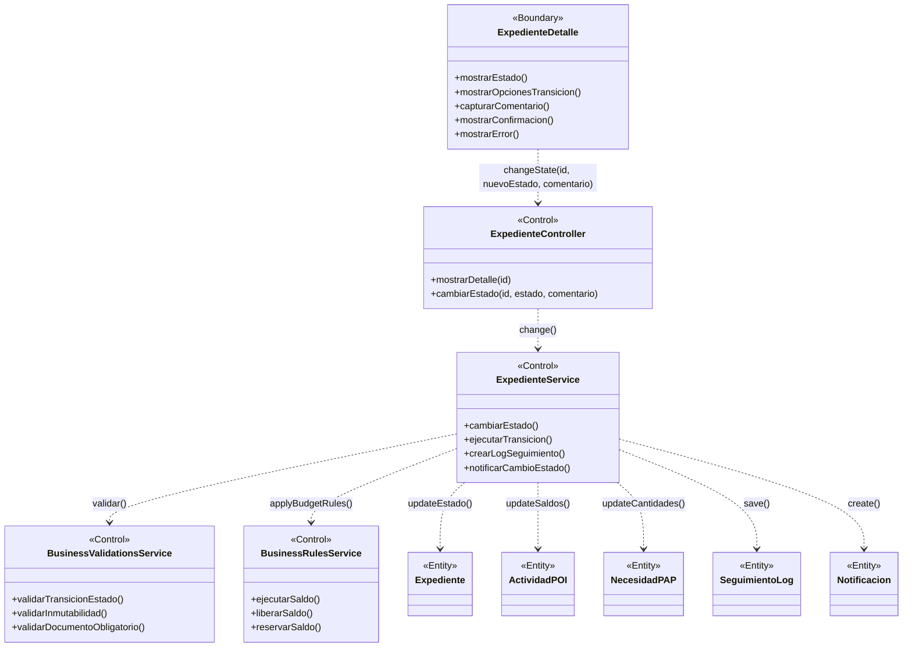

### Instrucciones para StarUML

1. Crear `UMLClassDiagram` "BCE-CU04-CambiarEstadoExpediente"
2. Crear 1 `<<Boundary>>`: **ExpedienteDetalle** (azul claro)
3. Crear 4 `<<Control>>`: **ExpedienteController**, **ExpedienteService**, **BusinessValidationsService**, **BusinessRulesService** (amarillo)
4. Crear 5 `<<Entity>>`: **Expediente**, **ActividadPOI**, **NecesidadPAP**, **SeguimientoLog**, **Notificacion** (verde claro)
5. Asociaciones dirigidas según la tabla de dependencias

---

## BCE05: Adjuntar Documento

### Identificación

| Campo | Valor |
|-------|-------|
| **ID** | BCE-CU05 |
| **Caso de Uso** | CU05: Adjuntar Documento |
| **Diagram Type** | UML Class Diagram con estereotipos |
| **Actores** | Laboratorio, Secretaria, Director, Coordinacion, Administrador |

### Objetos involucrados

| Tipo | Nombre | Descripción |
|:----:|:------|:------------|
| `<<Boundary>>` | DocumentoForm | Formulario de subida de documento |
| `<<Control>>` | ExpedienteController | `ExpedienteController.java` — manejo de subida |
| `<<Control>>` | ExpedienteService | `ExpedienteService.java` — validación y guardado |
| `<<Entity>>` | DocumentoAdjunto | Metadatos del documento adjunto |
| `<<Entity>>` | SeguimientoLog | Log de la acción de adjuntar |

### Dependencias

| Origen | Destino | Descripción |
|:------|:--------|:------------|
| DocumentoForm | ExpedienteController | Subida de archivo multipart |
| ExpedienteController | ExpedienteService | Delegación de adjuntado |
| ExpedienteService | DocumentoAdjunto | Persistir metadatos del archivo |
| ExpedienteService | SeguimientoLog | Registrar acción en el historial |

### Diagrama Mermaid

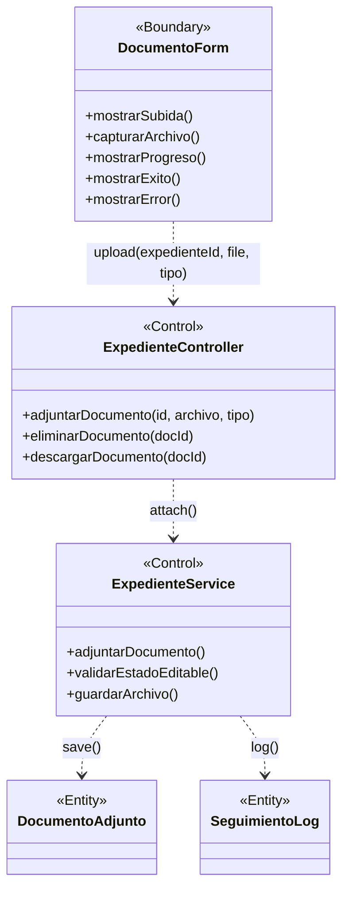

### Instrucciones para StarUML

1. Crear `UMLClassDiagram` "BCE-CU05-AdjuntarDocumento"
2. Crear 1 `<<Boundary>>`: **DocumentoForm** (azul claro)
3. Crear 2 `<<Control>>`: **ExpedienteController**, **ExpedienteService** (amarillo)
4. Crear 2 `<<Entity>>`: **DocumentoAdjunto**, **SeguimientoLog** (verde claro)
5. Asociaciones: DocumentoForm → ExpedienteController → ExpedienteService → DocumentoAdjunto y SeguimientoLog

---

## BCE06: Gestionar Techo Presupuestal

### Identificación

| Campo | Valor |
|-------|-------|
| **ID** | BCE-CU06 |
| **Caso de Uso** | CU06: Gestionar Techo Presupuestal |
| **Diagram Type** | UML Class Diagram con estereotipos |
| **Actores** | Administrador (TECHO_CREAR_EDITAR) |

### Objetos involucrados

| Tipo | Nombre | Descripción |
|:----:|:------|:------------|
| `<<Boundary>>` | TechoForm | Formulario de creación/edición de techo |
| `<<Control>>` | TechoPresupuestalController | `TechoPresupuestalController.java` — CRUD de techos |
| `<<Control>>` | TechoPresupuestalService | `TechoPresupuestalService.java` — lógica de negocio |
| `<<Control>>` | BusinessValidationsService | Validación: techo cerrado (planificado) |
| `<<Entity>>` | TechoPresupuestal | Entidad persistida con año, montoTotal, activo, planificado |
| `<<Entity>>` | Usuario | Referencia a creador del techo (creadoPor) |

### Dependencias

| Origen | Destino | Descripción |
|:------|:--------|:------------|
| TechoForm | TechoPresupuestalController | Submit del formulario |
| TechoPresupuestalController | TechoPresupuestalService | Delegación de operación |
| TechoPresupuestalService | BusinessValidationsService | Validar si está cerrado |
| TechoPresupuestalService | TechoPresupuestal | Persistencia |
| TechoPresupuestalService | Usuario | Asignación de creador |

### Diagrama Mermaid

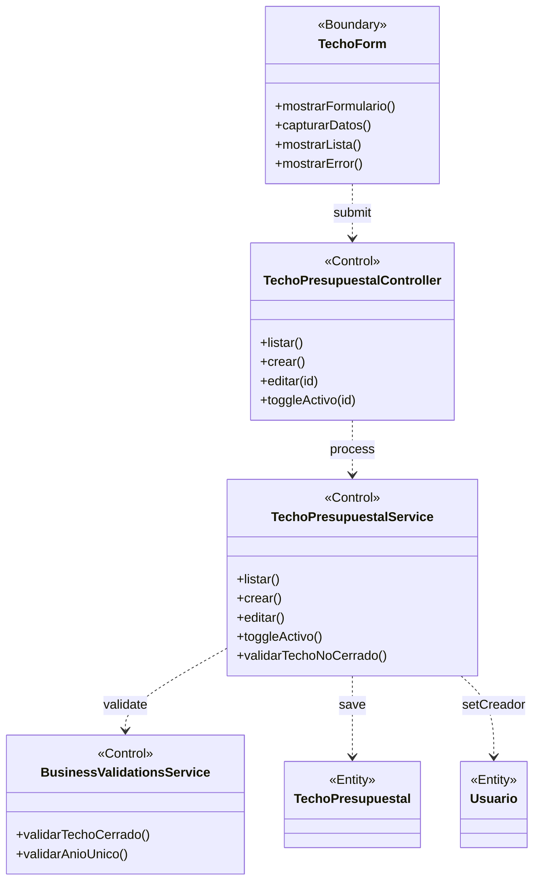

### Instrucciones para StarUML

1. Crear `UMLClassDiagram` "BCE-CU06-GestionarTechoPresupuestal"
2. Crear 1 `<<Boundary>>`: **TechoForm** (azul claro)
3. Crear 3 `<<Control>>`: **TechoPresupuestalController**, **TechoPresupuestalService**, **BusinessValidationsService** (amarillo)
4. Crear 2 `<<Entity>>`: **TechoPresupuestal**, **Usuario** (verde claro)

---

## BCE07: Gestionar Actividad POI

### Identificación

| Campo | Valor |
|-------|-------|
| **ID** | BCE-CU07 |
| **Caso de Uso** | CU07: Gestionar Actividad POI |
| **Diagram Type** | UML Class Diagram con estereotipos |
| **Actores** | Administrador (POI_CREAR_EDITAR) |

### Objetos involucrados

| Tipo | Nombre | Descripción |
|:----:|:------|:------------|
| `<<Boundary>>` | ActividadForm | Formulario de actividad POI |
| `<<Control>>` | ActividadPOIController | `ActividadPOIController.java` — CRUD de actividades |
| `<<Control>>` | ActividadPOIService | `ActividadPOIService.java` — lógica de negocio |
| `<<Control>>` | BusinessValidationsService | Validación: techo cerrado, año fiscal |
| `<<Entity>>` | ActividadPOI | Entidad con código, presupuesto, saldos |
| `<<Entity>>` | TechoPresupuestal | Techo al que pertenece la actividad |

### Dependencias

| Origen | Destino | Descripción |
|:------|:--------|:------------|
| ActividadForm | ActividadPOIController | Submit del formulario |
| ActividadPOIController | ActividadPOIService | Delegación de operación |
| ActividadPOIService | BusinessValidationsService | Validaciones de negocio |
| ActividadPOIService | ActividadPOI | Persistencia de la actividad |
| ActividadPOIService | TechoPresupuestal | Validación de presupuesto disponible |

### Diagrama Mermaid

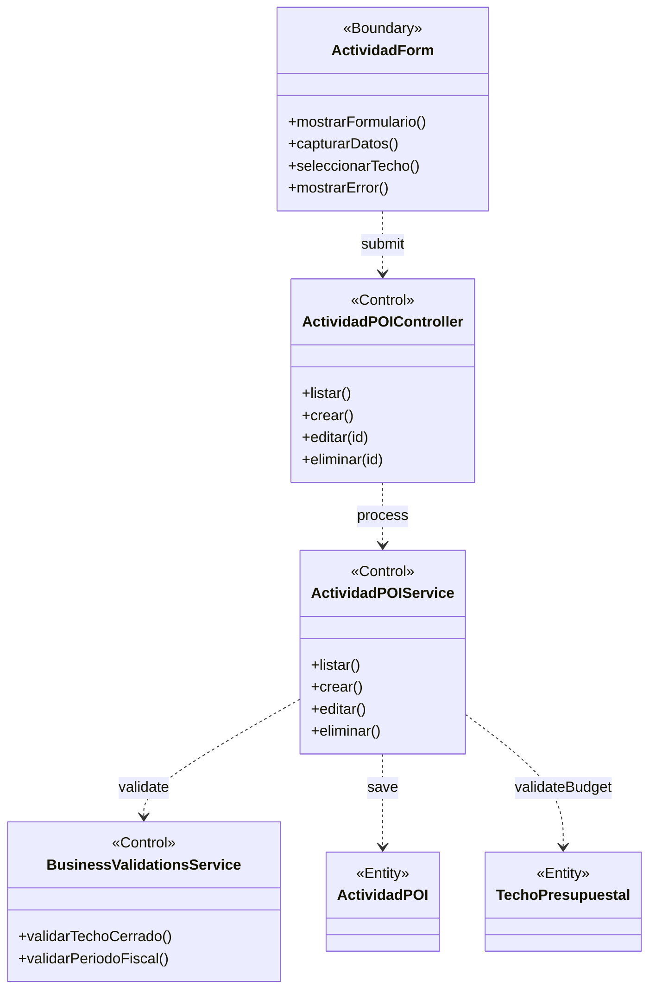

### Instrucciones para StarUML

1. Crear `UMLClassDiagram` "BCE-CU07-GestionarActividadPOI"
2. Crear 1 `<<Boundary>>`: **ActividadForm** (azul claro)
3. Crear 3 `<<Control>>`: **ActividadPOIController**, **ActividadPOIService**, **BusinessValidationsService** (amarillo)
4. Crear 2 `<<Entity>>`: **ActividadPOI**, **TechoPresupuestal** (verde claro)

---

## BCE08: Gestionar Necesidad PAP

### Identificación

| Campo | Valor |
|-------|-------|
| **ID** | BCE-CU08 |
| **Caso de Uso** | CU08: Gestionar Necesidad PAP |
| **Diagram Type** | UML Class Diagram con estereotipos |
| **Actores** | Administrador, Coordinacion (PAP_CREAR_EDITAR) |

### Objetos involucrados

| Tipo | Nombre | Descripción |
|:----:|:------|:------------|
| `<<Boundary>>` | NecesidadForm | Formulario de necesidad PAP |
| `<<Control>>` | NecesidadPAPController | `NecesidadPAPController.java` — CRUD de necesidades |
| `<<Control>>` | NecesidadPAPService | `NecesidadPAPService.java` — lógica de negocio |
| `<<Control>>` | BusinessValidationsService | Validaciones de actividad y saldos |
| `<<Entity>>` | NecesidadPAP | Entidad con cantidad, precio, tipo, saldos |
| `<<Entity>>` | ActividadPOI | Actividad a la que pertenece la necesidad |

### Dependencias

| Origen | Destino | Descripción |
|:------|:--------|:------------|
| NecesidadForm | NecesidadPAPController | Submit del formulario |
| NecesidadPAPController | NecesidadPAPService | Delegación de operación |
| NecesidadPAPService | BusinessValidationsService | Validaciones de negocio |
| NecesidadPAPService | NecesidadPAP | Persistencia de la necesidad |
| NecesidadPAPService | ActividadPOI | Validación de presupuesto de la actividad |

### Diagrama Mermaid

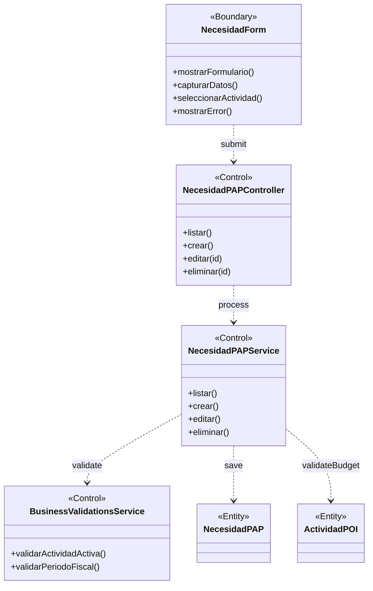

### Instrucciones para StarUML

1. Crear `UMLClassDiagram` "BCE-CU08-GestionarNecesidadPAP"
2. Crear 1 `<<Boundary>>`: **NecesidadForm** (azul claro)
3. Crear 3 `<<Control>>`: **NecesidadPAPController**, **NecesidadPAPService**, **BusinessValidationsService** (amarillo)
4. Crear 2 `<<Entity>>`: **NecesidadPAP**, **ActividadPOI** (verde claro)

---

## BCE09: Gestionar Nota Modificatoria

### Identificación

| Campo | Valor |
|-------|-------|
| **ID** | BCE-CU09 |
| **Caso de Uso** | CU09: Gestionar Nota Modificatoria |
| **Diagram Type** | UML Class Diagram con estereotipos |
| **Actores** | Administrador, Coordinacion |

### Objetos involucrados

| Tipo | Nombre | Descripción |
|:----:|:------|:------------|
| `<<Boundary>>` | NotaForm | Formulario de nota modificatoria |
| `<<Control>>` | NotaModificatoriaController | `NotaModificatoriaController.java` — CRUD y flujo de notas |
| `<<Control>>` | NotaModificatoriaService | `NotaModificatoriaService.java` — lógica de notas |
| `<<Control>>` | BusinessRulesService | Reglas: transferencia de saldo entre actividades |
| `<<Control>>` | BusinessValidationsService | Validaciones de estado y montos |
| `<<Entity>>` | NotaModificatoria | Entidad con tipo, montos, estados |
| `<<Entity>>` | ActividadPOI | Actividad origen y destino de la transferencia |
| `<<Entity>>` | TechoPresupuestal | Techo afectado por la nota |

### Dependencias

| Origen | Destino | Descripción |
|:------|:--------|:------------|
| NotaForm | NotaModificatoriaController | Submit del formulario |
| NotaModificatoriaController | NotaModificatoriaService | Delegación de operación |
| NotaModificatoriaService | BusinessRulesService | Reglas de transferencia de saldo |
| NotaModificatoriaService | BusinessValidationsService | Validaciones |
| NotaModificatoriaService | NotaModificatoria | Persistencia |
| NotaModificatoriaService | ActividadPOI | Actualización de saldos |
| NotaModificatoriaService | TechoPresupuestal | Actualización de montos |

### Diagrama Mermaid

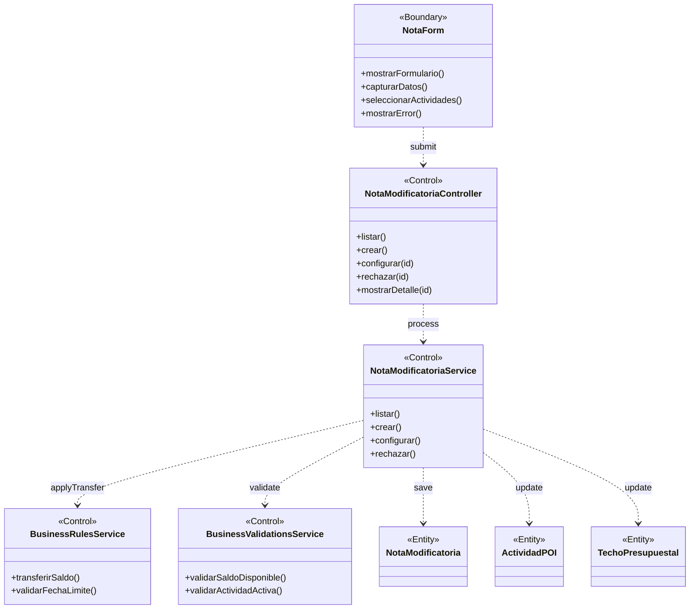

### Instrucciones para StarUML

1. Crear `UMLClassDiagram` "BCE-CU09-GestionarNotaModificatoria"
2. Crear 1 `<<Boundary>>`: **NotaForm** (azul claro)
3. Crear 4 `<<Control>>`: **NotaModificatoriaController**, **NotaModificatoriaService**, **BusinessRulesService**, **BusinessValidationsService** (amarillo)
4. Crear 3 `<<Entity>>`: **NotaModificatoria**, **ActividadPOI**, **TechoPresupuestal** (verde claro)

---

## BCE10: Ver Reportes

### Identificación

| Campo | Valor |
|-------|-------|
| **ID** | BCE-CU10 |
| **Caso de Uso** | CU10: Ver Reportes |
| **Diagram Type** | UML Class Diagram con estereotipos |
| **Actores** | Administrador, Coordinacion, Decanato, Director (REPORTES_VER) |

### Objetos involucrados

| Tipo | Nombre | Descripción |
|:----:|:------|:------------|
| `<<Boundary>>` | ReporteView | Página de reportes con filtros y visualización |
| `<<Control>>` | ReporteController | `ReporteController.java` — endpoints de reportes |
| `<<Control>>` | ReporteService | `ReporteService.java` — generación de reportes |
| `<<Entity>>` | Expediente | Datos para reporte de expedientes |
| `<<Entity>>` | ActividadPOI | Datos para reporte POI |
| `<<Entity>>` | NecesidadPAP | Datos para reporte PAP |
| `<<Entity>>` | TechoPresupuestal | Datos para reporte anual |

### Dependencias

| Origen | Destino | Descripción |
|:------|:--------|:------------|
| ReporteView | ReporteController | Solicitud de reporte con filtros |
| ReporteController | ReporteService | Generación del reporte |
| ReporteService | Expediente | Consulta de expedientes |
| ReporteService | ActividadPOI | Consulta de actividades POI |
| ReporteService | NecesidadPAP | Consulta de necesidades PAP |
| ReporteService | TechoPresupuestal | Consulta de techos |

### Diagrama Mermaid

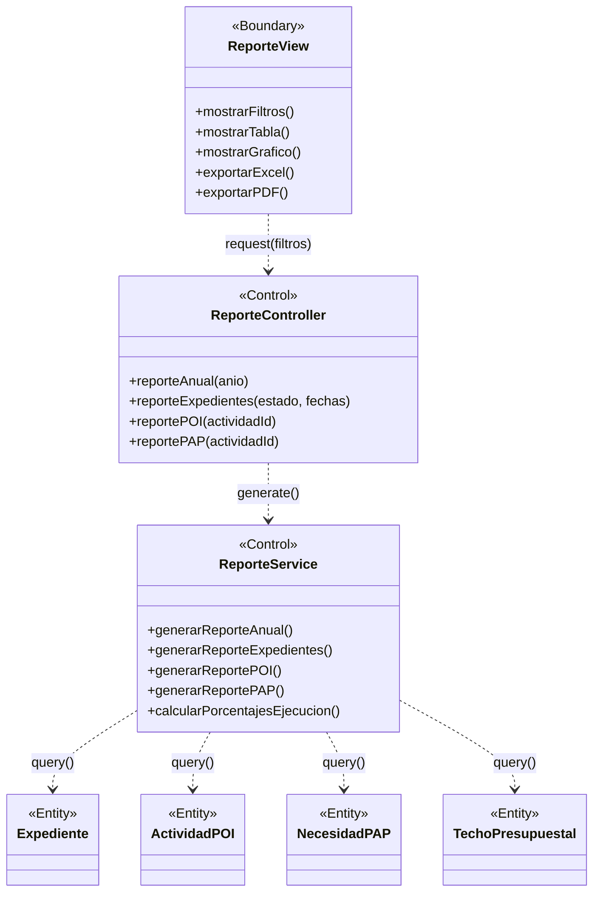

### Instrucciones para StarUML

1. Crear `UMLClassDiagram` "BCE-CU10-VerReportes"
2. Crear 1 `<<Boundary>>`: **ReporteView** (azul claro)
3. Crear 2 `<<Control>>`: **ReporteController**, **ReporteService** (amarillo)
4. Crear 4 `<<Entity>>`: **Expediente**, **ActividadPOI**, **NecesidadPAP**, **TechoPresupuestal** (verde claro)

---

## BCE11: Gestionar Usuarios

### Identificación

| Campo | Valor |
|-------|-------|
| **ID** | BCE-CU11 |
| **Caso de Uso** | CU11: Gestionar Usuarios |
| **Diagram Type** | UML Class Diagram con estereotipos |
| **Actores** | Administrador (USUARIO_ADMIN) |

### Objetos involucrados

| Tipo | Nombre | Descripción |
|:----:|:------|:------------|
| `<<Boundary>>` | UsuarioForm | Formulario de creación/edición de usuarios |
| `<<Control>>` | UsuarioController | `UsuarioController.java` — CRUD de usuarios |
| `<<Control>>` | UsuarioService | `UsuarioService.java` — lógica de gestión de usuarios |
| `<<Entity>>` | Usuario | Entidad con datos personales y de acceso |
| `<<Entity>>` | Rol | Entidad de roles disponibles |

### Dependencias

| Origen | Destino | Descripción |
|:------|:--------|:------------|
| UsuarioForm | UsuarioController | Submit del formulario |
| UsuarioController | UsuarioService | Delegación de operación |
| UsuarioService | Usuario | Persistencia del usuario |
| UsuarioService | Rol | Asignación de rol |

### Diagrama Mermaid

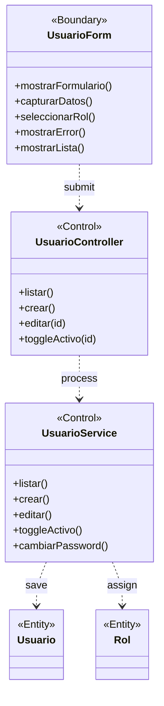

### Instrucciones para StarUML

1. Crear `UMLClassDiagram` "BCE-CU11-GestionarUsuarios"
2. Crear 1 `<<Boundary>>`: **UsuarioForm** (azul claro)
3. Crear 2 `<<Control>>`: **UsuarioController**, **UsuarioService** (amarillo)
4. Crear 2 `<<Entity>>`: **Usuario**, **Rol** (verde claro)

---

## BCE12: Gestionar Notificaciones

### Identificación

| Campo | Valor |
|-------|-------|
| **ID** | BCE-CU12 |
| **Caso de Uso** | CU12: Gestionar Notificaciones |
| **Diagram Type** | UML Class Diagram con estereotipos |
| **Actores** | Usuario autenticado (todos los roles) |

### Objetos involucrados

| Tipo | Nombre | Descripción |
|:----:|:------|:------------|
| `<<Boundary>>` | NotificacionView | Panel de notificaciones en el layout |
| `<<Control>>` | NotificacionController | `NotificacionController.java` — manejo de notificaciones |
| `<<Control>>` | NotificacionService | `NotificacionService.java` — lógica de notificaciones |
| `<<Entity>>` | Notificacion | Entidad con mensaje, tipo, estado leída |
| `<<Entity>>` | Usuario | Usuario destinatario de la notificación |

### Dependencias

| Origen | Destino | Descripción |
|:------|:--------|:------------|
| NotificacionView | NotificacionController | Solicitud de lista o acción |
| NotificacionController | NotificacionService | Procesamiento de la solicitud |
| NotificacionService | Notificacion | Actualización (marcar leída) |
| NotificacionService | Usuario | Filtrado por usuario destino |

### Diagrama Mermaid

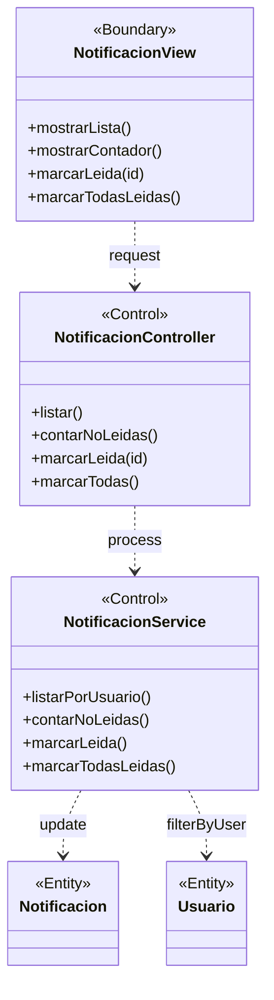

### Instrucciones para StarUML

1. Crear `UMLClassDiagram` "BCE-CU12-GestionarNotificaciones"
2. Crear 1 `<<Boundary>>`: **NotificacionView** (azul claro)
3. Crear 2 `<<Control>>`: **NotificacionController**, **NotificacionService** (amarillo)
4. Crear 2 `<<Entity>>`: **Notificacion**, **Usuario** (verde claro)

---

## BCE13: Rastrear Expediente (Público)

### Identificación

| Campo | Valor |
|-------|-------|
| **ID** | BCE-CU13 |
| **Caso de Uso** | CU13: Rastrear Expediente |
| **Diagram Type** | UML Class Diagram con estereotipos |
| **Actores** | Público (sin autenticación) |

### Objetos involucrados

| Tipo | Nombre | Descripción |
|:----:|:------|:------------|
| `<<Boundary>>` | RastreoView | Formulario público de rastreo y resultados |
| `<<Control>>` | RastreoController | `RastreoController.java` — búsqueda por código |
| `<<Control>>` | ExpedienteService | `ExpedienteService.java` — búsqueda en BD |
| `<<Entity>>` | Expediente | Datos del expediente (estado actual) |
| `<<Entity>>` | SeguimientoLog | Historial de cambios del expediente |

### Dependencias

| Origen | Destino | Descripción |
|:------|:--------|:------------|
| RastreoView | RastreoController | Ingreso de código de rastreo |
| RastreoController | ExpedienteService | Búsqueda por código |
| ExpedienteService | Expediente | Consulta del expediente |
| ExpedienteService | SeguimientoLog | Historial de seguimiento |

### Diagrama Mermaid

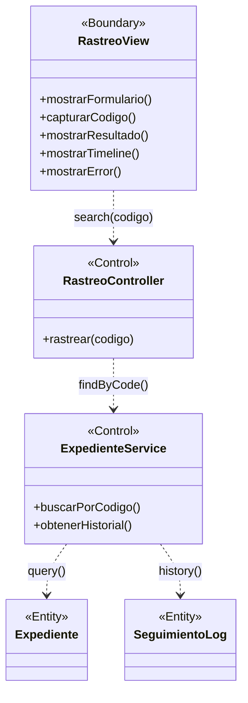

### Instrucciones para StarUML

1. Crear `UMLClassDiagram` "BCE-CU13-RastrearExpediente"
2. Crear 1 `<<Boundary>>`: **RastreoView** (azul claro)
3. Crear 2 `<<Control>>`: **RastreoController**, **ExpedienteService** (amarillo)
4. Crear 2 `<<Entity>>`: **Expediente**, **SeguimientoLog** (verde claro)

---

## BCE14: Cerrar Sesión

### Identificación

| Campo | Valor |
|-------|-------|
| **ID** | BCE-CU14 |
| **Caso de Uso** | CU14: Cerrar Sesión |
| **Diagram Type** | UML Class Diagram con estereotipos |
| **Actores** | Usuario autenticado |

### Objetos involucrados

| Tipo | Nombre | Descripción |
|:----:|:------|:------------|
| `<<Boundary>>` | HeaderView | Barra de navegación con opción "Cerrar Sesión" |
| `<<Control>>` | AuthController | `AuthController.java` — endpoint de logout |
| `<<Entity>>` | HttpSession | Sesión HTTP a invalidar (pseudo-entidad) |
| `<<Entity>>` | Cookie | Cookie "remember-me" a eliminar |

### Dependencias

| Origen | Destino | Descripción |
|:------|:--------|:------------|
| HeaderView | AuthController | Click en "Cerrar Sesión" |
| AuthController | HttpSession | Invalidación de sesión |
| AuthController | Cookie | Eliminación de cookie remember-me |

### Diagrama Mermaid

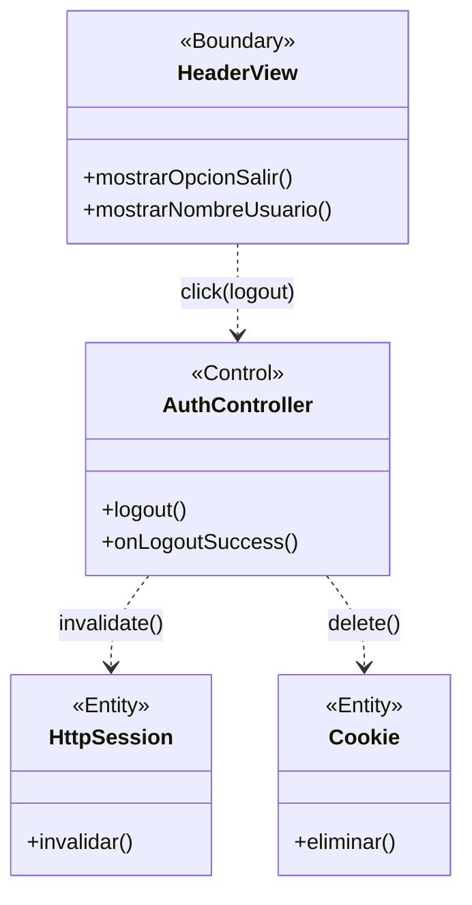

### Instrucciones para StarUML

1. Crear `UMLClassDiagram` "BCE-CU14-CerrarSesion"
2. Crear 1 `<<Boundary>>`: **HeaderView** (azul claro)
3. Crear 1 `<<Control>>`: **AuthController** (amarillo)
4. Crear 2 `<<Entity>>`: **HttpSession**, **Cookie** (verde claro) — notar que son pseudo-entidades
5. Asociaciones: HeaderView → AuthController → HttpSession y Cookie

---

## Verificación de Calidad ICONIX

| Criterio | Estado |
|:---------|:------:|
| Cada diagrama tiene al menos 1 Boundary, 1 Control, 1 Entity | ✅ |
| Actores solo se conectan a Boundary objects | ✅ (implícito en narrativa) |
| Boundary solo se conecta a Control objects | ✅ |
| Control se conecta a Entity y otros Control | ✅ |
| Entity nunca se conecta directamente a Boundary | ✅ |
| El diagrama cubre el flujo completo del CU (básico + alterno) | ✅ |
| Los nombres de los objetos reflejan su implementación real | ✅ |
| Trazabilidad: BCE-ID ↔ CU-ID ↔ RF ↔ SSD | ✅ |

---

# SISEXP-UPLA — Diagramas de Secuencia del Sistema (SSD)

**ICONIX — Fase 4: Diagramas de Secuencia**

**ISO/IEC 19505 (OMG UML 2.5) · ISO/IEC 29148:2018 · IEEE 830-1998**

---

| Proyecto | SISEXP-UPLA |
|---|---|
| Sistema | Seguimiento y Control de Expedientes |
| Institución | Universidad Peruana Los Andes — Facultad de Ingeniería |
| Metodología | ICONIX (Fase 4) |
| Estándar | ISO/IEC 19505-1:2012 (UML 2.5 Superstructure) |
| Total SSD | 14 (CU01 – CU14) |
| Versión | 1.0 |
| Fecha | Junio 2026 |

---

## Índice

| # | SSD | Caso de Uso | Actor | Pág. |
|---|---|---|---|---|
| 1 | SSD-CU01 | Iniciar Sesión | Usuario | 3 |
| 2 | SSD-CU02 | Ver Dashboard | Usuario | 5 |
| 3 | SSD-CU03 | Crear Expediente | Laboratorio / Secretaria | 7 |
| 4 | SSD-CU04 | Cambiar Estado Expediente | Admin / Coordinación / Secretaria | 9 |
| 5 | SSD-CU05 | Adjuntar Documento | Laboratorio / Secretaria | 11 |
| 6 | SSD-CU06 | Gestionar Techo Presupuestal | Admin / Coordinación | 13 |
| 7 | SSD-CU07 | Gestionar Actividad POI | Admin / Coordinación | 15 |
| 8 | SSD-CU08 | Gestionar Necesidad PAP | Admin / Coordinación | 17 |
| 9 | SSD-CU09 | Gestionar Nota Modificatoria | Admin / Coordinación / Laboratorio / Secretaria / Director | 19 |
| 10 | SSD-CU10 | Ver Reportes | Admin / Coordinación / Director / Decanato | 22 |
| 11 | SSD-CU11 | Gestionar Usuarios | Administrador | 24 |
| 12 | SSD-CU12 | Gestionar Notificaciones | Usuario (cualquier rol) | 26 |
| 13 | SSD-CU13 | Rastrear Expediente | Visitante (público) | 28 |
| 14 | SSD-CU14 | Cerrar Sesión | Usuario (cualquier rol) | 30 |

---

## Introducción

### Propósito de los SSD

Los **Diagramas de Secuencia del Sistema (SSD)** modelan la interacción entre los actores externos y el sistema SISEXP-UPLA, tratando al sistema como una **caja negra**. Cada SSD documenta:

- Los **eventos del sistema** que el actor envía (entradas)
- Las **respuestas del sistema** (salidas)
- Los **fragmentos combinados** que representan bucles, alternativas y opciones
- Las **validaciones y reglas de negocio** ejecutadas internamente

### Contexto en ICONIX (Fase 4)

En la metodología ICONIX, los SSD se construyen a partir de:

1. **ERS** (Fase 1) — casos de uso y requisitos funcionales
2. **Diagramas de Robustez** (Fase 3) — Boundary-Control-Entity
3. **Modelo de Dominio** (Fase 2) — entidades y relaciones

Cada SSD se traza directamente a un caso de uso del ERS y produce las especificaciones de operación que guiarán la implementación en **Spring Boot** (Controllers → Services → Repositories).

### Convenciones utilizadas

| Elemento | Notación Mermaid | Equivalente UML 2.5 |
|---|---|---|
| Actor externo | `actor Nombre` | Actor |
| Sistema (caja negra) | `participant :Sistema` | Lifeline de sistema |
| Mensaje sincrónico | `->>` | Message (sincrónico) |
| Mensaje de retorno | `-->>` | Message (retorno) |
| Activación | `activate / deactivate` | ExecutionSpecification |
| Alternativa | `alt / else / end` | CombinedFragment (alt) |
| Bucle | `loop / end` | CombinedFragment (loop) |
| Opcional | `opt / end` | CombinedFragment (opt) |
| Nota | `Note over` | Note |

### Nomenclatura de mensajes

Los mensajes siguen el patrón `verbo+Complemento()` en camelCase:

- `POST /api/ruta {datos}` — creación
- `PUT /api/ruta/{id} {datos}` — actualización
- `GET /api/ruta` — consulta
- `DELETE /api/ruta/{id}` — eliminación

Las respuestas incluyen el código HTTP y el tipo de dato retornado.

### Formato de código de expediente

`EXP-YYYY-NNNN` donde:
- `YYYY` = año actual (ej: 2026)
- `NNNN` = secuencial de 4 dígitos (ej: 0001)

---

## SSD-CU01: Iniciar Sesión

| Campo | Valor |
|---|---|
| **ID** | SSD-CU01 |
| **CU Reference** | CU01: Iniciar Sesión |
| **Actor** | Usuario (cualquier rol) |
| **Precondición** | Usuario registrado en el sistema, cuenta activa |
| **Descripción** | El usuario se autentica en el sistema mediante email y contraseña. El sistema valida las credenciales, verifica el estado de la cuenta (activa, bloqueada) y aplica las reglas de horario laboral. Si el usuario marca "Recordarme", se genera una cookie persistente por 30 días. |

### Flujo básico

1. Usuario envía credenciales (email + password) desde el formulario de login
2. Sistema busca al usuario por email
3. Sistema verifica que la cuenta esté activa
4. Sistema verifica que la cuenta no esté bloqueada por intentos fallidos
5. Sistema valida la contraseña contra el hash BCrypt
6. Sistema registra el inicio de sesión exitoso (resetea intentos fallidos)
7. Sistema crea la sesión HTTP
8. Sistema redirige al dashboard con datos del usuario

### Flujo alterno A — Credenciales inválidas
1. Sistema incrementa contador de intentos fallidos
2. Si intentos fallidos >= 5, bloquea la cuenta por 30 minutos
3. Sistema retorna mensaje de error "Credenciales inválidas"

### Flujo alterno B — Cuenta bloqueada
1. Sistema detecta que `bloqueadoHasta > ahora`
2. Sistema retorna mensaje "Cuenta bloqueada. Intente nuevamente en X minutos"

### Flujo alterno C — Cuenta inactiva
1. Sistema detecta que `activo = false`
2. Sistema retorna mensaje "Cuenta desactivada. Contacte al administrador"

### Mermaid

```mermaid
sequenceDiagram
    actor Usuario
    participant :Sistema

    Usuario->>:Sistema: POST /login {email, password}
    activate :Sistema

    :Sistema-->>:Sistema: Buscar usuario por email
    :Sistema-->>:Sistema: Verificar cuenta activa

    alt Cuenta inactiva
        :Sistema-->>Usuario: Redirect /login?error (Cuenta desactivada)
    else Cuenta activa
        :Sistema-->>:Sistema: Verificar bloqueo por intentos

        alt Cuenta bloqueada
            :Sistema-->>Usuario: Redirect /login?error (Cuenta bloqueada)
        else No bloqueada
            :Sistema-->>:Sistema: Validar password (BCrypt)

            alt Password inválido
                :Sistema-->>:Sistema: Incrementar intentosFallidos
                opt Intentos >= 5
                    :Sistema-->>:Sistema: Bloquear cuenta 30 min
                end
                :Sistema-->>Usuario: Redirect /login?error (Credenciales inválidas)
            else Password válido
                :Sistema-->>:Sistema: Resetear intentosFallidos a 0
                :Sistema-->>:Sistema: Crear sesión HTTP + RememberMe
                :Sistema-->>Usuario: Redirect /dashboard (302)
            end
        end
    end

    deactivate :Sistema
```

### Notas para StarUML

| Elemento Mermaid | Elemento StarUML |
|---|---|
| `actor Usuario` | Actor lifeline: nombre "Usuario" |
| `participant :Sistema` | Lifeline: nombre ":Sistema", tipo "Boundary" |
| `activate :Sistema` | Crear ExecutionSpecification en lifeline Sistema |
| Todos los mensajes `->>` | UML Message (sincrónico) |
| Fragmentos `alt/else` | CombinedFragment tipo "alt" |
| Fragmento `opt` | CombinedFragment tipo "opt" |
| Todos los retornos `-->>` | UML Message (retorno), estilo dashed |

---

## SSD-CU02: Ver Dashboard

| Campo | Valor |
|---|---|
| **ID** | SSD-CU02 |
| **CU Reference** | CU02: Ver Dashboard |
| **Actor** | Usuario (cualquier rol) |
| **Precondición** | Usuario autenticado con sesión activa |
| **Descripción** | El usuario accede a la página principal del sistema donde se muestran indicadores clave (KPIs), barras de ejecución presupuestal y alertas de expedientes vencidos o próximos a vencer. |

### Flujo básico

1. Usuario solicita el dashboard (post-login o desde la barra lateral)
2. Sistema verifica que el usuario tenga sesión activa
3. Sistema consulta el total de expedientes agrupados por estado
4. Sistema consulta los saldos de las actividades POI (presupuesto asignado, comprometido, ejecutado, disponible)
5. Sistema consulta las alertas (expedientes vencidos y próximos a vencer en 7 días)
6. Sistema consulta el conteo de notificaciones no leídas del usuario
7. Sistema renderiza la vista dashboard con todos los datos agregados

### Flujo alterno — Sin datos
1. Si no hay expedientes, el dashboard muestra mensaje "No hay expedientes registrados"
2. Las barras de presupuesto se muestran en cero

### Mermaid

```mermaid
sequenceDiagram
    actor Usuario
    participant :Sistema

    Usuario->>:Sistema: GET /dashboard
    activate :Sistema

    :Sistema-->>:Sistema: Verificar autenticación

    :Sistema-->>:Sistema: Consultar expedientes agrupados por estado
    :Sistema-->>:Sistema: Consultar saldos POI (presupuesto, comprometido, ejecutado)
    :Sistema-->>:Sistema: Consultar alertas (vencidos + próximos 7 días)
    :Sistema-->>:Sistema: Consultar notificaciones no leídas

    :Sistema-->>Usuario: 200 Vista dashboard (KPIs + barras + alertas)

    deactivate :Sistema
```

### Notas para StarUML

- Todas las consultas internas se representan como auto-mensajes (`Sistema -->> Sistema`)
- Las consultas pueden modelarse como mensajes a repositorios si se desea más detalle

---

## SSD-CU03: Crear Expediente

| Campo | Valor |
|---|---|
| **ID** | SSD-CU03 |
| **CU Reference** | CU03: Crear Expediente |
| **Actor** | Laboratorio, Secretaria, Director, Administrador |
| **Precondición** | Usuario autenticado. Existe al menos un Techo Presupuestal activo, una Actividad POI activa y una Necesidad PAP con saldo disponible. |
| **Descripción** | El usuario crea un nuevo expediente seleccionando la actividad POI y necesidad PAP, especificando cantidad, urgencia, descripción y fecha límite. El sistema valida múltiples reglas de negocio (saldo disponible, límite por rol, tope 80%, correspondencia de tipo, período fiscal, fecha límite de actividad) antes de crear el expediente en estado Borrador. |

### Flujo básico

1. Usuario solicita el formulario de creación
2. Sistema carga actividades POI activas con saldo disponible
3. Usuario selecciona actividad POI → Sistema carga necesidades PAP asociadas vía AJAX
4. Usuario completa el formulario (actividad, necesidad, cantidad, urgencia, descripción, fecha límite)
5. Sistema valida que la actividad POI esté activa y no tenga fecha límite vencida
6. Sistema valida que el techo del año esté abierto (no planificado)
7. Sistema calcula el costo estimado = `cantidadSolicitada × precioEstimado`
8. Sistema valida saldo disponible en la actividad POI
9. Sistema valida límite de monto por rol del usuario
10. Sistema valida tope 80% (un expediente no puede consumir más del 80% del saldo disponible)
11. Sistema valida correspondencia de tipo (Bien/Servicio) con la necesidad PAP
12. Sistema genera código de expediente (EXP-YYYY-NNNN)
13. Sistema crea el expediente en estado Borrador
14. Sistema retorna vista con expediente creado

### Flujo alterno A — Error de validación
1. Si alguna validación falla, sistema retorna mensaje de error específico
2. El formulario se mantiene con los datos ingresados para corrección

### Flujo alterno B — Error de carga AJAX
1. Si no hay necesidades PAP disponibles, el selector muestra "Sin ítems disponibles"

### Mermaid

```mermaid
sequenceDiagram
    actor Usuario
    participant :Sistema

    Usuario->>:Sistema: GET /expedientes/nuevo
    activate :Sistema
    :Sistema-->>Usuario: 200 Vista formulario + actividades POI activas
    deactivate :Sistema

    Usuario->>:Sistema: GET /api/actividades/{id}/necesidades (AJAX)
    activate :Sistema
    :Sistema-->>:Sistema: Consultar necesidades PAP vinculadas
    :Sistema-->>Usuario: 200 [{necesidadPAP}]
    deactivate :Sistema

    Usuario->>:Sistema: POST /expedientes {actividadPoiId, necesidadPapId, cantidad, urgencia, descripcion, fechaLimite}
    activate :Sistema

    :Sistema-->>:Sistema: Validar actividad activa y fecha límite no vencida
    :Sistema-->>:Sistema: Validar techo del año abierto (no planificado)
    :Sistema-->>:Sistema: Calcular costoEstimado = cantidad × precioUnitario
    :Sistema-->>:Sistema: Validar saldo disponible en POI
    :Sistema-->>:Sistema: Validar límite de monto por rol
    :Sistema-->>:Sistema: Validar tope 80% del saldo disponible
    :Sistema-->>:Sistema: Validar correspondencia de tipo (Bien/Servicio)
    :Sistema-->>:Sistema: Generar código EXP-YYYY-NNNN

    alt Validaciones exitosas
        :Sistema-->>:Sistema: Crear expediente (estado: Borrador)
        :Sistema-->>:Sistema: Crear log de seguimiento inicial
        :Sistema-->>Usuario: Redirect /expedientes/{id} (201)
    else Error de validación
        :Sistema-->>Usuario: Redirect /expedientes/nuevo (error específico)
    end

    deactivate :Sistema
```

### Notas para StarUML

- Los mensajes AJAX (`GET /api/actividades/{id}/necesidades`) pueden representarse como un mensaje separado con su propia activación
- Las validaciones internas se agrupan secuencialmente como auto-mensajes
- El fragmento `alt` distingue entre éxito y error de validación

---

## SSD-CU04: Cambiar Estado Expediente

| Campo | Valor |
|---|---|
| **ID** | SSD-CU04 |
| **CU Reference** | CU04: Cambiar Estado Expediente |
| **Actor** | Administrador, Coordinación (aprobar/rechazar/observar), Secretaria (finalizar/derivar) |
| **Precondición** | Usuario autenticado con permisos para la transición. Expediente existe y no está en estado terminal. |
| **Descripción** | El usuario cambia el estado de un expediente siguiendo la máquina de estados definida. Cada transición ejecuta reglas de negocio de reserva/liberación/ejecución de saldos en POI y PAP, y genera notificaciones automáticas. |

### Flujo básico

1. Usuario visualiza detalle del expediente
2. Sistema muestra panel de cambio de estado con transiciones permitidas
3. Usuario selecciona nuevo estado y escribe observación
4. Sistema valida que la transición esté permitida según la máquina de estados
5. Sistema ejecuta reglas de negocio según la transición:
   - `Borrador → En_revisión`: reserva saldo en POI y PAP
   - `En_revisión → Aprobado`: ejecuta saldo (comprometido → ejecutado)
   - `En_revisión → Rechazado`: libera saldo comprometido
   - `En_revisión → Observado`: libera saldo comprometido
   - `Observado → En_revisión`: vuelve a reservar saldo
   - `Aprobado → Finalizado`: sin cambio de saldos
   - `Aprobado → Derivado`: sin cambio de saldos
6. Sistema crea registro de seguimiento (SeguimientoLog)
7. Sistema crea notificación para el solicitante del expediente
8. Sistema redirige al detalle del expediente actualizado

### Flujo alterno A — Transición inválida
1. Sistema muestra error "Transición no permitida desde el estado actual"

### Flujo alterno B — Expediente en estado terminal
1. Si el expediente está Rechazado o Finalizado, el panel de cambio de estado no se muestra

### Mermaid

```mermaid
sequenceDiagram
    actor Usuario
    participant :Sistema

    Usuario->>:Sistema: GET /expedientes/{id}
    activate :Sistema
    :Sistema-->>:Sistema: Consultar expediente + transiciones permitidas
    :Sistema-->>Usuario: 200 Vista detalle + panel de cambio de estado
    deactivate :Sistema

    Usuario->>:Sistema: PUT /expedientes/{id}/estado {nuevoEstado, observacion}
    activate :Sistema

    :Sistema-->>:Sistema: Validar transición permitida

    alt Transición válida
        :Sistema-->>:Sistema: Ejecutar reglas de negocio según transición

        alt Borrador → En_revision
            :Sistema-->>:Sistema: reservarSaldo(POI)
            :Sistema-->>:Sistema: reservarSaldoPAP(PAP)
        else En_revision → Aprobado
            :Sistema-->>:Sistema: ejecutarSaldo(POI)
            :Sistema-->>:Sistema: ejecutarSaldoPAP(PAP)
        else En_revision → Rechazado
            :Sistema-->>:Sistema: liberarSaldo(POI)
            :Sistema-->>:Sistema: liberarSaldoPAP(PAP)
        else En_revision → Observado
            :Sistema-->>:Sistema: liberarSaldo(POI)
            :Sistema-->>:Sistema: liberarSaldoPAP(PAP)
        else Observado → En_revision
            :Sistema-->>:Sistema: reservarSaldo(POI)
            :Sistema-->>:Sistema: reservarSaldoPAP(PAP)
        end

        :Sistema-->>:Sistema: Actualizar estado del expediente
        :Sistema-->>:Sistema: Crear SeguimientoLog
        :Sistema-->>:Sistema: Crear Notificación para solicitante

        :Sistema-->>Usuario: Redirect /expedientes/{id} (200)
    else Transición inválida
        :Sistema-->>Usuario: Redirect /expedientes/{id}?error (Transición no permitida)
    end

    deactivate :Sistema
```

### Notas para StarUML

- El fragmento `alt` anidado (transición válida + tipo de transición) se modela como CombinedFragment alt anidado
- Las reglas de negocio son auto-mensajes con nombres descriptivos

---

## SSD-CU05: Adjuntar Documento

| Campo | Valor |
|---|---|
| **ID** | SSD-CU05 |
| **CU Reference** | CU05: Adjuntar Documento |
| **Actor** | Laboratorio, Secretaria, Administrador |
| **Precondición** | Usuario autenticado. Expediente existe y no está en estado terminal (Rechazado o Finalizado). |
| **Descripción** | El usuario sube un documento PDF al expediente como sustento. El sistema almacena el archivo en disco (con nombre UUID para evitar colisiones) y registra los metadatos en la base de datos. |

### Flujo básico

1. Usuario abre modal de "Subir documento" desde la vista detalle del expediente
2. Usuario selecciona tipo de documento (TDR, Especificaciones_Técnicas, Cotización, Informe_Técnico)
3. Usuario selecciona archivo PDF (máximo 15 MB)
4. Sistema valida que el archivo sea PDF (por extensión y MIME type)
5. Sistema valida que el tamaño no exceda 15 MB
6. Sistema genera nombre único en disco (UUID + extensión original)
7. Sistema guarda el archivo en el directorio de uploads
8. Sistema registra metadatos en DocumentoAdjunto (tipo, nombreOriginal, nombreArchivo, mimeType, tamaño, expedienteId)
9. Sistema retorna la vista detalle actualizada con el documento listado

### Flujo alterno A — Archivo inválido
1. Sistema muestra error "Solo se permiten archivos PDF"
2. El modal permanece abierto para corregir

### Flujo alterno B — Archivo muy grande
1. Sistema muestra error "El archivo excede el tamaño máximo de 15 MB"

### Flujo alterno C — Eliminación de documento
1. Usuario (solo Admin) solicita eliminar un documento
2. Sistema elimina el archivo del disco y el registro en BD

### Mermaid

```mermaid
sequenceDiagram
    actor Usuario
    participant :Sistema

    Usuario->>:Sistema: POST /expedientes/{id}/documentos {tipo, archivo}
    activate :Sistema

    :Sistema-->>:Sistema: Validar expediente existe y no es terminal
    :Sistema-->>:Sistema: Validar tipo de documento permitido

    loop Validar archivo
        :Sistema-->>:Sistema: Validar extensión .pdf
        :Sistema-->>:Sistema: Validar MIME type application/pdf
        :Sistema-->>:Sistema: Validar tamaño <= 15 MB
    end

    alt Archivo válido
        :Sistema-->>:Sistema: Generar UUID para nombre en disco
        :Sistema-->>:Sistema: Guardar archivo en /uploads
        :Sistema-->>:Sistema: Crear registro DocumentoAdjunto
        :Sistema-->>Usuario: Redirect /expedientes/{id} (201)
    else Archivo inválido
        :Sistema-->>Usuario: Redirect /expedientes/{id}?error (Tipo/tamaño inválido)
    end

    deactivate :Sistema
```

### Notas para StarUML

- El `loop` de validaciones puede simplificarse a un solo auto-mensaje `validarArchivo()`
- La eliminación es un caso de uso secundario dentro del mismo CU

---

## SSD-CU06: Gestionar Techo Presupuestal

| Campo | Valor |
|---|---|
| **ID** | SSD-CU06 |
| **CU Reference** | CU06: Gestionar Techo Presupuestal |
| **Actor** | Administrador, Coordinación |
| **Precondición** | Usuario autenticado con rol Admin o Coordinación. |
| **Descripción** | El usuario gestiona los techos presupuestales anuales. Puede listar, crear, editar, activar/desactivar y cerrar la planificación de techos. El sistema valida año único y montos positivos. |

### Flujo básico (crear)

1. Usuario solicita la lista de techos presupuestales
2. Sistema consulta todos los techos ordenados por año descendente
3. Usuario hace clic en "Nuevo techo" y completa formulario (año, monto total)
4. Sistema valida que el año no exista ya en la base de datos
5. Sistema valida que el monto total sea mayor a 0
6. Sistema crea el techo con estado activo y planificado = false
7. Sistema redirige al listado con mensaje de éxito

### Flujo básico (editar)
1. Usuario edita año y/o monto total de un techo existente
2. Sistema valida que el techo no esté planificado (cerrado)
3. Sistema actualiza los datos

### Flujo básico (cerrar planificación)
1. Usuario marca un techo como planificado (cerrado)
2. Sistema valida que el techo esté activo
3. Sistema establece `planificado = true`
4. Ya no se permiten modificaciones ni creación de expedientes en ese año

### Flujo alterno — Año duplicado
1. Sistema muestra error "Ya existe un techo para el año XXXX"

### Flujo alterno — Techo planificado
1. Si el techo está planificado, los botones de editar y eliminar no se muestran

### Mermaid

```mermaid
sequenceDiagram
    actor Usuario
    participant :Sistema

    Usuario->>:Sistema: GET /techos
    activate :Sistema
    :Sistema-->>:Sistema: Consultar todos los techos (ORDER BY año DESC)
    :Sistema-->>Usuario: 200 Vista listado de techos
    deactivate :Sistema

    Usuario->>:Sistema: GET /techos/nuevo
    activate :Sistema
    :Sistema-->>Usuario: 200 Vista formulario (año sugerido: añoActual+1)
    deactivate :Sistema

    Usuario->>:Sistema: POST /techos {año, montoTotal}
    activate :Sistema

    :Sistema-->>:Sistema: Validar año único en BD
    :Sistema-->>:Sistema: Validar montoTotal > 0

    alt Validaciones exitosas
        :Sistema-->>:Sistema: Crear TechoPresupuestal (activo=true, planificado=false)
        :Sistema-->>Usuario: Redirect /techos (201, éxito)
    else Año duplicado
        :Sistema-->>Usuario: Redirect /techos/nuevo (error: año ya existe)
    else Monto inválido
        :Sistema-->>Usuario: Redirect /techos/nuevo (error: monto debe ser > 0)
    end

    deactivate :Sistema

    Usuario->>:Sistema: PUT /techos/{id}/planificar
    activate :Sistema
    :Sistema-->>:Sistema: Validar techo activo
    :Sistema-->>:Sistema: Establecer planificado = true
    :Sistema-->>Usuario: Redirect /techos (200, éxito)
    deactivate :Sistema
```

### Notas para StarUML

- Se muestran tres interacciones separadas: listar, crear, planificar
- Cada interacción tiene su propia activación en StarUML

---

## SSD-CU07: Gestionar Actividad POI

| Campo | Valor |
|---|---|
| **ID** | SSD-CU07 |
| **CU Reference** | CU07: Gestionar Actividad POI |
| **Actor** | Administrador, Coordinación |
| **Precondición** | Existe al menos un Techo Presupuestal activo. Usuario autenticado con permisos. |
| **Descripción** | El usuario gestiona las actividades del Plan Operativo Institucional (POI) asociadas a un techo presupuestal. Puede listar, crear, editar y cambiar el estado de las actividades. |

### Flujo básico (crear)

1. Usuario solicita la lista de actividades POI
2. Sistema consulta todas las actividades con datos del techo asociado
3. Usuario hace clic en "Nueva actividad"
4. Sistema carga los techos disponibles para el selector
5. Usuario completa formulario (techo, código, nombre, presupuesto asignado, fecha límite)
6. Sistema valida que el techo seleccionado esté activo y no planificado
7. Sistema valida que el presupuesto asignado no exceda el disponible del techo
8. Sistema valida que el código sea único dentro del mismo techo
9. Sistema crea la actividad en estado Pendiente
10. Sistema redirige al listado

### Flujo básico (editar)
1. Usuario edita datos de la actividad (excepto si está planificada o cerrada)
2. Sistema actualiza los campos

### Flujo básico (cambiar estado)
1. Usuario cambia estado de la actividad (Pendiente → En Ejecución → Ejecutado → Cerrado)
2. Sistema valida la transición de estado

### Flujo alterno — Presupuesto excede disponible del techo
1. Sistema muestra error "El presupuesto asignado excede el disponible del techo"

### Mermaid

```mermaid
sequenceDiagram
    actor Usuario
    participant :Sistema

    Usuario->>:Sistema: GET /poi
    activate :Sistema
    :Sistema-->>:Sistema: Consultar actividades POI + techo asociado
    :Sistema-->>Usuario: 200 Vista listado POI
    deactivate :Sistema

    Usuario->>:Sistema: GET /poi/nuevo
    activate :Sistema
    :Sistema-->>:Sistema: Consultar techos activos disponibles
    :Sistema-->>Usuario: 200 Vista formulario + techos
    deactivate :Sistema

    Usuario->>:Sistema: POST /poi {techoId, codigo, nombre, presupuestoAsignado, fechaLimite}
    activate :Sistema

    :Sistema-->>:Sistema: Validar techo activo y no planificado
    :Sistema-->>:Sistema: Validar código único en el techo
    :Sistema-->>:Sistema: Validar presupuesto <= disponible del techo

    alt Validaciones exitosas
        :Sistema-->>:Sistema: Crear ActividadPOI (estado: Pendiente)
        :Sistema-->>Usuario: Redirect /poi (201, éxito)
    else Presupuesto excede disponible
        :Sistema-->>Usuario: Redirect /poi/nuevo (error: presupuesto excede disponible)
    else Código duplicado
        :Sistema-->>Usuario: Redirect /poi/nuevo (error: código ya existe)
    end

    deactivate :Sistema
```

### Notas para StarUML

- Similar estructura a Techo Presupuestal
- Las validaciones de saldo contra el techo padre son críticas

---

## SSD-CU08: Gestionar Necesidad PAP

| Campo | Valor |
|---|---|
| **ID** | SSD-CU08 |
| **CU Reference** | CU08: Gestionar Necesidad PAP |
| **Actor** | Administrador, Coordinación |
| **Precondición** | Existe al menos una Actividad POI activa. Usuario autenticado con permisos. |
| **Descripción** | El usuario gestiona las necesidades del Plan Anual de Contrataciones (PAP) asociadas a una actividad POI. Puede listar, crear, editar y eliminar necesidades. |

### Flujo básico (crear)

1. Usuario solicita la lista de necesidades PAP
2. Sistema consulta todas las necesidades con datos de la actividad asociada
3. Usuario hace clic en "Nueva necesidad"
4. Sistema carga las actividades POI activas para el selector
5. Usuario completa formulario (actividad, nombre, cantidad, precio estimado, unidad, oficina, tipo, clasificador)
6. Sistema valida que la actividad esté activa y no cerrada
7. Sistema valida que el `cantidad × precioEstimado` no exceda el disponible de la actividad
8. Sistema valida que `cantidad >= 1` y `precioEstimado > 0`
9. Sistema calcula: `cantidadDisponible = cantidad`, `montoDisponible = cantidad × precioEstimado`
10. Sistema crea la necesidad PAP
11. Sistema redirige al listado

### Flujo alterno — Presupuesto excede disponible de actividad
1. Sistema muestra error "El costo total excede el saldo disponible de la actividad"

### Flujo alterno — Eliminación
1. Usuario (solo Admin) elimina una necesidad PAP
2. Sistema valida que no tenga expedientes asociados
3. Si tiene expedientes asociados, muestra error "No se puede eliminar: tiene expedientes vinculados"

### Mermaid

```mermaid
sequenceDiagram
    actor Usuario
    participant :Sistema

    Usuario->>:Sistema: GET /pap
    activate :Sistema
    :Sistema-->>:Sistema: Consultar necesidades + actividad POI asociada
    :Sistema-->>Usuario: 200 Vista listado PAP
    deactivate :Sistema

    Usuario->>:Sistema: GET /pap/nuevo
    activate :Sistema
    :Sistema-->>:Sistema: Consultar actividades POI activas
    :Sistema-->>Usuario: 200 Vista formulario + actividades
    deactivate :Sistema

    Usuario->>:Sistema: POST /pap {actividadPoiId, nombre, cantidad, precioEstimado, unidad, tipo, clasificadorGasto}
    activate :Sistema

    :Sistema-->>:Sistema: Validar actividad activa y no cerrada
    :Sistema-->>:Sistema: Validar cantidad >= 1 y precioEstimado > 0
    :Sistema-->>:Sistema: Calcular costoTotal = cantidad × precioEstimado
    :Sistema-->>:Sistema: Validar costoTotal <= disponible de actividad

    alt Validaciones exitosas
        :Sistema-->>:Sistema: Crear NecesidadPAP (cantDisp=cantidad, montoDisp=costoTotal)
        :Sistema-->>Usuario: Redirect /pap (201, éxito)
    else Costo excede disponible
        :Sistema-->>Usuario: Redirect /pap/nuevo (error: costo excede disponible)
    end

    deactivate :Sistema
```

### Notas para StarUML

- La eliminación es una operación adicional que requiere validación de integridad referencial

---

## SSD-CU09: Gestionar Nota Modificatoria

| Campo | Valor |
|---|---|
| **ID** | SSD-CU09 |
| **CU Reference** | CU09: Gestionar Nota Modificatoria |
| **Actor** | Administrador, Coordinación, Laboratorio, Secretaria, Director (crear); Admin y Coordinación (configurar/rechazar) |
| **Precondición** | Usuario autenticado. Existe al menos una Actividad POI activa. |
| **Descripción** | El usuario solicita una redistribución presupuestal mediante una nota modificatoria. Puede ser de tipo "inclusión de ítem" (nuevo bien/servicio en actividad existente) o "inclusión de actividad" (nueva actividad completa). Admin/Coordinación puede configurar (aprobar) o rechazar la solicitud. |

### Flujo básico (crear)

1. Usuario solicita el formulario de nueva nota modificatoria
2. Sistema carga actividades POI activas para el selector
3. Usuario completa formulario: tipo (inclusión_item / inclusión_actividad), actividad existente, nombre nuevo, justificación, costo estimado, archivo PDF opcional
4. Sistema valida datos obligatorios
5. Sistema genera código de nota (NM-YYYY-NNNN)
6. Sistema crea la nota en estado pendiente
7. Sistema redirige al listado de notas

### Flujo básico (configurar — solo Admin/Coordinación)
1. Usuario abre modal de configuración desde la tabla de notas
2. Usuario selecciona actividad origen (de dónde se transfiere el dinero), monto a transferir, nuevo clasificador, nuevo tipo
3. Sistema valida que la actividad origen tenga saldo disponible suficiente
4. Sistema actualiza saldos: descuenta de actividad origen, acredita en actividad destino (o crea nuevo ítem/actividad)
5. Sistema cambia estado de la nota a "configurada"
6. Sistema crea notificación para el solicitante

### Flujo básico (rechazar — solo Admin/Coordinación)
1. Usuario escribe motivo de rechazo
2. Sistema cambia estado de la nota a "rechazada"
3. Sistema crea notificación para el solicitante

### Flujo alterno — Sin saldo disponible en origen
1. Sistema muestra error "La actividad origen no tiene saldo suficiente para la transferencia"

### Mermaid

```mermaid
sequenceDiagram
    actor Usuario
    participant :Sistema

    Note over Usuario, Sistema: --- CREAR NOTA ---
    Usuario->>:Sistema: GET /notas-modificatorias/nuevo
    activate :Sistema
    :Sistema-->>:Sistema: Consultar actividades POI activas
    :Sistema-->>Usuario: 200 Vista formulario
    deactivate :Sistema

    Usuario->>:Sistema: POST /notas-modificatorias {tipo, actividadExistenteId, nuevoNombre, justificacion, costoEstimado, archivo}
    activate :Sistema

    :Sistema-->>:Sistema: Validar datos obligatorios
    :Sistema-->>:Sistema: Generar código NM-YYYY-NNNN

    alt Validaciones exitosas
        :Sistema-->>:Sistema: Crear NotaModificatoria (estado: pendiente)
        :Sistema-->>Usuario: Redirect /notas-modificatorias (201, éxito)
    else Datos inválidos
        :Sistema-->>Usuario: Redirect /notas-modificatorias/nuevo (error)
    end

    deactivate :Sistema

    Note over Usuario, Sistema: --- CONFIGURAR (ADMIN/COORD) ---
    Usuario->>:Sistema: PUT /notas-modificatorias/{id}/configurar {actividadOrigenId, montoTransferir, nuevoClasificador, nuevoTipo, observacionAdmin}
    activate :Sistema

    :Sistema-->>:Sistema: Validar nota en estado pendiente
    :Sistema-->>:Sistema: Validar actividad origen activa
    :Sistema-->>:Sistema: Validar saldo disponible en origen >= montoTransferir

    alt Saldo suficiente
        :Sistema-->>:Sistema: Actualizar saldos (origen: -monto, destino: +monto)
        :Sistema-->>:Sistema: Cambiar estado nota a "configurada"
        :Sistema-->>:Sistema: Crear Notificación para solicitante (nota_aprobada)
        :Sistema-->>Usuario: Redirect /notas-modificatorias (200, éxito)
    else Saldo insuficiente
        :Sistema-->>Usuario: Redirect /notas-modificatorias (error: saldo insuficiente)
    end

    deactivate :Sistema

    Note over Usuario, Sistema: --- RECHAZAR (ADMIN/COORD) ---
    Usuario->>:Sistema: PUT /notas-modificatorias/{id}/rechazar {observacionAdmin}
    activate :Sistema

    :Sistema-->>:Sistema: Validar nota en estado pendiente
    :Sistema-->>:Sistema: Cambiar estado nota a "rechazada"
    :Sistema-->>:Sistema: Crear Notificación para solicitante (nota_rechazada)
    :Sistema-->>Usuario: Redirect /notas-modificatorias (200)

    deactivate :Sistema
```

### Notas para StarUML

- Este SSD tiene tres sub-flujos claramente diferenciados con notas explicativas
- En StarUML, usar tres diagramas separados o un solo diagrama con separadores visuales
- Las reglas de negocio de transferencia de saldos se modelan como auto-mensajes

---

## SSD-CU10: Ver Reportes

| Campo | Valor |
|---|---|
| **ID** | SSD-CU10 |
| **CU Reference** | CU10: Ver Reportes |
| **Actor** | Administrador, Coordinación, Director, Decanato |
| **Precondición** | Usuario autenticado con permisos de reportes. |
| **Descripción** | El usuario accede al módulo de reportes organizado en 4 pestañas: Expedientes, POI, PAP e Informe Anual. Puede ver datos agregados, tablas detalladas y exportar a CSV. |

### Flujo básico

1. Usuario solicita la página de reportes
2. Sistema verifica permisos del usuario
3. Sistema carga datos de las 4 pestañas:
   - **Expedientes**: total por estado, tabla detallada, vencidos
   - **POI**: actividades con presupuesto, ejecutado y % de ejecución
   - **PAP**: necesidades con cantidades disponibles y ejecutadas
   - **Informe Anual**: techos con montos totales y utilizados
4. Sistema renderiza la vista con tabs
5. Usuario puede navegar entre tabs sin recargar (carga inicial completa)
6. Usuario puede exportar a CSV desde cualquier tab

### Flujo alterno — Exportar CSV
1. Usuario hace clic en "Exportar CSV"
2. Sistema consulta los datos específicos del tab activo
3. Sistema genera archivo CSV con cabeceras
4. Sistema descarga el archivo

### Mermaid

```mermaid
sequenceDiagram
    actor Usuario
    participant :Sistema

    Usuario->>:Sistema: GET /reportes
    activate :Sistema

    :Sistema-->>:Sistema: Verificar permisos (Admin, Coord, Director, Decanato)

    par Carga de datos de reportes
        :Sistema-->>:Sistema: Consultar expedientes por estado (KPIs)
        :Sistema-->>:Sistema: Consultar tabla detallada de expedientes
        :Sistema-->>:Sistema: Consultar actividades POI con % ejecución
        :Sistema-->>:Sistema: Consultar necesidades PAP (disponible/ejecutado)
        :Sistema-->>:Sistema: Consultar techos para informe anual
    end

    :Sistema-->>Usuario: 200 Vista reportes (4 tabs)

    opt Exportar CSV
        Usuario->>:Sistema: GET /reportes/exportar?tab=expedientes
        activate :Sistema
        :Sistema-->>:Sistema: Consultar datos del tab solicitado
        :Sistema-->>:Sistema: Generar archivo CSV
        :Sistema-->>Usuario: 200 CSV file download
        deactivate :Sistema
    end

    deactivate :Sistema
```

### Notas para StarUML

- El `par` (parallel) fragment indica que las 4 consultas pueden ejecutarse en paralelo
- En StarUML, usar CombinedFragment tipo "par"
- La exportación CSV es opcional (fragmento `opt`)

---

## SSD-CU11: Gestionar Usuarios

| Campo | Valor |
|---|---|
| **ID** | SSD-CU11 |
| **CU Reference** | CU11: Gestionar Usuarios |
| **Actor** | Administrador |
| **Precondición** | Usuario autenticado con rol Administrador. |
| **Descripción** | El administrador gestiona las cuentas de usuario del sistema. Puede listar, crear, editar, activar/desactivar y cambiar contraseñas. Solo el rol Administrador tiene acceso a este módulo. |

### Flujo básico (crear)

1. Admin solicita la lista de usuarios
2. Sistema consulta todos los usuarios (excluyendo contraseñas)
3. Admin hace clic en "Nuevo usuario"
4. Sistema muestra modal con formulario (nombre, email, contraseña, rol, horario)
5. Admin completa el formulario y envía
6. Sistema valida que el email sea único
7. Sistema valida que la contraseña cumpla con la política (mínimo 6 caracteres)
8. Sistema hashea la contraseña con BCrypt
9. Sistema crea el usuario (activo = true, intentosFallidos = 0)
10. Sistema cierra el modal y actualiza la tabla

### Flujo básico (editar)
1. Admin hace clic en editar
2. Sistema muestra modal con datos actuales (sin campo contraseña)
3. Admin modifica nombre, rol o horario
4. Sistema valida y actualiza

### Flujo básico (cambiar contraseña)
1. Admin hace clic en "Cambiar contraseña"
2. Sistema muestra modal solo con campo de nueva contraseña
3. Admin ingresa nueva contraseña
4. Sistema hashea y actualiza

### Flujo básico (activar/desactivar)
1. Admin hace clic en toggle activo/inactivo
2. Sistema cambia el estado `activo` del usuario
3. Si se desactiva, el usuario no puede iniciar sesión

### Flujo alterno — Email duplicado
1. Sistema muestra error "El email ya está registrado"

### Mermaid

```mermaid
sequenceDiagram
    actor Administrador
    participant :Sistema

    Administrador->>:Sistema: GET /usuarios
    activate :Sistema
    :Sistema-->>:Sistema: Verificar rol Administrador
    :Sistema-->>:Sistema: Consultar todos los usuarios (sin passwords)
    :Sistema-->>Administrador: 200 Vista listado usuarios
    deactivate :Sistema

    Administrador->>:Sistema: POST /usuarios {nombre, email, password, rol, horarioRestringido}
    activate :Sistema

    :Sistema-->>:Sistema: Validar email único
    :Sistema-->>:Sistema: Validar password >= 6 caracteres
    :Sistema-->>:Sistema: Hashear password (BCrypt)

    alt Validaciones exitosas
        :Sistema-->>:Sistema: Crear Usuario (activo=true, intentosFallidos=0)
        :Sistema-->>Administrador: Redirect /usuarios (201, éxito)
    else Email duplicado
        :Sistema-->>Administrador: Redirect /usuarios (error: email ya existe)
    end

    deactivate :Sistema

    Administrador->>:Sistema: PUT /usuarios/{id}/toggle-activo
    activate :Sistema
    :Sistema-->>:Sistema: Validar que no sea el propio Admin
    :Sistema-->>:Sistema: Cambiar estado activo (true ↔ false)
    :Sistema-->>Administrador: Redirect /usuarios (200)
    deactivate :Sistema
```

### Notas para StarUML

- La verificación de rol es un paso de seguridad crítico
- La edición y cambio de contraseña son variaciones del mismo flujo

---

## SSD-CU12: Gestionar Notificaciones

| Campo | Valor |
|---|---|
| **ID** | SSD-CU12 |
| **CU Reference** | CU12: Gestionar Notificaciones |
| **Actor** | Usuario (cualquier rol) |
| **Precondición** | Usuario autenticado. |
| **Descripción** | El usuario consulta sus notificaciones generadas automáticamente por cambios de estado en sus expedientes. Puede ver la lista, marcar notificaciones individuales como leídas o marcar todas como leídas. El badge de notificaciones no leídas se actualiza periódicamente vía AJAX. |

### Flujo básico (ver notificaciones)

1. Usuario hace clic en el ícono de campana en la barra superior
2. Sistema redirige a la página de notificaciones
3. Sistema consulta todas las notificaciones del usuario ordenadas por fecha descendente
4. Sistema renderiza la lista con resaltado para no leídas

### Flujo básico (marcar como leída)
1. Usuario hace clic en "Marcar como leída" en una notificación
2. Sistema actualiza `leida = true`
3. Sistema actualiza el badge de conteo

### Flujo básico (marcar todas como leídas)
1. Usuario hace clic en "Marcar todas como leídas"
2. Sistema actualiza todas las notificaciones del usuario a `leida = true`
3. Sistema redirige a la misma página

### Flujo alterno (badge AJAX automático)
1. Cada 60 segundos, el frontend consulta `GET /api/notificaciones/count`
2. Sistema retorna el conteo de no leídas
3. Frontend actualiza el badge rojo en el ícono de campana

### Mermaid

```mermaid
sequenceDiagram
    actor Usuario
    participant :Sistema

    Usuario->>:Sistema: GET /notificaciones
    activate :Sistema
    :Sistema-->>:Sistema: Consultar notificaciones del usuario (ORDER BY createdAt DESC)
    :Sistema-->>Usuario: 200 Vista notificaciones
    deactivate :Sistema

    Usuario->>:Sistema: PUT /notificaciones/{id}/leer
    activate :Sistema
    :Sistema-->>:Sistema: Actualizar leida = true
    :Sistema-->>Usuario: Redirect /notificaciones (200)
    deactivate :Sistema

    Usuario->>:Sistema: PUT /notificaciones/leer-todas
    activate :Sistema
    :Sistema-->>:Sistema: Actualizar todas las notif. del usuario a leida=true
    :Sistema-->>Usuario: Redirect /notificaciones (200)
    deactivate :Sistema

    Note over Usuario, Sistema: Consulta automática cada 60s
    Usuario->>:Sistema: GET /api/notificaciones/count (AJAX)
    activate :Sistema
    :Sistema-->>:Sistema: Contar notificaciones no leídas
    :Sistema-->>Usuario: 200 {count: N}
    deactivate :Sistema
```

### Notas para StarUML

- La consulta AJAX automática puede representarse como un mensaje etiquetado con `{cada 60s}`
- En StarUML, los bucles temporales no tienen una notación estándar; usar una nota

---

## SSD-CU13: Rastrear Expediente

| Campo | Valor |
|---|---|
| **ID** | SSD-CU13 |
| **CU Reference** | CU13: Rastrear Expediente |
| **Actor** | Visitante (público, sin autenticación) |
| **Precondición** | Ninguna. Ruta pública sin autenticación. |
| **Descripción** | El visitante consulta el estado y ubicación actual de un expediente ingresando su código. El sistema retorna información pública del expediente sin datos sensibles (no muestra montos exactos ni datos del solicitante). |

### Flujo básico

1. Visitante accede a la página pública de rastreo
2. Sistema muestra formulario con campo de código de expediente
3. Visitante ingresa código (formato EXP-YYYY-NNNN)
4. Sistema busca el expediente por código
5. Sistema verifica que el expediente exista
6. Sistema retorna: código, estado (badge de color), actividad POI, ítem PAP, urgencia, fecha límite, última actualización, observaciones (si existen)
7. Sistema no expone: montos, datos del solicitante, información financiera

### Flujo alterno A — Expediente no encontrado
1. Sistema muestra mensaje "No se encontró ningún expediente con el código XXX"

### Flujo alterno B — Código inválido
1. Sistema muestra mensaje "Formato de código inválido. Debe ser EXP-YYYY-NNNN"

### Mermaid

```mermaid
sequenceDiagram
    actor Visitante
    participant :Sistema

    Visitante->>:Sistema: GET /rastreo
    activate :Sistema
    :Sistema-->>Visitante: 200 Vista formulario de búsqueda
    deactivate :Sistema

    Visitante->>:Sistema: GET /rastreo?codigo=EXP-2026-0001
    activate :Sistema

    :Sistema-->>:Sistema: Validar formato EXP-YYYY-NNNN

    alt Formato inválido
        :Sistema-->>Visitante: 400 Vista con error de formato
    else Formato válido
        :Sistema-->>:Sistema: Buscar expediente por código

        alt Expediente encontrado
            :Sistema-->>:Sistema: Ocultar datos sensibles (montos, solicitante)
            :Sistema-->>Visitante: 200 Vista resultado (código, estado, actividad, ítem, urgencia, fecha, obs)
        else No encontrado
            :Sistema-->>Visitante: 404 Vista mensaje "No se encontró expediente"
        end
    end

    deactivate :Sistema
```

### Notas para StarUML

- Este es el único SSD sin autenticación
- La ruta `/rastreo` está exenta de Spring Security y de HorarioLaboralFilter
- El sistema filtra explícitamente datos sensibles antes de responder

---

## SSD-CU14: Cerrar Sesión

| Campo | Valor |
|---|---|
| **ID** | SSD-CU14 |
| **CU Reference** | CU14: Cerrar Sesión |
| **Actor** | Usuario (cualquier rol) |
| **Precondición** | Usuario autenticado con sesión activa. |
| **Descripción** | El usuario finaliza su sesión en el sistema. Se invalida la sesión HTTP, se elimina la cookie Remember Me (si existe) y se redirige al login. |

### Flujo básico

1. Usuario hace clic en "Cerrar sesión" desde la barra superior o menú
2. Sistema invalida la sesión HTTP actual
3. Sistema limpia la autenticación del contexto de seguridad
4. Sistema elimina la cookie JSESSIONID
5. Sistema elimina la cookie "remember-me" (si existe)
6. Sistema redirige al login con mensaje "Sesión cerrada exitosamente"

### Flujo alterno — Sesión ya expirada
1. Si la sesión ya expiró, el usuario es redirigido al login sin mensaje de error

### Mermaid

```mermaid
sequenceDiagram
    actor Usuario
    participant :Sistema

    Usuario->>:Sistema: POST /logout
    activate :Sistema

    :Sistema-->>:Sistema: Invalidar sesión HTTP
    :Sistema-->>:Sistema: Limpiar SecurityContextHolder
    :Sistema-->>:Sistema: Eliminar cookie JSESSIONID
    :Sistema-->>:Sistema: Eliminar cookie "remember-me"

    :Sistema-->>Usuario: Redirect /login?logout (302)

    deactivate :Sistema
```

### Notas para StarUML

- Diagrama simple: es el CU con menos interacciones
- La invalidación de sesión es una operación del contenedor Servlet (no visible en el código de aplicación)

---

## Trazabilidad

| SSD | CU | Requisito Funcional (ERS) | Diagrama de Robustez |
|---|---|---|---|
| SSD-CU01 | CU01: Iniciar Sesión | RF-1.1, RF-1.2, RF-1.3 | DR-CU01 |
| SSD-CU02 | CU02: Ver Dashboard | RF-2.1, RF-2.2, RF-2.3 | DR-CU02 |
| SSD-CU03 | CU03: Crear Expediente | RF-3.1, RF-3.2, RF-3.3, RF-3.4, RF-3.5 | DR-CU03 |
| SSD-CU04 | CU04: Cambiar Estado | RF-4.1, RF-4.2, RF-4.3, RF-4.4 | DR-CU04 |
| SSD-CU05 | CU05: Adjuntar Documento | RF-5.1, RF-5.2 | DR-CU05 |
| SSD-CU06 | CU06: Gestionar Techo | RF-6.1, RF-6.2 | DR-CU06 |
| SSD-CU07 | CU07: Gestionar POI | RF-7.1, RF-7.2 | DR-CU07 |
| SSD-CU08 | CU08: Gestionar PAP | RF-8.1, RF-8.2 | DR-CU08 |
| SSD-CU09 | CU09: Gestionar Nota Mod. | RF-9.1, RF-9.2, RF-9.3 | DR-CU09 |
| SSD-CU10 | CU10: Ver Reportes | RF-10.1, RF-10.2 | DR-CU10 |
| SSD-CU11 | CU11: Gestionar Usuarios | RF-11.1, RF-11.2 | DR-CU11 |
| SSD-CU12 | CU12: Gestionar Notif. | RF-12.1, RF-12.2 | DR-CU12 |
| SSD-CU13 | CU13: Rastrear Exp. | RF-13.1, RF-13.2 | DR-CU13 |
| SSD-CU14 | CU14: Cerrar Sesión | RF-14.1 | DR-CU14 |

---

## Checklist de Calidad

- [x] Cada lifeline tiene nombre y tipo correcto (actor / :Sistema)
- [x] Los mensajes siguen convención `verbo+Complemento()` en camelCase
- [x] Fragmentos combinados usan etiquetas descriptivas (`alt`, `else`, `loop`, `opt`, `par`)
- [x] Las respuestas tienen código HTTP correcto (200, 201, 302, 400, 401, 404)
- [x] Cada diagrama corresponde al flujo del CU en el ERS
- [x] Trazabilidad: ID del SSD ↔ ID del CU ↔ ID del requisito funcional
- [x] 14 diagramas completos (CU01 – CU14)
- [x] Notas para importación a StarUML incluidas

---

*Documento generado el 23 de junio de 2026.*  
*SISEXP-UPLA — Sistema de Seguimiento y Control de Expedientes*  
*Universidad Peruana Los Andes — Facultad de Ingeniería*  
*Arquitectura de Software — VIII Ciclo*
