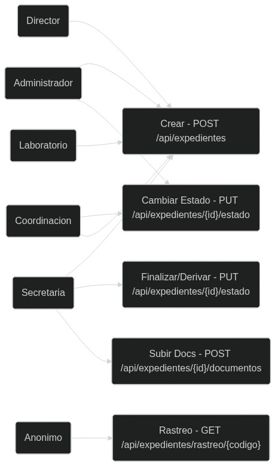
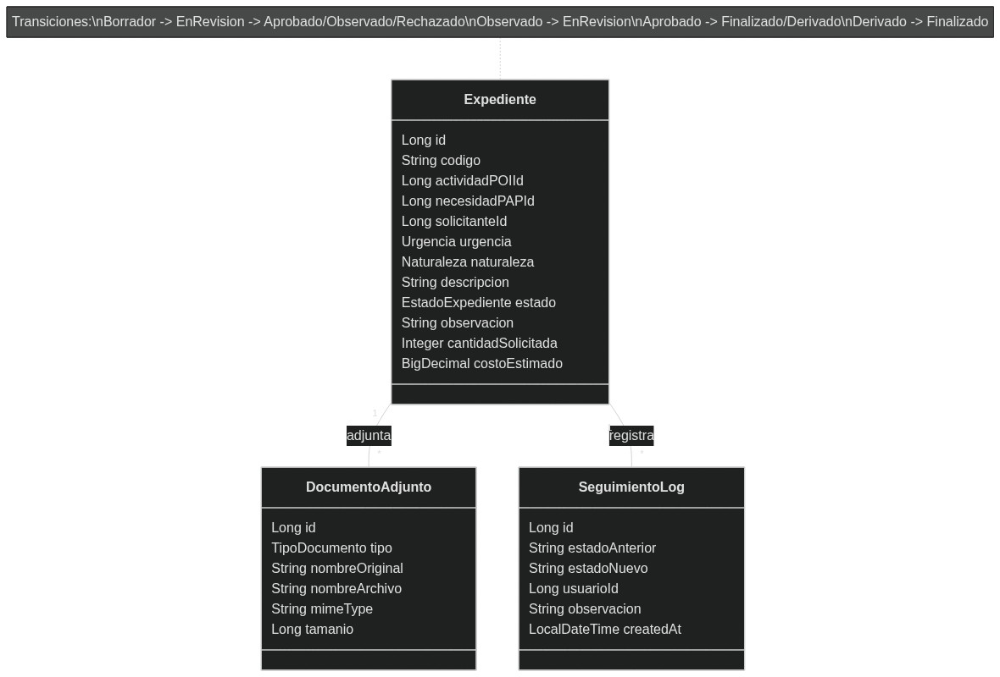
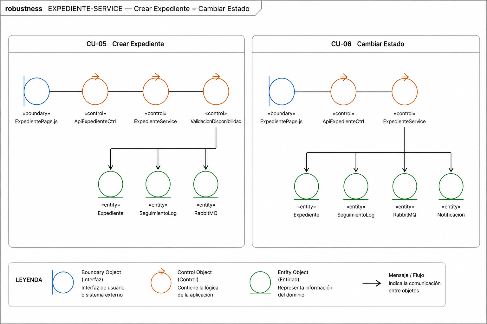
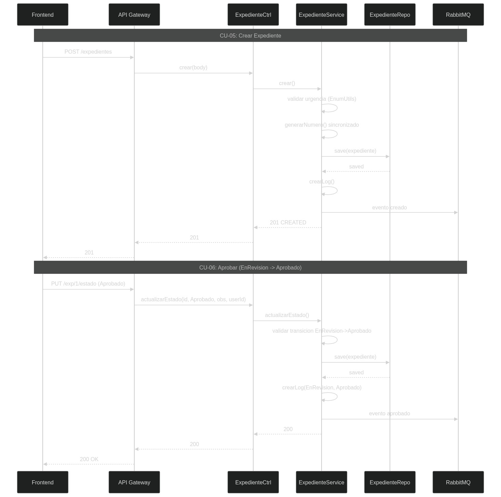
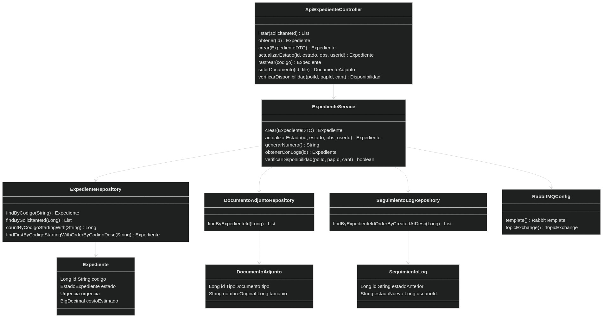

# **EXPEDIENTE-SERVICE (:8083)**

## **1. Descripcion**

Servicio de gestion de expedientes: creacion con validacion de disponibilidad, maquina de 7 estados, documentos adjuntos, seguimiento y publicacion de eventos a RabbitMQ.

| **Propiedad** | **Valor** |
|:--------------|:----------|
| Puerto | 8083 |
| Base de Datos | PostgreSQL `expediente_db` (:5435) |
| Bounded Context | Expedientes |
| Tecnologia | Spring Boot 3.4 + RabbitMQ + RestTemplate |
| Dependencias | Eureka Server, expediente-db, RabbitMQ, presupuesto-service |

---

## **2. Actores**

| **Actor** | **Acceso** |
|:----------|:-----------|
| Administrador, Coordinacion | Crear expedientes, aprobar/rechazar/observar |
| Secretaria | Crear expedientes, subir docs, finalizar/derivar |
| Director, Laboratorio | Crear expedientes, subir documentos |
| Anonimo | Rastrear expediente por codigo (sin autenticacion) |

---

## **3. ICONIX — Casos de Uso**



| **CU** | **Actor** | **Descripcion** | **Endpoint** |
|:-------|:----------|:----------------|:-------------|
| CU-12 Crear Expediente | Admin, Coord, Sec, Dir, Lab | Seleccionar techo→POI→PAP, validar saldo, generar codigo EXP-YYYY-NNNNN | `POST /api/expedientes` |
| CU-13 Cambiar Estado | Admin, Coord | Aprobar, rechazar, observar (7 estados, maquina de estados) | `PUT /api/expedientes/{id}/estado` |
| CU-14 Finalizar/Derivar | Admin, Coord, Sec | Finalizar o derivar expedientes aprobados | `PUT /api/expedientes/{id}/estado` |
| CU-15 Subir Documentos | Admin, Coord, Sec, Dir, Lab | Adjuntar TDR, cotizaciones, informes tecnicos | `POST /api/expedientes/{id}/documentos` |
| CU-16 Rastrear Expediente | Anonimo | Consultar estado por codigo publico (sin JWT) | `GET /api/expedientes/rastreo/{codigo}` |

---

## **4. ICONIX — Modelo del Dominio**



**Entidad Expediente (tabla: expedientes)**

| **Campo** | **Tipo** | **Restricciones** |
|:----------|:---------|:------------------|
| id | Long | PK |
| codigo | String(20) | NOT NULL, UNIQUE (EXP-YYYY-NNNNN) |
| actividadPOIId | Long | FK → actividades_poi (presupuesto-db) |
| necesidadPAPId | Long | FK → necesidades_pap (presupuesto-db) |
| solicitanteId | Long | FK → usuarios (auth-db) |
| urgencia | Urgencia (enum) | NOT NULL |
| naturaleza | Naturaleza (enum) | — |
| descripcion | TEXT | — |
| estado | EstadoExpediente (enum) | Default Borrador |
| observacion | TEXT | — |
| cantidadSolicitada | Integer | NOT NULL, default 1 |
| costoEstimado | BigDecimal(12,2) | NOT NULL |
| aprobadoPorId | Long | FK → usuarios (auth-db) |

**Entidad DocumentoAdjunto (tabla: documentos_adjuntos)**

| **Campo** | **Tipo** | **Restricciones** |
|:----------|:---------|:------------------|
| id | Long | PK |
| tipo | TipoDocumento (enum) | NOT NULL |
| nombreOriginal | String | NOT NULL |
| nombreArchivo | String | NOT NULL (UUID) |
| mimeType | String | — |
| tamanio | Long | — (soporta >2 GB) |

**Entidad SeguimientoLog (tabla: seguimiento_logs)**

| **Campo** | **Tipo** | **Restricciones** |
|:----------|:---------|:------------------|
| id | Long | PK |
| estadoAnterior | String | — |
| estadoNuevo | String | NOT NULL |
| usuarioId | Long | FK → usuarios (auth-db) |
| observacion | TEXT | — |
| createdAt | LocalDateTime | — |

**Maquina de Estados (7 estados):**

```
Borrador → EnRevision → {Aprobado, Rechazado, Observado}
Observado → EnRevision
Aprobado → {Finalizado, Derivado}
Derivado → Finalizado
```

**Enums:** EstadoExpediente (7 valores), Urgencia (Urgente, No_tan_urgente, Puede_esperar), TipoDocumento (TDR, Especificaciones_Tecnicas, Cotizacion, Informe_Tecnico)

---

## **5. ICONIX — Diagrama de Robustez**



**CU-12 Crear Expediente:**

```
Boundary: ExpedientePage.js (React Form, seleccion techo→POI→PAP)
  → Controller: ApiExpedienteController (POST /expedientes)
    → Service: ExpedienteService.crear()
      → validarDisponibilidad(poiId, papId, cantidad) via RestTemplate
        → generarNumero() sincronizado (countByCodigoStartingWith)
          → ExpedienteRepository.save(exp) → SeguimientoLog → RabbitMQ
            ← 201 CREATED
```

**CU-13 Cambiar Estado:**

```
Boundary: ExpedientePage.js (Botones: Aprobar, Rechazar, Observar)
  → Controller: ApiExpedienteController (PUT /{id}/estado)
    → Service: ExpedienteService.actualizarEstado()
      → EnumUtils.parseSafe(estadoNuevo) → validar TRANSICIONES map
        → exp.setEstado() → save → crearLog → RabbitMQ (evento)
          ← 200 OK
```

---

## **6. ICONIX — Diagrama de Secuencia**



**CU-12: Crear Expediente**

```
Frontend → POST /api/expedientes {actividadPOIId, necesidadPAPId, urgencia, ...}
  → ApiExpedienteController.crear(body)
    → ExpedienteService.crear()
      → validarDisponibilidad(poiId, papId, cantidad) → RestTemplate → presupuesto-service
        → generarNumero() → countByCodigoStartingWith("EXP-2026-") → "EXP-2026-00009"
          → save(Expediente) → crearLog(Borrador) → RabbitTemplate.convertAndSend(evento)
            ← 201 CREATED {codigo: "EXP-2026-00009"}
```

**CU-13: Aprobar Expediente (EnRevision → Aprobado)**

```
Frontend → PUT /api/expedientes/1/estado {estado:"Aprobado", observacion:"", usuarioId:1}
  → ApiExpedienteController.actualizarEstado(1, "Aprobado", "", 1)
    → ExpedienteService.actualizarEstado()
      → obtenerConLogs(1) → EnumUtils.parseSafe("Aprobado")
        → TRANSICIONES["EnRevision"].contains("Aprobado")? YES
          → exp.setEstado(Aprobado) → exp.setAprobadoPorId(1) → save(exp)
            → crearLog("EnRevision", "Aprobado") → RabbitMQ (evento aprobado)
              ← 200 OK → NotificacionService.consume() (async)
```

---

## **7. ICONIX — Diagrama de Clases**



| **Clase** | **Tipo** | **Metodos clave** |
|:----------|:---------|:------------------|
| ApiExpedienteController | @RestController | listar(), obtener(), crear(), actualizarEstado(), rastrear(), subirDocumento(), verificarDisponibilidad() |
| ExpedienteService | @Service | crear(), actualizarEstado(), generarNumero() sincronizado, obtenerConLogs(), verificarDisponibilidad() |
| ExpedienteRepository | JpaRepository | findByCodigo(), findBySolicitanteId(), countByCodigoStartingWith(), findFirstByCodigoStartingWithOrderByCodigoDesc() |
| DocumentoAdjuntoRepository | JpaRepository | findByExpedienteId() |
| SeguimientoLogRepository | JpaRepository | findByExpedienteIdOrderByCreatedAtDesc() |
| RabbitMQConfig | @Configuration | rabbitTemplate(), topicExchange() para publicar eventos |
| RestTemplateConfig | @Configuration | restTemplate() para llamar a presupuesto-service |
| GlobalExceptionHandler | @ControllerAdvice | Captura BusinessException→400, NoSuchElement→404 |
| DataInitializer | @Component | Seed 8 expedientes con 7 estados distintos + 6 logs |
| Expediente | @Entity | 16 campos, codigo UNIQUE con generacion sincronizada |
| DocumentoAdjunto | @Entity | 7 campos, tamanio Long para >2 GB |
| SeguimientoLog | @Entity | 6 campos, registro historico de transiciones de estado |

**Constante TRANSICIONES (Map<EstadoExpediente, Set<EstadoExpediente>>):**

| **De** | **A** |
|:-------|:------|
| Borrador | {EnRevision} |
| EnRevision | {Aprobado, Rechazado, Observado} |
| Observado | {EnRevision} |
| Aprobado | {Finalizado, Derivado} |
| Derivado | {Finalizado} |
| Rechazado | {} (terminal) |
| Finalizado | {} (terminal) |

---

## **8. Endpoints API**

| **Metodo** | **Ruta** | **Auth** | **Descripcion** |
|:-----------|:---------|:--------:|:----------------|
| GET | /api/expedientes | JWT | Listar expedientes (filtro opcional: ?solicitanteId=) |
| GET | /api/expedientes/{id} | JWT | Obtener expediente con documentos y logs |
| GET | /api/expedientes/rastreo/{codigo} | **No** | Rastreo publico por codigo EXP-YYYY-NNNNN |
| GET | /api/expedientes/disponibilidad/{poiId}/{papId} | JWT | Verificar saldo y fecha disponible |
| POST | /api/expedientes | JWT | Crear expediente (genera codigo automatico) |
| PUT | /api/expedientes/{id}/estado | JWT | Cambiar estado (validado contra TRANSICIONES) |
| POST | /api/expedientes/{id}/documentos | JWT | Subir documento adjunto (multipart) |

---

## **9. Dependencias**

| **Dependencia** | **Tipo** | **Detalle** |
|:----------------|:---------|:------------|
| Eureka Server | Registro | `eureka-server:8761` |
| expediente-db | Base de Datos | `postgres:16-alpine`, puerto 5435 |
| RabbitMQ | Mensajeria | `rabbitmq:5672`, user `sisexp` |
| presupuesto-service | REST | Via RestTemplate para validar disponibilidad |
| sisexp-common | JAR compartido | Enums, EnumUtils, BusinessException |

---

## **10. Configuracion**

| **Variable** | **Valor** | **Descripcion** |
|:-------------|:----------|:----------------|
| SPRING_DATASOURCE_URL | `jdbc:postgresql://expediente-db:5432/expediente_db` | Conexion a BD |
| SPRING_DATASOURCE_USERNAME | `postgres` | Usuario BD |
| SPRING_DATASOURCE_PASSWORD | `sisexp` | Password BD |
| SPRING_RABBITMQ_HOST | `rabbitmq` | Host RabbitMQ |
| SPRING_RABBITMQ_USERNAME | `sisexp` | Usuario RabbitMQ |
| SPRING_RABBITMQ_PASSWORD | `sisexp` | Password RabbitMQ |
| EUREKA_CLIENT_SERVICEURL_DEFAULTZONE | `http://eureka-server:8761/eureka` | Discovery |
| JWT_SECRET | `SisexpJwtSecret2026MicroservicesKey!` | Clave JJWT |
| EUREKA_INSTANCE_HOSTNAME | `heartfelt-wonder.railway.internal` | Railway |
| PRESUPUESTO_SERVICE_URL | `http://presupuesto-service:8082` | Docker/Railway |
| server.port | `8083` | Puerto HTTP |

---

<div style="text-align: center; margin-top: 40px; padding: 20px; border-top: 3px solid #1e3a5f;">

**SISEXP-UPLA** — EXPEDIENTE-SERVICE — Documentacion ICONIX

Universidad Peruana Los Andes — Arquitectura de Software — VIII Ciclo — Julio 2026

</div>
