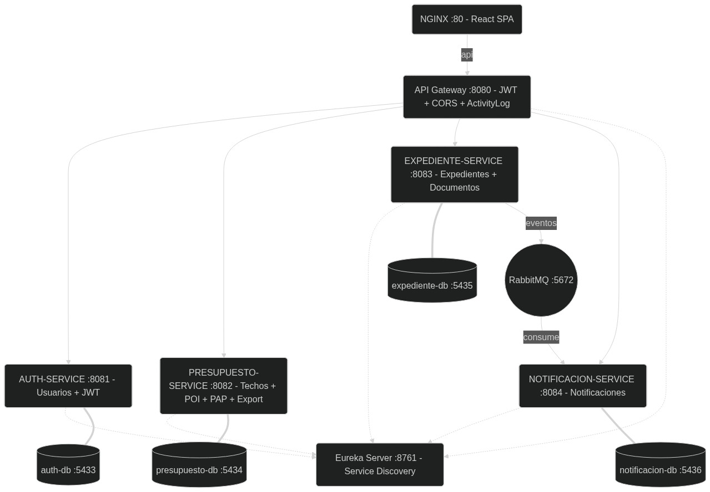
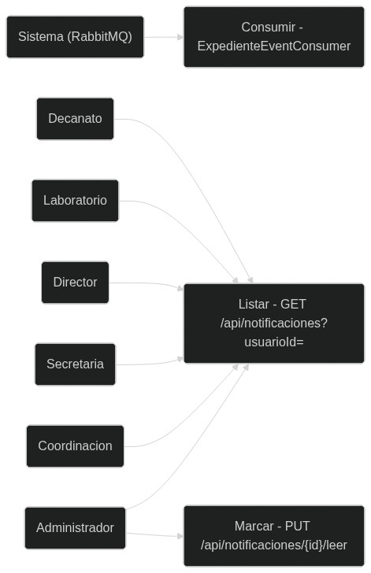
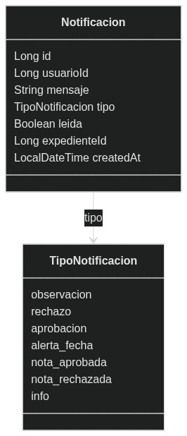
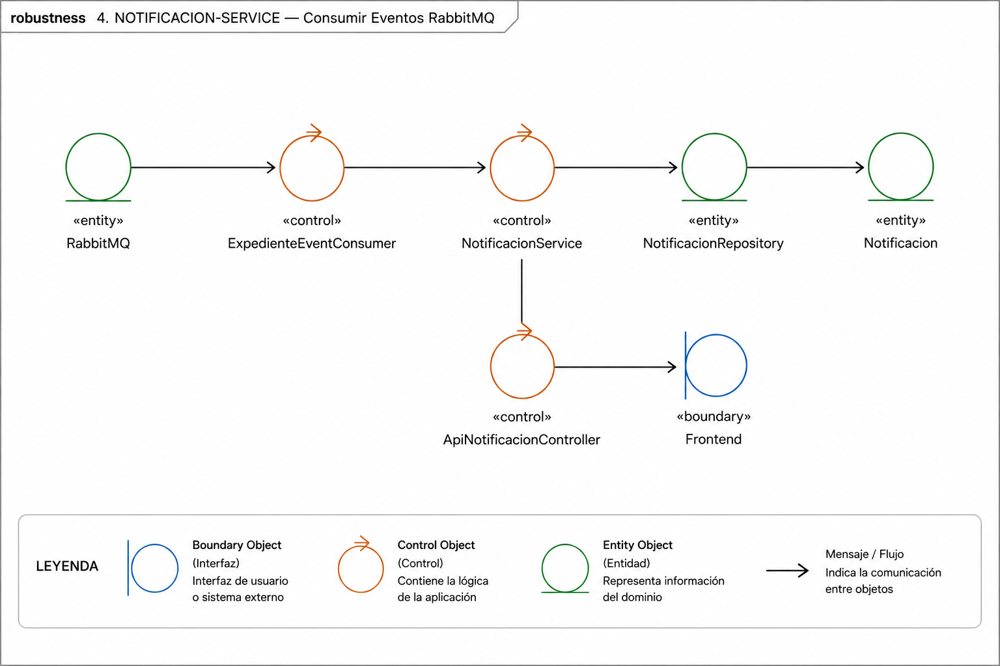
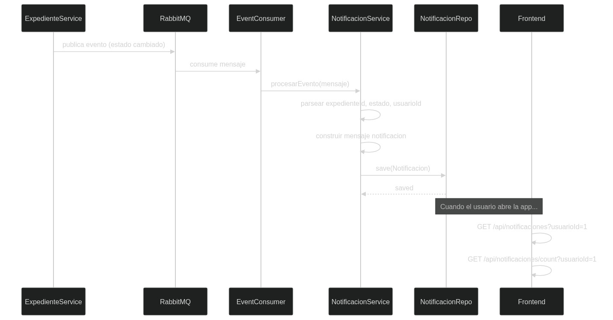
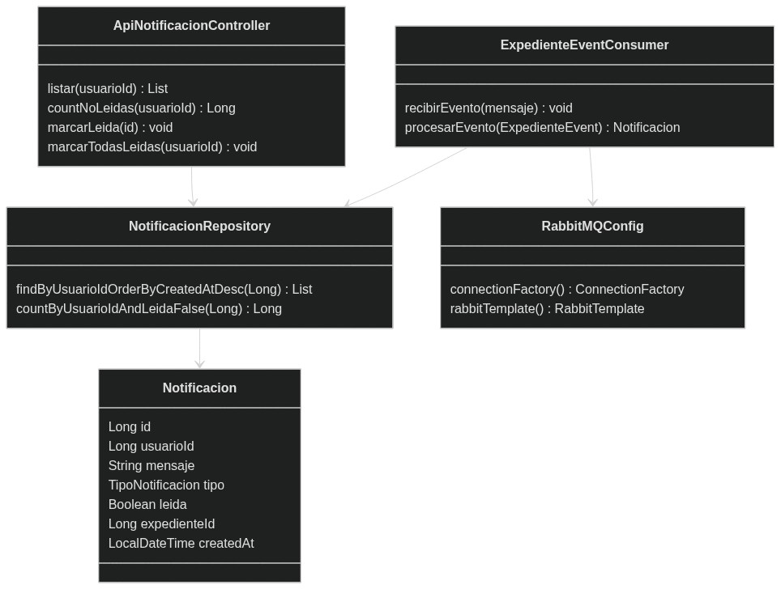

# **NOTIFICACION-SERVICE (:8084)**

## **1. Descripcion**

Servicio consumidor de eventos RabbitMQ que genera notificaciones automaticas sobre cambios en expedientes. Expone endpoints para consultar y marcar notificaciones como leidas.

| **Propiedad** | **Valor** |
|:--------------|:----------|
| Puerto | 8084 |
| Base de Datos | PostgreSQL `notific_db` (:5436) |
| Bounded Context | Notificaciones |
| Tecnologia | Spring Boot 3.4 + RabbitMQ (consumer) |
| Dependencias | Eureka Server, notificacion-db, RabbitMQ |

---

## **2. Actores**

| **Actor** | **Acceso** |
|:----------|:-----------|
| Sistema (RabbitMQ) | Publica eventos que el consumer procesa automaticamente |
| Administrador, Coordinacion, Secretaria | Consultan y marcan notificaciones como leidas |
| Director, Laboratorio, Decanato | Consultan sus notificaciones |

---

## **3. ICONIX — Casos de Uso**



| **CU** | **Actor** | **Descripcion** | **Endpoint** |
|:-------|:----------|:----------------|:-------------|
| CU-17 Recibir Notificaciones | Sistema (RabbitMQ) | Consumir eventos de expediente, generar notificacion | @RabbitListener |
| CU-18 Consultar Notificaciones | Todos | Listar notificaciones del usuario autenticado | `GET /api/notificaciones?usuarioId=` |
| CU-19 Contar No Leidas | Todos | Obtener contador de notificaciones sin leer | `GET /api/notificaciones/count?usuarioId=` |
| CU-20 Marcar Leidas | Todos | Marcar una o todas las notificaciones como leidas | `PUT /api/notificaciones/{id}/leer`, `PUT .../leer-todas` |

---

## **4. ICONIX — Modelo del Dominio**



**Entidad unica: Notificacion (tabla: notificaciones)**

| **Campo** | **Tipo** | **Restricciones** |
|:----------|:---------|:------------------|
| id | Long | PK |
| usuarioId | Long | FK → usuarios (auth-db) |
| mensaje | TEXT | NOT NULL |
| tipo | TipoNotificacion (enum) | — |
| leida | Boolean | NOT NULL, default false |
| expedienteId | Long | FK → expedientes (expediente-db) |
| createdAt | LocalDateTime | @PrePersist |

**Enum TipoNotificacion:** observacion, rechazo, aprobacion, alerta_fecha, nota_aprobada, nota_rechazada, info

**Flujo de creacion:**
```
ExpedienteService (expediente-service)
  → RabbitMQ (evento: EXPEDIENTE_CREADO / ESTADO_CAMBIADO)
    → ExpedienteEventConsumer.recibirEvento(mensaje)
      → procesarEvento() → new Notificacion(usuarioId, mensaje, tipo)
        → NotificacionRepository.save(notificacion)
```

---

## **5. ICONIX — Diagrama de Robustez**



**Consumir Eventos y Generar Notificaciones:**

```
Evento RabbitMQ (expediente creado/cambiado/rechazado)
  → Boundary: @RabbitListener (ExpedienteEventConsumer)
    → Controller: NotificacionService.procesarEvento()
      → Repository: NotificacionRepository.save(Notificacion)
        → Entity: Notificacion (usuarioId, mensaje, tipo, leida=false)

Consulta de notificaciones:
  Frontend (campana en Header)
    → Controller: ApiNotificacionController.listar(usuarioId)
      → Repository: NotificacionRepository.findByUsuarioIdOrderByCreatedAtDesc()
        ← List<Notificacion>
```

---

## **6. ICONIX — Diagrama de Secuencia**



**Flujo completo: Expediente → RabbitMQ → Notificacion → Frontend**

```
ExpedienteService.aprobarExpediente()
  → RabbitTemplate.convertAndSend("expediente.cambiado", evento)
    → RabbitMQ (exchange: sisexp.exchange)
      → ExpedienteEventConsumer.recibirEvento(mensaje) (@RabbitListener)
        → procesarEvento(ExpedienteEvent)
          → construir mensaje: "jefe@upla.edu.pe aprobo EXP-2026-005"
            → new Notificacion(usuarioId=1, mensaje, tipo=APROBACION_ESTADO)
              → NotificacionRepository.save(notificacion) → leida=false

Frontend (cada 30s):
  → GET /api/notificaciones/count?usuarioId=1
    ← {count: 3}
      → Muestra badge "3" en campana del Header

  → GET /api/notificaciones?usuarioId=1
    ← [{id:1, mensaje:"...", tipo:"aprobacion", leida:false}, ...]
      → Dropdown con lista de notificaciones

Usuario clickea "Marcar todas leidas":
  → PUT /api/notificaciones/leer-todas?usuarioId=1
    → UPDATE notificaciones SET leida=true WHERE usuario_id=1
      ← 200 OK
```

---

## **7. ICONIX — Diagrama de Clases**



| **Clase** | **Tipo** | **Metodos clave** |
|:----------|:---------|:------------------|
| ApiNotificacionController | @RestController | listar(usuarioId), countNoLeidas(usuarioId), marcarLeida(id), marcarTodasLeidas(usuarioId) |
| ExpedienteEventConsumer | @Component | recibirEvento(String mensaje) con @RabbitListener, procesarEvento() |
| NotificacionRepository | JpaRepository | findByUsuarioIdOrderByCreatedAtDesc(Long), countByUsuarioIdAndLeidaFalse(Long) |
| RabbitMQConfig | @Configuration | connectionFactory(), rabbitTemplate(), messageConverter() |
| GlobalExceptionHandler | @ControllerAdvice | Captura excepciones → HTTP codes |
| Notificacion | @Entity | 7 campos, creado exclusivamente por eventos async |

---

## **8. Endpoints API**

| **Metodo** | **Ruta** | **Auth** | **Descripcion** |
|:-----------|:---------|:--------:|:----------------|
| GET | /api/notificaciones?usuarioId= | JWT | Listar notificaciones del usuario |
| GET | /api/notificaciones/count?usuarioId= | JWT | Contar notificaciones no leidas |
| PUT | /api/notificaciones/{id}/leer | JWT | Marcar una como leida |
| PUT | /api/notificaciones/leer-todas?usuarioId= | JWT | Marcar todas como leidas |

---

## **9. Dependencias**

| **Dependencia** | **Tipo** | **Detalle** |
|:----------------|:---------|:------------|
| Eureka Server | Registro | `eureka-server:8761` |
| notificacion-db | Base de Datos | `postgres:16-alpine`, puerto 5436 |
| RabbitMQ | Mensajeria | `rabbitmq:5672`, consumer vinculado a `sisexp.exchange` |
| sisexp-common | JAR compartido | Enums, BusinessException |

---

## **10. Configuracion**

| **Variable** | **Valor** | **Descripcion** |
|:-------------|:----------|:----------------|
| SPRING_DATASOURCE_URL | `jdbc:postgresql://notificacion-db:5432/notific_db` | Conexion a BD |
| SPRING_DATASOURCE_USERNAME | `postgres` | Usuario BD |
| SPRING_DATASOURCE_PASSWORD | `sisexp` | Password BD |
| SPRING_RABBITMQ_HOST | `rabbitmq` | Host RabbitMQ |
| SPRING_RABBITMQ_USERNAME | `sisexp` | Usuario RabbitMQ |
| SPRING_RABBITMQ_PASSWORD | `sisexp` | Password RabbitMQ |
| EUREKA_CLIENT_SERVICEURL_DEFAULTZONE | `http://eureka-server:8761/eureka` | Discovery |
| JWT_SECRET | `SisexpJwtSecret2026MicroservicesKey!` | Clave JJWT |
| EUREKA_INSTANCE_HOSTNAME | `notificacion-service.railway.internal` | Railway |
| server.port | `8084` | Puerto HTTP |

---

<div style="text-align: center; margin-top: 40px; padding: 20px; border-top: 3px solid #1e3a5f;">

**SISEXP-UPLA** — NOTIFICACION-SERVICE — Documentacion ICONIX

Universidad Peruana Los Andes — Arquitectura de Software — VIII Ciclo — Julio 2026

</div>
