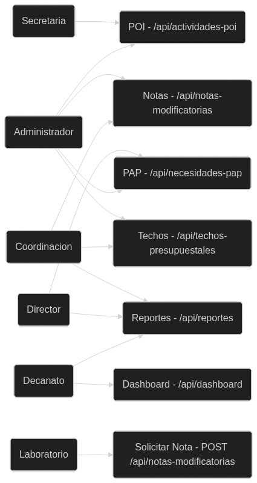
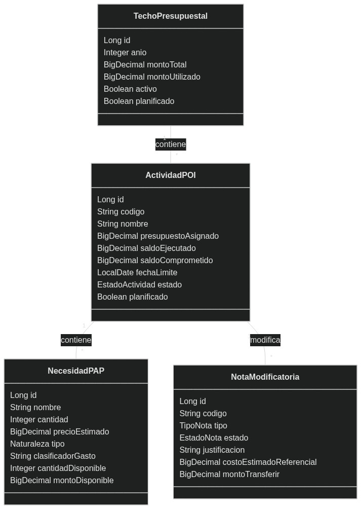
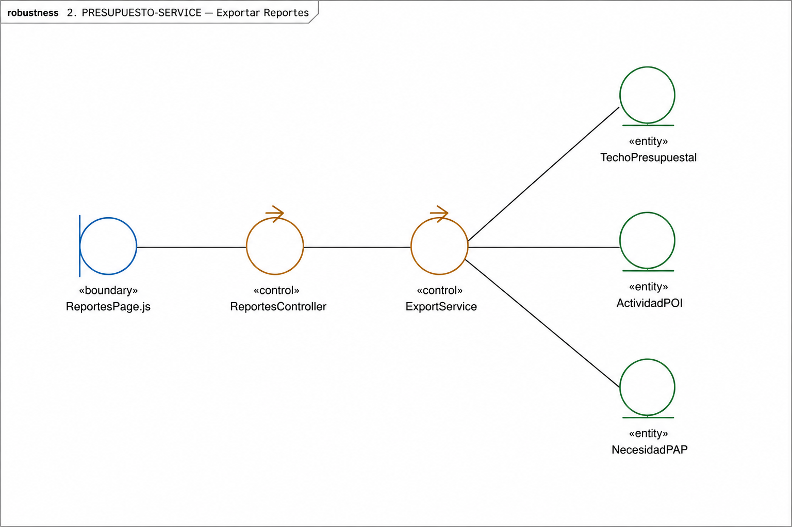
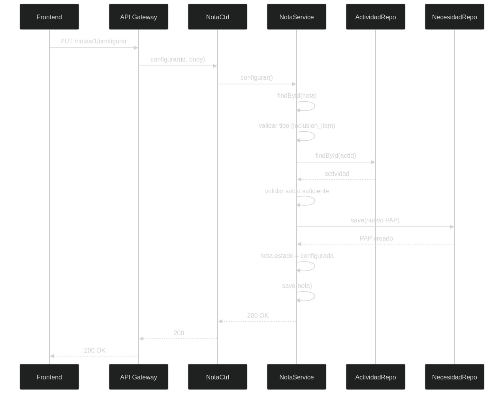
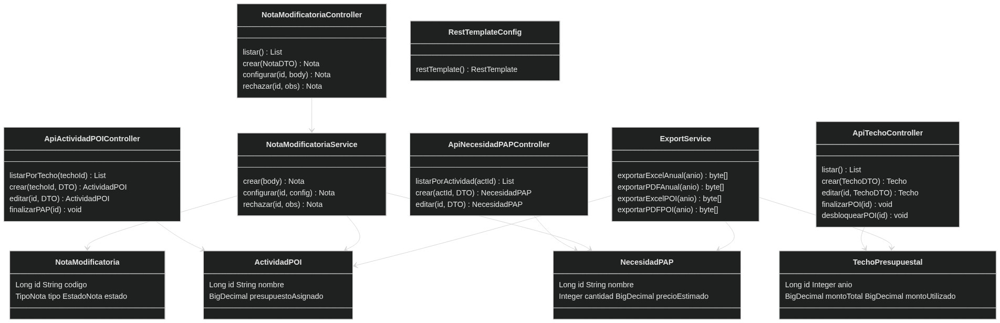

# **PRESUPUESTO-SERVICE (:8082)**

## **1. Descripcion**

Servicio de gestion presupuestal: techos, actividades POI, necesidades PAP, notas modificatorias, dashboard de alertas y exportacion de reportes a Excel/PDF.

| **Propiedad** | **Valor** |
|:--------------|:----------|
| Puerto | 8082 |
| Base de Datos | PostgreSQL `presupuesto_db` (:5434) |
| Bounded Context | Presupuesto |
| Tecnologia | Spring Boot 3.4 + Apache POI 5.2.5 + RestTemplate |
| Dependencias | Eureka Server, presupuesto-db, expediente-service (via RestTemplate) |

---

## **2. Actores**

| **Actor** | **Acceso** |
|:----------|:-----------|
| Administrador | CRUD techos, POI, PAP, notas, reportes, dashboard |
| Coordinacion | CRUD techos, POI, PAP, notas, reportes, dashboard |
| Secretaria | CRUD techos, POI, PAP, dashboard |
| Director | CRUD techos, POI, PAP, solicitar notas, reportes |
| Laboratorio | POI, PAP, solicitar notas modificatorias |
| Decanato | Dashboard, reportes, consulta PAP |

---

## **3. ICONIX — Casos de Uso**



| **CU** | **Actor** | **Descripcion** | **Endpoint** |
|:-------|:----------|:----------------|:-------------|
| CU-05 Gestionar Techos | Admin, Coord, Sec, Dir | CRUD de techos por ano, finalizar/desbloquear POI | `/api/techos-presupuestales` |
| CU-06 Gestionar POI | Admin, Coord, Sec, Dir, Lab | CRUD de actividades, asignar presupuesto, finalizar PAP | `/api/actividades-poi` |
| CU-07 Gestionar PAP | Todos | CRUD de necesidades, cantidades, montos, clasificadores | `/api/necesidades-pap` |
| CU-08 Solicitar Nota | Lab, Director | Crear nota modificatoria con archivo adjunto | `POST /api/notas-modificatorias` |
| CU-09 Configurar/Rechazar Nota | Admin, Coord | Aprobar o rechazar notas, ejecutar cambios | `PUT /api/notas-modificatorias/{id}/configurar` |
| CU-10 Dashboard | Todos | KPIs presupuestales con semaforo rojo/amarillo/verde | `/api/dashboard/alertas` |
| CU-11 Exportar Reportes | Admin, Coord, Dir, Dec | Excel (Apache POI) y PDF con marca de agua UPLA | `/api/reportes/**/excel`, `/pdf` |

---

## **4. ICONIX — Modelo del Dominio**



**Jerarquia:** TechoPresupuestal → ActividadPOI → NecesidadPAP

**Entidad TechoPresupuestal (tabla: techos_presupuestales)**

| **Campo** | **Tipo** | **Restricciones** |
|:----------|:---------|:------------------|
| id | Long | PK |
| anio | Integer | NOT NULL |
| montoTotal | BigDecimal(12,2) | NOT NULL |
| montoUtilizado | BigDecimal(12,2) | NOT NULL |
| activo | Boolean | NOT NULL, default true |
| planificado | Boolean | NOT NULL, default false |

**Entidad ActividadPOI (tabla: actividades_poi)**

| **Campo** | **Tipo** | **Restricciones** |
|:----------|:---------|:------------------|
| id | Long | PK |
| codigo | String(20) | NOT NULL |
| nombre | String(255) | NOT NULL |
| presupuestoAsignado | BigDecimal(12,2) | NOT NULL |
| saldoEjecutado | BigDecimal(12,2) | NOT NULL |
| saldoComprometido | BigDecimal(12,2) | NOT NULL |
| fechaLimite | LocalDate | — |
| estado | EstadoActividad (enum) | Default Pendiente |
| planificado | Boolean | NOT NULL, default false |
| techoPresupuestalId | Long | FK → techos_presupuestales |

**Entidad NecesidadPAP (tabla: necesidades_pap)**

| **Campo** | **Tipo** | **Restricciones** |
|:----------|:---------|:------------------|
| id | Long | PK |
| nombre | String(255) | NOT NULL |
| cantidad | Integer | NOT NULL, default 1 |
| precioEstimado | BigDecimal(10,2) | NOT NULL |
| tipo | Naturaleza (enum) | — |
| clasificadorGasto | String | — |
| cantidadDisponible | Integer | NOT NULL, default 0 |
| montoDisponible | BigDecimal(12,2) | NOT NULL |
| actividadPOIId | Long | FK → actividades_poi |

**Entidad NotaModificatoria (tabla: notas_modificatorias)**

| **Campo** | **Tipo** | **Restricciones** |
|:----------|:---------|:------------------|
| id | Long | PK |
| codigo | String(30) | NOT NULL |
| tipo | TipoNota (enum) | NOT NULL |
| estado | EstadoNota (enum) | Default pendiente |
| justificacion | TEXT | NOT NULL |
| costoEstimadoReferencial | BigDecimal(12,2) | NOT NULL |
| montoTransferir | BigDecimal(12,2) | — |
| archivoAdjunto | BYTEA | PDF adjunto |

**Enums:** EstadoActividad (Pendiente, En_progreso, Finalizada, Cerrado), EstadoNota (pendiente, configurada, rechazada), TipoNota (inclusion_item, inclusion_actividad), Naturaleza (Bien, Servicio)

---

## **5. ICONIX — Diagrama de Robustez**



**CU-09: Exportar Reportes**

```
Boundary: ReportesPage.js (Boton Exportar Excel/PDF)
  → Controller: ReportesController (GET /api/reportes/**/excel, /pdf)
    → Service: ExportService (Apache POI 5.2.5, PDF HTML)
      → Entity: TechoPresupuestal, ActividadPOI, NecesidadPAP
        ← Response: application/octet-stream (Excel) o text/html (PDF)
```

---

## **6. ICONIX — Diagrama de Secuencia**



**CU-08: Configurar Nota Modificatoria**

```
Frontend → PUT /api/notas-modificatorias/1/configurar {monto:5000}
  → NotaModificatoriaController.configurar(id, body)
    → NotaModificatoriaService.configurar()
      → findById(nota) → validar tipo (inclusion_item / inclusion_actividad)
        → ActividadPOIRepository.findById(actId) → validar saldo suficiente
          → NecesidadPAPRepository.save(nuevo item PAP)
            → nota.estado = configurada → save(nota)
              ← 200 OK
```

---

## **7. ICONIX — Diagrama de Clases**



| **Clase** | **Tipo** | **Metodos clave** |
|:----------|:---------|:------------------|
| ApiTechoPresupuestalController | @RestController | listar(), crear(), editar(), finalizarPOI(), desbloquearPOI() |
| ApiActividadPOIController | @RestController | listarPorTecho(), crear(), editar(), finalizarPAP() |
| ApiNecesidadPAPController | @RestController | listarPorActividad(), crear(), editar() |
| NotaModificatoriaController | @RestController | listar(), crear(), configurar(), rechazar() |
| DashboardController | @RestController | alertas(), saldos() |
| ReportesController | @RestController | informeAnual(), informePOI(), informePAP(), informeExpedientes() y sus exportaciones Excel/PDF |
| ExportService | @Service | exportarExcelAnual(), exportarPDFAnual(), exportarExcelPOI(), exportarExcelPAP() |
| NotaModificatoriaService | @Service | crear(), configurar(), rechazar() |
| RestTemplateConfig | @Configuration | restTemplate() para llamar a expediente-service |
| GlobalExceptionHandler | @ControllerAdvice | Captura BusinessException→400, NoSuchElement→404, DataIntegrity→409 |
| DataInitializer | @Component | Seed 5 techos (2022-2026), 20 POI, 80 PAP, 4 notas |
| TechoPresupuestalRepository | JpaRepository | findByAnio(Integer) |
| ActividadPOIRepository | JpaRepository | findByTechoPresupuestalId(Long) |
| NecesidadPAPRepository | JpaRepository | findByActividadPOIId(Long) |
| NotaModificatoriaRepository | JpaRepository | countByEstado(), findByEstadoOrderByCreatedAtDesc() |

---

## **8. Endpoints API**

| **Metodo** | **Ruta** | **Auth** | **Descripcion** |
|:-----------|:---------|:--------:|:----------------|
| GET | /api/techos-presupuestales | JWT | Listar techos (por anio descendente) |
| POST | /api/techos-presupuestales | JWT | Crear techo |
| PUT | /api/techos-presupuestales/{id} | JWT | Editar techo |
| PATCH | /api/techos-presupuestales/{id}/toggle-activo | JWT | Activar/desactivar |
| POST | /api/techos-presupuestales/{id}/finalizar-poi | JWT | Planificar POI (bloquear) |
| POST | /api/techos-presupuestales/{id}/desbloquear-poi | JWT | Desbloquear POI |
| GET | /api/actividades-poi/techo/{id} | JWT | Listar POI por techo |
| POST | /api/actividades-poi/techo/{id} | JWT | Crear actividad |
| PUT | /api/actividades-poi/{id} | JWT | Editar actividad |
| DELETE | /api/actividades-poi/{id} | JWT | Eliminar actividad |
| POST | /api/actividades-poi/{id}/finalizar-pap | JWT | Finalizar PAP |
| GET | /api/necesidades-pap/actividad/{id} | JWT | Listar PAP por actividad |
| POST | /api/necesidades-pap/actividad/{id} | JWT | Crear necesidad |
| PUT | /api/necesidades-pap/{id} | JWT | Editar necesidad |
| GET | /api/notas-modificatorias | JWT | Listar notas (enriquecidas) |
| POST | /api/notas-modificatorias | JWT | Crear nota (multipart) |
| PUT | /api/notas-modificatorias/{id}/configurar | JWT | Configurar/aprobar nota |
| PUT | /api/notas-modificatorias/{id}/rechazar | JWT | Rechazar nota |
| GET | /api/dashboard/alertas | JWT | KPIs con semaforo |
| GET | /api/dashboard/saldos | JWT | Saldos presupuestales |
| GET | /api/reportes/anual/{anio} | JWT | Reporte anual |
| GET | /api/reportes/anual/{anio}/excel | JWT | Exportar Excel anual |
| GET | /api/reportes/anual/{anio}/pdf | JWT | Exportar PDF anual |

---

## **9. Dependencias**

| **Dependencia** | **Tipo** | **Detalle** |
|:----------------|:---------|:------------|
| Eureka Server | Registro | `eureka-server:8761` |
| presupuesto-db | Base de Datos | `postgres:16-alpine`, puerto 5434 |
| expediente-service | REST | Via RestTemplate para dashboard (conteo expedientes) |
| sisexp-common | JAR compartido | Enums, EnumUtils, BusinessException |

---

## **10. Configuracion**

| **Variable** | **Valor** | **Descripcion** |
|:-------------|:----------|:----------------|
| SPRING_DATASOURCE_URL | `jdbc:postgresql://presupuesto-db:5432/presupuesto_db` | Conexion a BD |
| SPRING_DATASOURCE_USERNAME | `postgres` | Usuario BD |
| SPRING_DATASOURCE_PASSWORD | `sisexp` | Password BD |
| EUREKA_CLIENT_SERVICEURL_DEFAULTZONE | `http://eureka-server:8761/eureka` | Discovery |
| JWT_SECRET | `SisexpJwtSecret2026MicroservicesKey!` | Clave JJWT |
| EUREKA_INSTANCE_HOSTNAME | `presupuesto-service.railway.internal` | Railway |
| PRESUPUESTO_SERVICE_URL (expediente) | `http://presupuesto-service:8082` | Interno |
| server.port | `8082` | Puerto HTTP |

---

<div style="text-align: center; margin-top: 40px; padding: 20px; border-top: 3px solid #1e3a5f;">

**SISEXP-UPLA** — PRESUPUESTO-SERVICE — Documentacion ICONIX

Universidad Peruana Los Andes — Arquitectura de Software — VIII Ciclo — Julio 2026

</div>
