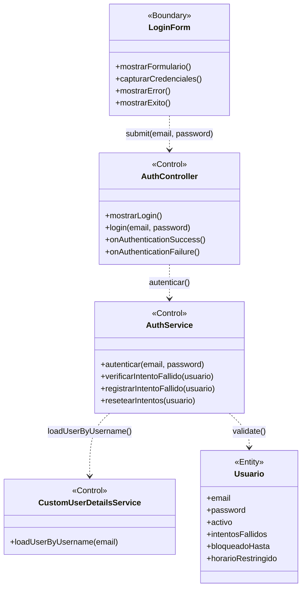

# BCE-CU01: Iniciar Sesión

## Identificación

| Campo | Valor |
|-------|-------|
| **ID** | BCE-CU01 |
| **Caso de Uso** | CU01: Iniciar Sesión |
| **Diagram Type** | UML Class Diagram con estereotipos |
| **Actores** | Usuario (Administrador, Coordinacion, Secretaria, Director, Laboratorio, Decanato) |

## Objetos involucrados

| Tipo | Nombre | Descripción |
|:----:|:------|:------------|
| `<<Boundary>>` | LoginForm | Formulario de login (Thymeleaf: `login.html`) |
| `<<Control>>` | AuthController | `AuthController.java` — maneja GET `/login` y POST `/login` |
| `<<Control>>` | AuthService | `AuthService.java` — autentica credenciales vía Spring Security |
| `<<Control>>` | CustomUserDetailsService | `CustomUserDetailsService.java` — carga usuario desde BD |
| `<<Entity>>` | Usuario | Entidad JPA con email, password, activo, intentosFallidos |

## Dependencias

| Origen | Destino | Descripción |
|:------|:--------|:------------|
| LoginForm | AuthController | Envío de credenciales (submit) |
| AuthController | AuthService | Delegación de autenticación |
| AuthService | CustomUserDetailsService | Carga de usuario por email |
| AuthService | Usuario | Validación de credenciales y estado del usuario |

## Diagrama Mermaid

## Instrucciones para StarUML

1. Crear un nuevo `UMLClassDiagram` con nombre "BCE-CU01-IniciarSesion"
2. Crear 1 clase `<<Boundary>>`: **LoginForm** (color azul claro `#D4E6F1`)
3. Crear 3 clases `<<Control>>`: **AuthController**, **AuthService**, **CustomUserDetailsService** (color amarillo `#F9E79F`)
4. Crear 1 clase `<<Entity>>`: **Usuario** (color verde claro `#D5F5E3`)
5. Agregar atributos y métodos según la especificación de cada clase
6. Crear asociaciones dirigidas (flecha simple):
   - `LoginForm` → `AuthController`
   - `AuthController` → `AuthService`
   - `AuthService` → `CustomUserDetailsService`
   - `AuthService` → `Usuario`
7. Verificar que ninguna Entity se conecta directamente a una Boundary
