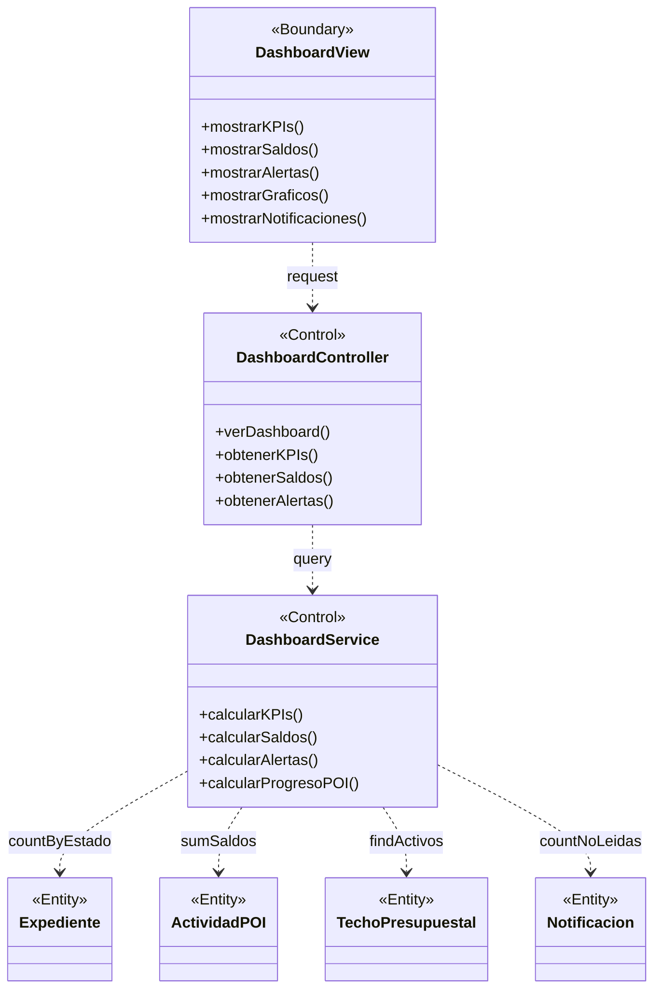

# BCE-CU02: Ver Dashboard

## Identificación

| Campo | Valor |
|-------|-------|
| **ID** | BCE-CU02 |
| **Caso de Uso** | CU02: Ver Dashboard |
| **Diagram Type** | UML Class Diagram con estereotipos |
| **Actores** | Usuario autenticado (cualquier rol) |

## Objetos involucrados

| Tipo | Nombre | Descripción |
|:----:|:------|:------------|
| `<<Boundary>>` | DashboardView | Página principal del dashboard (Thymeleaf: `dashboard.html`) |
| `<<Control>>` | DashboardController | `DashboardController.java` — endpoints de KPIs y saldos |
| `<<Control>>` | DashboardService | `DashboardService.java` — cálculos de KPIs, alertas y saldos |
| `<<Entity>>` | Expediente | Entidad para conteos por estado y detección de vencidos |
| `<<Entity>>` | ActividadPOI | Entidad para sumarizar saldos presupuestales |
| `<<Entity>>` | TechoPresupuestal | Entidad para mostrar el techo anual |
| `<<Entity>>` | Notificacion | Entidad para contar no-leídas del usuario |

## Dependencias

| Origen | Destino | Descripción |
|:------|:--------|:------------|
| DashboardView | DashboardController | Solicitud de KPIs del dashboard |
| DashboardController | DashboardService | Consulta de datos agregados |
| DashboardService | Expediente | Conteo por estado, detección de vencidos |
| DashboardService | ActividadPOI | Suma de presupuestos y saldos |
| DashboardService | TechoPresupuestal | Consulta de techos activos |
| DashboardService | Notificacion | Conteo de notificaciones no leídas |

## Diagrama Mermaid

## Instrucciones para StarUML

1. Crear `UMLClassDiagram` "BCE-CU02-VerDashboard"
2. Crear 1 `<<Boundary>>`: **DashboardView** (azul claro)
3. Crear 2 `<<Control>>`: **DashboardController**, **DashboardService** (amarillo)
4. Crear 4 `<<Entity>>`: **Expediente**, **ActividadPOI**, **TechoPresupuestal**, **Notificacion** (verde claro)
5. Asociaciones dirigidas: DashboardView → DashboardController, DashboardController → DashboardService, DashboardService → cada Entity
