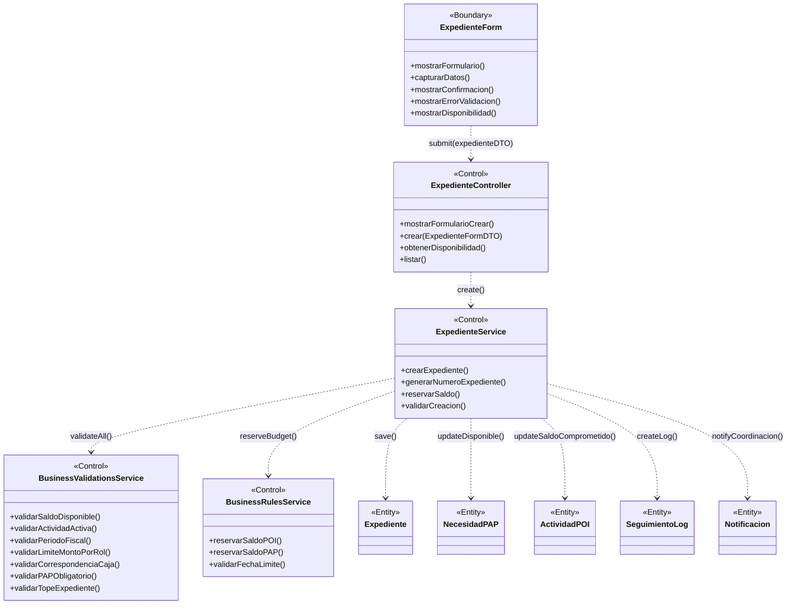

# BCE-CU03: Crear Expediente

## Identificación

| Campo | Valor |
|-------|-------|
| **ID** | BCE-CU03 |
| **Caso de Uso** | CU03: Crear Expediente |
| **Diagram Type** | UML Class Diagram con estereotipos |
| **Actores** | Laboratorio, Secretaria, Director, Coordinacion, Administrador |

## Objetos involucrados

| Tipo | Nombre | Descripción |
|:----:|:------|:------------|
| `<<Boundary>>` | ExpedienteForm | Formulario de creación de expediente (Thymeleaf) |
| `<<Control>>` | ExpedienteController | `ExpedienteController.java` — recibe datos, genera código |
| `<<Control>>` | ExpedienteService | `ExpedienteService.java` — lógica de creación y reserva de saldo |
| `<<Control>>` | BusinessValidationsService | Validaciones: fecha límite, saldo, período fiscal, documento |
| `<<Control>>` | BusinessRulesService | Reglas: reservar/liberar saldo en POI y PAP |
| `<<Entity>>` | Expediente | Nuevo expediente a persistir |
| `<<Entity>>` | NecesidadPAP | Necesidad asociada (actualiza saldos) |
| `<<Entity>>` | ActividadPOI | Actividad asociada (actualiza saldos) |
| `<<Entity>>` | SeguimientoLog | Log de creación |
| `<<Entity>>` | Notificacion | Notificación a coordinación |

## Dependencias

| Origen | Destino | Descripción |
|:------|:--------|:------------|
| ExpedienteForm | ExpedienteController | Submit del formulario con datos del expediente |
| ExpedienteController | ExpedienteService | Delegación de creación |
| ExpedienteService | BusinessValidationsService | Validación de reglas de negocio |
| ExpedienteService | BusinessRulesService | Aplicación de reglas presupuestales |
| ExpedienteService | Expediente | Persistencia del nuevo expediente |
| ExpedienteService | NecesidadPAP | Reserva de saldo en PAP |
| ExpedienteService | ActividadPOI | Reserva de saldo en POI |
| ExpedienteService | SeguimientoLog | Creación de log de seguimiento |
| ExpedienteService | Notificacion | Creación de notificación |

## Diagrama Mermaid

## Instrucciones para StarUML

1. Crear `UMLClassDiagram` "BCE-CU03-CrearExpediente"
2. Crear 1 `<<Boundary>>`: **ExpedienteForm** (azul claro)
3. Crear 4 `<<Control>>`: **ExpedienteController**, **ExpedienteService**, **BusinessValidationsService**, **BusinessRulesService** (amarillo)
4. Crear 5 `<<Entity>>`: **Expediente**, **NecesidadPAP**, **ActividadPOI**, **SeguimientoLog**, **Notificacion** (verde claro)
5. Asociaciones dirigidas desde Boundary → Control → Entity
