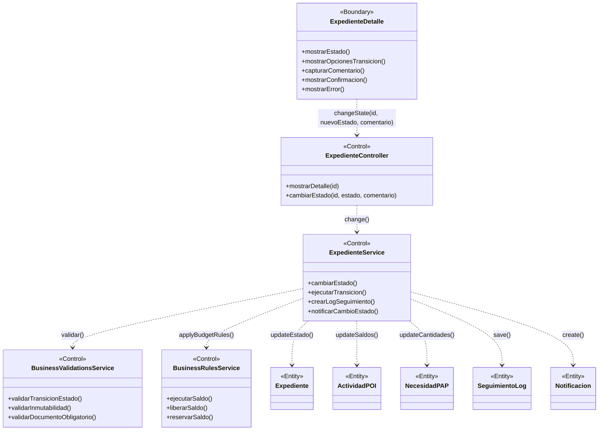

# BCE-CU04: Cambiar Estado Expediente

## Identificación

| Campo | Valor |
|-------|-------|
| **ID** | BCE-CU04 |
| **Caso de Uso** | CU04: Cambiar Estado Expediente |
| **Diagram Type** | UML Class Diagram con estereotipos |
| **Actores** | Coordinacion, Secretaria, Administrador (según transición) |

## Objetos involucrados

| Tipo | Nombre | Descripción |
|:----:|:------|:------------|
| `<<Boundary>>` | ExpedienteDetalle | Página de detalle del expediente con opciones de transición |
| `<<Control>>` | ExpedienteController | `ExpedienteController.java` — endpoint de cambio de estado |
| `<<Control>>` | ExpedienteService | `ExpedienteService.java` — lógica de transición |
| `<<Control>>` | BusinessValidationsService | Validaciones de inmutabilidad y reglas de transición |
| `<<Control>>` | BusinessRulesService | Reglas: ejecutar, liberar o reservar saldo según transición |
| `<<Entity>>` | Expediente | Expediente a actualizar (nuevo estado) |
| `<<Entity>>` | ActividadPOI | Actualización de saldos (comprometido, ejecutado) |
| `<<Entity>>` | NecesidadPAP | Actualización de saldos (disponible, ejecutado) |
| `<<Entity>>` | SeguimientoLog | Registro del cambio de estado |
| `<<Entity>>` | Notificacion | Notificación al solicitante |

## Dependencias

| Origen | Destino | Descripción |
|:------|:--------|:------------|
| ExpedienteDetalle | ExpedienteController | Solicitud de cambio de estado |
| ExpedienteController | ExpedienteService | Delegación del cambio |
| ExpedienteService | BusinessValidationsService | Validar transición permitida |
| ExpedienteService | BusinessRulesService | Aplicar reglas de saldo |
| ExpedienteService | Expediente | Actualizar estado |
| ExpedienteService | ActividadPOI | Ejecutar/liberar saldo |
| ExpedienteService | NecesidadPAP | Ejecutar/liberar cantidad |
| ExpedienteService | SeguimientoLog | Crear log del cambio |
| ExpedienteService | Notificacion | Notificar cambio al solicitante |

## Diagrama Mermaid

## Instrucciones para StarUML

1. Crear `UMLClassDiagram` "BCE-CU04-CambiarEstadoExpediente"
2. Crear 1 `<<Boundary>>`: **ExpedienteDetalle** (azul claro)
3. Crear 4 `<<Control>>`: **ExpedienteController**, **ExpedienteService**, **BusinessValidationsService**, **BusinessRulesService** (amarillo)
4. Crear 5 `<<Entity>>`: **Expediente**, **ActividadPOI**, **NecesidadPAP**, **SeguimientoLog**, **Notificacion** (verde claro)
5. Asociaciones dirigidas según la tabla de dependencias
