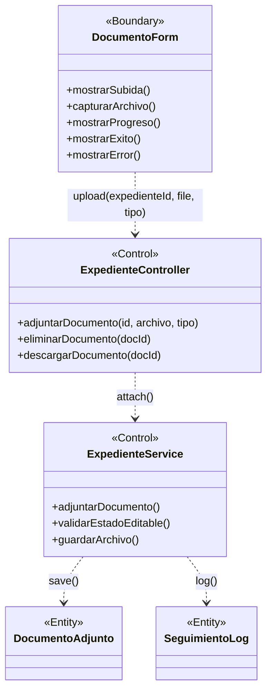

# BCE-CU05: Adjuntar Documento

## Identificación

| Campo | Valor |
|-------|-------|
| **ID** | BCE-CU05 |
| **Caso de Uso** | CU05: Adjuntar Documento |
| **Diagram Type** | UML Class Diagram con estereotipos |
| **Actores** | Laboratorio, Secretaria, Director, Coordinacion, Administrador |

## Objetos involucrados

| Tipo | Nombre | Descripción |
|:----:|:------|:------------|
| `<<Boundary>>` | DocumentoForm | Formulario de subida de documento |
| `<<Control>>` | ExpedienteController | `ExpedienteController.java` — manejo de subida |
| `<<Control>>` | ExpedienteService | `ExpedienteService.java` — validación y guardado |
| `<<Entity>>` | DocumentoAdjunto | Metadatos del documento adjunto |
| `<<Entity>>` | SeguimientoLog | Log de la acción de adjuntar |

## Dependencias

| Origen | Destino | Descripción |
|:------|:--------|:------------|
| DocumentoForm | ExpedienteController | Subida de archivo multipart |
| ExpedienteController | ExpedienteService | Delegación de adjuntado |
| ExpedienteService | DocumentoAdjunto | Persistir metadatos del archivo |
| ExpedienteService | SeguimientoLog | Registrar acción en el historial |

## Diagrama Mermaid

## Instrucciones para StarUML

1. Crear `UMLClassDiagram` "BCE-CU05-AdjuntarDocumento"
2. Crear 1 `<<Boundary>>`: **DocumentoForm** (azul claro)
3. Crear 2 `<<Control>>`: **ExpedienteController**, **ExpedienteService** (amarillo)
4. Crear 2 `<<Entity>>`: **DocumentoAdjunto**, **SeguimientoLog** (verde claro)
5. Asociaciones: DocumentoForm → ExpedienteController → ExpedienteService → DocumentoAdjunto y SeguimientoLog
