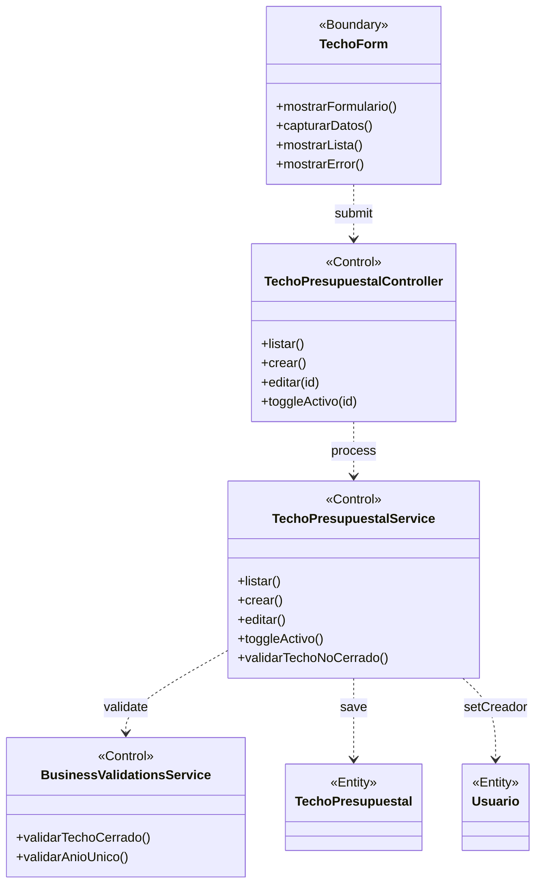

# BCE-CU06: Gestionar Techo Presupuestal

## Identificación

| Campo | Valor |
|-------|-------|
| **ID** | BCE-CU06 |
| **Caso de Uso** | CU06: Gestionar Techo Presupuestal |
| **Diagram Type** | UML Class Diagram con estereotipos |
| **Actores** | Administrador (TECHO_CREAR_EDITAR) |

## Objetos involucrados

| Tipo | Nombre | Descripción |
|:----:|:------|:------------|
| `<<Boundary>>` | TechoForm | Formulario de creación/edición de techo |
| `<<Control>>` | TechoPresupuestalController | `TechoPresupuestalController.java` — CRUD de techos |
| `<<Control>>` | TechoPresupuestalService | `TechoPresupuestalService.java` — lógica de negocio |
| `<<Control>>` | BusinessValidationsService | Validación: techo cerrado (planificado) |
| `<<Entity>>` | TechoPresupuestal | Entidad persistida con año, montoTotal, activo, planificado |
| `<<Entity>>` | Usuario | Referencia a creador del techo (creadoPor) |

## Dependencias

| Origen | Destino | Descripción |
|:------|:--------|:------------|
| TechoForm | TechoPresupuestalController | Submit del formulario |
| TechoPresupuestalController | TechoPresupuestalService | Delegación de operación |
| TechoPresupuestalService | BusinessValidationsService | Validar si está cerrado |
| TechoPresupuestalService | TechoPresupuestal | Persistencia |
| TechoPresupuestalService | Usuario | Asignación de creador |

## Diagrama Mermaid

## Instrucciones para StarUML

1. Crear `UMLClassDiagram` "BCE-CU06-GestionarTechoPresupuestal"
2. Crear 1 `<<Boundary>>`: **TechoForm** (azul claro)
3. Crear 3 `<<Control>>`: **TechoPresupuestalController**, **TechoPresupuestalService**, **BusinessValidationsService** (amarillo)
4. Crear 2 `<<Entity>>`: **TechoPresupuestal**, **Usuario** (verde claro)
