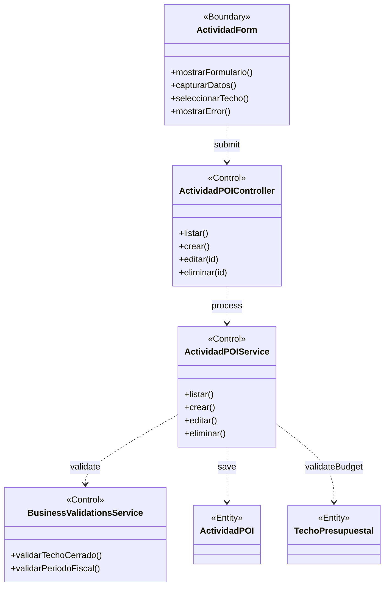

# BCE-CU07: Gestionar Actividad POI

## Identificación

| Campo | Valor |
|-------|-------|
| **ID** | BCE-CU07 |
| **Caso de Uso** | CU07: Gestionar Actividad POI |
| **Diagram Type** | UML Class Diagram con estereotipos |
| **Actores** | Administrador (POI_CREAR_EDITAR) |

## Objetos involucrados

| Tipo | Nombre | Descripción |
|:----:|:------|:------------|
| `<<Boundary>>` | ActividadForm | Formulario de actividad POI |
| `<<Control>>` | ActividadPOIController | `ActividadPOIController.java` — CRUD de actividades |
| `<<Control>>` | ActividadPOIService | `ActividadPOIService.java` — lógica de negocio |
| `<<Control>>` | BusinessValidationsService | Validación: techo cerrado, año fiscal |
| `<<Entity>>` | ActividadPOI | Entidad con código, presupuesto, saldos |
| `<<Entity>>` | TechoPresupuestal | Techo al que pertenece la actividad |

## Dependencias

| Origen | Destino | Descripción |
|:------|:--------|:------------|
| ActividadForm | ActividadPOIController | Submit del formulario |
| ActividadPOIController | ActividadPOIService | Delegación de operación |
| ActividadPOIService | BusinessValidationsService | Validaciones de negocio |
| ActividadPOIService | ActividadPOI | Persistencia de la actividad |
| ActividadPOIService | TechoPresupuestal | Validación de presupuesto disponible |

## Diagrama Mermaid

## Instrucciones para StarUML

1. Crear `UMLClassDiagram` "BCE-CU07-GestionarActividadPOI"
2. Crear 1 `<<Boundary>>`: **ActividadForm** (azul claro)
3. Crear 3 `<<Control>>`: **ActividadPOIController**, **ActividadPOIService**, **BusinessValidationsService** (amarillo)
4. Crear 2 `<<Entity>>`: **ActividadPOI**, **TechoPresupuestal** (verde claro)
