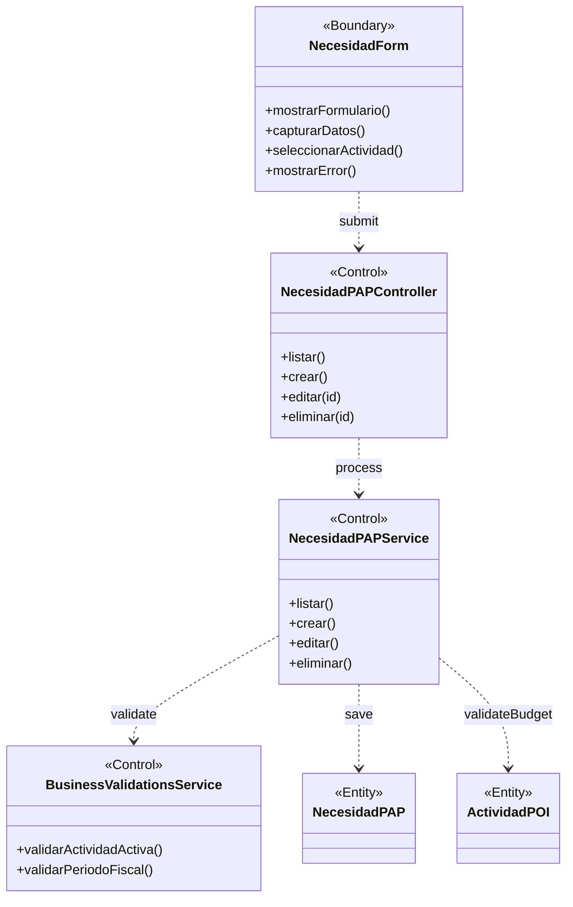

# BCE-CU08: Gestionar Necesidad PAP

## Identificación

| Campo | Valor |
|-------|-------|
| **ID** | BCE-CU08 |
| **Caso de Uso** | CU08: Gestionar Necesidad PAP |
| **Diagram Type** | UML Class Diagram con estereotipos |
| **Actores** | Administrador, Coordinacion (PAP_CREAR_EDITAR) |

## Objetos involucrados

| Tipo | Nombre | Descripción |
|:----:|:------|:------------|
| `<<Boundary>>` | NecesidadForm | Formulario de necesidad PAP |
| `<<Control>>` | NecesidadPAPController | `NecesidadPAPController.java` — CRUD de necesidades |
| `<<Control>>` | NecesidadPAPService | `NecesidadPAPService.java` — lógica de negocio |
| `<<Control>>` | BusinessValidationsService | Validaciones de actividad y saldos |
| `<<Entity>>` | NecesidadPAP | Entidad con cantidad, precio, tipo, saldos |
| `<<Entity>>` | ActividadPOI | Actividad a la que pertenece la necesidad |

## Dependencias

| Origen | Destino | Descripción |
|:------|:--------|:------------|
| NecesidadForm | NecesidadPAPController | Submit del formulario |
| NecesidadPAPController | NecesidadPAPService | Delegación de operación |
| NecesidadPAPService | BusinessValidationsService | Validaciones de negocio |
| NecesidadPAPService | NecesidadPAP | Persistencia de la necesidad |
| NecesidadPAPService | ActividadPOI | Validación de presupuesto de la actividad |

## Diagrama Mermaid

## Instrucciones para StarUML

1. Crear `UMLClassDiagram` "BCE-CU08-GestionarNecesidadPAP"
2. Crear 1 `<<Boundary>>`: **NecesidadForm** (azul claro)
3. Crear 3 `<<Control>>`: **NecesidadPAPController**, **NecesidadPAPService**, **BusinessValidationsService** (amarillo)
4. Crear 2 `<<Entity>>`: **NecesidadPAP**, **ActividadPOI** (verde claro)
