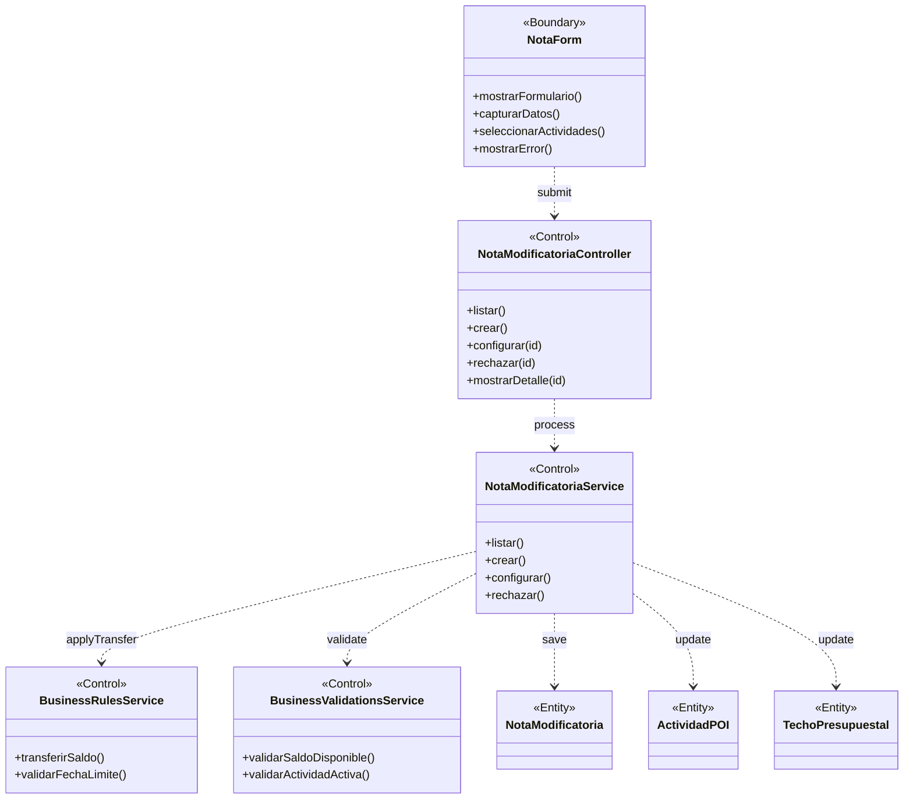

# BCE-CU09: Gestionar Nota Modificatoria

## Identificación

| Campo | Valor |
|-------|-------|
| **ID** | BCE-CU09 |
| **Caso de Uso** | CU09: Gestionar Nota Modificatoria |
| **Diagram Type** | UML Class Diagram con estereotipos |
| **Actores** | Administrador, Coordinacion |

## Objetos involucrados

| Tipo | Nombre | Descripción |
|:----:|:------|:------------|
| `<<Boundary>>` | NotaForm | Formulario de nota modificatoria |
| `<<Control>>` | NotaModificatoriaController | `NotaModificatoriaController.java` — CRUD y flujo de notas |
| `<<Control>>` | NotaModificatoriaService | `NotaModificatoriaService.java` — lógica de notas |
| `<<Control>>` | BusinessRulesService | Reglas: transferencia de saldo entre actividades |
| `<<Control>>` | BusinessValidationsService | Validaciones de estado y montos |
| `<<Entity>>` | NotaModificatoria | Entidad con tipo, montos, estados |
| `<<Entity>>` | ActividadPOI | Actividad origen y destino de la transferencia |
| `<<Entity>>` | TechoPresupuestal | Techo afectado por la nota |

## Dependencias

| Origen | Destino | Descripción |
|:------|:--------|:------------|
| NotaForm | NotaModificatoriaController | Submit del formulario |
| NotaModificatoriaController | NotaModificatoriaService | Delegación de operación |
| NotaModificatoriaService | BusinessRulesService | Reglas de transferencia de saldo |
| NotaModificatoriaService | BusinessValidationsService | Validaciones |
| NotaModificatoriaService | NotaModificatoria | Persistencia |
| NotaModificatoriaService | ActividadPOI | Actualización de saldos |
| NotaModificatoriaService | TechoPresupuestal | Actualización de montos |

## Diagrama Mermaid

## Instrucciones para StarUML

1. Crear `UMLClassDiagram` "BCE-CU09-GestionarNotaModificatoria"
2. Crear 1 `<<Boundary>>`: **NotaForm** (azul claro)
3. Crear 4 `<<Control>>`: **NotaModificatoriaController**, **NotaModificatoriaService**, **BusinessRulesService**, **BusinessValidationsService** (amarillo)
4. Crear 3 `<<Entity>>`: **NotaModificatoria**, **ActividadPOI**, **TechoPresupuestal** (verde claro)
