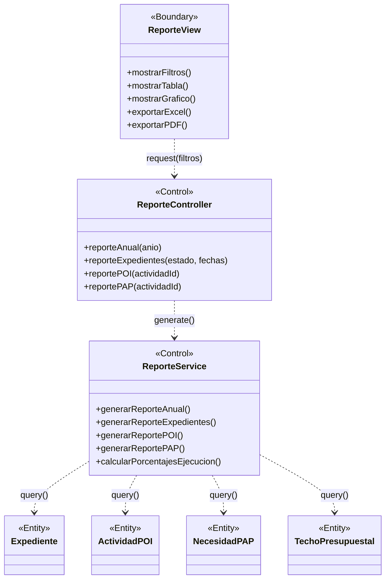

# BCE-CU10: Ver Reportes

## Identificación

| Campo | Valor |
|-------|-------|
| **ID** | BCE-CU10 |
| **Caso de Uso** | CU10: Ver Reportes |
| **Diagram Type** | UML Class Diagram con estereotipos |
| **Actores** | Administrador, Coordinacion, Decanato, Director (REPORTES_VER) |

## Objetos involucrados

| Tipo | Nombre | Descripción |
|:----:|:------|:------------|
| `<<Boundary>>` | ReporteView | Página de reportes con filtros y visualización |
| `<<Control>>` | ReporteController | `ReporteController.java` — endpoints de reportes |
| `<<Control>>` | ReporteService | `ReporteService.java` — generación de reportes |
| `<<Entity>>` | Expediente | Datos para reporte de expedientes |
| `<<Entity>>` | ActividadPOI | Datos para reporte POI |
| `<<Entity>>` | NecesidadPAP | Datos para reporte PAP |
| `<<Entity>>` | TechoPresupuestal | Datos para reporte anual |

## Dependencias

| Origen | Destino | Descripción |
|:------|:--------|:------------|
| ReporteView | ReporteController | Solicitud de reporte con filtros |
| ReporteController | ReporteService | Generación del reporte |
| ReporteService | Expediente | Consulta de expedientes |
| ReporteService | ActividadPOI | Consulta de actividades POI |
| ReporteService | NecesidadPAP | Consulta de necesidades PAP |
| ReporteService | TechoPresupuestal | Consulta de techos |

## Diagrama Mermaid

## Instrucciones para StarUML

1. Crear `UMLClassDiagram` "BCE-CU10-VerReportes"
2. Crear 1 `<<Boundary>>`: **ReporteView** (azul claro)
3. Crear 2 `<<Control>>`: **ReporteController**, **ReporteService** (amarillo)
4. Crear 4 `<<Entity>>`: **Expediente**, **ActividadPOI**, **NecesidadPAP**, **TechoPresupuestal** (verde claro)
