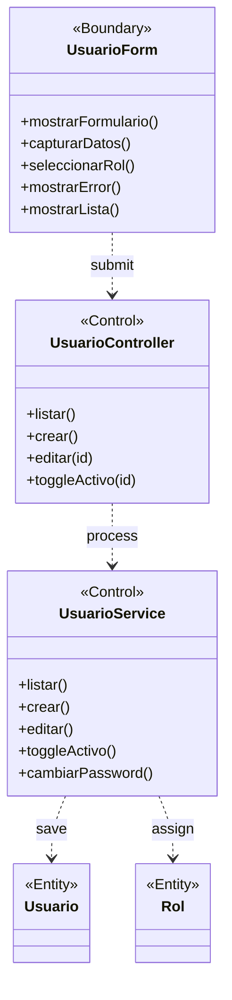

# BCE-CU11: Gestionar Usuarios

## Identificación

| Campo | Valor |
|-------|-------|
| **ID** | BCE-CU11 |
| **Caso de Uso** | CU11: Gestionar Usuarios |
| **Diagram Type** | UML Class Diagram con estereotipos |
| **Actores** | Administrador (USUARIO_ADMIN) |

## Objetos involucrados

| Tipo | Nombre | Descripción |
|:----:|:------|:------------|
| `<<Boundary>>` | UsuarioForm | Formulario de creación/edición de usuarios |
| `<<Control>>` | UsuarioController | `UsuarioController.java` — CRUD de usuarios |
| `<<Control>>` | UsuarioService | `UsuarioService.java` — lógica de gestión de usuarios |
| `<<Entity>>` | Usuario | Entidad con datos personales y de acceso |
| `<<Entity>>` | Rol | Entidad de roles disponibles |

## Dependencias

| Origen | Destino | Descripción |
|:------|:--------|:------------|
| UsuarioForm | UsuarioController | Submit del formulario |
| UsuarioController | UsuarioService | Delegación de operación |
| UsuarioService | Usuario | Persistencia del usuario |
| UsuarioService | Rol | Asignación de rol |

## Diagrama Mermaid

## Instrucciones para StarUML

1. Crear `UMLClassDiagram` "BCE-CU11-GestionarUsuarios"
2. Crear 1 `<<Boundary>>`: **UsuarioForm** (azul claro)
3. Crear 2 `<<Control>>`: **UsuarioController**, **UsuarioService** (amarillo)
4. Crear 2 `<<Entity>>`: **Usuario**, **Rol** (verde claro)
