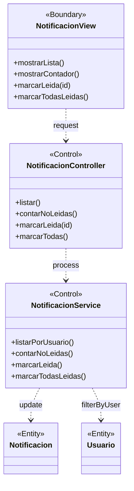

# BCE-CU12: Gestionar Notificaciones

## Identificación

| Campo | Valor |
|-------|-------|
| **ID** | BCE-CU12 |
| **Caso de Uso** | CU12: Gestionar Notificaciones |
| **Diagram Type** | UML Class Diagram con estereotipos |
| **Actores** | Usuario autenticado (todos los roles) |

## Objetos involucrados

| Tipo | Nombre | Descripción |
|:----:|:------|:------------|
| `<<Boundary>>` | NotificacionView | Panel de notificaciones en el layout |
| `<<Control>>` | NotificacionController | `NotificacionController.java` — manejo de notificaciones |
| `<<Control>>` | NotificacionService | `NotificacionService.java` — lógica de notificaciones |
| `<<Entity>>` | Notificacion | Entidad con mensaje, tipo, estado leída |
| `<<Entity>>` | Usuario | Usuario destinatario de la notificación |

## Dependencias

| Origen | Destino | Descripción |
|:------|:--------|:------------|
| NotificacionView | NotificacionController | Solicitud de lista o acción |
| NotificacionController | NotificacionService | Procesamiento de la solicitud |
| NotificacionService | Notificacion | Actualización (marcar leída) |
| NotificacionService | Usuario | Filtrado por usuario destino |

## Diagrama Mermaid

## Instrucciones para StarUML

1. Crear `UMLClassDiagram` "BCE-CU12-GestionarNotificaciones"
2. Crear 1 `<<Boundary>>`: **NotificacionView** (azul claro)
3. Crear 2 `<<Control>>`: **NotificacionController**, **NotificacionService** (amarillo)
4. Crear 2 `<<Entity>>`: **Notificacion**, **Usuario** (verde claro)
