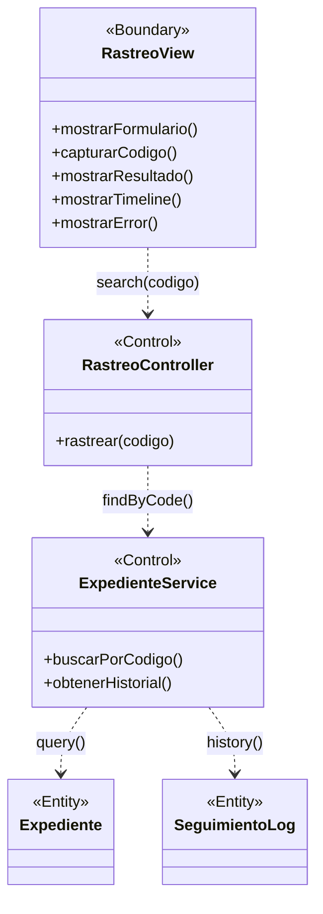

# BCE-CU13: Rastrear Expediente (Público)

## Identificación

| Campo | Valor |
|-------|-------|
| **ID** | BCE-CU13 |
| **Caso de Uso** | CU13: Rastrear Expediente |
| **Diagram Type** | UML Class Diagram con estereotipos |
| **Actores** | Público (sin autenticación) |

## Objetos involucrados

| Tipo | Nombre | Descripción |
|:----:|:------|:------------|
| `<<Boundary>>` | RastreoView | Formulario público de rastreo y resultados |
| `<<Control>>` | RastreoController | `RastreoController.java` — búsqueda por código |
| `<<Control>>` | ExpedienteService | `ExpedienteService.java` — búsqueda en BD |
| `<<Entity>>` | Expediente | Datos del expediente (estado actual) |
| `<<Entity>>` | SeguimientoLog | Historial de cambios del expediente |

## Dependencias

| Origen | Destino | Descripción |
|:------|:--------|:------------|
| RastreoView | RastreoController | Ingreso de código de rastreo |
| RastreoController | ExpedienteService | Búsqueda por código |
| ExpedienteService | Expediente | Consulta del expediente |
| ExpedienteService | SeguimientoLog | Historial de seguimiento |

## Diagrama Mermaid

## Instrucciones para StarUML

1. Crear `UMLClassDiagram` "BCE-CU13-RastrearExpediente"
2. Crear 1 `<<Boundary>>`: **RastreoView** (azul claro)
3. Crear 2 `<<Control>>`: **RastreoController**, **ExpedienteService** (amarillo)
4. Crear 2 `<<Entity>>`: **Expediente**, **SeguimientoLog** (verde claro)
