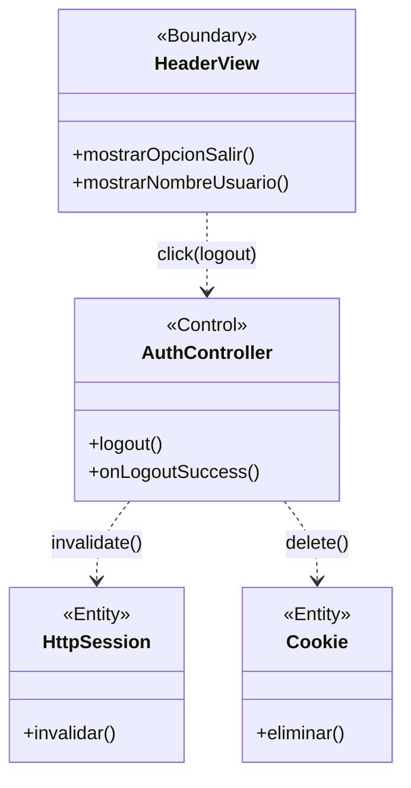

# BCE-CU14: Cerrar Sesión

## Identificación

| Campo | Valor |
|-------|-------|
| **ID** | BCE-CU14 |
| **Caso de Uso** | CU14: Cerrar Sesión |
| **Diagram Type** | UML Class Diagram con estereotipos |
| **Actores** | Usuario autenticado |

## Objetos involucrados

| Tipo | Nombre | Descripción |
|:----:|:------|:------------|
| `<<Boundary>>` | HeaderView | Barra de navegación con opción "Cerrar Sesión" |
| `<<Control>>` | AuthController | `AuthController.java` — endpoint de logout |
| `<<Entity>>` | HttpSession | Sesión HTTP a invalidar (pseudo-entidad) |
| `<<Entity>>` | Cookie | Cookie "remember-me" a eliminar |

## Dependencias

| Origen | Destino | Descripción |
|:------|:--------|:------------|
| HeaderView | AuthController | Click en "Cerrar Sesión" |
| AuthController | HttpSession | Invalidación de sesión |
| AuthController | Cookie | Eliminación de cookie remember-me |

## Diagrama Mermaid

## Instrucciones para StarUML

1. Crear `UMLClassDiagram` "BCE-CU14-CerrarSesion"
2. Crear 1 `<<Boundary>>`: **HeaderView** (azul claro)
3. Crear 1 `<<Control>>`: **AuthController** (amarillo)
4. Crear 2 `<<Entity>>`: **HttpSession**, **Cookie** (verde claro) — notar que son pseudo-entidades
5. Asociaciones: HeaderView → AuthController → HttpSession y Cookie
