# SISEXP-UPLA — Diagramas BCE (Boundary-Control-Entity)
## ICONIX Fase 3: Robustness Analysis

---

**Proyecto:** SISEXP-UPLA — Sistema de Seguimiento y Control de Expedientes
**Facultad:** Ingeniería — Universidad Peruana Los Andes (UPLA)
**Metodología:** ICONIX (Fase 3 — Diagramas de Robustez)
**Total diagramas:** 14 (BCE01–BCE14)
**Fecha:** 2026-06-23

---

## Introducción

### Propósito de los Diagramas de Robustez (BCE)

Los diagramas de robustez son el puente entre los Casos de Uso (Fase 1-2) y los Diagramas de Secuencia (Fase 4) en la metodología ICONIX. Validan que la estructura de cada Caso de Uso sea realizable desde el punto de vista arquitectónico antes de proceder a la implementación.

### Reglas ICONIX para Diagramas BCE

1. Los **actores** solo se conectan a objetos **Boundary**
2. Los objetos **Boundary** solo se conectan a objetos **Control**
3. Los objetos **Control** se conectan a objetos **Entity** y a otros objetos **Control**
4. Los objetos **Entity** nunca se conectan directamente a objetos **Boundary**
5. Cada Caso de Uso produce al menos un diagrama BCE
6. Los diagramas BCE deben validar que el flujo completo del CU sea implementable

### Los 3 Estereotipos UML

| Estereotipo | Tipo | Propósito | Color recomendado (StarUML) |
|:-----------:|:----:|:----------|:---------------------------:|
| `<<Boundary>>` | Interfaz | Formularios, vistas, páginas HTML con las que interactúa el actor | Azul claro (#D4E6F1) |
| `<<Control>>` | Lógica | Controllers + Services de Spring Boot que orquestan la lógica de negocio | Amarillo (#F9E79F) |
| `<<Entity>>` | Datos | Entidades JPA persistentes (tablas en PostgreSQL) | Verde claro (#D5F5E3) |

### Convenciones de Diagramación

- **Tipo de diagrama:** `UMLClassDiagram` en StarUML
- **Notación:** Clases con estereotipos UML (`<<Boundary>>`, `<<Control>>`, `<<Entity>>`)
- **Dependencias:** Línea discontinua con flecha abierta (→) que va del cliente al proveedor
- **Dirección de dependencia:** `Boundary → Control → Entity` (nunca Boundary → Entity directo)

### Entidades JPA del Sistema (11)

Las entidades que aparecen como `<<Entity>>` en los diagramas BCE corresponden a las 11 tablas del modelo de datos:

1. **Usuario** — Usuarios del sistema (6 roles)
2. **Rol** — Roles RBAC (Administrador, Coordinacion, Secretaria, Director, Laboratorio, Decanato)
3. **TechoPresupuestal** — Techo presupuestal por año
4. **ActividadPOI** — Actividades del Plan Operativo Institucional
5. **NecesidadPAP** — Necesidades del Plan Anual de Presupuesto
6. **Expediente** — Expedientes administrativos (7 estados)
7. **DocumentoAdjunto** — Documentos adjuntos a expedientes
8. **SeguimientoLog** — Historial de cambios de estado
9. **NotaModificatoria** — Notas modificatorias presupuestales
10. **Notificacion** — Notificaciones a usuarios
11. — (HttpSession se usa como pseudo-entidad en BCE14)

---

## BCE01: Iniciar Sesión

### Identificación

| Campo | Valor |
|-------|-------|
| **ID** | BCE-CU01 |
| **Caso de Uso** | CU01: Iniciar Sesión |
| **Diagram Type** | UML Class Diagram con estereotipos |
| **Actores** | Usuario (Administrador, Coordinacion, Secretaria, Director, Laboratorio, Decanato) |

### Objetos involucrados

| Tipo | Nombre | Descripción |
|:----:|:------|:------------|
| `<<Boundary>>` | LoginForm | Formulario de login (Thymeleaf: `login.html`) |
| `<<Control>>` | AuthController | `AuthController.java` — maneja GET `/login` y POST `/login` |
| `<<Control>>` | AuthService | `AuthService.java` — autentica credenciales vía Spring Security |
| `<<Control>>` | CustomUserDetailsService | `CustomUserDetailsService.java` — carga usuario desde BD |
| `<<Entity>>` | Usuario | Entidad JPA con email, password, activo, intentosFallidos |

### Dependencias

| Origen | Destino | Descripción |
|:------|:--------|:------------|
| LoginForm | AuthController | Envío de credenciales (submit) |
| AuthController | AuthService | Delegación de autenticación |
| AuthService | CustomUserDetailsService | Carga de usuario por email |
| AuthService | Usuario | Validación de credenciales y estado del usuario |

### Diagrama Mermaid

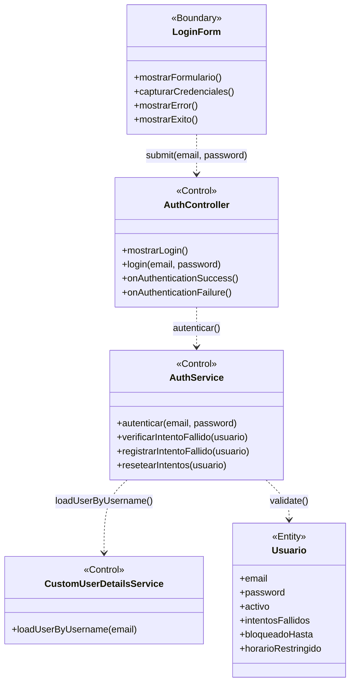

### Instrucciones para StarUML

1. Crear un nuevo `UMLClassDiagram` con nombre "BCE-CU01-IniciarSesion"
2. Crear 1 clase `<<Boundary>>`: **LoginForm** (color azul claro `#D4E6F1`)
3. Crear 3 clases `<<Control>>`: **AuthController**, **AuthService**, **CustomUserDetailsService** (color amarillo `#F9E79F`)
4. Crear 1 clase `<<Entity>>`: **Usuario** (color verde claro `#D5F5E3`)
5. Agregar atributos y métodos según la especificación de cada clase
6. Crear asociaciones dirigidas (flecha simple):
   - `LoginForm` → `AuthController`
   - `AuthController` → `AuthService`
   - `AuthService` → `CustomUserDetailsService`
   - `AuthService` → `Usuario`
7. Verificar que ninguna Entity se conecta directamente a una Boundary

---

## BCE02: Ver Dashboard

### Identificación

| Campo | Valor |
|-------|-------|
| **ID** | BCE-CU02 |
| **Caso de Uso** | CU02: Ver Dashboard |
| **Diagram Type** | UML Class Diagram con estereotipos |
| **Actores** | Usuario autenticado (cualquier rol) |

### Objetos involucrados

| Tipo | Nombre | Descripción |
|:----:|:------|:------------|
| `<<Boundary>>` | DashboardView | Página principal del dashboard (Thymeleaf: `dashboard.html`) |
| `<<Control>>` | DashboardController | `DashboardController.java` — endpoints de KPIs y saldos |
| `<<Control>>` | DashboardService | `DashboardService.java` — cálculos de KPIs, alertas y saldos |
| `<<Entity>>` | Expediente | Entidad para conteos por estado y detección de vencidos |
| `<<Entity>>` | ActividadPOI | Entidad para sumarizar saldos presupuestales |
| `<<Entity>>` | TechoPresupuestal | Entidad para mostrar el techo anual |
| `<<Entity>>` | Notificacion | Entidad para contar no-leídas del usuario |

### Dependencias

| Origen | Destino | Descripción |
|:------|:--------|:------------|
| DashboardView | DashboardController | Solicitud de KPIs del dashboard |
| DashboardController | DashboardService | Consulta de datos agregados |
| DashboardService | Expediente | Conteo por estado, detección de vencidos |
| DashboardService | ActividadPOI | Suma de presupuestos y saldos |
| DashboardService | TechoPresupuestal | Consulta de techos activos |
| DashboardService | Notificacion | Conteo de notificaciones no leídas |

### Diagrama Mermaid

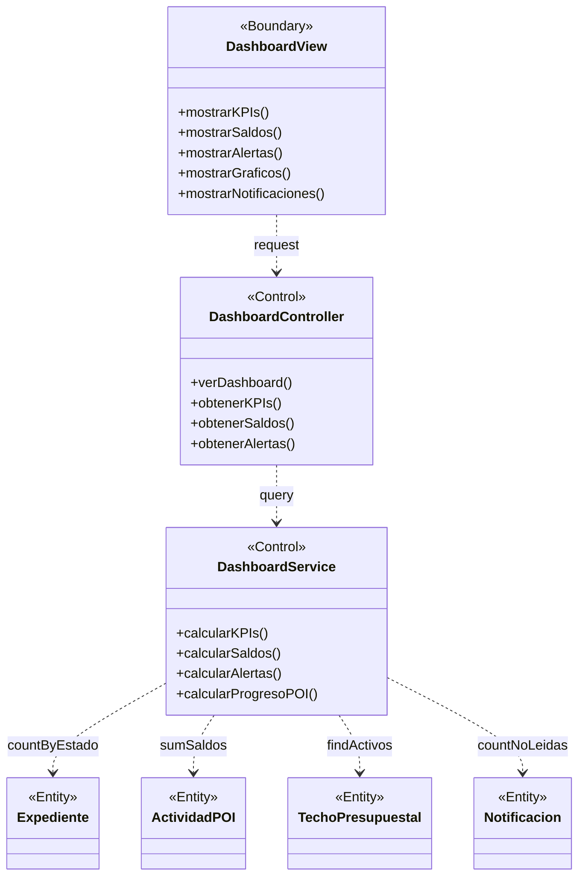

### Instrucciones para StarUML

1. Crear `UMLClassDiagram` "BCE-CU02-VerDashboard"
2. Crear 1 `<<Boundary>>`: **DashboardView** (azul claro)
3. Crear 2 `<<Control>>`: **DashboardController**, **DashboardService** (amarillo)
4. Crear 4 `<<Entity>>`: **Expediente**, **ActividadPOI**, **TechoPresupuestal**, **Notificacion** (verde claro)
5. Asociaciones dirigidas: DashboardView → DashboardController, DashboardController → DashboardService, DashboardService → cada Entity

---

## BCE03: Crear Expediente

### Identificación

| Campo | Valor |
|-------|-------|
| **ID** | BCE-CU03 |
| **Caso de Uso** | CU03: Crear Expediente |
| **Diagram Type** | UML Class Diagram con estereotipos |
| **Actores** | Laboratorio, Secretaria, Director, Coordinacion, Administrador |

### Objetos involucrados

| Tipo | Nombre | Descripción |
|:----:|:------|:------------|
| `<<Boundary>>` | ExpedienteForm | Formulario de creación de expediente (Thymeleaf) |
| `<<Control>>` | ExpedienteController | `ExpedienteController.java` — recibe datos, genera código |
| `<<Control>>` | ExpedienteService | `ExpedienteService.java` — lógica de creación y reserva de saldo |
| `<<Control>>` | BusinessValidationsService | Validaciones: fecha límite, saldo, período fiscal, documento |
| `<<Control>>` | BusinessRulesService | Reglas: reservar/liberar saldo en POI y PAP |
| `<<Entity>>` | Expediente | Nuevo expediente a persistir |
| `<<Entity>>` | NecesidadPAP | Necesidad asociada (actualiza saldos) |
| `<<Entity>>` | ActividadPOI | Actividad asociada (actualiza saldos) |
| `<<Entity>>` | SeguimientoLog | Log de creación |
| `<<Entity>>` | Notificacion | Notificación a coordinación |

### Dependencias

| Origen | Destino | Descripción |
|:------|:--------|:------------|
| ExpedienteForm | ExpedienteController | Submit del formulario con datos del expediente |
| ExpedienteController | ExpedienteService | Delegación de creación |
| ExpedienteService | BusinessValidationsService | Validación de reglas de negocio |
| ExpedienteService | BusinessRulesService | Aplicación de reglas presupuestales |
| ExpedienteService | Expediente | Persistencia del nuevo expediente |
| ExpedienteService | NecesidadPAP | Reserva de saldo en PAP |
| ExpedienteService | ActividadPOI | Reserva de saldo en POI |
| ExpedienteService | SeguimientoLog | Creación de log de seguimiento |
| ExpedienteService | Notificacion | Creación de notificación |

### Diagrama Mermaid

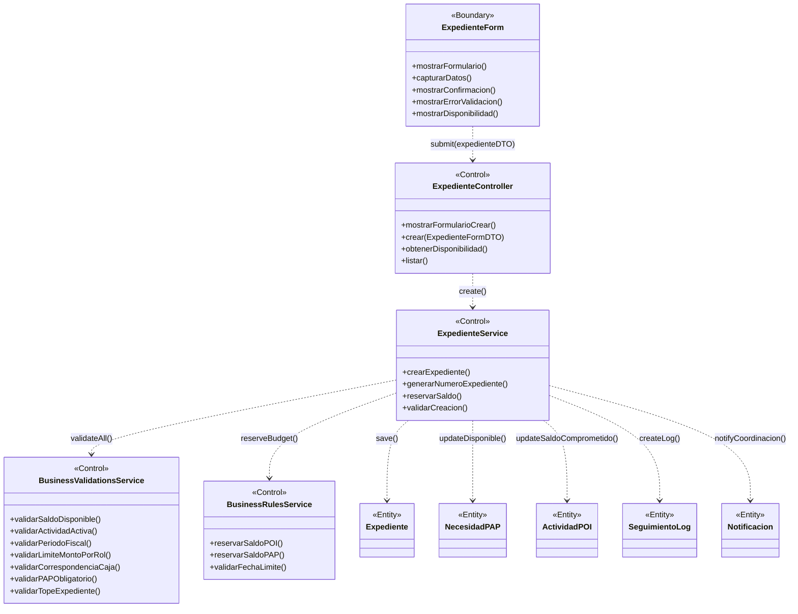

### Instrucciones para StarUML

1. Crear `UMLClassDiagram` "BCE-CU03-CrearExpediente"
2. Crear 1 `<<Boundary>>`: **ExpedienteForm** (azul claro)
3. Crear 4 `<<Control>>`: **ExpedienteController**, **ExpedienteService**, **BusinessValidationsService**, **BusinessRulesService** (amarillo)
4. Crear 5 `<<Entity>>`: **Expediente**, **NecesidadPAP**, **ActividadPOI**, **SeguimientoLog**, **Notificacion** (verde claro)
5. Asociaciones dirigidas desde Boundary → Control → Entity

---

## BCE04: Cambiar Estado Expediente

### Identificación

| Campo | Valor |
|-------|-------|
| **ID** | BCE-CU04 |
| **Caso de Uso** | CU04: Cambiar Estado Expediente |
| **Diagram Type** | UML Class Diagram con estereotipos |
| **Actores** | Coordinacion, Secretaria, Administrador (según transición) |

### Objetos involucrados

| Tipo | Nombre | Descripción |
|:----:|:------|:------------|
| `<<Boundary>>` | ExpedienteDetalle | Página de detalle del expediente con opciones de transición |
| `<<Control>>` | ExpedienteController | `ExpedienteController.java` — endpoint de cambio de estado |
| `<<Control>>` | ExpedienteService | `ExpedienteService.java` — lógica de transición |
| `<<Control>>` | BusinessValidationsService | Validaciones de inmutabilidad y reglas de transición |
| `<<Control>>` | BusinessRulesService | Reglas: ejecutar, liberar o reservar saldo según transición |
| `<<Entity>>` | Expediente | Expediente a actualizar (nuevo estado) |
| `<<Entity>>` | ActividadPOI | Actualización de saldos (comprometido, ejecutado) |
| `<<Entity>>` | NecesidadPAP | Actualización de saldos (disponible, ejecutado) |
| `<<Entity>>` | SeguimientoLog | Registro del cambio de estado |
| `<<Entity>>` | Notificacion | Notificación al solicitante |

### Dependencias

| Origen | Destino | Descripción |
|:------|:--------|:------------|
| ExpedienteDetalle | ExpedienteController | Solicitud de cambio de estado |
| ExpedienteController | ExpedienteService | Delegación del cambio |
| ExpedienteService | BusinessValidationsService | Validar transición permitida |
| ExpedienteService | BusinessRulesService | Aplicar reglas de saldo |
| ExpedienteService | Expediente | Actualizar estado |
| ExpedienteService | ActividadPOI | Ejecutar/liberar saldo |
| ExpedienteService | NecesidadPAP | Ejecutar/liberar cantidad |
| ExpedienteService | SeguimientoLog | Crear log del cambio |
| ExpedienteService | Notificacion | Notificar cambio al solicitante |

### Diagrama Mermaid

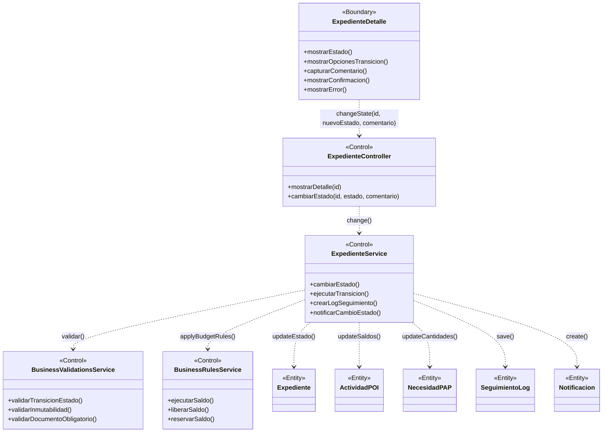

### Instrucciones para StarUML

1. Crear `UMLClassDiagram` "BCE-CU04-CambiarEstadoExpediente"
2. Crear 1 `<<Boundary>>`: **ExpedienteDetalle** (azul claro)
3. Crear 4 `<<Control>>`: **ExpedienteController**, **ExpedienteService**, **BusinessValidationsService**, **BusinessRulesService** (amarillo)
4. Crear 5 `<<Entity>>`: **Expediente**, **ActividadPOI**, **NecesidadPAP**, **SeguimientoLog**, **Notificacion** (verde claro)
5. Asociaciones dirigidas según la tabla de dependencias

---

## BCE05: Adjuntar Documento

### Identificación

| Campo | Valor |
|-------|-------|
| **ID** | BCE-CU05 |
| **Caso de Uso** | CU05: Adjuntar Documento |
| **Diagram Type** | UML Class Diagram con estereotipos |
| **Actores** | Laboratorio, Secretaria, Director, Coordinacion, Administrador |

### Objetos involucrados

| Tipo | Nombre | Descripción |
|:----:|:------|:------------|
| `<<Boundary>>` | DocumentoForm | Formulario de subida de documento |
| `<<Control>>` | ExpedienteController | `ExpedienteController.java` — manejo de subida |
| `<<Control>>` | ExpedienteService | `ExpedienteService.java` — validación y guardado |
| `<<Entity>>` | DocumentoAdjunto | Metadatos del documento adjunto |
| `<<Entity>>` | SeguimientoLog | Log de la acción de adjuntar |

### Dependencias

| Origen | Destino | Descripción |
|:------|:--------|:------------|
| DocumentoForm | ExpedienteController | Subida de archivo multipart |
| ExpedienteController | ExpedienteService | Delegación de adjuntado |
| ExpedienteService | DocumentoAdjunto | Persistir metadatos del archivo |
| ExpedienteService | SeguimientoLog | Registrar acción en el historial |

### Diagrama Mermaid

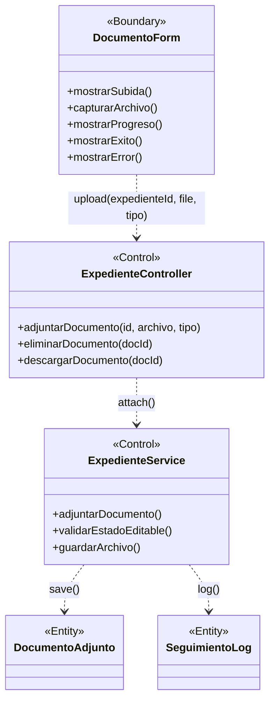

### Instrucciones para StarUML

1. Crear `UMLClassDiagram` "BCE-CU05-AdjuntarDocumento"
2. Crear 1 `<<Boundary>>`: **DocumentoForm** (azul claro)
3. Crear 2 `<<Control>>`: **ExpedienteController**, **ExpedienteService** (amarillo)
4. Crear 2 `<<Entity>>`: **DocumentoAdjunto**, **SeguimientoLog** (verde claro)
5. Asociaciones: DocumentoForm → ExpedienteController → ExpedienteService → DocumentoAdjunto y SeguimientoLog

---

## BCE06: Gestionar Techo Presupuestal

### Identificación

| Campo | Valor |
|-------|-------|
| **ID** | BCE-CU06 |
| **Caso de Uso** | CU06: Gestionar Techo Presupuestal |
| **Diagram Type** | UML Class Diagram con estereotipos |
| **Actores** | Administrador (TECHO_CREAR_EDITAR) |

### Objetos involucrados

| Tipo | Nombre | Descripción |
|:----:|:------|:------------|
| `<<Boundary>>` | TechoForm | Formulario de creación/edición de techo |
| `<<Control>>` | TechoPresupuestalController | `TechoPresupuestalController.java` — CRUD de techos |
| `<<Control>>` | TechoPresupuestalService | `TechoPresupuestalService.java` — lógica de negocio |
| `<<Control>>` | BusinessValidationsService | Validación: techo cerrado (planificado) |
| `<<Entity>>` | TechoPresupuestal | Entidad persistida con año, montoTotal, activo, planificado |
| `<<Entity>>` | Usuario | Referencia a creador del techo (creadoPor) |

### Dependencias

| Origen | Destino | Descripción |
|:------|:--------|:------------|
| TechoForm | TechoPresupuestalController | Submit del formulario |
| TechoPresupuestalController | TechoPresupuestalService | Delegación de operación |
| TechoPresupuestalService | BusinessValidationsService | Validar si está cerrado |
| TechoPresupuestalService | TechoPresupuestal | Persistencia |
| TechoPresupuestalService | Usuario | Asignación de creador |

### Diagrama Mermaid

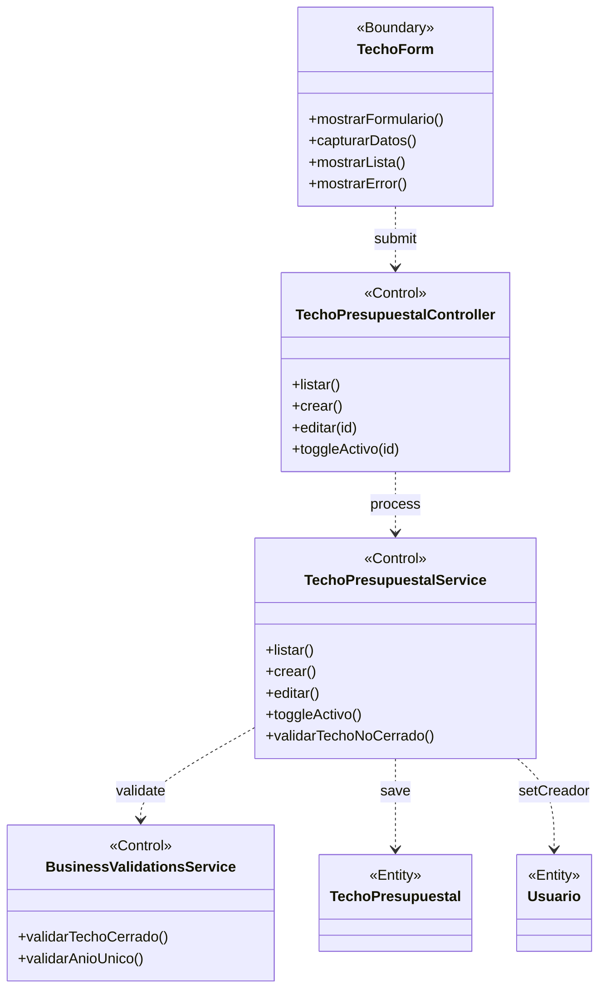

### Instrucciones para StarUML

1. Crear `UMLClassDiagram` "BCE-CU06-GestionarTechoPresupuestal"
2. Crear 1 `<<Boundary>>`: **TechoForm** (azul claro)
3. Crear 3 `<<Control>>`: **TechoPresupuestalController**, **TechoPresupuestalService**, **BusinessValidationsService** (amarillo)
4. Crear 2 `<<Entity>>`: **TechoPresupuestal**, **Usuario** (verde claro)

---

## BCE07: Gestionar Actividad POI

### Identificación

| Campo | Valor |
|-------|-------|
| **ID** | BCE-CU07 |
| **Caso de Uso** | CU07: Gestionar Actividad POI |
| **Diagram Type** | UML Class Diagram con estereotipos |
| **Actores** | Administrador (POI_CREAR_EDITAR) |

### Objetos involucrados

| Tipo | Nombre | Descripción |
|:----:|:------|:------------|
| `<<Boundary>>` | ActividadForm | Formulario de actividad POI |
| `<<Control>>` | ActividadPOIController | `ActividadPOIController.java` — CRUD de actividades |
| `<<Control>>` | ActividadPOIService | `ActividadPOIService.java` — lógica de negocio |
| `<<Control>>` | BusinessValidationsService | Validación: techo cerrado, año fiscal |
| `<<Entity>>` | ActividadPOI | Entidad con código, presupuesto, saldos |
| `<<Entity>>` | TechoPresupuestal | Techo al que pertenece la actividad |

### Dependencias

| Origen | Destino | Descripción |
|:------|:--------|:------------|
| ActividadForm | ActividadPOIController | Submit del formulario |
| ActividadPOIController | ActividadPOIService | Delegación de operación |
| ActividadPOIService | BusinessValidationsService | Validaciones de negocio |
| ActividadPOIService | ActividadPOI | Persistencia de la actividad |
| ActividadPOIService | TechoPresupuestal | Validación de presupuesto disponible |

### Diagrama Mermaid

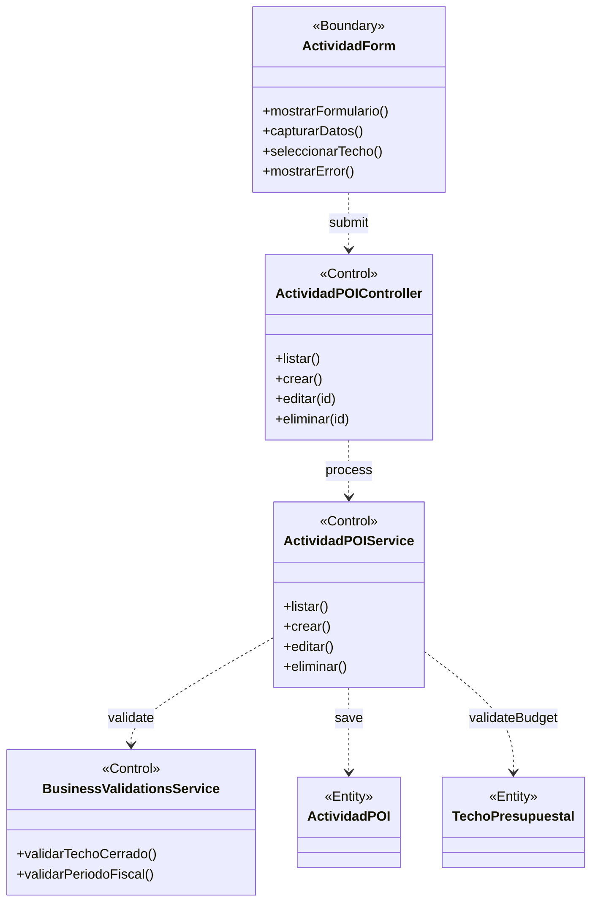

### Instrucciones para StarUML

1. Crear `UMLClassDiagram` "BCE-CU07-GestionarActividadPOI"
2. Crear 1 `<<Boundary>>`: **ActividadForm** (azul claro)
3. Crear 3 `<<Control>>`: **ActividadPOIController**, **ActividadPOIService**, **BusinessValidationsService** (amarillo)
4. Crear 2 `<<Entity>>`: **ActividadPOI**, **TechoPresupuestal** (verde claro)

---

## BCE08: Gestionar Necesidad PAP

### Identificación

| Campo | Valor |
|-------|-------|
| **ID** | BCE-CU08 |
| **Caso de Uso** | CU08: Gestionar Necesidad PAP |
| **Diagram Type** | UML Class Diagram con estereotipos |
| **Actores** | Administrador, Coordinacion (PAP_CREAR_EDITAR) |

### Objetos involucrados

| Tipo | Nombre | Descripción |
|:----:|:------|:------------|
| `<<Boundary>>` | NecesidadForm | Formulario de necesidad PAP |
| `<<Control>>` | NecesidadPAPController | `NecesidadPAPController.java` — CRUD de necesidades |
| `<<Control>>` | NecesidadPAPService | `NecesidadPAPService.java` — lógica de negocio |
| `<<Control>>` | BusinessValidationsService | Validaciones de actividad y saldos |
| `<<Entity>>` | NecesidadPAP | Entidad con cantidad, precio, tipo, saldos |
| `<<Entity>>` | ActividadPOI | Actividad a la que pertenece la necesidad |

### Dependencias

| Origen | Destino | Descripción |
|:------|:--------|:------------|
| NecesidadForm | NecesidadPAPController | Submit del formulario |
| NecesidadPAPController | NecesidadPAPService | Delegación de operación |
| NecesidadPAPService | BusinessValidationsService | Validaciones de negocio |
| NecesidadPAPService | NecesidadPAP | Persistencia de la necesidad |
| NecesidadPAPService | ActividadPOI | Validación de presupuesto de la actividad |

### Diagrama Mermaid

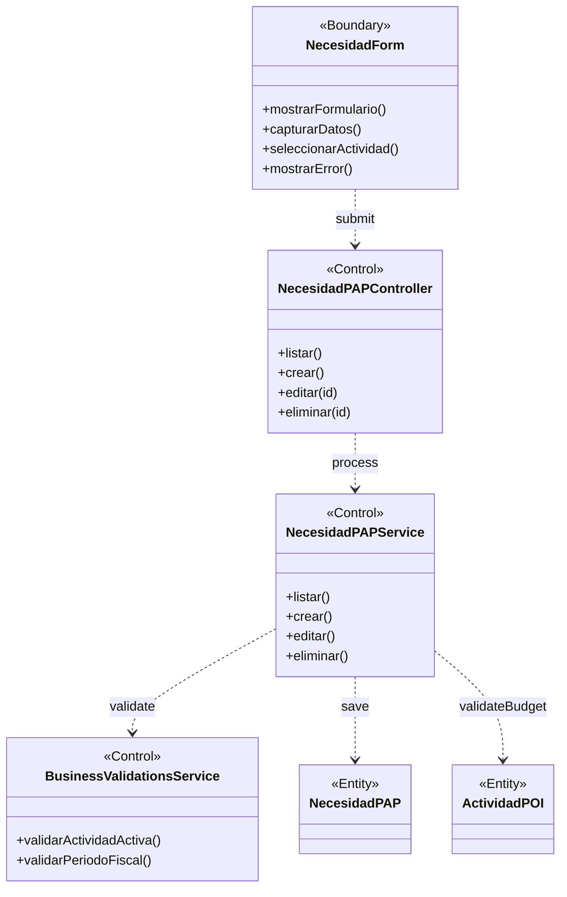

### Instrucciones para StarUML

1. Crear `UMLClassDiagram` "BCE-CU08-GestionarNecesidadPAP"
2. Crear 1 `<<Boundary>>`: **NecesidadForm** (azul claro)
3. Crear 3 `<<Control>>`: **NecesidadPAPController**, **NecesidadPAPService**, **BusinessValidationsService** (amarillo)
4. Crear 2 `<<Entity>>`: **NecesidadPAP**, **ActividadPOI** (verde claro)

---

## BCE09: Gestionar Nota Modificatoria

### Identificación

| Campo | Valor |
|-------|-------|
| **ID** | BCE-CU09 |
| **Caso de Uso** | CU09: Gestionar Nota Modificatoria |
| **Diagram Type** | UML Class Diagram con estereotipos |
| **Actores** | Administrador, Coordinacion |

### Objetos involucrados

| Tipo | Nombre | Descripción |
|:----:|:------|:------------|
| `<<Boundary>>` | NotaForm | Formulario de nota modificatoria |
| `<<Control>>` | NotaModificatoriaController | `NotaModificatoriaController.java` — CRUD y flujo de notas |
| `<<Control>>` | NotaModificatoriaService | `NotaModificatoriaService.java` — lógica de notas |
| `<<Control>>` | BusinessRulesService | Reglas: transferencia de saldo entre actividades |
| `<<Control>>` | BusinessValidationsService | Validaciones de estado y montos |
| `<<Entity>>` | NotaModificatoria | Entidad con tipo, montos, estados |
| `<<Entity>>` | ActividadPOI | Actividad origen y destino de la transferencia |
| `<<Entity>>` | TechoPresupuestal | Techo afectado por la nota |

### Dependencias

| Origen | Destino | Descripción |
|:------|:--------|:------------|
| NotaForm | NotaModificatoriaController | Submit del formulario |
| NotaModificatoriaController | NotaModificatoriaService | Delegación de operación |
| NotaModificatoriaService | BusinessRulesService | Reglas de transferencia de saldo |
| NotaModificatoriaService | BusinessValidationsService | Validaciones |
| NotaModificatoriaService | NotaModificatoria | Persistencia |
| NotaModificatoriaService | ActividadPOI | Actualización de saldos |
| NotaModificatoriaService | TechoPresupuestal | Actualización de montos |

### Diagrama Mermaid

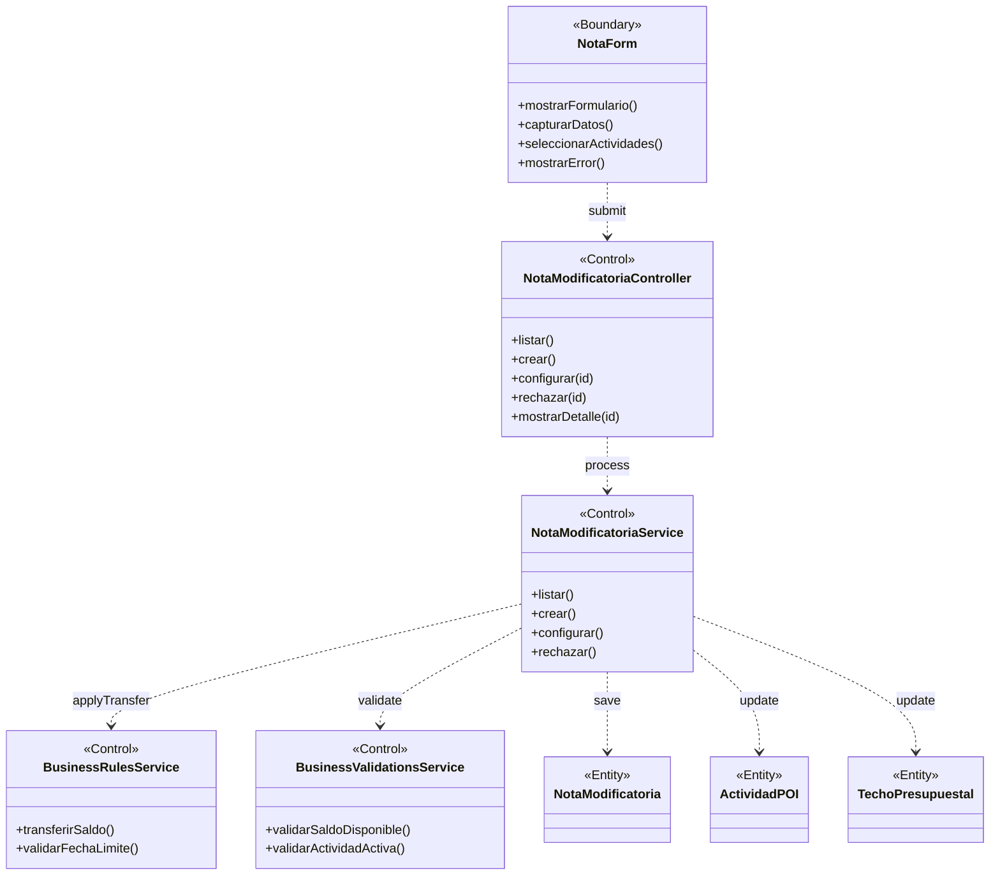

### Instrucciones para StarUML

1. Crear `UMLClassDiagram` "BCE-CU09-GestionarNotaModificatoria"
2. Crear 1 `<<Boundary>>`: **NotaForm** (azul claro)
3. Crear 4 `<<Control>>`: **NotaModificatoriaController**, **NotaModificatoriaService**, **BusinessRulesService**, **BusinessValidationsService** (amarillo)
4. Crear 3 `<<Entity>>`: **NotaModificatoria**, **ActividadPOI**, **TechoPresupuestal** (verde claro)

---

## BCE10: Ver Reportes

### Identificación

| Campo | Valor |
|-------|-------|
| **ID** | BCE-CU10 |
| **Caso de Uso** | CU10: Ver Reportes |
| **Diagram Type** | UML Class Diagram con estereotipos |
| **Actores** | Administrador, Coordinacion, Decanato, Director (REPORTES_VER) |

### Objetos involucrados

| Tipo | Nombre | Descripción |
|:----:|:------|:------------|
| `<<Boundary>>` | ReporteView | Página de reportes con filtros y visualización |
| `<<Control>>` | ReporteController | `ReporteController.java` — endpoints de reportes |
| `<<Control>>` | ReporteService | `ReporteService.java` — generación de reportes |
| `<<Entity>>` | Expediente | Datos para reporte de expedientes |
| `<<Entity>>` | ActividadPOI | Datos para reporte POI |
| `<<Entity>>` | NecesidadPAP | Datos para reporte PAP |
| `<<Entity>>` | TechoPresupuestal | Datos para reporte anual |

### Dependencias

| Origen | Destino | Descripción |
|:------|:--------|:------------|
| ReporteView | ReporteController | Solicitud de reporte con filtros |
| ReporteController | ReporteService | Generación del reporte |
| ReporteService | Expediente | Consulta de expedientes |
| ReporteService | ActividadPOI | Consulta de actividades POI |
| ReporteService | NecesidadPAP | Consulta de necesidades PAP |
| ReporteService | TechoPresupuestal | Consulta de techos |

### Diagrama Mermaid

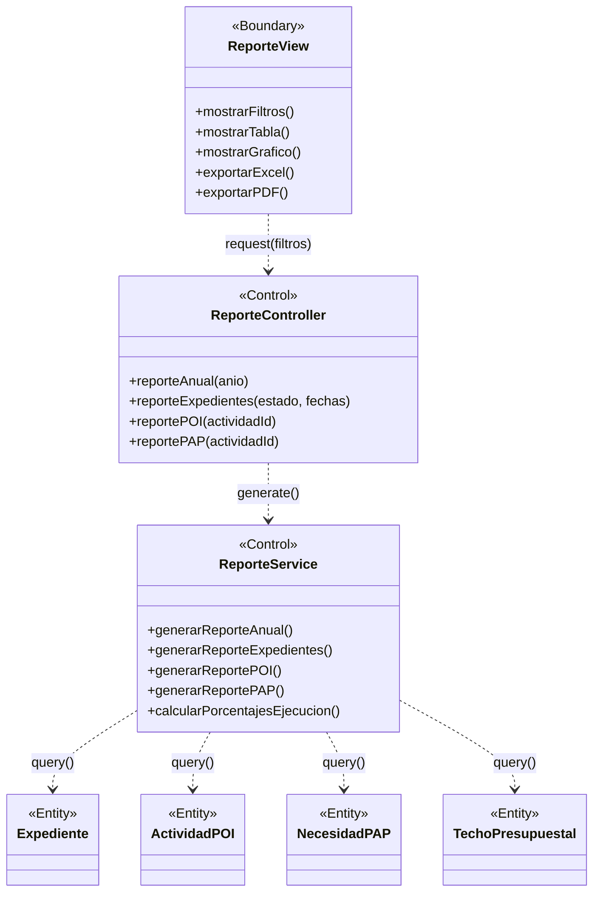

### Instrucciones para StarUML

1. Crear `UMLClassDiagram` "BCE-CU10-VerReportes"
2. Crear 1 `<<Boundary>>`: **ReporteView** (azul claro)
3. Crear 2 `<<Control>>`: **ReporteController**, **ReporteService** (amarillo)
4. Crear 4 `<<Entity>>`: **Expediente**, **ActividadPOI**, **NecesidadPAP**, **TechoPresupuestal** (verde claro)

---

## BCE11: Gestionar Usuarios

### Identificación

| Campo | Valor |
|-------|-------|
| **ID** | BCE-CU11 |
| **Caso de Uso** | CU11: Gestionar Usuarios |
| **Diagram Type** | UML Class Diagram con estereotipos |
| **Actores** | Administrador (USUARIO_ADMIN) |

### Objetos involucrados

| Tipo | Nombre | Descripción |
|:----:|:------|:------------|
| `<<Boundary>>` | UsuarioForm | Formulario de creación/edición de usuarios |
| `<<Control>>` | UsuarioController | `UsuarioController.java` — CRUD de usuarios |
| `<<Control>>` | UsuarioService | `UsuarioService.java` — lógica de gestión de usuarios |
| `<<Entity>>` | Usuario | Entidad con datos personales y de acceso |
| `<<Entity>>` | Rol | Entidad de roles disponibles |

### Dependencias

| Origen | Destino | Descripción |
|:------|:--------|:------------|
| UsuarioForm | UsuarioController | Submit del formulario |
| UsuarioController | UsuarioService | Delegación de operación |
| UsuarioService | Usuario | Persistencia del usuario |
| UsuarioService | Rol | Asignación de rol |

### Diagrama Mermaid

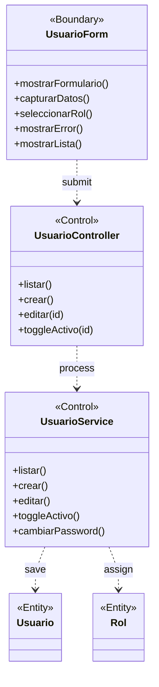

### Instrucciones para StarUML

1. Crear `UMLClassDiagram` "BCE-CU11-GestionarUsuarios"
2. Crear 1 `<<Boundary>>`: **UsuarioForm** (azul claro)
3. Crear 2 `<<Control>>`: **UsuarioController**, **UsuarioService** (amarillo)
4. Crear 2 `<<Entity>>`: **Usuario**, **Rol** (verde claro)

---

## BCE12: Gestionar Notificaciones

### Identificación

| Campo | Valor |
|-------|-------|
| **ID** | BCE-CU12 |
| **Caso de Uso** | CU12: Gestionar Notificaciones |
| **Diagram Type** | UML Class Diagram con estereotipos |
| **Actores** | Usuario autenticado (todos los roles) |

### Objetos involucrados

| Tipo | Nombre | Descripción |
|:----:|:------|:------------|
| `<<Boundary>>` | NotificacionView | Panel de notificaciones en el layout |
| `<<Control>>` | NotificacionController | `NotificacionController.java` — manejo de notificaciones |
| `<<Control>>` | NotificacionService | `NotificacionService.java` — lógica de notificaciones |
| `<<Entity>>` | Notificacion | Entidad con mensaje, tipo, estado leída |
| `<<Entity>>` | Usuario | Usuario destinatario de la notificación |

### Dependencias

| Origen | Destino | Descripción |
|:------|:--------|:------------|
| NotificacionView | NotificacionController | Solicitud de lista o acción |
| NotificacionController | NotificacionService | Procesamiento de la solicitud |
| NotificacionService | Notificacion | Actualización (marcar leída) |
| NotificacionService | Usuario | Filtrado por usuario destino |

### Diagrama Mermaid

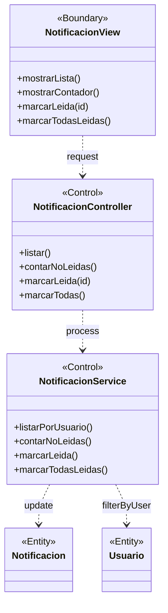

### Instrucciones para StarUML

1. Crear `UMLClassDiagram` "BCE-CU12-GestionarNotificaciones"
2. Crear 1 `<<Boundary>>`: **NotificacionView** (azul claro)
3. Crear 2 `<<Control>>`: **NotificacionController**, **NotificacionService** (amarillo)
4. Crear 2 `<<Entity>>`: **Notificacion**, **Usuario** (verde claro)

---

## BCE13: Rastrear Expediente (Público)

### Identificación

| Campo | Valor |
|-------|-------|
| **ID** | BCE-CU13 |
| **Caso de Uso** | CU13: Rastrear Expediente |
| **Diagram Type** | UML Class Diagram con estereotipos |
| **Actores** | Público (sin autenticación) |

### Objetos involucrados

| Tipo | Nombre | Descripción |
|:----:|:------|:------------|
| `<<Boundary>>` | RastreoView | Formulario público de rastreo y resultados |
| `<<Control>>` | RastreoController | `RastreoController.java` — búsqueda por código |
| `<<Control>>` | ExpedienteService | `ExpedienteService.java` — búsqueda en BD |
| `<<Entity>>` | Expediente | Datos del expediente (estado actual) |
| `<<Entity>>` | SeguimientoLog | Historial de cambios del expediente |

### Dependencias

| Origen | Destino | Descripción |
|:------|:--------|:------------|
| RastreoView | RastreoController | Ingreso de código de rastreo |
| RastreoController | ExpedienteService | Búsqueda por código |
| ExpedienteService | Expediente | Consulta del expediente |
| ExpedienteService | SeguimientoLog | Historial de seguimiento |

### Diagrama Mermaid

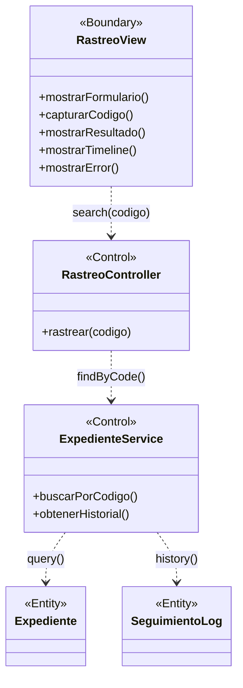

### Instrucciones para StarUML

1. Crear `UMLClassDiagram` "BCE-CU13-RastrearExpediente"
2. Crear 1 `<<Boundary>>`: **RastreoView** (azul claro)
3. Crear 2 `<<Control>>`: **RastreoController**, **ExpedienteService** (amarillo)
4. Crear 2 `<<Entity>>`: **Expediente**, **SeguimientoLog** (verde claro)

---

## BCE14: Cerrar Sesión

### Identificación

| Campo | Valor |
|-------|-------|
| **ID** | BCE-CU14 |
| **Caso de Uso** | CU14: Cerrar Sesión |
| **Diagram Type** | UML Class Diagram con estereotipos |
| **Actores** | Usuario autenticado |

### Objetos involucrados

| Tipo | Nombre | Descripción |
|:----:|:------|:------------|
| `<<Boundary>>` | HeaderView | Barra de navegación con opción "Cerrar Sesión" |
| `<<Control>>` | AuthController | `AuthController.java` — endpoint de logout |
| `<<Entity>>` | HttpSession | Sesión HTTP a invalidar (pseudo-entidad) |
| `<<Entity>>` | Cookie | Cookie "remember-me" a eliminar |

### Dependencias

| Origen | Destino | Descripción |
|:------|:--------|:------------|
| HeaderView | AuthController | Click en "Cerrar Sesión" |
| AuthController | HttpSession | Invalidación de sesión |
| AuthController | Cookie | Eliminación de cookie remember-me |

### Diagrama Mermaid

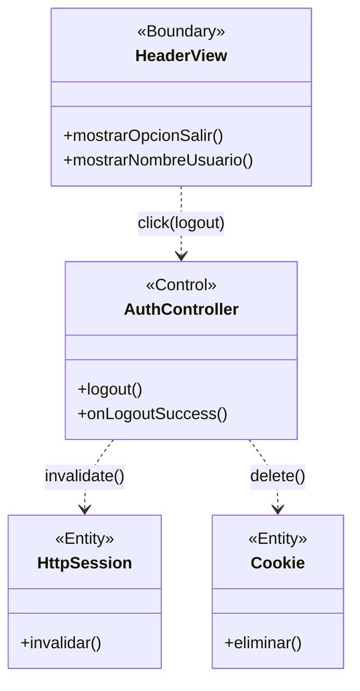

### Instrucciones para StarUML

1. Crear `UMLClassDiagram` "BCE-CU14-CerrarSesion"
2. Crear 1 `<<Boundary>>`: **HeaderView** (azul claro)
3. Crear 1 `<<Control>>`: **AuthController** (amarillo)
4. Crear 2 `<<Entity>>`: **HttpSession**, **Cookie** (verde claro) — notar que son pseudo-entidades
5. Asociaciones: HeaderView → AuthController → HttpSession y Cookie

---

## Verificación de Calidad ICONIX

| Criterio | Estado |
|:---------|:------:|
| Cada diagrama tiene al menos 1 Boundary, 1 Control, 1 Entity | ✅ |
| Actores solo se conectan a Boundary objects | ✅ (implícito en narrativa) |
| Boundary solo se conecta a Control objects | ✅ |
| Control se conecta a Entity y otros Control | ✅ |
| Entity nunca se conecta directamente a Boundary | ✅ |
| El diagrama cubre el flujo completo del CU (básico + alterno) | ✅ |
| Los nombres de los objetos reflejan su implementación real | ✅ |
| Trazabilidad: BCE-ID ↔ CU-ID ↔ RF ↔ SSD | ✅ |
