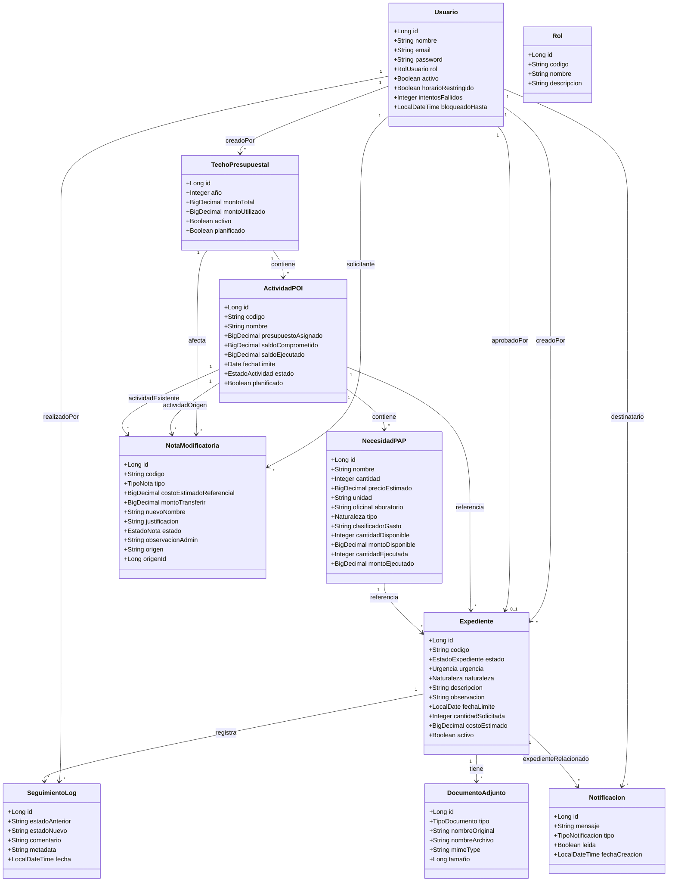

# ERS — Especificación de Requisitos de Software

## Sistema de Seguimiento y Control de Expedientes — SISEXP-UPLA

---

| Campo | Valor |
|---|---|
| **Proyecto** | SISEXP-UPLA — Sistema de Seguimiento y Control de Expedientes |
| **Estándar** | ISO/IEC 29148:2018 — Ingeniería de Sistemas y Software |
| **Metodología** | ICONIX — Fase 1: Análisis de Requisitos |
| **Versión** | 1.0 |
| **Fecha** | 23 de junio de 2026 |
| **Autor** | Equipo de Arquitectura de Software — VIII Ciclo — UPLA |
| **Dominio** | Gestión presupuestal de expedientes académico-administrativos |
| **Entidades** | 11 (Usuario, Rol, TechoPresupuestal, ActividadPOI, NecesidadPAP, Expediente, DocumentoAdjunto, SeguimientoLog, NotaModificatoria, Notificacion) |
| **Roles** | 6 (Administrador, Coordinacion, Secretaria, Director, Laboratorio, Decanato) |
| **Estados expediente** | 7 (Borrador, En_revision, Aprobado, Rechazado, Finalizado, Observado, Derivado) |

---

## Índice

1. [Introducción](#1-introducción)
   - 1.1 Propósito
   - 1.2 Alcance
   - 1.3 Definiciones, acrónimos y abreviaturas
   - 1.4 Referencias
   - 1.5 Visión general del documento
2. [Descripción General](#2-descripción-general)
   - 2.1 Perspectiva del producto
   - 2.2 Funciones del producto
   - 2.3 Características de los usuarios (actores)
   - 2.4 Restricciones
   - 2.5 Suposiciones y dependencias
3. [Requisitos Específicos](#3-requisitos-específicos)
   - 3.1 Requisitos Funcionales (RF01–RF14)
   - 3.2 Requisitos No Funcionales (RNF01–RNF08)
   - 3.3 Interfaces Externas
4. [Modelo de Casos de Uso](#4-modelo-de-casos-de-uso)
   - 4.1 Diagrama de Actores
   - 4.2 Especificación Detallada de Casos de Uso (CU01–CU14)
5. [Modelo de Dominio](#5-modelo-de-dominio)
   - 5.1 Diagrama de Clases
   - 5.2 Descripción de Entidades
6. [Matriz de Trazabilidad](#6-matriz-de-trazabilidad)
7. [Apéndices](#7-apéndices)
   - 7.1 Glosario de términos
   - 7.2 Referencias a documentos originales

---

## 1. Introducción

### 1.1 Propósito

Este documento constituye la **Especificación de Requisitos de Software (ERS)** para el sistema **SISEXP-UPLA** (Sistema de Seguimiento y Control de Expedientes de la Universidad Peruana Los Andes), elaborado siguiendo el estándar **ISO/IEC 29148:2018** y la metodología **ICONIX (Fase 1: Análisis de Requisitos)**.

El propósito de este documento es establecer una descripción completa, no ambigua y verificable de los requisitos del sistema, incluyendo:

- Requisitos funcionales (RF) y no funcionales (RNF)
- Modelo de casos de uso con especificaciones detalladas
- Modelo de dominio con entidades y relaciones
- Matriz de trazabilidad bidireccional entre requisitos, casos de uso y entidades

Este documento servirá como base contractual entre el equipo de desarrollo y los stakeholders, y como guía para las fases posteriores de ICONIX (Análisis, Diseño, Implementación y Pruebas).

### 1.2 Alcance

El sistema **SISEXP-UPLA** automatiza la gestión presupuestal de expedientes administrativos de la Oficina de Asuntos Administrativos, Planificación y Presupuesto de la Facultad de Ingeniería de la UPLA. Cubre el ciclo presupuestal completo:

```
Techo Presupuestal → Actividades POI → Necesidades PAP → Expedientes
```

**Incluye:**
- Autenticación y control de acceso basado en roles (RBAC) con 6 roles
- Gestión del ciclo presupuestal: techos, POI, PAP, expedientes
- Flujo de trabajo de expedientes con 7 estados y reglas de negocio de saldos
- Control de horario laboral (8am–8pm, hora Perú) con bypass para Administrador
- Notificaciones automáticas por cambio de estado
- Reportes institucionales (expedientes, POI, PAP, informe anual)
- Rastreo público de expedientes por código
- Notas modificatorias para redistribución presupuestal

**Excluye:**
- Módulo de firmas digitales o certificación electrónica
- Integración con sistemas externos de tesorería o contabilidad gubernamental
- Almacenamiento físico de archivos PDF (solo metadatos)
- Módulo de planilla o recursos humanos

### 1.3 Definiciones, acrónimos y abreviaturas

| Término | Definición |
|---|---|
| **ERS** | Especificación de Requisitos de Software (equivalente a SRS — Software Requirements Specification) |
| **ICONIX** | Metodología ágil de desarrollo de software basada en UML, con 4 fases: Análisis de Requisitos, Análisis y Diseño Preliminar, Diseño Detallado, Implementación |
| **ISO/IEC 29148** | Estándar internacional para la especificación de requisitos de sistemas y software |
| **RF** | Requisito Funcional |
| **RNF** | Requisito No Funcional |
| **CU** | Caso de Uso |
| **RBAC** | Role-Based Access Control — Control de acceso basado en roles |
| **POI** | Plan Operativo Institucional |
| **PAP** | Plan Anual de Contrataciones |
| **KPI** | Key Performance Indicator — Indicador clave de rendimiento |
| **BCrypt** | Algoritmo de hash para almacenamiento seguro de contraseñas |
| **JWT** | JSON Web Token — Token de autenticación |
| **SSD** | System Sequence Diagram — Diagrama de secuencia del sistema |
| **BCE** | Boundary-Control-Entity — Patrón de robustez ICONIX |
| **UPLA** | Universidad Peruana Los Andes |
| **Techo** | Techo Presupuestal — presupuesto anual asignado a la facultad |
| **Bypass horario** | Excepción a la restricción de horario laboral (solo Administrador) |
| **Saldo comprometido** | Monto reservado para expedientes en revisión |
| **Saldo ejecutado** | Monto ya gastado en expedientes aprobados/finalizados |

### 1.4 Referencias

| ID | Documento | Fuente |
|---|---|---|
| [R1] | ISO/IEC 29148:2018 — Systems and software engineering — Life cycle processes — Requirements engineering | Estándar internacional |
| [R2] | ICONIX: Use Case Driven Object Modeling with UML — Doug Rosenberg | Libro de referencia metodológica |
| [R3] | SDD SISEXP-UPLA v4.0 — Documento de Diseño de Software (IEEE 1016-2009) | `docs/referencia/doc/` |
| [R4] | DOMINIO_SISEXP.md — Modelo de dominio completo extraído del código original Express/React v2.0 | `docs/referencia/DOMINIO_SISEXP.md` |
| [R5] | FUNCIONALIDADES_SISEXP.md — Manual de funcionalidades del sistema | `docs/FUNCIONALIDADES_SISEXP.md` |
| [R6] | Informe_Trazabilidad_v4.md — Trazabilidad entre casos de uso e implementación v2.0 | `docs/referencia/doc/Informe_Trazabilidad_v4.md` |
| [R7] | Informe_Inconsistencias_SDD_ERS.md — Inconsistencias entre documentos originales | `docs/referencia/doc/Informe_Inconsistencias_SDD_ERS.md` |
| [R8] | PLAN.md — Plan detallado de implementación por fases | `PLAN.md` |
| [R9] | AGENTS.md — Memoria del proyecto Spring Boot | `AGENTS.md` |

### 1.5 Visión general del documento

Este documento está organizado siguiendo la estructura recomendada por ISO/IEC 29148:2018 (Sección 5.1.6 — Contenido de la ERS). La **Sección 1** presenta la introducción. La **Sección 2** describe el sistema de forma general. La **Sección 3** detalla los requisitos específicos (funcionales, no funcionales e interfaces). La **Sección 4** presenta el modelo de casos de uso completo. La **Sección 5** describe el modelo de dominio. La **Sección 6** contiene la matriz de trazabilidad. La **Sección 7** incluye apéndices.

---

## 2. Descripción General

### 2.1 Perspectiva del producto

SISEXP-UPLA es un **sistema web de gestión presupuestal** que reemplaza el proceso manual de registro y seguimiento de expedientes de gasto. El sistema permite a los diferentes actores (desde personal de laboratorio hasta el decanato) crear, revisar, aprobar y dar seguimiento a solicitudes de gasto, con control automático de saldos presupuestales en tiempo real.

**Ciclo presupuestal que automatiza:**

1. La facultad recibe un **Techo Presupuestal** anual (ej: S/ 115,000 para 2026).
2. Este monto se distribuye en **Actividades POI** (ej: equipamiento de laboratorios, licencias de software).
3. Cada actividad contiene **Necesidades PAP** (ítems específicos: computadoras, microscopios, etc.).
4. Los usuarios crean **Expedientes** que solicitan recursos de una necesidad PAP específica.
5. Cada expediente pasa por un flujo de **7 estados** con reglas de negocio automáticas de reserva/liberación/ejecución de saldos.

**Arquitectura objetivo:**

- Backend: Spring Boot 3.4.1 + Java 17
- Frontend: Thymeleaf + Bootstrap 5.3 (server-side rendering MVC)
- Base de datos: PostgreSQL (producción) / H2 (desarrollo local)
- Seguridad: Spring Security con form login + Remember Me 30 días
- Despliegue: Railway (Docker)

### 2.2 Funciones del producto (lista de RF)

El sistema implementa **14 requisitos funcionales** agrupados en 5 áreas:

| Área | RF | Descripción |
|---|---|---|
| **Autenticación** | RF01 | Iniciar Sesión |
| | RF14 | Cerrar Sesión |
| **Dashboard** | RF02 | Ver Dashboard (KPIs) |
| **Gestión de Expedientes** | RF03 | Crear Expediente |
| | RF04 | Cambiar Estado de Expediente |
| | RF05 | Adjuntar Documento a Expediente |
| **Gestión Presupuestal** | RF06 | Gestionar Techo Presupuestal |
| | RF07 | Gestionar Actividad POI |
| | RF08 | Gestionar Necesidad PAP |
| | RF09 | Gestionar Nota Modificatoria |
| **Reportes y Consultas** | RF10 | Ver Reportes |
| | RF11 | Gestionar Usuarios |
| | RF12 | Gestionar Notificaciones |
| | RF13 | Rastrear Expediente (público) |

### 2.3 Características de los usuarios (actores)

| Actor | Rol en sistema | Perfil | Descripción | Módulos visibles | Acceso horario |
|---|---|---|---|---|---|
| **Administrador** | Administrador | admin_planificacion | Gestión total del sistema, bypass horario 24/7 | 8 (todos) | Bypass 24/7 |
| **Coordinador** | Coordinacion | admin_planificacion | Gestión presupuestal (techos, POI, PAP, aprueba/rechaza) | 7 (excepto Usuarios) | Restringido (8am–8pm) |
| **Secretaria** | Secretaria | secretarial | Creación y gestión de expedientes, documentos, finalización | 6 (sin Reportes, sin Usuarios) | Restringido (8am–8pm) |
| **Director** | Director | solicitante | Crea expedientes, aprueba/rechaza (límite S/ 15,000), ve reportes | 7 (sin Usuarios) | Restringido (8am–8pm) |
| **Laboratorio** | Laboratorio | solicitante | Crea expedientes propios (límite S/ 5,000) | 5 (sin Techos, Reportes, Usuarios) | Restringido (8am–8pm) |
| **Decanato** | Decanato | consulta | Solo consulta de reportes y lectura | 4 (Dashboard, PAP, Reportes, Notas) | Restringido (8am–8pm) |
| **Visitante** | Sin autenticación | — | Rastreo público de expedientes por código | 1 (Rastreo) | Público |

**Permisos granulares por rol (18 acciones):**

| Acción | Admin | Coord | Sec | Dir | Lab | Dec |
|---|---|---|---|---|---|---|
| `EXP_CREAR` | ✅ | ✅ | ✅ | ✅ | ✅ | ❌ |
| `EXP_APROBAR_OBSERVAR` | ✅ | ✅ | ❌ | ❌ | ❌ | ❌ |
| `EXP_RECHAZAR` | ✅ | ✅ | ❌ | ❌ | ❌ | ❌ |
| `EXP_FINALIZAR` | ✅ | ✅ | ✅ | ❌ | ❌ | ❌ |
| `EXP_DERIVAR` | ✅ | ✅ | ✅ | ❌ | ❌ | ❌ |
| `EXP_CAMBIAR_ESTADO` | ✅ | ✅ | ❌ | ❌ | ❌ | ❌ |
| `EXP_SUBIR_DOCUMENTO` | ✅ | ✅ | ✅ | ✅ | ✅ | ❌ |
| `EXP_ELIMINAR_DOCUMENTO` | ✅ | ❌ | ❌ | ❌ | ❌ | ❌ |
| `EXP_VER_TODOS` | ✅ | ✅ | ✅ | ❌ | ❌ | ❌ |
| `POI_CREAR_EDITAR` | ✅ | ❌ | ❌ | ❌ | ❌ | ❌ |
| `POI_VER` | ✅ | ✅ | ✅ | ✅ | ✅ | ✅ |
| `PAP_CREAR_EDITAR` | ✅ | ✅ | ❌ | ❌ | ❌ | ❌ |
| `PAP_ELIMINAR` | ✅ | ❌ | ❌ | ❌ | ❌ | ❌ |
| `TECHO_CREAR_EDITAR` | ✅ | ✅ | ❌ | ❌ | ❌ | ❌ |
| `TECHO_VER` | ✅ | ✅ | ✅ | ✅ | ✅ | ✅ |
| `USUARIO_ADMIN` | ✅ | ❌ | ❌ | ❌ | ❌ | ❌ |
| `REPORTES_VER` | ✅ | ✅ | ❌ | ✅ | ❌ | ✅ |

**Límites de monto por rol:**

| Rol | Límite máximo por expediente |
|---|---|
| Administrador | Ilimitado |
| Coordinacion | Ilimitado |
| Director | S/ 15,000 |
| Secretaria | S/ 5,000 |
| Laboratorio | S/ 5,000 |
| Decanato | S/ 0 (solo consulta) |

### 2.4 Restricciones

| ID | Restricción | Descripción |
|---|---|---|
| **R01** | Horario laboral | El sistema solo es accesible de 8:00 AM a 8:00 PM (hora Perú, `America/Lima`). Usuarios con `horarioRestringido = true` no pueden acceder fuera de este horario. El Administrador tiene bypass. |
| **R02** | Stack tecnológico | Backend: Spring Boot 3.4.1 + Java 17. Frontend: Thymeleaf + Bootstrap 5.3. BD: PostgreSQL (prod) / H2 (dev). Seguridad: Spring Security. |
| **R03** | Autenticación | Form login con Spring Security. Remember Me con validez de 30 días. Contraseñas almacenadas con BCrypt. |
| **R04** | Control de intentos | Máximo 5 intentos fallidos de login. Luego, bloqueo automático por 30 minutos. |
| **R05** | Base de datos | PostgreSQL 15 en producción. H2 en memoria para desarrollo local. Transacciones ACID obligatorias en operaciones de saldo. |
| **R06** | CSRF | Las rutas `/api/**` están exentas de protección CSRF. El resto de rutas Thymeleaf tienen CSRF activado. |
| **R07** | Despliegue | Docker multi-stage, despliegue en Railway. Puerto 8081. |

### 2.5 Suposiciones y dependencias

- El sistema asume que existe una conexión de red estable entre el frontend y el backend.
- La base de datos PostgreSQL debe estar configurada con codificación UTF-8.
- El archivo `application.properties` debe contener las credenciales de BD como variables de entorno (no hardcodeadas).
- Se asume que los usuarios tienen un correo electrónico válido y único como identificador de login.
- El seed data se carga automáticamente en cada deploy (mientras la BD esté vacía).
- No se requiere integración con Active Directory, LDAP ni SSO.
- El sistema no almacena archivos PDF físicos; solo metadatos de documentos.

---

## 3. Requisitos Específicos

### 3.1 Requisitos Funcionales (RF01–RF14)

---

#### RF01: Iniciar Sesión

| Propiedad | Valor |
|---|---|
| **ID** | RF01 |
| **Título** | Iniciar Sesión |
| **Descripción** | El sistema debe autenticar usuarios mediante formulario de login con email y contraseña, verificar el estado de la cuenta (activa, no bloqueada), y establecer una sesión HTTP con remember-me configurable de 30 días. Debe controlar intentos fallidos (máximo 5, luego bloqueo de 30 minutos). |
| **Prioridad** | Alta |
| **Estabilidad** | Alta |
| **Actor(es)** | Todos los actores autenticables (Administrador, Coordinacion, Secretaria, Director, Laboratorio, Decanato) |
| **Caso de Uso** | CU01 |

---

#### RF02: Ver Dashboard

| Propiedad | Valor |
|---|---|
| **ID** | RF02 |
| **Título** | Ver Dashboard (KPIs) |
| **Descripción** | El sistema debe mostrar una página de inicio con KPIs: total de expedientes, distribución por estado (7 estados), expedientes vencidos, barras de ejecución presupuestal por Actividad POI (ejecutado/comprometido/disponible), y lista de alertas de expedientes próximos a vencer. |
| **Prioridad** | Alta |
| **Estabilidad** | Alta |
| **Actor(es)** | Todos los actores autenticados |
| **Caso de Uso** | CU02 |

---

#### RF03: Crear Expediente

| Propiedad | Valor |
|---|---|
| **ID** | RF03 |
| **Título** | Crear Expediente |
| **Descripción** | El sistema debe permitir crear expedientes con: selección de Actividad POI, carga dinámica de Necesidad PAP (vía AJAX), cálculo automático de costo (cantidad × precio unitario), selección de urgencia, naturaleza, cantidad solicitada, fecha límite y descripción. Debe generar código único EXP-YYYY-NNNN, validar saldo disponible, fecha límite de actividad, límite por rol, tope 80% del disponible, correspondencia Bien/Servicio y período fiscal abierto. Al crear, debe registrar el estado inicial "Borrador" y crear un registro en SeguimientoLog. |
| **Prioridad** | Alta |
| **Estabilidad** | Alta |
| **Actor(es)** | Laboratorio, Secretaria, Administrador, Coordinacion, Director |
| **Caso de Uso** | CU03 |

---

#### RF04: Cambiar Estado de Expediente

| Propiedad | Valor |
|---|---|
| **ID** | RF04 |
| **Título** | Cambiar Estado de Expediente |
| **Descripción** | El sistema debe permitir cambiar el estado de un expediente respetando las transiciones permitidas: Borrador→En_revision, En_revision→Aprobado/Rechazado/Observado, Observado→En_revision, Aprobado→Finalizado/Derivado, Derivado→Finalizado. Cada transición debe ejecutar automáticamente las reglas de negocio de saldo: reservar (En_revision), liberar (Rechazado/Observado), ejecutar (Aprobado). Estados Rechazado y Finalizado son terminales. Debe generar una notificación automática al solicitante y registrar en SeguimientoLog. |
| **Prioridad** | Alta |
| **Estabilidad** | Alta |
| **Actor(es)** | Secretaria, Director, Administrador, Coordinacion |
| **Caso de Uso** | CU04 |

---

#### RF05: Adjuntar Documento a Expediente

| Propiedad | Valor |
|---|---|
| **ID** | RF05 |
| **Título** | Adjuntar Documento a Expediente |
| **Descripción** | El sistema debe permitir adjuntar documentos (metadatos) a un expediente en estado Borrador u Observado. Los tipos de documento son: TDR, Especificaciones_Tecnicas, Cotizacion, Informe_Tecnico. Solo el Administrador puede eliminar documentos de cualquier expediente. Se requiere al menos un documento adjunto para enviar el expediente a revisión. |
| **Prioridad** | Media |
| **Estabilidad** | Alta |
| **Actor(es)** | Laboratorio, Secretaria, Administrador, Coordinacion, Director |
| **Caso de Uso** | CU05 |

---

#### RF06: Gestionar Techo Presupuestal

| Propiedad | Valor |
|---|---|
| **ID** | RF06 |
| **Título** | Gestionar Techo Presupuestal |
| **Descripción** | El sistema debe permitir CRUD completo de techos presupuestales por año. Cada techo tiene: año (único), monto total, monto utilizado (cálculo automático), activo/inactivo, planificado/abierto. Un techo planificado no permite modificaciones. El año se auto-sugiere como año actual + 1 al crear. |
| **Prioridad** | Alta |
| **Estabilidad** | Alta |
| **Actor(es)** | Administrador, Coordinacion |
| **Caso de Uso** | CU06 |

---

#### RF07: Gestionar Actividad POI

| Propiedad | Valor |
|---|---|
| **ID** | RF07 |
| **Título** | Gestionar Actividad POI |
| **Descripción** | El sistema debe permitir CRUD de actividades POI dentro de un techo presupuestal. Cada actividad tiene: código, nombre, presupuesto asignado, saldo comprometido, saldo ejecutado, fecha límite, estado (Pendiente/En_Ejecucion/Ejecutado/Cerrado), planificado. La disponibilidad real se calcula como: `presupuestoAsignado - saldoComprometido - saldoEjecutado`. |
| **Prioridad** | Alta |
| **Estabilidad** | Alta |
| **Actor(es)** | Administrador, Coordinacion |
| **Caso de Uso** | CU07 |

---

#### RF08: Gestionar Necesidad PAP

| Propiedad | Valor |
|---|---|
| **ID** | RF08 |
| **Título** | Gestionar Necesidad PAP |
| **Descripción** | El sistema debe permitir CRUD de necesidades PAP dentro de una actividad POI. Cada necesidad tiene: nombre, cantidad planificada, precio unitario, unidad, oficina/laboratorio destino, tipo (Bien/Servicio), clasificador de gasto, cantidad disponible, monto disponible, cantidad ejecutada, monto ejecutado. Los saldos se actualizan automáticamente al crear/cambiar estado de expedientes. |
| **Prioridad** | Alta |
| **Estabilidad** | Alta |
| **Actor(es)** | Administrador, Coordinacion |
| **Caso de Uso** | CU08 |

---

#### RF09: Gestionar Nota Modificatoria

| Propiedad | Valor |
|---|---|
| **ID** | RF09 |
| **Título** | Gestionar Nota Modificatoria |
| **Descripción** | El sistema debe permitir crear y procesar notas modificatorias para redistribución presupuestal. Tipos: inclusión de ítem (nuevo ítem en actividad existente) e inclusión de actividad (nueva actividad). Flujo: solicitud (pendiente) → configuración (Admin/Coordinación asignan origen y monto) → configurada (aprobada) o rechazada. Soporta adjunto PDF de sustento. |
| **Prioridad** | Media |
| **Estabilidad** | Media |
| **Actor(es)** | Administrador, Coordinacion, Secretaria, Laboratorio, Director |
| **Caso de Uso** | CU09 |

---

#### RF10: Ver Reportes

| Propiedad | Valor |
|---|---|
| **ID** | RF10 |
| **Título** | Ver Reportes |
| **Descripción** | El sistema debe generar reportes institucionales con 4 vistas: (1) expedientes: KPI por estado + tabla detalle + exportar CSV; (2) POI: tabla con % ejecución + barra de progreso + exportar CSV; (3) PAP: tabla detallada cantidades + exportar CSV; (4) Informe anual: comparativa entre años fiscales con cards y barras de progreso. |
| **Prioridad** | Media |
| **Estabilidad** | Alta |
| **Actor(es)** | Administrador, Coordinacion, Director, Decanato |
| **Caso de Uso** | CU10 |

---

#### RF11: Gestionar Usuarios

| Propiedad | Valor |
|---|---|
| **ID** | RF11 |
| **Título** | Gestionar Usuarios |
| **Descripción** | El sistema debe permitir CRUD completo de usuarios (solo Administrador). Incluye: crear (nombre, email, contraseña, rol, horario), editar (excepto contraseña), cambiar contraseña (modal independiente), activar/desactivar (toggle soft delete). Validación de email único. Colores por rol: Admin=rojo, Coord=azul, Sec=violeta, Dir=cyan, Lab=naranja, Dec=gris. |
| **Prioridad** | Alta |
| **Estabilidad** | Alta |
| **Actor(es)** | Administrador |
| **Caso de Uso** | CU11 |

---

#### RF12: Gestionar Notificaciones

| Propiedad | Valor |
|---|---|
| **ID** | RF12 |
| **Título** | Gestionar Notificaciones |
| **Descripción** | El sistema debe generar notificaciones automáticas al cambiar el estado de un expediente. Tipos: observacion, rechazo, aprobacion, alerta_fecha, nota_aprobada, nota_rechazada, info. Debe mostrar un badge en el header con el conteo de no leídas (actualización vía AJAX cada 60s). Debe permitir marcar individual o masivamente como leídas. |
| **Prioridad** | Media |
| **Estabilidad** | Media |
| **Actor(es)** | Todos los actores autenticados |
| **Caso de Uso** | CU12 |

---

#### RF13: Rastrear Expediente (público)

| Propiedad | Valor |
|---|---|
| **ID** | RF13 |
| **Título** | Rastrear Expediente |
| **Descripción** | El sistema debe permitir consulta pública de expedientes por código (formato EXP-YYYY-NNNN) sin autenticación. Debe mostrar: código, estado (badge de color), actividad POI, ítem PAP, urgencia, fecha límite, última actualización. No debe exponer montos exactos ni datos del solicitante. Ruta exenta de horario laboral y autenticación. |
| **Prioridad** | Baja |
| **Estabilidad** | Alta |
| **Actor(es)** | Visitante (sin autenticación) |
| **Caso de Uso** | CU13 |

---

#### RF14: Cerrar Sesión

| Propiedad | Valor |
|---|---|
| **ID** | RF14 |
| **Título** | Cerrar Sesión |
| **Descripción** | El sistema debe cerrar la sesión del usuario, invalidar la sesión HTTP, eliminar las cookies JSESSIONID y remember-me, y redirigir a la página de login con mensaje de cierre exitoso. |
| **Prioridad** | Alta |
| **Estabilidad** | Alta |
| **Actor(es)** | Todos los actores autenticados |
| **Caso de Uso** | CU14 |

---

### 3.2 Requisitos No Funcionales (RNF01–RNF08)

---

#### RNF01: Seguridad

| Propiedad | Valor |
|---|---|
| **ID** | RNF01 |
| **Título** | Seguridad |
| **Descripción** | El sistema debe almacenar contraseñas con BCrypt (costo $2a$10). Las sesiones HTTP deben utilizar cookie segura con flag HttpOnly y SameSite=Lax. El endpoint de login debe protegerse contra fuerza bruta (máximo 5 intentos fallidos, bloqueo 30 minutos). Las contraseñas no deben exponerse en respuestas JSON (anotación `@JsonProperty(access = WRITE_ONLY)`). RBAC implementado con Spring Security `@PreAuthorize`. |
| **Prioridad** | Alta |
| **Estabilidad** | Alta |

---

#### RNF02: Horario Laboral

| Propiedad | Valor |
|---|---|
| **ID** | RNF02 |
| **Título** | Restricción de horario laboral |
| **Descripción** | El sistema debe restringir el acceso fuera del horario laboral (8:00 AM – 8:00 PM, hora Perú, `America/Lima`). Usuarios con `horarioRestringido = true` no pueden acceder fuera de ese horario. El Administrador (`horarioRestringido = false`) tiene bypass. Rutas exentas: `/login`, `/rastreo/**`, `/api/health`, `/error`, `/css/**`, `/js/**`, `/vendor/**`, `/favicon.ico`. |
| **Prioridad** | Alta |
| **Estabilidad** | Alta |

---

#### RNF03: Rendimiento

| Propiedad | Valor |
|---|---|
| **ID** | RNF03 |
| **Título** | Rendimiento |
| **Descripción** | La carga del dashboard no debe exceder 2 segundos. Las consultas de listado de expedientes deben responder en menos de 1 segundo. Las tablas deben tener índices en columnas de búsqueda frecuente (código, estado, año, email). Las consultas AJAX de notificaciones deben completarse en menos de 500ms. |
| **Prioridad** | Media |
| **Estabilidad** | Media |

---

#### RNF04: Disponibilidad

| Propiedad | Valor |
|---|---|
| **ID** | RNF04 |
| **Título** | Disponibilidad |
| **Descripción** | El sistema debe tener un 99.5% de uptime. El despliegue en Railway debe incluir PostgreSQL como servicio gestionado. La aplicación debe iniciar en menos de 30 segundos en un contenedor Docker. |
| **Prioridad** | Media |
| **Estabilidad** | Alta |

---

#### RNF05: Escalabilidad

| Propiedad | Valor |
|---|---|
| **ID** | RNF05 |
| **Título** | Escalabilidad |
| **Descripción** | La arquitectura debe ser horizontalmente escalable (Spring Boot stateless). La sesión no debe almacenar estado en memoria del servidor (solo en cookie). Debe soportar hasta 100 usuarios concurrentes sin degradación. |
| **Prioridad** | Baja |
| **Estabilidad** | Media |

---

#### RNF06: Mantenibilidad

| Propiedad | Valor |
|---|---|
| **ID** | RNF06 |
| **Título** | Mantenibilidad |
| **Descripción** | El código debe seguir la estructura de paquetes definida (`config/`, `security/`, `model/`, `enums/`, `repository/`, `dto/`, `service/`, `controller/`, `exception/`). Los servicios críticos (BusinessRulesService, cambio de estado) deben tener pruebas unitarias. La documentación del código debe mantenerse en AGENTS.md. |
| **Prioridad** | Media |
| **Estabilidad** | Alta |

---

#### RNF07: Usabilidad

| Propiedad | Valor |
|---|---|
| **ID** | RNF07 |
| **Título** | Usabilidad |
| **Descripción** | La interfaz debe ser responsive con Bootstrap 5.3. Los badges de estado deben tener colores distintivos: Borrador=gris, En_revision=amarillo, Aprobado=verde, Rechazado=rojo, Finalizado=azul, Observado=rosa, Derivado=púrpura. Los formularios deben tener validación en tiempo real con mensajes de error claros. Los modales deben tener confirmación para acciones destructivas. |
| **Prioridad** | Media |
| **Estabilidad** | Alta |

---

#### RNF08: Integridad de Datos

| Propiedad | Valor |
|---|---|
| **ID** | RNF08 |
| **Título** | Integridad de datos |
| **Descripción** | Todas las operaciones de saldo (reserva/liberación/ejecución) deben ejecutarse dentro de transacciones ACID. Las operaciones de cambio de estado y actualización de saldos deben ser atómicas (si falla una, falla todo). Los saldos no pueden volverse negativos (validación con `max(BigDecimal.ZERO, nuevoSaldo)`). |
| **Prioridad** | Alta |
| **Estabilidad** | Alta |

---

### 3.3 Interfaces Externas

#### 3.3.1 Interfaz de Usuario (Thymeleaf + Bootstrap 5.3)

La interfaz de usuario se implementa con templates Thymeleaf (server-side rendering) y Bootstrap 5.3. Las vistas principales son:

| Vista | Ruta | Descripción |
|---|---|---|
| Login | `/login` | Página de inicio de sesión con diseño card + gradiente |
| Dashboard | `/dashboard` | KPIs, barras de progreso, alertas |
| Expedientes lista | `/expedientes` | Tabla paginada con filtros |
| Expediente detalle | `/expedientes/{id}` | Detalle + timeline + docs + cambio estado |
| Techos | `/techos` | CRUD de techos presupuestales |
| POI | `/poi` | CRUD de actividades POI |
| PAP | `/pap` | CRUD de necesidades PAP |
| Notas Modificatorias | `/notas` | Flujo de notas |
| Reportes | `/reportes` | 4 vistas en tabs |
| Usuarios | `/usuarios` | CRUD de usuarios (solo Admin) |
| Notificaciones | `/notificaciones` | Lista de notificaciones |
| Rastreo | `/rastreo` | Público, sin autenticación |

#### 3.3.2 API REST (`/api/**`)

Endpoints para consumo programático (React SPA original, mantenidos para compatibilidad):

| Método | Ruta | Uso |
|---|---|---|
| `GET` | `/api/expedientes` | Listar expedientes |
| `POST` | `/api/expedientes` | Crear expediente |
| `GET` | `/api/expedientes/{id}` | Obtener detalle |
| `PUT` | `/api/expedientes/{id}/estado` | Cambiar estado |
| `POST` | `/api/expedientes/{id}/documentos` | Subir documento |
| `DELETE` | `/api/expedientes/documentos/{docId}` | Eliminar documento |
| `GET` | `/api/expedientes/disponibilidad/{actividadId}/{necesidadId}` | Consultar disponibilidad |
| `GET` | `/api/techos` | Listar techos |
| `GET` | `/api/techos/{id}` | Obtener techo |
| `GET` | `/api/poi` | Listar actividades POI |
| `GET` | `/api/poi/{id}` | Obtener actividad POI |
| `GET` | `/api/pap` | Listar necesidades PAP |
| `GET` | `/api/pap/{id}` | Obtener necesidad PAP |
| `GET` | `/api/notificaciones/count` | Conteo no leídas |
| `POST` | `/api/notificaciones/{id}/leer` | Marcar como leída |
| `POST` | `/api/notificaciones/leer-todas` | Marcar todas leídas |
| `GET` | `/api/usuarios` | Listar usuarios (Admin) |
| `GET` | `/api/usuarios/{id}` | Obtener usuario |
| `POST` | `/api/usuarios` | Crear usuario |
| `PUT` | `/api/usuarios/{id}` | Actualizar usuario |
| `GET` | `/api/dashboard/alertas` | Alertas dashboard |
| `GET` | `/api/dashboard/saldos` | Saldos dashboard |
| `GET` | `/api/reportes/expedientes` | Reporte expedientes |
| `GET` | `/api/reportes/poi` | Reporte POI general |
| `GET` | `/api/reportes/pap` | Reporte PAP general |
| `GET` | `/api/reportes/anual/{anio}` | Informe anual |

#### 3.3.3 Base de Datos

- **Producción:** PostgreSQL 15 en Railway
- **Desarrollo local:** H2 en memoria (perfil `dev`)
- **ORM:** Spring Data JPA / Hibernate 6.6.4
- **DDL:** `spring.jpa.hibernate.ddl-auto=update` (en desarrollo), migraciones manuales en producción
- **Conexión:** Configurada vía `application.properties` con variables de entorno para credenciales

---

## 4. Modelo de Casos de Uso

### 4.1 Diagrama de Actores

```mermaid
flowchart TD
    subgraph Actores
        A["Administrador"]
        C["Coordinacion"]
        S["Secretaria"]
        D["Director"]
        L["Laboratorio"]
        N["Decanato"]
        V["Visitante\n(sin autenticación)"]
    end

    subgraph "CU01: Autenticación"
        CU01["(Iniciar Sesión)"]
        CU14["(Cerrar Sesión)"]
    end

    subgraph "CU02: Dashboard"
        CU02["(Ver Dashboard)"]
    end

    subgraph "Gestión de Expedientes"
        CU03["(Crear Expediente)"]
        CU04["(Cambiar Estado)"]
        CU05["(Adjuntar Documento)"]
    end

    subgraph "Gestión Presupuestal"
        CU06["(Gestionar Techo)"]
        CU07["(Gestionar Actividad POI)"]
        CU08["(Gestionar Necesidad PAP)"]
        CU09["(Gestionar Nota Modificatoria)"]
    end

    subgraph "Reportes y Consultas"
        CU10["(Ver Reportes)"]
        CU11["(Gestionar Usuarios)"]
        CU12["(Gestionar Notificaciones)"]
        CU13["(Rastrear Expediente)"]
    end

    A --> CU01 & CU02 & CU03 & CU04 & CU05 & CU06 & CU07 & CU08 & CU09 & CU10 & CU11 & CU12 & CU14
    C --> CU01 & CU02 & CU03 & CU04 & CU05 & CU06 & CU07 & CU08 & CU09 & CU10 & CU12 & CU14
    S --> CU01 & CU02 & CU03 & CU04 & CU05 & CU06 & CU07 & CU08 & CU09 & CU12 & CU14
    D --> CU01 & CU02 & CU03 & CU05 & CU06 & CU07 & CU08 & CU09 & CU10 & CU12 & CU14
    L --> CU01 & CU02 & CU03 & CU05 & CU07 & CU08 & CU09 & CU12 & CU14
    N --> CU01 & CU02 & CU08 & CU09 & CU10 & CU12 & CU14
    V --> CU13
```



### 4.2 Especificación Detallada de Casos de Uso

---

#### CU01: Iniciar Sesión

| Propiedad | Valor |
|---|---|
| **ID** | CU01 |
| **Nombre** | Iniciar Sesión |
| **Actor(es)** | Administrador, Coordinacion, Secretaria, Director, Laboratorio, Decanato |
| **Descripción** | El usuario ingresa su email y contraseña en el formulario de login. El sistema verifica las credenciales, el estado de la cuenta (activa, no bloqueada), y establece una sesión HTTP. Si el usuario marca "Recordarme", se genera una cookie con validez de 30 días. |
| **Precondición** | El usuario debe tener una cuenta activa en el sistema. |
| **Postcondición** | El usuario queda autenticado y es redirigido al Dashboard. Se registra la sesión. |

**Flujo básico:**

1. El actor navega a la página de login (`/login`).
2. El sistema muestra el formulario de login con campos email y contraseña, más checkbox "Recordarme (30 días)".
3. El actor ingresa su email y contraseña.
4. El actor hace clic en "Iniciar Sesión".
5. El sistema valida que los campos no estén vacíos.
6. El sistema busca al usuario por email en la base de datos.
7. El sistema verifica que el usuario esté activo (`activo = true`).
8. El sistema verifica que la cuenta no esté bloqueada (5 intentos fallidos en los últimos 30 minutos).
9. El sistema compara la contraseña ingresada con el hash BCrypt almacenado.
10. Si coincide, el sistema:
    - Resetea `intentosFallidos = 0` y `bloqueadoHasta = NULL`.
    - Crea la sesión HTTP.
    - Si marcó "Recordarme", genera cookie remember-me con validez 30 días.
    - Redirige al Dashboard.
11. El sistema muestra la página de Dashboard con los KPIs del usuario.

**Flujo alterno A — Credenciales inválidas:**

1. En el paso 9, si la contraseña no coincide.
2. El sistema incrementa `intentosFallidos` en 1.
3. Si `intentosFallidos >= 5`, el sistema establece `bloqueadoHasta = now() + 30 min`.
4. El sistema muestra mensaje de error: "Credenciales inválidas" o "Cuenta bloqueada. Intente nuevamente en 30 minutos."

**Flujo alterno B — Cuenta inactiva:**

1. En el paso 7, si `activo = false`.
2. El sistema muestra mensaje: "Su cuenta ha sido desactivada. Contacte al administrador."

**Flujo alterno C — Fuera de horario laboral:**

1. Si la solicitud se realiza fuera del horario 8am–8pm.
2. El sistema verifica si el usuario tiene `horarioRestringido = false` (Administrador).
3. Si no tiene bypass, redirige a `/login?horario` con mensaje: "El sistema solo está disponible de 8:00 AM a 8:00 PM."

| Requisitos asociados | RF01 |
|---|---|
| **Reglas de negocio** | RN01: Máximo 5 intentos fallidos, luego bloqueo 30 min. RN02: Horario laboral 8am–8pm. RN03: Admin tiene bypass horario. |

---

#### CU02: Ver Dashboard

| Propiedad | Valor |
|---|---|
| **ID** | CU02 |
| **Nombre** | Ver Dashboard |
| **Actor(es)** | Administrador, Coordinacion, Secretaria, Director, Laboratorio, Decanato |
| **Descripción** | El usuario visualiza la página principal del sistema con indicadores clave: total de expedientes, distribución por estado, barras de ejecución presupuestal por actividad POI, y alertas de expedientes vencidos/próximos a vencer. |
| **Precondición** | El usuario debe estar autenticado. |
| **Postcondición** | Se muestran los KPIs actualizados al momento de la consulta. |

**Flujo básico:**

1. El actor inicia sesión exitosamente (CU01) o navega a `/dashboard`.
2. El sistema carga los KPIs de expedientes (total, por estado).
3. El sistema calcula expedientes vencidos (fechaLímite < hoy, estado ≠ Finalizado/Rechazado).
4. El sistema consulta las actividades POI con sus saldos (presupuesto asignado, comprometido, ejecutado).
5. El sistema renderiza: 6 tarjetas KPI, barras de progreso por actividad y lista de alertas.

**Flujo alterno A — Sin datos:**

1. Si no hay expedientes registrados, se muestran tarjetas en cero y mensaje "No hay expedientes registrados."

| Requisitos asociados | RF02 |
|---|---|
| **Reglas de negocio** | RN04: Dashboard visible para todos los roles autenticados. |

---

#### CU03: Crear Expediente

| Propiedad | Valor |
|---|---|
| **ID** | CU03 |
| **Nombre** | Crear Expediente |
| **Actor(es)** | Laboratorio, Secretaria, Administrador, Coordinacion, Director |
| **Descripción** | El actor crea un nuevo expediente seleccionando actividad POI, necesidad PAP (carga dinámica), completando campos (urgencia, cantidad, descripción, fecha límite). El sistema valida reglas de negocio, genera código secuencial EXP-YYYY-NNNN, reserva saldo, y establece estado "Borrador". |
| **Precondición** | El usuario debe tener permiso `EXP_CREAR`. Debe existir al menos un techo presupuestal activo con actividades POI y necesidades PAP. |
| **Postcondición** | Se crea un expediente en estado Borrador con código único. Se registra en SeguimientoLog. Se reserva saldo en ActividadPOI y NecesidadPAP. |

**Flujo básico:**

1. El actor navega a "Crear Expediente".
2. El sistema carga la lista de actividades POI activas con saldo disponible.
3. El actor selecciona una actividad POI.
4. El sistema carga vía AJAX las necesidades PAP de esa actividad (nombre, precio unitario, cantidad disponible).
5. El actor selecciona una necesidad PAP e ingresa: cantidad solicitada, urgencia, descripción, fecha límite (opcional).
6. El sistema calcula automáticamente: `costoEstimado = cantidad × precioUnitario`.
7. El sistema valida:
    - Actividad no cerrada/planificada.
    - Fecha límite de actividad no vencida.
    - Saldo disponible suficiente (`costoEstimado <= disponible`).
    - Límite de monto del rol del solicitante.
    - Tope 80% del disponible.
    - Correspondencia Bien/Servicio entre PAP y expediente.
    - Período fiscal abierto (techo del año no cerrado/planificado).
8. El sistema genera código: `EXP-YYYY-NNNN` (secuencial por año).
9. El sistema reserva saldo en ActividadPOI (`saldoComprometido += costoEstimado`).
10. El sistema descuenta en NecesidadPAP (`cantidadDisponible -= cantidad`, `montoDisponible -= costoEstimado`).
11. El sistema crea el expediente con estado "Borrador".
12. El sistema registra en SeguimientoLog: "Expediente registrado", estadoNuevo = "Borrador".
13. El sistema redirige al detalle del expediente creado.

**Flujo alterno A — Saldo insuficiente:**

1. En el paso 7, si el saldo disponible es menor que el costo estimado.
2. El sistema muestra mensaje: "Saldo insuficiente en la actividad. Disponible: S/ X."

**Flujo alterno B — Límite de rol excedido:**

1. En el paso 7, si el costo estimado excede el límite del rol.
2. El sistema muestra mensaje: "El monto solicitado (S/ X) excede su límite de S/ Y."

**Flujo alterno C — Sin necesidades PAP disponibles:**

1. Si la actividad seleccionada no tiene necesidades PAP con cantidad disponible > 0.
2. El sistema muestra mensaje: "No hay necesidades PAP disponibles en esta actividad."

| Requisitos asociados | RF03 |
|---|---|
| **Reglas de negocio** | RN05: validar fecha límite actividad. RN06: validar saldo disponible. RN07: reservar saldo POI. RN08: reservar saldo PAP. RN09: límite de monto por rol. RN10: tope 80%. RN11: correspondencia Bien/Servicio. RN12: período fiscal abierto. RN13: documento obligatorio para enviar a revisión. |

---

#### CU04: Cambiar Estado de Expediente

| Propiedad | Valor |
|---|---|
| **ID** | CU04 |
| **Nombre** | Cambiar Estado de Expediente |
| **Actor(es)** | Secretaria (parcial), Director (parcial), Administrador, Coordinacion |
| **Descripción** | El actor cambia el estado de un expediente respetando las transiciones permitidas. Cada transición ejecuta reglas de negocio de saldo automáticas y genera notificación al solicitante. |
| **Precondición** | El usuario debe tener permiso `EXP_CAMBIAR_ESTADO` (Admin/Coord) o acciones específicas (Secretaria: finalizar/derivar; Director: aprobar/rechazar con límite S/ 15,000). |
| **Postcondición** | El expediente cambia de estado. Se actualizan saldos según reglas de negocio. Se registra en SeguimientoLog. Se genera notificación. |

**Flujo básico:**

1. El actor visualiza el detalle del expediente.
2. El sistema muestra el panel de cambio de estado con los estados permitidos según el estado actual y el rol del usuario.
3. El actor selecciona el nuevo estado y opcionalmente ingresa una observación.
4. El sistema valida que la transición esté permitida.
5. El sistema ejecuta las reglas de negocio según la transición:
    - **Borrador → En_revision:** `reservarSaldo()` en POI + PAP. Validar que tenga al menos 1 documento adjunto.
    - **En_revision → Aprobado:** `ejecutarSaldo()` en POI + PAP.
    - **En_revision → Rechazado:** `liberarSaldo()` en POI + PAP.
    - **En_revision → Observado:** `liberarSaldo()` en POI + PAP.
    - **Observado → En_revision:** `reservarSaldo()` en POI + PAP.
    - **Aprobado → Finalizado:** sin cambio de saldo.
    - **Aprobado → Derivado:** sin cambio de saldo.
    - **Derivado → Finalizado:** sin cambio de saldo.
6. El sistema actualiza el estado del expediente.
7. El sistema registra en SeguimientoLog: estadoAnterior, estadoNuevo, observación, usuarioId.
8. El sistema genera notificación al solicitante del expediente.
9. El sistema redirige al detalle del expediente actualizado.

**Flujo alterno A — Transición no permitida:**

1. En el paso 4, si la transición no está en la matriz de estados permitidos.
2. El sistema muestra mensaje: "No se puede cambiar de {estadoActual} a {estadoNuevo}."

**Flujo alterno B — Documento obligatorio faltante:**

1. En el paso 5, si se intenta pasar de Borrador a En_revision sin tener al menos un documento adjunto.
2. El sistema muestra mensaje: "Debe adjuntar al menos un documento antes de enviar a revisión."

**Matriz de transiciones permitidas:**

| Estado actual | Estados destino permitidos |
|---|---|
| Borrador | En_revision |
| En_revision | Aprobado, Rechazado, Observado |
| Observado | En_revision |
| Aprobado | Finalizado, Derivado |
| Derivado | Finalizado |
| Rechazado | (terminal) |
| Finalizado | (terminal) |

| Requisitos asociados | RF04 |
|---|---|
| **Reglas de negocio** | RN07: reservarSaldo. RN08: reservarSaldoPAP. RN14: ejecutarSaldo. RN15: liberarSaldo. RN16: inmutabilidad de estados terminales. RN13: documento obligatorio. RN17: generación de notificación automática. |

---

#### CU05: Adjuntar Documento a Expediente

| Propiedad | Valor |
|---|---|
| **ID** | CU05 |
| **Nombre** | Adjuntar Documento a Expediente |
| **Actor(es)** | Laboratorio, Secretaria, Administrador, Coordinacion, Director |
| **Descripción** | El actor adjunta metadatos de un documento a un expediente en estado Borrador u Observado. Tipos: TDR, Especificaciones_Tecnicas, Cotizacion, Informe_Tecnico. |
| **Precondición** | El expediente debe existir y estar en estado Borrador, En_revision, Observado o Derivado (estados editables). El usuario debe tener permiso `EXP_SUBIR_DOCUMENTO`. |
| **Postcondición** | Se crea un registro en DocumentoAdjunto. Se registra en SeguimientoLog. |

**Flujo básico:**

1. El actor visualiza el detalle del expediente.
2. El sistema muestra la sección de documentos con lista de adjuntos existentes y botón "Subir documento".
3. El actor hace clic en "Subir documento".
4. El sistema muestra un modal con: selector de tipo de documento (TDR, Especificaciones_Tecnicas, Cotizacion, Informe_Tecnico) e input de archivo.
5. El actor selecciona el tipo y el archivo (solo PDF, máximo 15 MB).
6. El sistema valida el tipo de archivo y el tamaño.
7. El sistema guarda los metadatos en DocumentoAdjunto.
8. El sistema registra en SeguimientoLog: "Documento adjuntado: [nombreOriginal]".
9. El sistema actualiza la lista de documentos visible en el detalle.

**Flujo alterno A — Expediente en estado no editable:**

1. Si el expediente está en Aprobado, Finalizado o Rechazado.
2. El sistema muestra mensaje: "El expediente no permite modificaciones en este estado."

**Flujo alterno B — Archivo no es PDF:**

1. En el paso 6, si el archivo no es PDF.
2. El sistema muestra mensaje: "Solo se permiten archivos PDF."

**Flujo alterno C — Archivo excede 15 MB:**

1. En el paso 6, si el archivo supera 15 MB.
2. El sistema muestra mensaje: "El archivo excede el tamaño máximo de 15 MB."

| Requisitos asociados | RF05 |
|---|---|
| **Reglas de negocio** | RN18: solo Admin puede eliminar documentos de cualquier expediente. RN13: se requiere al menos 1 documento para enviar a revisión. |

---

#### CU06: Gestionar Techo Presupuestal

| Propiedad | Valor |
|---|---|
| **ID** | CU06 |
| **Nombre** | Gestionar Techo Presupuestal |
| **Actor(es)** | Administrador, Coordinacion |
| **Descripción** | El actor gestiona los techos presupuestales anuales: crear, editar, activar/desactivar, cerrar planificación. |
| **Precondición** | El usuario debe tener permiso `TECHO_CREAR_EDITAR`. |
| **Postcondición** | Se crea/modifica/desactiva un techo presupuestal. |

**Flujo básico:**

1. El actor navega a "Techos Presupuestales".
2. El sistema muestra lista de techos en cards con barra de progreso de utilización.
3. El actor hace clic en "Nuevo Techo".
4. El sistema muestra modal con: año (auto-sugerido: año actual + 1), monto total.
5. El actor completa los campos y guarda.
6. El sistema valida que el año no esté duplicado.
7. El sistema crea el techo con estado activo y no planificado.

**Flujo alterno A — Editar techo:**

1. El actor hace clic en editar sobre un techo existente.
2. Si el techo está planificado, el sistema bloquea la edición.
3. El sistema muestra modal con campos editables.
4. El actor modifica y guarda.

**Flujo alterno B — Cerrar planificación:**

1. El actor hace clic en "Cerrar planificación".
2. El sistema confirma la acción.
3. El sistema marca el techo como `planificado = true` (no modificable).

| Requisitos asociados | RF06 |
|---|---|
| **Reglas de negocio** | RN19: techo planificado no permite modificaciones. RN20: año único. |

---

#### CU07: Gestionar Actividad POI

| Propiedad | Valor |
|---|---|
| **ID** | CU07 |
| **Nombre** | Gestionar Actividad POI |
| **Actor(es)** | Administrador, Coordinacion |
| **Descripción** | El actor gestiona actividades POI dentro de un techo presupuestal: crear, editar, cambiar estado. |
| **Precondición** | Debe existir al menos un techo presupuestal activo. El usuario debe tener permiso `POI_CREAR_EDITAR`. |
| **Postcondición** | Se crea/modifica una actividad POI. |

**Flujo básico:**

1. El actor navega a "Actividades POI".
2. El sistema muestra tabla con actividades filtrables por techo.
3. El actor hace clic en "Nueva Actividad".
4. El sistema muestra modal con: techo presupuestal (selector), código, nombre, presupuesto asignado, fecha límite.
5. El actor completa y guarda.
6. El sistema valida que el código sea único dentro del techo.
7. El sistema crea la actividad con estado "Pendiente".

**Flujo alterno A — Editar actividad:**

1. El actor edita una actividad existente.
2. Si techo está planificado o actividad está Cerrada, el sistema bloquea edición.
3. El sistema muestra modal y guarda cambios.

| Requisitos asociados | RF07 |
|---|---|
| **Reglas de negocio** | RN21: código único por techo. RN19: techo planificado bloquea edición de actividades. |

---

#### CU08: Gestionar Necesidad PAP

| Propiedad | Valor |
|---|---|
| **ID** | CU08 |
| **Nombre** | Gestionar Necesidad PAP |
| **Actor(es)** | Administrador, Coordinacion |
| **Descripción** | El actor gestiona necesidades PAP dentro de una actividad POI: crear, editar, eliminar. Se actualizan saldos automáticamente. |
| **Precondición** | Debe existir al menos una actividad POI activa. El usuario debe tener permiso `PAP_CREAR_EDITAR`. |
| **Postcondición** | Se crea/modifica/elimina una necesidad PAP. |

**Flujo básico:**

1. El actor navega a "Necesidades PAP".
2. El sistema muestra tabla filtrable por actividad POI.
3. El actor hace clic en "Nueva Necesidad".
4. El sistema muestra modal con: actividad POI, nombre, cantidad, precio unitario, unidad, tipo (Bien/Servicio), clasificador de gasto, oficina/laboratorio.
5. El actor completa y guarda.
6. El sistema calcula automáticamente: `total = cantidad × precioUnitario`, `montoDisponible = total`.
7. El sistema crea la necesidad PAP.

**Flujo alterno A — Eliminar necesidad:**

1. Si la necesidad tiene expedientes asociados, el sistema bloquea la eliminación.
2. El sistema muestra mensaje: "No se puede eliminar: tiene expedientes asociados."

| Requisitos asociados | RF08 |
|---|---|
| **Reglas de negocio** | RN22: no eliminar si tiene expedientes asociados. RN08: actualización automática de saldos PAP. |

---

#### CU09: Gestionar Nota Modificatoria

| Propiedad | Valor |
|---|---|
| **ID** | CU09 |
| **Nombre** | Gestionar Nota Modificatoria |
| **Actor(es)** | Administrador, Coordinacion, Secretaria, Laboratorio, Director |
| **Descripción** | El actor crea una solicitud de redistribución presupuestal. Admin/Coordinación la configuran (aprueban) o rechazan. |
| **Precondición** | Debe existir al menos una actividad POI activa. El usuario debe tener permisos según el rol. |
| **Postcondición** | Se crea una nota modificatoria. Puede quedar configurada (aprobada), rechazada o pendiente. |

**Flujo básico:**

1. El actor navega a "Notas Modificatorias".
2. El sistema muestra tabla con notas existentes.
3. El actor hace clic en "Nueva Nota".
4. El sistema muestra formulario: tipo (inclusión ítem/actividad), actividad existente, nombre nuevo ítem/actividad, justificación, costo estimado referencial, archivo PDF (opcional).
5. El actor completa y envía.
6. El sistema crea la nota en estado "pendiente".

**Flujo alterno A — Configurar nota (Admin/Coordinación):**

1. El actor (Admin/Coordinación) hace clic en "Configurar" sobre una nota pendiente.
2. El sistema muestra modal con: actividad origen (de dónde se transfiere), monto a transferir, nuevo clasificador de gasto, nuevo tipo (Bien/Servicio).
3. El actor completa y confirma.
4. El sistema cambia estado a "configurada" y ejecuta la redistribución.

**Flujo alterno B — Rechazar nota (Admin/Coordinación):**

1. El actor hace clic en "Rechazar".
2. El sistema solicita motivo de rechazo.
3. El actor ingresa el motivo.
4. El sistema cambia estado a "rechazada".

| Requisitos asociados | RF09 |
|---|---|
| **Reglas de negocio** | RN23: nota pendiente puede ser configurada o rechazada. RN24: nota configurada ejecuta transferencia presupuestal. |

---

#### CU10: Ver Reportes

| Propiedad | Valor |
|---|---|
| **ID** | CU10 |
| **Nombre** | Ver Reportes |
| **Actor(es)** | Administrador, Coordinacion, Director, Decanato |
| **Descripción** | El actor visualiza reportes institucionales con 4 vistas: expedientes, POI, PAP e informe anual. Incluye exportación a CSV. |
| **Precondición** | El usuario debe tener permiso `REPORTES_VER`. |
| **Postcondición** | Se muestran los datos agregados correspondientes al tipo de reporte seleccionado. |

**Flujo básico:**

1. El actor navega a "Reportes".
2. El sistema muestra 4 pestañas (tabs Bootstrap): Expedientes, POI, PAP, Informe Anual.
3. El actor selecciona una pestaña.
4. El sistema carga los datos correspondientes y los renderiza.

| Requisitos asociados | RF10 |
|---|---|
| **Reglas de negocio** | RN25: solo Admin, Coordinacion, Director y Decanato pueden ver reportes. |

---

#### CU11: Gestionar Usuarios

| Propiedad | Valor |
|---|---|
| **ID** | CU11 |
| **Nombre** | Gestionar Usuarios |
| **Actor(es)** | Administrador |
| **Descripción** | El Administrador gestiona los usuarios del sistema: crear, editar, cambiar contraseña, activar/desactivar. |
| **Precondición** | El usuario debe tener rol Administrador (permiso `USUARIO_ADMIN`). |
| **Postcondición** | Se crea/modifica/desactiva un usuario. |

**Flujo básico:**

1. El actor navega a "Usuarios".
2. El sistema muestra tabla con todos los usuarios.
3. El actor hace clic en "Nuevo Usuario".
4. El sistema muestra modal con: nombre, email, contraseña, rol, horario (restringido/bypass).
5. El actor completa y guarda.
6. El sistema valida email único y crea el usuario.

**Flujo alterno A — Editar usuario:**

1. El actor edita un usuario existente (excepto contraseña).
2. El sistema muestra modal sin campo contraseña.

**Flujo alterno B — Cambiar contraseña:**

1. El actor hace clic en "Cambiar Contraseña".
2. El sistema muestra modal con solo campo de nueva contraseña.

**Flujo alterno C — Desactivar usuario:**

1. El actor hace clic en el toggle de activo/inactivo.
2. El sistema confirma y cambia el estado.

| Requisitos asociados | RF11 |
|---|---|
| **Reglas de negocio** | RN26: email único. RN27: solo Admin puede gestionar usuarios. |

---

#### CU12: Gestionar Notificaciones

| Propiedad | Valor |
|---|---|
| **ID** | CU12 |
| **Nombre** | Gestionar Notificaciones |
| **Actor(es)** | Todos los actores autenticados |
| **Descripción** | El sistema genera notificaciones automáticas por cambios de estado. El usuario puede verlas, marcarlas como leídas individual o masivamente. |
| **Precondición** | El usuario debe estar autenticado. |
| **Postcondición** | Las notificaciones se muestran en la interfaz. Las notificaciones marcadas cambian a leídas. |

**Flujo básico:**

1. El actor visualiza el badge de notificaciones en el header (número de no leídas).
2. El actor hace clic en el badge o navega a `/notificaciones`.
3. El sistema muestra lista de notificaciones ordenadas por fecha descendente.
4. Las filas no leídas aparecen resaltadas.
5. El actor hace clic en "Marcar como leída" en una notificación individual.
6. El sistema actualiza el estado de esa notificación.

| Requisitos asociados | RF12 |
|---|---|
| **Reglas de negocio** | RN28: notificaciones generadas automáticamente al cambiar estado. RN29: badge actualiza conteo vía AJAX cada 60s. |

---

#### CU13: Rastrear Expediente (público)

| Propiedad | Valor |
|---|---|
| **ID** | CU13 |
| **Nombre** | Rastrear Expediente |
| **Actor(es)** | Visitante (sin autenticación) |
| **Descripción** | El visitante consulta el estado de un expediente mediante su código único sin necesidad de autenticación. |
| **Precondición** | Ninguna (ruta pública). |
| **Postcondición** | Se muestra información pública del expediente. |

**Flujo básico:**

1. El visitante navega a `/rastreo`.
2. El sistema muestra campo de búsqueda para código de expediente.
3. El visitante ingresa un código (ej: `EXP-2026-0001`).
4. El sistema busca el expediente por código.
5. Si existe, el sistema muestra: código, estado (badge de color), actividad POI, ítem PAP, urgencia, fecha límite, última actualización.
6. No se muestran montos exactos ni datos del solicitante.

**Flujo alterno A — Código no encontrado:**

1. En el paso 5, si no existe expediente con ese código.
2. El sistema muestra: "No se encontró ningún expediente con el código ingresado."

| Requisitos asociados | RF13 |
|---|---|
| **Reglas de negocio** | RN30: ruta pública, sin autenticación ni restricción horaria. RN31: no exponer montos ni datos personales. |

---

#### CU14: Cerrar Sesión

| Propiedad | Valor |
|---|---|
| **ID** | CU14 |
| **Nombre** | Cerrar Sesión |
| **Actor(es)** | Todos los actores autenticados |
| **Descripción** | El usuario cierra su sesión explícitamente. |
| **Precondición** | El usuario debe estar autenticado. |
| **Postcondición** | Sesión HTTP invalidada. Cookies JSESSIONID y remember-me eliminadas. Redirección a login. |

**Flujo básico:**

1. El actor hace clic en "Cerrar Sesión" en el menú de usuario.
2. El sistema invalida la sesión HTTP.
3. El sistema elimina las cookies JSESSIONID y remember-me.
4. El sistema redirige a `/login?logout` con mensaje: "Sesión cerrada exitosamente."

| Requisitos asociados | RF14 |
|---|---|
| **Reglas de negocio** | RN32: cierre de sesión siempre accesible. |

---

## 5. Modelo de Dominio

### 5.1 Diagrama de Clases



### 5.2 Descripción de Entidades

#### 5.2.1 Usuario
Representa una cuenta de acceso al sistema. Cada usuario tiene un email único como identificador de login, una contraseña almacenada con BCrypt y un rol que determina sus permisos. El campo `horarioRestringido` controla si el usuario puede acceder fuera del horario laboral (8am–8pm). El sistema controla intentos fallidos de login: después de 5 intentos fallidos, el campo `bloqueadoHasta` se establece por 30 minutos.

**Relaciones:** creador de expedientes, realizador de seguimiento logs, destinatario de notificaciones, solicitante de notas modificatorias.

#### 5.2.2 Rol
Catálogo de roles del sistema. Define el código, nombre y descripción de cada uno de los 6 roles. Se usa como referencia para el RBAC.

#### 5.2.3 TechoPresupuestal
Representa el presupuesto anual total asignado a la facultad. El campo `año` es único. `montoTotal` es el presupuesto asignado, `montoUtilizado` se calcula automáticamente como suma de saldos ejecutados de actividades POI. `planificado = true` bloquea modificaciones.

**Relaciones:** contiene actividades POI, es afectado por notas modificatorias, es creado por un usuario.

#### 5.2.4 ActividadPOI
Distribución del presupuesto del techo en actividades específicas del Plan Operativo Institucional. La disponibilidad real se calcula como `presupuestoAsignado - saldoComprometido - saldoEjecutado`. El estado puede ser: Pendiente, En_Ejecucion, Ejecutado, Cerrado.

**Relaciones:** pertenece a un techo, contiene necesidades PAP, referencia expedientes, es origen/destino de notas modificatorias.

#### 5.2.5 NecesidadPAP
Ítems específicos del Plan Anual de Contrataciones. Define bienes o servicios a adquirir con cantidad planificada, precio unitario estimado y saldos disponibles/ejecutados. Los campos `cantidadDisponible` y `montoDisponible` se actualizan automáticamente al crear o cambiar estado de expedientes.

**Relaciones:** pertenece a una actividad POI, referencia expedientes.

#### 5.2.6 Expediente
Solicitud formal de gasto con flujo de aprobación de 7 estados. El código se genera automáticamente con formato `EXP-YYYY-NNNN` (secuencial por año). El costo se calcula como `cantidadSolicitada × precioEstimado` de la necesidad PAP. Almacena la urgencia, naturaleza (Bien/Servicio), y estado actual. Es la entidad central del dominio.

**Relaciones:** pertenece a actividad POI y necesidad PAP, tiene documentos, registra seguimiento logs, genera notificaciones.

#### 5.2.7 DocumentoAdjunto
Metadatos de documentos PDF adjuntos a expedientes. No almacena el archivo binario físicamente, solo el nombre original, nombre en disco (UUID), tipo MIME y tamaño. Tipos: TDR, Especificaciones_Tecnicas, Cotizacion, Informe_Tecnico.

**Relaciones:** pertenece a un expediente.

#### 5.2.8 SeguimientoLog
Historial completo e inmutable de cambios de estado del expediente. Cada registro almacena el estado anterior y nuevo como String (no enum, para flexibilidad), el usuario que realizó el cambio, observación y metadatos adicionales en formato JSON.

**Relaciones:** pertenece a un expediente, realizado por un usuario.

#### 5.2.9 NotaModificatoria
Solicitud de redistribución presupuestal entre actividades. Puede ser de tipo `inclusion_item` (nuevo ítem en actividad existente) o `inclusion_actividad` (nueva actividad completa). Tiene un flujo propio: pendiente → configurada/rechazada. La configuración asigna actividad origen y monto a transferir.

**Relaciones:** solicitada por un usuario, afecta actividades POI y techo presupuestal.

#### 5.2.10 Notificacion
Notificación automática generada al cambiar el estado de un expediente. Tipos: observacion, rechazo, aprobacion, alerta_fecha, nota_aprobada, nota_rechazada, info. Puede estar asociada a un expediente específico.

**Relaciones:** dirigida a un usuario, opcionalmente asociada a un expediente.

---

## 6. Matriz de Trazabilidad

### 6.1 RF ↔ CU ↔ Entidades

| RF | CU | Actor(es) | Entidad(es) afectadas | SSD | BCE |
|:--:|:--:|-----------|:---------------------:|:---:|:---:|
| RF01 | CU01 | Todos (autenticables) | Usuario | SSD01 | BCE01 |
| RF02 | CU02 | Todos (autenticados) | Expediente, ActividadPOI, TechoPresupuestal | SSD02 | BCE02 |
| RF03 | CU03 | Lab, Sec, Admin, Coord, Dir | Expediente, NecesidadPAP, ActividadPOI, SeguimientoLog | SSD03 | BCE03 |
| RF04 | CU04 | Sec, Dir, Admin, Coord | Expediente, ActividadPOI, NecesidadPAP, SeguimientoLog, Notificacion | SSD04 | BCE04 |
| RF05 | CU05 | Lab, Sec, Admin, Coord, Dir | DocumentoAdjunto, Expediente, SeguimientoLog | SSD05 | BCE05 |
| RF06 | CU06 | Admin, Coord | TechoPresupuestal, Usuario | SSD06 | BCE06 |
| RF07 | CU07 | Admin, Coord | ActividadPOI, TechoPresupuestal | SSD07 | BCE07 |
| RF08 | CU08 | Admin, Coord | NecesidadPAP, ActividadPOI | SSD08 | BCE08 |
| RF09 | CU09 | Admin, Coord, Sec, Lab, Dir | NotaModificatoria, ActividadPOI, TechoPresupuestal | SSD09 | BCE09 |
| RF10 | CU10 | Admin, Coord, Dir, Dec | Expediente, ActividadPOI, NecesidadPAP, TechoPresupuestal | SSD10 | BCE10 |
| RF11 | CU11 | Admin | Usuario, Rol | SSD11 | BCE11 |
| RF12 | CU12 | Todos (autenticados) | Notificacion, Usuario, Expediente | SSD12 | BCE12 |
| RF13 | CU13 | Visitante (público) | Expediente | SSD13 | BCE13 |
| RF14 | CU14 | Todos (autenticados) | — (sesión HTTP) | SSD14 | BCE14 |

### 6.2 RF ↔ RNF

| RNF | RF01 | RF02 | RF03 | RF04 | RF05 | RF06 | RF07 | RF08 | RF09 | RF10 | RF11 | RF12 | RF13 | RF14 |
|:---:|:----:|:----:|:----:|:----:|:----:|:----:|:----:|:----:|:----:|:----:|:----:|:----:|:----:|:----:|
| RNF01 (Seguridad) | ✅ | | | | | | | | | | ✅ | | | |
| RNF02 (Horario) | ✅ | ✅ | ✅ | ✅ | ✅ | ✅ | ✅ | ✅ | ✅ | ✅ | ✅ | ✅ | | ✅ |
| RNF03 (Rendimiento) | ✅ | ✅ | | | | | | | | ✅ | | ✅ | | |
| RNF04 (Disponibilidad) | ✅ | ✅ | ✅ | ✅ | ✅ | ✅ | ✅ | ✅ | ✅ | ✅ | ✅ | ✅ | ✅ | ✅ |
| RNF05 (Escalabilidad) | ✅ | ✅ | ✅ | ✅ | ✅ | ✅ | ✅ | ✅ | ✅ | ✅ | ✅ | ✅ | ✅ | ✅ |
| RNF06 (Mantenibilidad) | ✅ | ✅ | ✅ | ✅ | ✅ | ✅ | ✅ | ✅ | ✅ | ✅ | ✅ | ✅ | ✅ | ✅ |
| RNF07 (Usabilidad) | ✅ | ✅ | ✅ | ✅ | ✅ | ✅ | ✅ | ✅ | ✅ | ✅ | ✅ | ✅ | ✅ | ✅ |
| RNF08 (Integridad) | | | ✅ | ✅ | | ✅ | ✅ | ✅ | ✅ | | | | | |

### 6.3 Matriz Bidireccional RF ↔ CU

| | CU01 | CU02 | CU03 | CU04 | CU05 | CU06 | CU07 | CU08 | CU09 | CU10 | CU11 | CU12 | CU13 | CU14 |
|:---:|:----:|:----:|:----:|:----:|:----:|:----:|:----:|:----:|:----:|:----:|:----:|:----:|:----:|:----:|
| RF01 | ✅ | | | | | | | | | | | | | |
| RF02 | | ✅ | | | | | | | | | | | | |
| RF03 | | | ✅ | | | | | | | | | | | |
| RF04 | | | | ✅ | | | | | | | | | | |
| RF05 | | | | | ✅ | | | | | | | | | |
| RF06 | | | | | | ✅ | | | | | | | | |
| RF07 | | | | | | | ✅ | | | | | | | |
| RF08 | | | | | | | | ✅ | | | | | | |
| RF09 | | | | | | | | | ✅ | | | | | |
| RF10 | | | | | | | | | | ✅ | | | | |
| RF11 | | | | | | | | | | | ✅ | | | |
| RF12 | | | | | | | | | | | | ✅ | | |
| RF13 | | | | | | | | | | | | | ✅ | |
| RF14 | | | | | | | | | | | | | | ✅ |

---

## 7. Apéndices

### 7.1 Glosario de términos

| Término | Definición |
|---|---|
| **Actividad POI** | Distribución del presupuesto del techo en actividades específicas del Plan Operativo Institucional |
| **BCE** | Boundary-Control-Entity — patrón de robustez ICONIX para análisis de casos de uso |
| **Bypass horario** | Excepción a la restricción de horario laboral; solo el Administrador tiene esta capacidad |
| **Clasificador de gasto** | Código estándar de clasificación presupuestal (ej: 2.3.1.2.1.1) |
| **Código de expediente** | Identificador único con formato EXP-YYYY-NNNN (año + secuencial de 4 dígitos) |
| **Expediente** | Solicitud formal de gasto que sigue un flujo de aprobación de 7 estados |
| **Horario restringido** | Usuarios que solo pueden acceder al sistema dentro del horario laboral (8am–8pm) |
| **ICONIX** | Metodología ágil de desarrollo basada en UML con 4 fases: Análisis de Requisitos, Análisis y Diseño Preliminar, Diseño Detallado, Implementación |
| **Necesidad PAP** | Ítem específico del Plan Anual de Contrataciones (bien o servicio) |
| **Nota Modificatoria** | Solicitud de redistribución presupuestal entre actividades |
| **POI** | Plan Operativo Institucional — distribución del presupuesto anual |
| **PAP** | Plan Anual de Contrataciones — detalle de bienes y servicios a adquirir |
| **RBAC** | Role-Based Access Control — control de acceso basado en roles del usuario |
| **Saldo comprometido** | Monto reservado para expedientes en revisión, no disponible para nuevos gastos |
| **Saldo ejecutado** | Monto ya gastado en expedientes aprobados o finalizados |
| **SSD** | System Sequence Diagram — diagrama de secuencia del sistema ICONIX |
| **SeguimientoLog** | Registro histórico e inmutable de cada cambio de estado de un expediente |
| **Techo Presupuestal** | Presupuesto anual total asignado a la facultad |
| **Timeline** | Línea de tiempo visual del historial de cambios del expediente |

### 7.2 Referencias a documentos originales

| Archivo | Ruta relativa | Descripción |
|---|---|---|
| `PLAN.md` | `/PLAN.md` | Plan detallado de implementación por fases |
| `AGENTS.md` | `/AGENTS.md` | Memoria del proyecto Spring Boot con lecciones aprendidas |
| `DOMINIO_SISEXP.md` | `docs/referencia/DOMINIO_SISEXP.md` | Modelo de dominio completo extraído del código original Express/React v2.0 |
| `FUNCIONALIDADES_SISEXP.md` | `docs/FUNCIONALIDADES_SISEXP.md` | Manual detallado de funcionalidades del sistema |
| `Informe_Trazabilidad_v4.md` | `docs/referencia/doc/Informe_Trazabilidad_v4.md` | Trazabilidad entre casos de uso e implementación v2.0 |
| `Informe_Inconsistencias_SDD_ERS.md` | `docs/referencia/doc/Informe_Inconsistencias_SDD_ERS.md` | Inconsistencias detectadas entre SDD y ERS originales |
| `SDD_SISEXP.md` | `docs/referencia/doc/SDD_SISEXP.md` | Documento de Diseño de Software (IEEE 1016-2009) |
| `ERS_v4.md` | `docs/referencia/doc/ERS_v4.md` | Versión anterior de la ERS |
| SKILL.md | `.opencode/skills/diagramas-ers/SKILL.md` | Skill de diagramas ERS para generación de documentación |

---

## Registro de cambios

| Versión | Fecha | Cambios realizados | Autor |
|---|---|---|---|
| 1.0 | 23/06/2026 | Versión inicial completa del ERS según ISO/IEC 29148:2018 y metodología ICONIX Fase 1 | Equipo Arquitectura de Software — UPLA |
