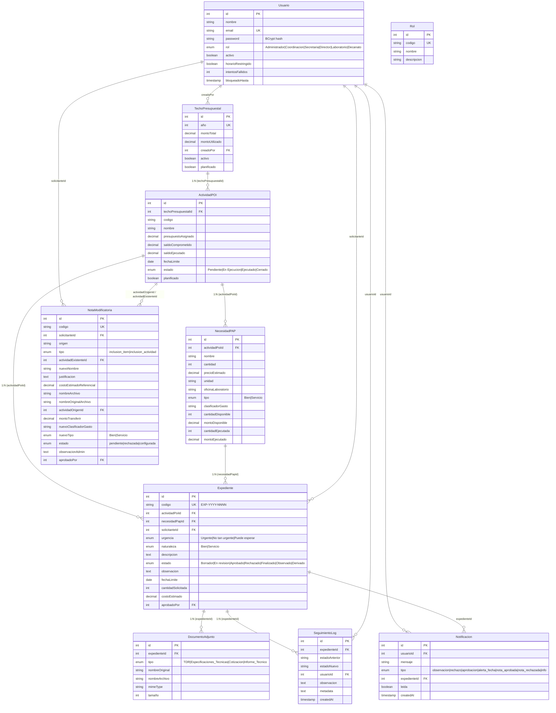
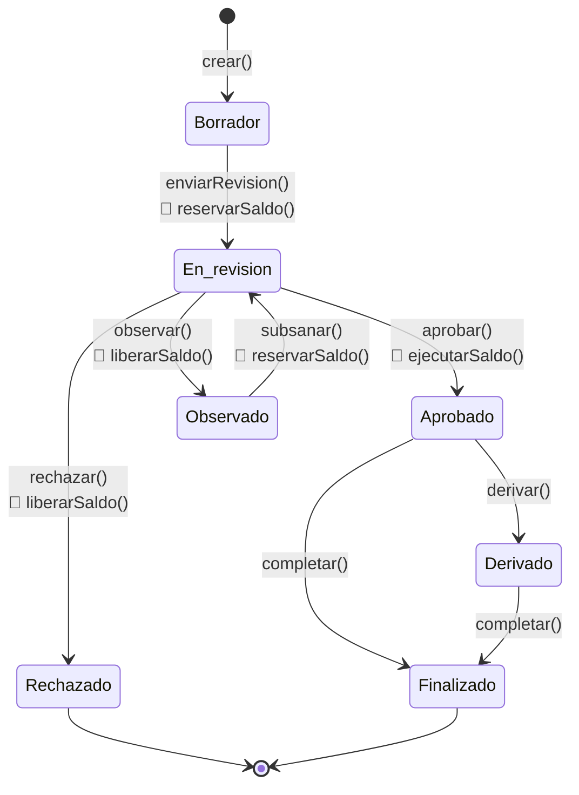
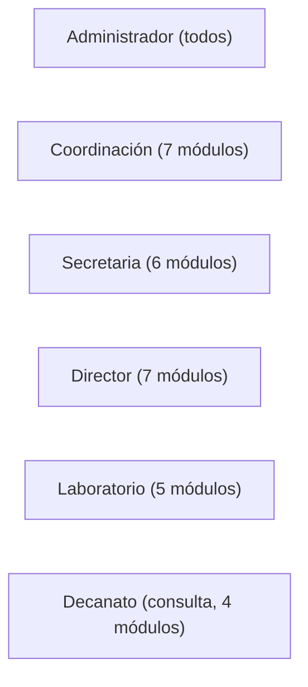
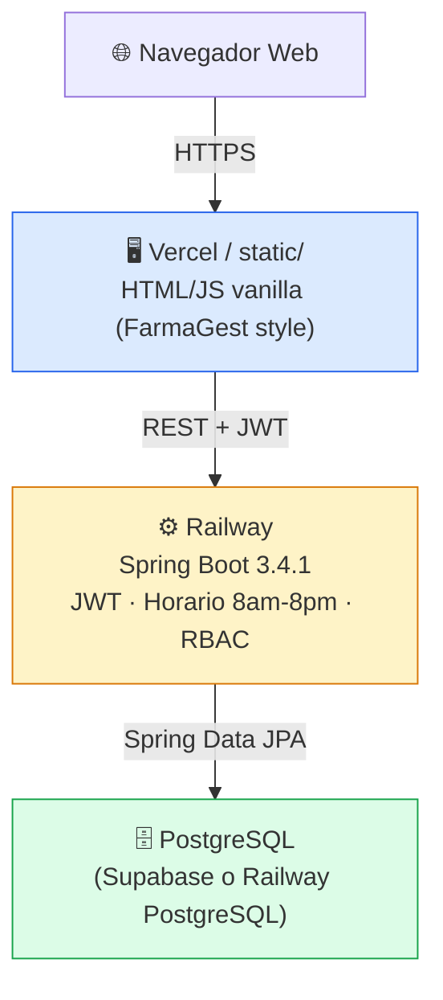

# DOMINIO SISEXP-UPLA — Documento consolidado para migración a Spring Boot

**Extraído directamente del código fuente (backend-as + frontend-as) del proyecto Express/React v2.0**  
**No es copia de la documentación — es el modelo REAL implementado**

---

## 1. VISIÓN GENERAL DEL SISTEMA

**Nombre:** SISEXP-UPLA (Sistema de Seguimiento y Control de Expedientes)  
**Propósito:** Automatizar la gestión presupuestal de expedientes administrativos de la Oficina de Asuntos Administrativos, Planificación y Presupuesto de la Facultad de Ingeniería de la UPLA.  
**Ciclo presupuestal completo:** Techo Presupuestal → Actividades POI → Necesidades PAP → Expedientes  
**Características:** 7 estados automáticos, 6 roles con RBAC por acción, reglas de negocio de reserva/liberación/ejecución de saldos, horario laboral 8am-8pm Perú.

---

## 2. MODELO DE DATOS — 11 ENTIDADES

### 2.1 DIAGRAMA ENTIDAD-RELACIÓN (MERMAID)



---

## 2.2 ESPECIFICACIÓN DETALLADA DE CADA ENTIDAD

### Usuario
| Campo | Tipo JPA | Nullable | Default | Notas |
|---|---|---|---|---|
| `id` | `Long` (auto) | NO | — | PK |
| `nombre` | `String(150)` | NO | — | |
| `email` | `String(150)` | NO | — | UK (username para login) |
| `password` | `String(255)` | NO | — | BCrypt hash, $2a$10 |
| `rol` | `@Enumerated(STRING)` | NO | — | Ver 2.3 Roles |
| `activo` | `Boolean` | — | `true` | Soft delete |
| `horarioRestringido` | `Boolean` | — | `false` | false = bypass horario |
| `intentosFallidos` | `Integer` | — | `0` | Bloqueo a los 5 |
| `bloqueadoHasta` | `LocalDateTime` | YES | — | Bloqueo 30 min |

**Relationships:**
- `@OneToMany` expedientes (solicitanteId)
- `@OneToMany` seguimientoLogs (usuarioId)

---

### TechoPresupuestal
| Campo | Tipo JPA | Nullable | Default | Notas |
|---|---|---|---|---|
| `id` | `Long` (auto) | NO | — | PK |
| `año` | `Integer` | NO | — | UK (ej: 2026) |
| `montoTotal` | `BigDecimal(12,2)` | NO | `0` | Presupuesto del año |
| `montoUtilizado` | `BigDecimal(12,2)` | NO | `0` | Total ejecutado en ese año |
| `creadoPor` | `Long` | YES | — | FK → Usuario |
| `activo` | `Boolean` | NO | `true` | |
| `planificado` | `Boolean` | NO | `false` | true = cerrado, no modificable |

**Relationships:**
- `@OneToMany` actividades (techoPresupuestalId)

---

### ActividadPOI
| Campo | Tipo JPA | Nullable | Default | Notas |
|---|---|---|---|---|
| `id` | `Long` (auto) | NO | — | PK |
| `techoPresupuestalId` | `Long` | NO | — | FK → TechoPresupuestal |
| `codigo` | `String(20)` | NO | — | ej: "POI-2.01" |
| `nombre` | `String(255)` | NO | — | |
| `presupuestoAsignado` | `BigDecimal(12,2)` | NO | `0` | |
| `saldoComprometido` | `BigDecimal(12,2)` | NO | `0` | Reservado (expedientes en revisión) |
| `saldoEjecutado` | `BigDecimal(12,2)` | NO | `0` | Ya gastado (expedientes aprobados) |
| `fechaLimite` | `LocalDate` | YES | — | |
| `estado` | `@Enumerated(STRING)` | — | `Pendiente` | Ver 2.3 Estados POI |
| `planificado` | `Boolean` | NO | `false` | |

**Relationships:**
- `@ManyToOne` TechoPresupuestal
- `@OneToMany` necesidadesPAP
- `@OneToMany` expedientes

**Disponible real:** `presupuestoAsignado - saldoComprometido - saldoEjecutado`

---

### NecesidadPAP
| Campo | Tipo JPA | Nullable | Default | Notas |
|---|---|---|---|---|
| `id` | `Long` (auto) | NO | — | PK |
| `actividadPoiId` | `Long` | NO | — | FK → ActividadPOI |
| `nombre` | `String(255)` | NO | — | |
| `cantidad` | `Integer` | NO | `1` | Cantidad planificada total |
| `precioEstimado` | `BigDecimal(10,2)` | NO | `0` | Precio unitario |
| `unidad` | `String(50)` | YES | — | ej: "unidad", "licencia" |
| `oficinaLaboratorio` | `String(150)` | YES | — | |
| `tipo` | `@Enumerated(STRING)` | — | `Bien` | Bien o Servicio |
| `clasificadorGasto` | `String(30)` | YES | — | ej: "2.3.1.2.1.1" |
| `cantidadDisponible` | `Integer` | NO | `0` | Disponible para reservar |
| `montoDisponible` | `BigDecimal(12,2)` | NO | `0` | Monto disponible |
| `cantidadEjecutada` | `Integer` | NO | `0` | Ya ejecutado |
| `montoEjecutado` | `BigDecimal(12,2)` | NO | `0` | Monto ya ejecutado |

**Relationships:**
- `@ManyToOne` ActividadPOI
- `@OneToMany` expedientes

---

### Expediente
| Campo | Tipo JPA | Nullable | Default | Notas |
|---|---|---|---|---|
| `id` | `Long` (auto) | NO | — | PK |
| `codigo` | `String(20)` | NO | — | UK, formato EXP-YYYY-NNNN secuencial |
| `actividadPoiId` | `Long` | NO | — | FK → ActividadPOI |
| `necesidadPapId` | `Long` | NO | — | FK → NecesidadPAP |
| `solicitanteId` | `Long` | NO | — | FK → Usuario |
| `urgencia` | `@Enumerated(STRING)` | NO | — | Urgente / No tan urgente / Puede esperar |
| `naturaleza` | `@Enumerated(STRING)` | YES | — | Bien / Servicio |
| `descripcion` | `@Lob String` | YES | — | Texto libre |
| `estado` | `@Enumerated(STRING)` | — | `Borrador` | Ver 4. Estados |
| `observacion` | `@Lob String` | YES | — | |
| `fechaLimite` | `LocalDate` | YES | — | |
| `cantidadSolicitada` | `Integer` | NO | `1` | |
| `costoEstimado` | `BigDecimal(12,2)` | NO | `0` | cantidadSolicitada × precioEstimado PAP |
| `aprobadoPor` | `Long` | YES | — | FK → Usuario (quién aprobó) |

**Relationships:**
- `@ManyToOne` ActividadPOI
- `@ManyToOne` NecesidadPAP
- `@ManyToOne` Usuario (solicitante)
- `@OneToMany` documentosAdjuntos
- `@OneToMany` seguimientoLogs

---

### DocumentoAdjunto
| Campo | Tipo JPA | Nullable | Default | Notas |
|---|---|---|---|---|
| `id` | `Long` (auto) | NO | — | PK |
| `expedienteId` | `Long` | NO | — | FK → Expediente |
| `tipo` | `@Enumerated(STRING)` | NO | — | TDR / Especificaciones_Tecnicas / Cotizacion / Informe_Tecnico |
| `nombreOriginal` | `String(255)` | NO | — | Nombre original del archivo |
| `nombreArchivo` | `String(255)` | NO | — | Nombre en disco (UUID) |
| `mimeType` | `String(100)` | YES | — | ej: "application/pdf" |
| `tamaño` | `Integer` | YES | — | Bytes |

---

### SeguimientoLog
| Campo | Tipo JPA | Nullable | Default | Notas |
|---|---|---|---|---|
| `id` | `Long` (auto) | NO | — | PK |
| `expedienteId` | `Long` | NO | — | FK → Expediente |
| `estadoAnterior` | `String(30)` | YES | — | null en creación |
| `estadoNuevo` | `String(30)` | NO | — | |
| `usuarioId` | `Long` | NO | — | FK → Usuario |
| `observacion` | `@Lob String` | YES | — | |
| `metadata` | `@Lob String` | YES | — | JSON con datos extra |
| `createdAt` | `timestamp` | AUTO | — | Solo create, sin update |

---

### NotaModificatoria
| Campo | Tipo JPA | Nullable | Default | Notas |
|---|---|---|---|---|
| `id` | `Long` (auto) | NO | — | PK |
| `codigo` | `String(25)` | NO | — | UK |
| `solicitanteId` | `Long` | NO | — | FK → Usuario |
| `origen` | `String(200)` | YES | — | |
| `tipo` | `@Enumerated(STRING)` | NO | — | inclusion_item / inclusion_actividad |
| `actividadExistenteId` | `Long` | YES | — | FK → ActividadPOI |
| `nuevoNombre` | `String(255)` | NO | — | Nombre del nuevo item/actividad |
| `justificacion` | `@Lob String` | NO | — | |
| `costoEstimadoReferencial` | `BigDecimal(12,2)` | YES | `0` | |
| `nombreArchivo` | `String(255)` | YES | — | PDF de sustento |
| `nombreOriginalArchivo` | `String(255)` | YES | — | |
| `actividadOrigenId` | `Long` | YES | — | FK → ActividadPOI (de dónde sale el dinero) |
| `montoTransferir` | `BigDecimal(12,2)` | YES | — | |
| `nuevoClasificadorGasto` | `String(30)` | YES | — | |
| `nuevoTipo` | `@Enumerated(STRING)` | — | `Bien` | |
| `estado` | `@Enumerated(STRING)` | — | `pendiente` | pendiente / rechazada / configurada |
| `observacionAdmin` | `@Lob String` | YES | — | |
| `aprobadoPor` | `Long` | YES | — | FK → Usuario |

---

### Notificacion
| Campo | Tipo JPA | Nullable | Default | Notas |
|---|---|---|---|---|
| `id` | `Long` (auto) | NO | — | PK |
| `usuarioId` | `Long` | NO | — | FK → Usuario |
| `mensaje` | `String(500)` | NO | — | |
| `tipo` | `@Enumerated(STRING)` | NO | `info` | Ver 2.3 Tipos de notificación |
| `expedienteId` | `Long` | YES | — | FK → Expediente |
| `leida` | `Boolean` | — | `false` | |
| `createdAt` | `timestamp` | AUTO | — | Solo create, sin update |

---

## 2.3 ENUMS

```java
// Usuario
public enum RolUsuario { Administrador, Coordinacion, Secretaria, Director, Laboratorio, Decanato }

// ActividadPOI
public enum EstadoActividad { Pendiente, En_Ejecucion, Ejecutado, Cerrado }

// NecesidadPAP / Expediente
public enum Naturaleza { Bien, Servicio }

// Expediente
public enum EstadoExpediente { Borrador, En_revision, Aprobado, Rechazado, Finalizado, Observado, Derivado }
public enum Urgencia { Urgente, No_tan_urgente, Puede_esperar }

// DocumentoAdjunto
public enum TipoDocumento { TDR, Especificaciones_Tecnicas, Cotizacion, Informe_Tecnico }

// NotaModificatoria
public enum TipoNota { inclusion_item, inclusion_actividad }
public enum EstadoNota { pendiente, rechazada, configurada }

// Notificacion
public enum TipoNotificacion { observacion, rechazo, aprobacion, alerta_fecha, nota_aprobada, nota_rechazada, info }
```

---

## 3. ROLES, PERFILES Y PERMISOS (RBAC)

### 3.1 Roles (6)
| Rol | Perfil | Módulos visibles | Acceso horario |
|---|---|---|---|
| `Administrador` | admin_planificacion | 8 (todos) | Bypass 24/7 |
| `Coordinacion` | admin_planificacion | 7 (excepto Usuarios) | Restringido |
| `Secretaria` | secretarial | 6 | Restringido |
| `Director` | solicitante | 7 | Restringido |
| `Laboratorio` | solicitante | 5 | Restringido |
| `Decanato` | consulta | 4 | Restringido |

### 3.2 Perfiles (4)
```java
public enum Perfil {
    admin_planificacion,  // Administrador + Coordinacion
    solicitante,          // Director + Laboratorio
    secretarial,          // Secretaria
    consulta              // Decanato
}
```

### 3.3 Acciones y permisos (18 acciones)
| Acción | Roles permitidos |
|---|---|
| `EXP_CREAR` | Administrador, Coordinacion, Laboratorio, Director, Secretaria |
| `EXP_APROBAR_OBSERVAR` | Administrador, Coordinacion |
| `EXP_RECHAZAR` | Administrador, Coordinacion |
| `EXP_FINALIZAR` | Administrador, Coordinacion, Secretaria |
| `EXP_DERIVAR` | Administrador, Coordinacion, Secretaria |
| `EXP_CAMBIAR_ESTADO` | Administrador, Coordinacion |
| `EXP_VER_DERIVACION` | Administrador, Coordinacion, Secretaria |
| `EXP_SUBIR_DOCUMENTO` | Administrador, Coordinacion, Secretaria, Laboratorio, Director |
| `EXP_ELIMINAR_DOCUMENTO` | Administrador |
| `EXP_VER_TODOS` | Administrador, Coordinacion, Secretaria |
| `POI_CREAR_EDITAR` | Administrador |
| `POI_VER` | Todos (6 roles) |
| `PAP_CREAR_EDITAR` | Administrador, Coordinacion |
| `PAP_ELIMINAR` | Administrador |
| `TECHO_CREAR_EDITAR` | Administrador |
| `TECHO_VER` | Todos (6 roles) |
| `USUARIO_ADMIN` | Administrador |
| `REPORTES_VER` | Administrador, Coordinacion, Decanato, Director |

### 3.4 Navegación por rol (sidebar)
| Rol | Dashboard | Expedientes | Techos | POI | PAP | Reportes | Notas | Usuarios |
|---|---|---|---|---|---|---|---|---|
| Administrador | ✅ | ✅ | ✅ | ✅ | ✅ | ✅ | ✅ | ✅ |
| Coordinacion | ✅ | ✅ | ✅ | ✅ | ✅ | ✅ | ✅ | ❌ |
| Secretaria | ✅ | ✅ | ✅ | ✅ | ✅ | ❌ | ✅ | ❌ |
| Director | ✅ | ✅ | ✅ | ✅ | ✅ | ✅ | ✅ | ❌ |
| Laboratorio | ✅ | ✅ | ❌ | ✅ | ✅ | ❌ | ✅ | ❌ |
| Decanato | ✅ | ❌ | ❌ | ❌ | ✅ | ✅ | ✅ | ❌ |

### 3.5 Límite de monto por rol
| Rol | Límite |
|---|---|
| Administrador | Ilimitado |
| Coordinacion | Ilimitado |
| Secretaria | S/ 5,000 |
| Director | S/ 15,000 |
| Laboratorio | S/ 5,000 |
| Decanato | S/ 0 (solo consulta) |

---

## 4. ESTADOS DEL EXPEDIENTE — CICLO DE VIDA COMPLETO

### 4.1 Los 7 estados
```
Borrador → En_revision → Aprobado → Finalizado
                ↓            ↓
            Observado    Derivado → Finalizado
                ↓
            Rechazado (terminal)
```



### 4.2 Reglas de negocio por transición

| Transición | Acción en POI | Acción en PAP |
|---|---|---|
| **Borrador → En revisión** | `saldoComprometido += costoEstimado` | `cantidadDisponible -= cantidadSolicitada`, `montoDisponible -= costoEstimado` |
| **En revisión → Aprobado** | `saldoEjecutado += costoEstimado`, `saldoComprometido -= costoEstimado` | `cantidadEjecutada += cantidadSolicitada`, `montoEjecutado += costoEstimado` |
| **En revisión → Rechazado** | `saldoComprometido -= costoEstimado` | `cantidadDisponible += cantidadSolicitada`, `montoDisponible += costoEstimado` |
| **En revisión → Observado** | `saldoComprometido -= costoEstimado` | `cantidadDisponible += cantidadSolicitada`, `montoDisponible += costoEstimado` |
| **Observado → En revisión** | `saldoComprometido += costoEstimado` | `cantidadDisponible -= cantidadSolicitada`, `montoDisponible -= costoEstimado` |
| **Aprobado → Finalizado** | Sin cambio (ya ejecutado) | Sin cambio (ya ejecutado) |
| **Aprobado → Derivado** | Sin cambio | Sin cambio |

---

## 5. REGLAS DE NEGOCIO (BusinessRulesService — Spring Boot)

### 5.1 Ciclo presupuestal (extraído de `businessRules.service.js`)

```java
@Service
@Transactional
public class BusinessRulesService {

    // RF-3.1: Validar fecha límite de la actividad POI
    public void validarFechaLimite(Long actividadPoiId) {
        ActividadPOI actividad = actividadPOIRepo.findById(actividadPoiId).orElseThrow(...);
        if (actividad.getFechaLimite() == null) return;
        if (LocalDate.now().isAfter(actividad.getFechaLimite())) {
            throw new BusinessException("Fecha límite vencida...");
        }
    }

    // RF-3.2: Validar saldo disponible
    public SaldoInfo validarSaldoDisponible(Long actividadPoiId, BigDecimal costo) {
        ActividadPOI a = actividadPOIRepo.findById(actividadPoiId).orElseThrow(...);
        BigDecimal disponible = a.getPresupuestoAsignado()
            .subtract(a.getSaldoComprometido())
            .subtract(a.getSaldoEjecutado());
        if (costo.compareTo(disponible) > 0) {
            throw new BusinessException("Saldo insuficiente. Disponible: S/ " + disponible);
        }
        return new SaldoInfo(disponible, a.getPresupuestoAsignado(), ...);
    }

    // RF-3.3: Reservar saldo (al pasar a "En revisión")
    public void reservarSaldo(Long actividadPoiId, BigDecimal costo) {
        ActividadPOI a = actividadPOIRepo.findById(actividadPoiId).orElseThrow(...);
        a.setSaldoComprometido(a.getSaldoComprometido().add(costo));
        actividadPOIRepo.save(a);
    }

    // Liberar saldo comprometido (al rechazar u observar)
    public void liberarSaldo(Long actividadPoiId, BigDecimal costo) {
        ActividadPOI a = actividadPOIRepo.findById(actividadPoiId).orElseThrow(...);
        BigDecimal nuevo = a.getSaldoComprometido().subtract(costo);
        a.setSaldoComprometido(nuevo.compareTo(BigDecimal.ZERO) < 0 ? BigDecimal.ZERO : nuevo);
        actividadPOIRepo.save(a);
    }

    // Ejecutar saldo: mover de comprometido a ejecutado en POI + actualizar PAP
    public void ejecutarSaldo(Long actividadPoiId, BigDecimal costo,
                               Long necesidadPapId, int cantidadSolicitada) {
        // POI: comprometido → ejecutado
        ActividadPOI a = actividadPOIRepo.findById(actividadPoiId).orElseThrow(...);
        a.setSaldoComprometido(a.getSaldoComprometido().subtract(costo).max(ZERO));
        a.setSaldoEjecutado(a.getSaldoEjecutado().add(costo));
        actividadPOIRepo.save(a);

        // PAP: disponible → ejecutado
        if (necesidadPapId != null && cantidadSolicitada > 0) {
            ejecutarSaldoPAP(necesidadPapId, cantidadSolicitada, costo);
        }
    }

    // PAP: reservar (al pasar a En revisión)
    public void reservarSaldoPAP(Long necesidadPapId, int cantidadSolicitada, BigDecimal costo) {
        if (necesidadPapId == null) return;
        NecesidadPAP n = necesidadPAPRepo.findById(necesidadPapId).orElseThrow(...);
        if (cantidadSolicitada > n.getCantidadDisponible()) {
            throw new BusinessException("Cantidad solicitada excede la disponible");
        }
        n.setCantidadDisponible(n.getCantidadDisponible() - cantidadSolicitada);
        n.setMontoDisponible(n.getMontoDisponible().subtract(costo).max(ZERO));
        necesidadPAPRepo.save(n);
    }

    // PAP: liberar (al observar o rechazar)
    public void liberarSaldoPAP(Long necesidadPapId, int cantidadSolicitada, BigDecimal costo) {
        if (necesidadPapId == null) return;
        NecesidadPAP n = necesidadPAPRepo.findById(necesidadPapId).orElseThrow(...);
        n.setCantidadDisponible(n.getCantidadDisponible() + cantidadSolicitada);
        n.setMontoDisponible(n.getMontoDisponible().add(costo));
        necesidadPAPRepo.save(n);
    }

    // PAP: ejecutar (al aprobar)
    public void ejecutarSaldoPAP(Long necesidadPapId, int cantidadSolicitada, BigDecimal costo) {
        if (necesidadPapId == null) return;
        NecesidadPAP n = necesidadPAPRepo.findById(necesidadPapId).orElseThrow(...);
        n.setCantidadEjecutada(n.getCantidadEjecutada() + cantidadSolicitada);
        n.setMontoEjecutado(n.getMontoEjecutado().add(costo));
        necesidadPAPRepo.save(n);
    }

    // RF-3.4: Validar correspondencia Bien/Servicio entre PAP y expediente
    public void validarCorrespondenciaCaja(Long necesidadPapId, Naturaleza naturaleza) {
        NecesidadPAP n = necesidadPAPRepo.findById(necesidadPapId).orElseThrow(...);
        if (n.getTipo() != naturaleza) {
            throw new BusinessException("El ítem PAP es de tipo " + n.getTipo()
                + " pero se solicita como " + naturaleza);
        }
    }
}
```

---

## 6. VALIDACIONES DE NEGOCIO (BusinessValidationsService)

```java
@Service
public class BusinessValidationsService {

    // #3: Login con límite de intentos (5 fallos = bloqueo 30 min)
    public void checkLoginAttempts(Usuario usuario) { ... }
    public void registerFailedAttempt(Usuario usuario) { ... }

    // #5: Inmutabilidad de aprobados/finalizados/derivados
    public boolean validarInmutabilidad(Expediente e) {
        return List.of(EstadoExpediente.Aprobado,
            EstadoExpediente.Finalizado,
            EstadoExpediente.Derivado).contains(e.getEstado());
    }

    // #6: Límite de monto por rol
    public BigDecimal getLimiteMontoPorRol(RolUsuario rol) {
        return switch (rol) {
            case Administrador, Coordinacion -> null; // ilimitado
            case Director -> new BigDecimal("15000");
            case Secretaria, Laboratorio -> new BigDecimal("5000");
            case Decanato -> BigDecimal.ZERO;
        };
    }

    // #7: Validar actividad activa (no cerrada)
    public void validarActividadActiva(Long actividadPoiId) { ... }

    // #8: PAP obligatorio (al menos 1 necesidad registrada)
    public void validarPAPObligatorio(Long actividadPoiId) { ... }

    // #9: Tope 80% del disponible (un solo expediente no puede consumir >80%)
    public void validarTopeExpediente(Long actividadPoiId, BigDecimal costo) { ... }

    // #10: Período fiscal cerrado (no crear expedientes para años pasados)
    public void validarPeriodoFiscal(Long actividadPoiId) { ... }

    // #11: Documento obligatorio (al menos 1 PDF para enviar a revisión)
    public void validarDocumentoObligatorio(Long expedienteId) { ... }

    // #18: Edición bloqueada (solo Borrador permite editar campos)
    public void validarEdicionBloqueada(Expediente e) {
        if (e.getEstado() != EstadoExpediente.Borrador) {
            throw new BusinessException("Solo se pueden editar expedientes en Borrador");
        }
    }

    // #19: Techo cerrado (si planificado=true, no se puede modificar)
    public void validarTechoCerrado(Long techoPresupuestalId) { ... }
}
```

---

## 7. HORARIO LABORAL — FILTRO

**Regla:** Sistema accesible de 8:00 AM a 8:00 PM (hora Perú, `America/Lima`).

**Bypass:** Usuarios con `horarioRestringido = false` (solo Administrador por defecto) acceden 24/7.

**Excepciones:** `/api/health`, `/api/auth/*`, `/api/expedientes/rastreo/*` son públicas sin restricción de horario.

```java
@Component
public class HorarioLaboralFilter extends OncePerRequestFilter {

    @Override
    protected void doFilterInternal(HttpServletRequest request,
            HttpServletResponse response, FilterChain chain) {
        String path = request.getServletPath();

        // Rutas públicas: sin restricción
        if (path.startsWith("/api/auth") || path.equals("/api/health")
                || path.startsWith("/api/expedientes/rastreo")) {
            chain.doFilter(request, response);
            return;
        }

        ZonedDateTime ahora = ZonedDateTime.now(ZoneId.of("America/Lima"));
        int minutos = ahora.getHour() * 60 + ahora.getMinute();

        if (minutos >= 8 * 60 && minutos < 20 * 60) {
            chain.doFilter(request, response); // Dentro de horario
            return;
        }

        // Fuera de horario: verificar bypass
        Authentication auth = SecurityContextHolder.getContext().getAuthentication();
        if (auth != null) {
            Usuario user = (Usuario) auth.getPrincipal();
            if (!user.isHorarioRestringido()) {
                chain.doFilter(request, response);
                return;
            }
        }

        response.setStatus(403);
        response.setContentType("application/json");
        response.getWriter().write("{\"error\":\"Sistema fuera de horario laboral\"}");
    }
}
```

---

## 8. CÓDIGO DE EXPEDIENTE — SECUENCIAL POR AÑO

**Formato:** `EXP-YYYY-NNNN` (ej: `EXP-2026-0001`, `EXP-2026-0002`...)

**Lógica:**
```sql
SELECT MAX(codigo) FROM expedientes WHERE codigo LIKE 'EXP-YYYY-%'
→ Extraer NNNN → incrementar → formatear con 4 dígitos
```

**En Java:**
```java
public String generarNumeroExpediente() {
    int año = Year.now().getValue();
    String prefixo = "EXP-" + año + "-";
    String ultimo = expedienteRepo.findTopByCodigoStartingWithOrderByCodigoDesc(prefixo)
        .map(Expediente::getCodigo).orElse(prefixo + "0000");
    int seq = Integer.parseInt(ultimo.substring(ultimo.lastIndexOf('-') + 1)) + 1;
    return prefixo + String.format("%04d", seq);
}
```

---

## 9. ENDPOINTS — API REST

### 9.1 Auth
| Método | Ruta | Auth | Descripción |
|---|---|---|---|
| `POST` | `/api/auth/login` | Público | `{email, password}` → `{token, usuario}` |
| `GET` | `/api/expedientes/rastreo/:codigo` | Público | Consulta pública por código |

### 9.2 Expedientes
| Método | Ruta | Permiso |
|---|---|---|
| `GET` | `/api/expedientes` | `EXP_VER_TODOS` |
| `GET` | `/api/expedientes/:id` | — |
| `POST` | `/api/expedientes` | `EXP_CREAR` |
| `PUT` | `/api/expedientes/:id/estado` | `EXP_CAMBIAR_ESTADO` |
| `GET` | `/api/expedientes/:id/historial` | — |
| `POST` | `/api/expedientes/:id/documentos` | `EXP_SUBIR_DOCUMENTO` |
| `DELETE` | `/api/expedientes/documentos/:docId` | `EXP_ELIMINAR_DOCUMENTO` |
| `GET` | `/api/expedientes/documentos/:docId/download` | — |
| `GET` | `/api/expedientes/disponibilidad/:actividadId/:necesidadId` | — |

### 9.3 Dashboard
| Método | Ruta | Descripción |
|---|---|---|
| `GET` | `/api/dashboard/alertas` | Expedientes vencidos y próximos |
| `GET` | `/api/dashboard/saldos` | Saldos presupuestales por actividad |

### 9.4 Reportes (permiso: `REPORTES_VER`)
| Método | Ruta | Descripción |
|---|---|---|
| `GET` | `/api/reportes/expedientes` | Estadísticas por estado + vencidos |
| `GET` | `/api/reportes/poi` | POI general con % ejecución |
| `GET` | `/api/reportes/poi/:actividadId` | POI específico |
| `GET` | `/api/reportes/pap` | PAP general |
| `GET` | `/api/reportes/pap/:actividadId` | PAP específico |
| `GET` | `/api/reportes/anual/:anio` | Informe anual comparativo |

### 9.5 Usuarios (permiso: `USUARIO_ADMIN`)
| Método | Ruta |
|---|---|
| `GET` | `/api/usuarios` |
| `GET` | `/api/usuarios/:id` |
| `POST` | `/api/usuarios` |
| `PUT` | `/api/usuarios/:id` |

### 9.6 CRUDs completos
| Entidad | Ruta base | Permiso crear/editar |
|---|---|---|
| Actividades POI | `/api/poi` | `POI_CREAR_EDITAR` (Admin) |
| Necesidades PAP | `/api/pap` | `PAP_CREAR_EDITAR` (Admin, Coord) |
| Techos Presupuestales | `/api/techos` | `TECHO_CREAR_EDITAR` (Admin) |
| Notas Modificatorias | `/api/notas` | (flujo propio) |
| Notificaciones | `/api/notificaciones` | (automático + count) |

---

## 10. SEED DATA DE REFERENCIA

### Usuarios (6)
| Nombre | Email | Password | Rol | Horario |
|---|---|---|---|---|
| Jefe Administrativo | jefe@upla.edu.pe | jefe123 | Administrador | Bypass |
| Coordinador Admin | coord@upla.edu.pe | coord123 | Coordinacion | Restringido |
| Secretaria General | secretaria@upla.edu.pe | secretaria123 | Secretaria | Restringido |
| Director de Escuela | director@upla.edu.pe | director123 | Director | Restringido |
| Resp. Laboratorio | lab@upla.edu.pe | lab123 | Laboratorio | Restringido |
| Decano | decanato@upla.edu.pe | decanato123 | Decanato | Restringido |

### Roles (6)
| Código | Nombre |
|---|---|
| ADMIN | Administrador |
| COORD | Coordinacion |
| SEC | Secretaria |
| DIR | Director |
| LAB | Laboratorio |
| DEC | Decanato |

### Techos Presupuestales (2)
| Año | Monto Total | Monto Utilizado |
|---|---|---|
| 2025 | S/ 45,000 | S/ 45,000 |
| 2026 | S/ 115,000 | S/ 115,000 |

### Actividades POI (20)
- 4 de 2025 (Cerradas, históricas)
- 16 de 2026 distribuyendo S/ 115,000 (IDs 5-20)

### Necesidades PAP (13)
- 13 ítems en 7 actividades de 2026
- Ejemplos: Computadoras Core i7 (10 × S/1,200), Licencias Microsoft 365 (50 × S/100), Catering (150 × S/25), Microscopios (2 × S/2,500), Access Points WiFi 6 (4 × S/1,500)

### Expedientes (5 de ejemplo)
| Código | Estado | Costo |
|---|---|---|
| EXP-2026-0001 | En revision | S/ 3,600 |
| EXP-2026-0002 | Borrador | S/ 1,500 |
| EXP-2026-0003 | Aprobado | S/ 3,750 |
| EXP-2026-0004 | Finalizado | S/ 2,500 |
| EXP-2026-0005 | Observado | S/ 2,000 |

---

## 11. INCONSISTENCIAS DETECTADAS EN LA DOCUMENTACIÓN ORIGINAL

Documentadas en `docs/referencia/doc/Informe_Inconsistencias_SDD_ERS.md`. Las 4 **ALTAS** que debemos corregir:

1. **ERS RF-07:** Dice 3 estados (Pendiente, En proceso, Resuelto). La implementación real tiene **7 estados** (Borrador, En revisión, Aprobado, Rechazado, Finalizado, Observado, Derivado).
2. **SDD Actores:** Define 3 actores (Admin, Secretaría, Coordinadora). La implementación tiene **6 roles** (Agregar: Director, Laboratorio, Decanato).
3. **SDD Diccionario:** `cod_expediente varchar(10)` cuando el formato real es `CHAR(20)` (EXP-YYYY-NNNN = 14 caracteres).
4. **ERS:** RF-15 y RF-16 (autenticación, usuarios) están mezclados con CU-01. Deben moverse a capa transversal de seguridad.

---

## 12. DIAGRAMAS CLAVE PARA STARUML

### 12.1 Casos de Uso (16 CUs, 6 actores)



### 12.2 Secuencia — Login JWT
```
Usuario → LoginForm → AuthController → UsuarioRepo → DB
         → BCrypt.compare → JwtService.sign → {token, usuario}
```

### 12.3 Secuencia — Crear Expediente con Ciclo Presupuestal
```
Usuario → ExpeditionForm → ExpedienteController
    → BusinessRulesService.validarFechaLimite()
    → BusinessRulesService.validarSaldoDisponible()
    → BusinessRulesService.reservarSaldo()  // POI
    → BusinessRulesService.reservarSaldoPAP()  // PAP
    → generarNumeroExpediente() → EXP-YYYY-NNNN
    → ExpedienteRepo.save()
    → SeguimientoLogRepo.save("Expediente registrado")
```

### 12.4 Secuencia — Aprobar Expediente (En revisión → Aprobado)
```
Usuario → ExpeditionPage → PUT /api/expedientes/:id/estado {estado:"Aprobado"}
    → ExpedienteController.actualizarEstado()
    → BusinessRulesService.ejecutarSaldo()  // POI: comprometido→ejecutado
    → BusinessRulesService.ejecutarSaldoPAP()  // PAP: disponible→ejecutado
    → ExpedienteRepo.update(estado="Aprobado")
    → SeguimientoLogRepo.save("Aprobado")
```

### 12.5 Secuencia — Adjuntar Documento
```
Usuario → UploadForm → POST /api/expedientes/:id/documentos (multipart)
    → validar estado editable (Borrador/Observado)
    → guardar archivo → DocumentoAdjuntoRepo.save()
    → SeguimientoLogRepo.save("Documento adjuntado: nombre.pdf")
```

### 12.6 Secuencia — Dashboard (KPIs + Saldos)
```
Usuario → Dashboard → GET /api/dashboard/alertas + GET /api/dashboard/saldos
    → ExpedienteRepo.countByEstado + vencidos
    → ActividadPOIRepo.findAll con JOIN TechoPresupuestal
    → barras de progreso (ejecutado/comprometido/disponible)
```

---

## 13. DIAGRAMA DE DESPLIEGUE



---

## 14. CONSIDERACIONES PARA LA MIGRACIÓN A SPRING BOOT

### Lo que se mantiene igual
- Modelo de datos (11 entidades con las mismas relaciones)
- Reglas de negocio (ciclo presupuestal, validaciones)
- RBAC (6 roles, 4 perfiles, 18 acciones)
- Horario laboral (8am-8pm, bypass Admin)
- Estados del expediente (7 estados con transiciones)
- Código secuencial (EXP-YYYY-NNNN)
- JWT 30 días
- Seed data

### Lo que cambia
| Express/Sequelize | Spring Boot/JPA |
|---|---|
| `sequelize.define()` | `@Entity` + `@Table` |
| `DataTypes.ENUM` | `@Enumerated(STRING)` |
| `DataTypes.DECIMAL` | `@Column(precision=12, scale=2) BigDecimal` |
| `belongsTo/hasMany` | `@ManyToOne` / `@OneToMany` |
| `beforeCreate` hook | `@PrePersist` |
| `bcryptjs` | `BCryptPasswordEncoder` |
| `jsonwebtoken` | `jjwt` 0.12.6 |
| `multer` | `Spring MultipartFile` |
| `req.usuario` | `@AuthenticationPrincipal` o `SecurityContextHolder` |
| `authorizeAction()` | `@PreAuthorize` o custom `PermissionEvaluator` |

### Tecnologías a usar (de AGENTS.md)
- Spring Boot 3.4.1 + Java 17 + Maven
- Spring Security + JWT (jjwt 0.12.6)
- Spring Data JPA + PostgreSQL
- Spring Validation (`@Valid`, `@NotBlank`, etc.)
- BCryptPasswordEncoder para passwords
- Jackson para JSON (incluido en spring-boot-starter-web)
- Frontend: HTML/JS vanilla en `static/` del JAR (mismo patrón FarmaGest)
