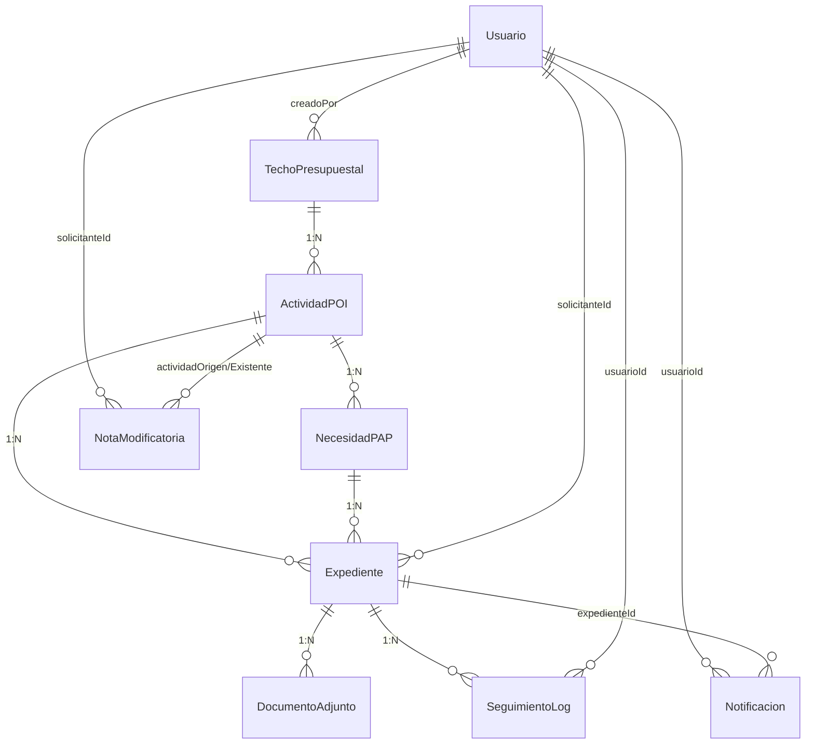
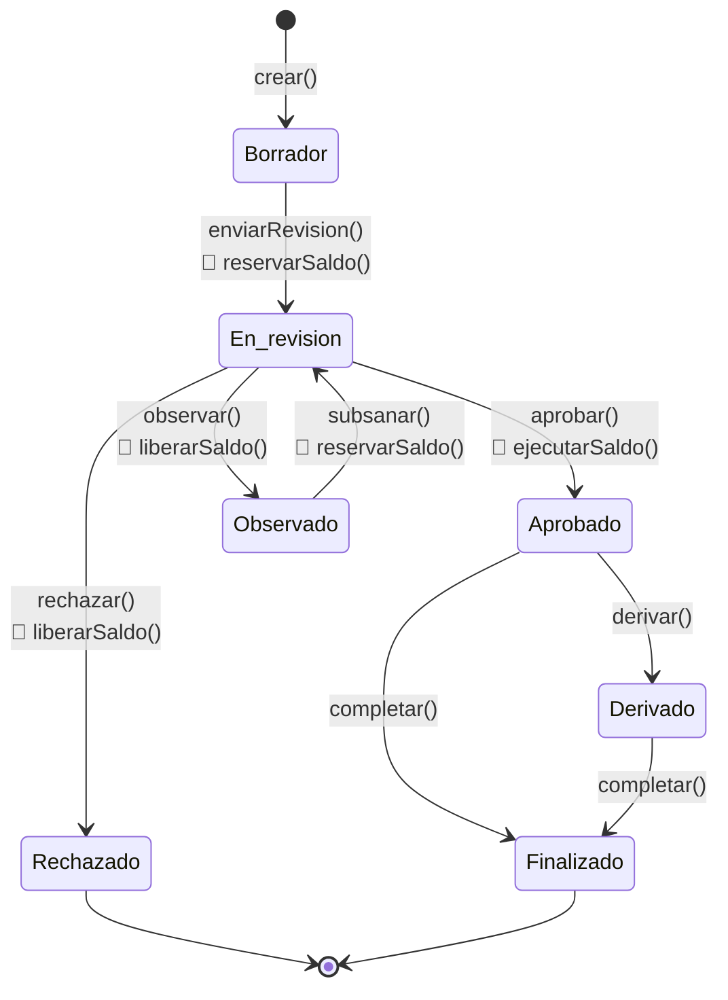
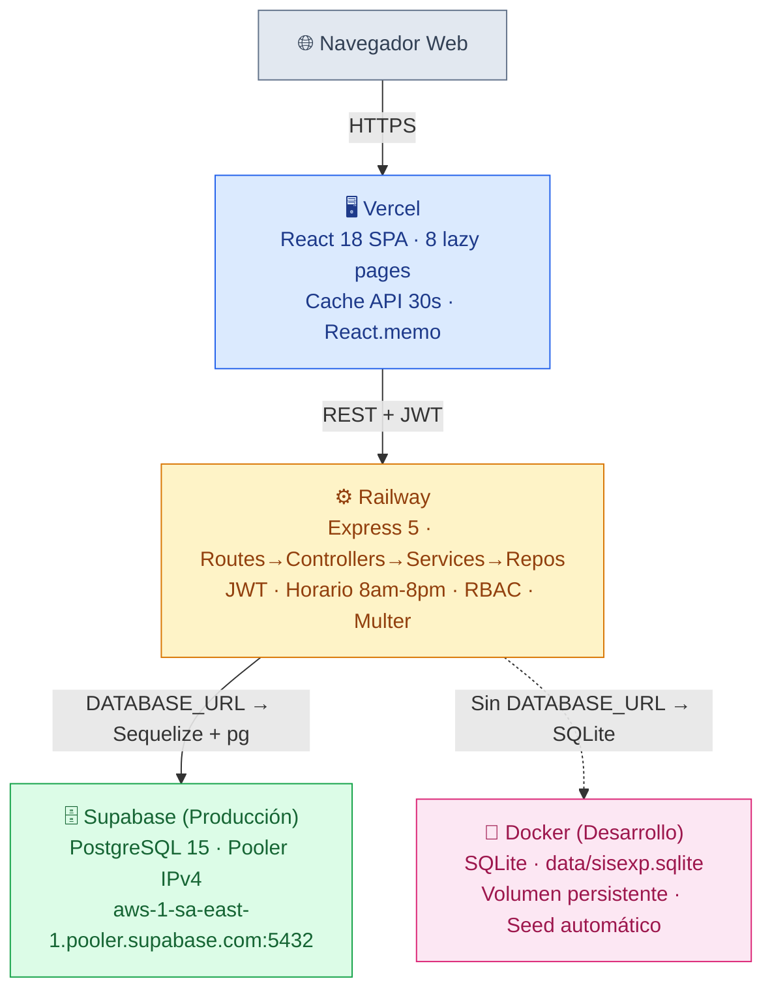
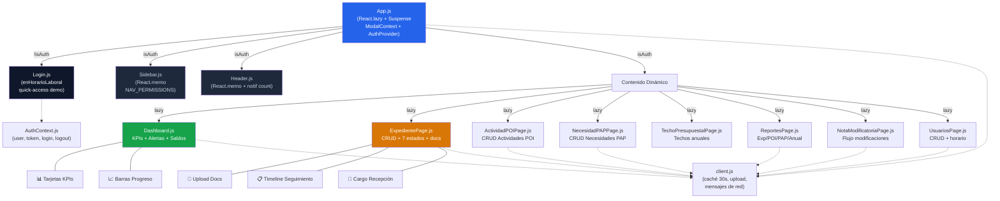
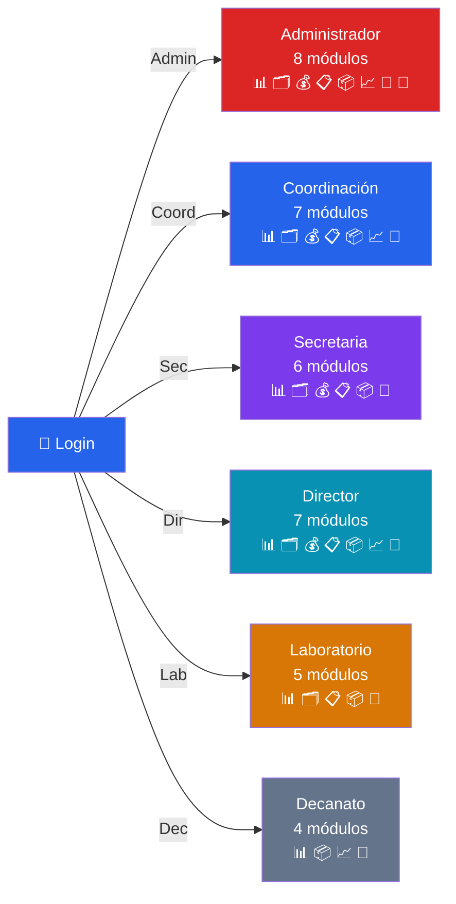

# SISEXP-UPLA — Informe de Trazabilidad v4.0

**Sistema de Seguimiento y Control de Expedientes**  
**Universidad Peruana Los Andes — Facultad de Ingeniería**  
**Escuela Profesional de Ingeniería de Sistemas y Computación**  
**Curso: Arquitectura de Software · VIII Ciclo · 2026**  
**Versión 4.0 · Mayo 2026**

---

## 1. Introducción y alcance

Este informe documenta la trazabilidad entre los Casos de Uso definidos en el SDD (IEEE 1016-2009) y la implementación v2.0 del sistema SISEXP-UPLA, siguiendo la metodología **ICONIX**.

El sistema SISEXP-UPLA es una aplicación web para automatizar la gestión presupuestal de expedientes administrativos de la Oficina de Asuntos Administrativos, Planificación y Presupuesto de la Facultad de Ingeniería de la Universidad Peruana Los Andes. Implementa el ciclo presupuestal completo: **Techo Presupuestal → Actividades POI → Necesidades PAP → Expedientes**, con 7 estados automáticos, 6 roles con RBAC por acción, y reglas de negocio de reserva/liberación/ejecución de saldos.

### Estado actual del proyecto (v2.0)

| CU | Descripción | Backend | Frontend | % |
|---|---|---|---|---|
| CU-01 | Gestionar expediente y documentos | Completo | Completo | **100%** |
| CU-02 | Gestionar proyectos POI/PAP | Completo | Completo | **100%** |
| CU-03 | Gestionar observaciones y seguimiento | Completo (SeguimientoLog + businessValidations) | Integrado en ExpeditionPage | **80%** |
| CU-04 | Generar reportes institucionales | Completo | Completo | **100%** |
| CU-05 | Recibir notificaciones automáticas | Completo (modelo + controller) | Count en Header, sin página dedicada | **60%** |
| Transversal | Auth, Dashboard, Usuarios, Horario | Completo | Completo | **100%** |

---

## 2. Trazabilidad de Casos de Uso

### 2.1 CU-01: Gestionar expediente y documentos

| RF | Descripción | Backend | Frontend |
|---|---|---|---|
| RF-01 | Registrar expediente | `expediente.controller.js ::crear()` | `ExpedientePage.js` |
| RF-02 | Generar código único | `generarNumeroExpediente()` (EXP-YYYY-NNNN secuencial) | Automático |
| RF-03 | Validar campos obligatorios | Sequelize NOT NULL + `businessValidations.service.js` | Validación en formulario |
| RF-06 | Historial automático | `SeguimientoLog` model + triggers en create/update | Timeline en detalle |
| RF-07 | Actualizar estado | `expediente.controller.js ::actualizarEstado()` | Panel de clasificación (7 estados) |
| RF-08 | Consulta pública por rastreo | `GET /api/expedientes/rastreo/:codigo` (público) | `TrackingPublic.js` |
| RF-18 | Búsqueda de expedientes | `expediente.controller.js ::listar()` | Tabla con filtros |
| — | Adjuntar documentos | `POST /api/expedientes/:id/documentos` | Upload en detalle |
| — | Descargar documentos | `GET /api/expedientes/documentos/:docId/download` | Botón descarga |
| — | Eliminar documentos | `DELETE /api/expedientes/documentos/:docId` | Botón eliminar |

### 2.2 CU-02: Gestionar proyectos POI/PAP

| Funcionalidad | Backend | Frontend |
|---|---|---|
| Techo Presupuestal CRUD | `techoPresupuestal.controller.js` | `TechoPresupuestalPage.js` |
| Actividades POI CRUD | `actividadPOI.controller.js` | `ActividadPOIPage.js` |
| Necesidades PAP CRUD | `necesidadPAP.controller.js` | `NecesidadPAPPage.js` |
| Ciclo presupuestal | `businessRules.service.js` (reservar/liberar/ejecutar saldo) | Dashboard (barras de progreso) |

### 2.3 CU-03: Gestionar observaciones y seguimiento

| Funcionalidad | Backend | Frontend |
|---|---|---|
| Historial de cambios | `SeguimientoLog` model + hooks automáticos | Timeline en `ExpedientePage.js` |
| Validaciones de negocio | `businessValidations.service.js` (10 reglas) | Mensajes de error en formularios |
| Observaciones de estado | Campo `observacion` en Expediente + estados Observado/Rechazado | Panel de clasificación |

### 2.4 CU-04: Generar reportes institucionales

| Funcionalidad | Backend | Frontend |
|---|---|---|
| Reporte de expedientes | `reporte.controller.js ::expedientes()` | `ReportesPage.js` |
| Reporte POI general | `reporte.controller.js ::poiGeneral()` | Tabla resumen |
| Reporte POI específico | `reporte.controller.js ::poiEspecifico()` | Detalle con gráficos |
| Reporte PAP | `reporte.controller.js ::papGeneral()` + `::papEspecifico()` | Tabla detallada |
| Informe anual | `reporte.controller.js ::informeAnual()` | Resumen por año |

### 2.5 CU-05: Recibir notificaciones automáticas

| Funcionalidad | Backend | Frontend |
|---|---|---|
| Generar notificación | `notificacion.controller.js` | — |
| 7 tipos de notificación | Observación, Rechazo, Aprobación, Alerta Fecha, Nota Aprobada, Nota Rechazada, Info | — |
| Contador en Header | `GET /api/notificaciones/count` | `Header.js` (badge numérico) |

---

## 3. Stack tecnológico

| Capa | Tecnología | Versión | Hosting |
|---|---|---|---|
| Frontend | React (CRA) + React.lazy code splitting | 18 | Vercel |
| Backend | Node.js + Express | 18 / 5 | Railway |
| ORM | Sequelize | 6.37 | — |
| BD Producción | PostgreSQL (Session Pooler IPv4) | 15 | Supabase |
| BD Desarrollo | SQLite | 3 | Docker |
| Auth | JWT + bcryptjs | — | — |
| Upload | multer (memoryStorage, 15 MB) | 1.4 | — |
| DevOps | Docker Compose | — | Local |

---

## 4. Modelo de datos

### 4.1 Diagrama Entidad-Relación



### 4.2 Tablas y columnas clave

| Tabla | Columnas clave |
|---|---|
| `techos_presupuestales` | id (PK), año, montoTotal, montoUtilizado, creadoPor (FK→usuarios) |
| `actividades_poi` | id (PK), techoPresupuestalId (FK), codigo, nombre, presupuestoAsignado, saldoComprometido, saldoEjecutado, estado (ENUM), fechaLimite |
| `necesidades_pap` | id (PK), actividadPoiId (FK), nombre, cantidad, precioEstimado, unidad, tipo (Bien/Servicio), cantidadDisponible, montoDisponible |
| `expedientes` | id (PK), codigo (UQ), actividadPoiId (FK), necesidadPapId (FK), solicitanteId (FK→usuarios), estado (ENUM 7), naturaleza, urgencia, costoEstimado |
| `documentos_adjuntos` | id (PK), expedienteId (FK), tipo (ENUM), nombreOriginal, nombreArchivo, mimeType, tamaño |
| `seguimiento_logs` | id (PK), expedienteId (FK), usuarioId (FK), estadoAnterior, estadoNuevo, observacion, metadata |
| `notas_modificatorias` | id (PK), solicitanteId (FK), actividadOrigenId (FK), actividadExistenteId (FK), tipo, estado, codigo |
| `notificaciones` | id (PK), usuarioId (FK), expedienteId (FK), mensaje, tipo (ENUM 7), leida |
| `usuarios` | id (PK), nombre, email (UQ), password (hash), rol (ENUM 6), activo, horarioRestringido |
| `roles` | id (PK), codigo, nombre, descripcion |

### 4.3 Estados del expediente (7 estados + transiciones automáticas)

| Estado | Transición desde | Regla de negocio |
|---|---|---|
| Borrador | Creación | Estado inicial |
| En revisión | Borrador / Observado | `reservarSaldo()` + `reservarSaldoPAP()` |
| Aprobado | En revisión | `ejecutarSaldo()` + `ejecutarSaldoPAP()` |
| Rechazado | En revisión | `liberarSaldo()` + `liberarSaldoPAP()` |
| Observado | En revisión | `liberarSaldo()` + `liberarSaldoPAP()` |
| Derivado | Aprobado | Derivar a otra área |
| Finalizado | Aprobado / Derivado | Ejecución completa |

### 4.4 Roles y permisos (6 roles, 4 perfiles)

| Rol | Perfil | Módulos |
|---|---|---|
| Administrador | admin_planificacion | 8 módulos (todos) |
| Coordinación | admin_planificacion | 7 módulos (excepto Usuarios) |
| Secretaria | secretarial | 6 módulos |
| Director | solicitante | 7 módulos |
| Laboratorio | solicitante | 5 módulos |
| Decanato | consulta | 4 módulos |

---

## 5. Diagramas ICONIX — Prompts completos para IA generativa

Cada sección contiene un prompt autosuficiente que puede copiarse y pegarse en cualquier IA (ChatGPT, Claude, GitHub Copilot) para generar el diagrama completo en Mermaid, PlantUML o Enterprise Architect. **No se requiere contexto adicional.** Los prompts incluyen todos los actores, casos de uso, entidades, relaciones, reglas de negocio y flujos exactos extraídos del código fuente real (`permissions.js`, `poiPap.associations.js`, `businessRules.service.js`, `config.js`).

---

### 5.1 Diagrama de Casos de Uso

**PROMPT IA:**

```
Genera un diagrama de casos de uso en formato PlantUML para el sistema SISEXP-UPLA 
v2.0 (Sistema de Gestión Presupuestal de Expedientes de la Universidad Peruana Los 
Andes). Usa la directiva left to right direction.

ACTORES (6 en total):
1. Administrador (alias: Admin) — acceso total, todos los módulos
2. Coordinacion (alias: Coord) — aprueba/observa, 7 módulos
3. Secretaria (alias: Sec) — registro y documentos, 6 módulos
4. Director (alias: Dir) — solicitante, 7 módulos
5. Laboratorio (alias: Lab) — solicitante, 5 módulos
6. Decanato (alias: Dec) — solo consulta, 4 módulos

PAQUETES Y CASOS DE USO CON SUS ASOCIACIONES EXACTAS:

PAQUETE "CU-01: Gestionar Expediente y Documentos":
- UC1 "Registrar expediente con ciclo presupuestal" → Admin, Coord, Sec, Dir, Lab
- UC2 "Clasificar expediente (7 estados: Borrador..Finalizado)" → Admin, Coord, Sec
- UC3 "Adjuntar documento (TDR, Cotización, Especificaciones, Informe)" → Admin, Coord, Sec, Dir, Lab
- UC4 "Consultar por código de rastreo (público, sin login)" → Dec
- UC5 "Aprobar / Rechazar expediente" → Admin, Coord

PAQUETE "CU-02: Gestionar Proyectos POI/PAP":
- UC6 "Gestionar Techo Presupuestal (presupuestos anuales)" → Admin, Coord, Sec, Dir
- UC7 "Gestionar Actividades POI (CRUD + estado)" → Admin, Coord, Sec, Dir, Lab
- UC8 "Gestionar Necesidades PAP (cantidades, precios, tipos)" → Admin, Coord, Sec, Dir, Lab, Dec

PAQUETE "CU-03: Observaciones y Seguimiento":
- UC9 "Registrar observación en expediente" → Admin, Coord
- UC10 "Ver historial de cambios (SeguimientoLog)" → Admin, Coord, Sec, Dir, Lab

PAQUETE "CU-04: Generar Reportes Institucionales":
- UC11 "Reporte de expedientes (por estado, vencidos)" → Admin, Coord, Dec, Dir
- UC12 "Reporte POI general y específico (ejecución presupuestal)" → Admin, Coord, Dec, Dir
- UC13 "Informe anual (comparativa por año)" → Admin, Coord, Dec, Dir

PAQUETE "CU-05: Recibir Notificaciones":
- UC14 "Recibir notificación (7 tipos: observación, rechazo, aprobación, alerta_fecha, nota_aprobada, nota_rechazada, info)" → Admin, Coord, Sec, Dir, Lab, Dec

PAQUETE "Transversal":
- UC15 "Gestionar usuarios (CRUD + horarioRestringido)" → Admin
- UC16 "Ver Dashboard (KPIs, alertas de vencimiento, saldos presupuestales con barras de progreso)" → Admin, Coord, Sec, Dir, Lab, Dec

Genera TODAS las asociaciones Actor→UseCase listadas arriba. No omitas ninguna.
```

**PlantUML renderizado directo:**

```plantuml
@startuml
left to right direction
actor "Administrador" as Admin
actor "Coordinacion" as Coord
actor "Secretaria" as Sec
actor "Director" as Dir
actor "Laboratorio" as Lab
actor "Decanato" as Dec

rectangle "CU-01: Gestionar Expediente y Documentos" {
  usecase "Registrar expediente" as UC1
  usecase "Clasificar expediente" as UC2
  usecase "Adjuntar documento" as UC3
  usecase "Consultar por codigo de rastreo" as UC4
  usecase "Aprobar / Rechazar" as UC5
}

rectangle "CU-02: Gestionar Proyectos POI/PAP" {
  usecase "Gestionar Techo Presupuestal" as UC6
  usecase "Gestionar Actividades POI" as UC7
  usecase "Gestionar Necesidades PAP" as UC8
}

rectangle "CU-03: Observaciones y Seguimiento" {
  usecase "Registrar observacion" as UC9
  usecase "Ver historial de cambios" as UC10
}

rectangle "CU-04: Generar Reportes" {
  usecase "Reporte de expedientes" as UC11
  usecase "Reporte POI" as UC12
  usecase "Informe anual" as UC13
}

rectangle "CU-05: Notificaciones" {
  usecase "Recibir notificaciones" as UC14
}

rectangle "Transversal" {
  usecase "Gestionar usuarios" as UC15
  usecase "Dashboard / KPIs" as UC16
}

Admin --> UC1; Admin --> UC2; Admin --> UC3; Admin --> UC5
Admin --> UC6; Admin --> UC7; Admin --> UC8; Admin --> UC9
Admin --> UC10; Admin --> UC11; Admin --> UC12; Admin --> UC13
Admin --> UC14; Admin --> UC15; Admin --> UC16

Coord --> UC1; Coord --> UC2; Coord --> UC3; Coord --> UC5
Coord --> UC7; Coord --> UC8; Coord --> UC9; Coord --> UC10
Coord --> UC11; Coord --> UC12; Coord --> UC13; Coord --> UC14; Coord --> UC16

Sec --> UC1; Sec --> UC2; Sec --> UC3; Sec --> UC6
Sec --> UC7; Sec --> UC8; Sec --> UC10; Sec --> UC14; Sec --> UC16

Dir --> UC1; Dir --> UC3; Dir --> UC6; Dir --> UC7
Dir --> UC8; Dir --> UC10; Dir --> UC11; Dir --> UC12
Dir --> UC13; Dir --> UC14; Dir --> UC16

Lab --> UC1; Lab --> UC3; Lab --> UC7; Lab --> UC8
Lab --> UC10; Lab --> UC14; Lab --> UC16

Dec --> UC4; Dec --> UC8; Dec --> UC10; Dec --> UC11
Dec --> UC12; Dec --> UC13; Dec --> UC14; Dec --> UC16
@enduml
```

**Guía Enterprise Architect:**
1. File → New Project → Model Wizard → **Use Case**
2. Crear paquete raíz "SISEXP-UPLA" → 6 sub-paquetes (CU-01 a CU-05 + Transversal)
3. Toolbox → **Actor** (×6). Renombrar: Administrador, Coordinacion, Secretaria, Director, Laboratorio, Decanato
4. Toolbox → **Use Case** (×16). Colocar cada uno en su paquete según la tabla de arriba
5. Toolbox → **Association**. Conectar cada Actor a sus Use Cases según la lista exacta del prompt
6. Doble click en cada Association → estereotipo `<<include>>` o `<<extend>>` si aplica

---

### 5.2 Diagramas de Robustez ICONIX (Boundary-Control-Entity)

**PROMPT IA:**

```
Genera 5 diagramas de robustez ICONIX para el sistema SISEXP-UPLA v2.0 usando 
estereotipos Boundary, Control y Entity. Regla fundamental de ICONIX: Boundary 
NUNCA se comunica directamente con Entity. Todo pasa por Control. El Actor solo 
se comunica con objetos Boundary.

═══════════════════════════════════════
DIAGRAMA 1 — Registrar Expediente (con ciclo presupuestal)
═══════════════════════════════════════
Actor: Usuario (credenciales válidas, rol con permiso EXP_CREAR)
Boundary: PantallaExpedientePage — formulario React con campos: selector de 
  Actividad POI, selector de Necesidad PAP, naturaleza (Bien/Servicio), 
  urgencia (Urgente/No tan urgente/Puede esperar), descripcion, 
  costoEstimado, cantidadSolicitada, fechaLimite. Botón "Crear expediente".
Control: ExpedienteController.crear() — recibe datos del formulario, 
  valida permisos (authorizeAction EXP_CREAR)
Control: BusinessRulesService.validarSaldoDisponible() — verifica que 
  costo <= (presupuestoAsignado - saldoComprometido - saldoEjecutado)
Control: BusinessRulesService.reservarSaldo() — suma costo a saldoComprometido,
  descuenta cantidadDisponible de PAP
Entity: ActividadPOI — presupuestoAsignado, saldoComprometido, saldoEjecutado
Entity: NecesidadPAP — cantidadDisponible, montoDisponible
Entity: Expediente — INSERT con estado="Borrador", codigo=EXP-YYYY-NNNN (secuencial)
Entity: SeguimientoLog — INSERT "Expediente registrado", estadoNuevo="Borrador"
Flujo: Actor → Boundary(completa formulario) → Control(crear) → 
  Control(validarSaldo) → Entity(ActividadPOI: consultar) → 
  Control(reservarSaldo) → Entity(ActividadPOI: UPDATE) → 
  Entity(Expediente: INSERT) → Entity(SeguimientoLog: INSERT) → 
  Control → Boundary(confirmación)

═══════════════════════════════════════
DIAGRAMA 2 — Adjuntar Documento
═══════════════════════════════════════
Actor: Usuario (rol con permiso EXP_SUBIR_DOCUMENTO)
Boundary: PanelUpload — sección de subida en ExpeditionPage. Input type=file, 
  selector de tipo de documento (TDR / Especificaciones_Tecnicas / 
  Cotizacion / Informe_Tecnico), botón "Subir documento"
Control: ExpedienteController.adjuntarDocumento() — recibe archivo (multipart)
Entity: Expediente — validar estado editable (solo Borrador u Observado permiten 
  modificaciones; Aprobado/Finalizado/Rechazado NO permiten)
Entity: DocumentoAdjunto — INSERT: nombreOriginal, nombreArchivo, mimeType, 
  tamaño, tipo (ENUM), ruta (local uploads/ o URL Supabase Storage)
Entity: SeguimientoLog — INSERT "Documento adjuntado: [nombreOriginal]"
Flujo: Actor → Boundary(selecciona archivo+tipo) → Control(adjuntarDocumento) → 
  Entity(Expediente: validar estado) → Entity(DocumentoAdjunto: INSERT) → 
  Entity(SeguimientoLog: INSERT) → Control → Boundary(lista actualizada)

═══════════════════════════════════════
DIAGRAMA 3 — Clasificar Expediente (cambio de estado con ciclo presupuestal)
═══════════════════════════════════════
Actor: Usuario (Admin o Coordinacion, permiso EXP_CAMBIAR_ESTADO)
Boundary: PanelClasificacion — selector dropdown con 7 estados, campo de texto 
  "observacion" para justificar el cambio, botón "Actualizar estado"
Control: ExpedienteController.actualizarEstado() — recibe nuevo estado + observacion
Control: BusinessRulesService — según la transición:
  - Si En revisión → Aprobado: ejecutarSaldo(actividadId, papId, costo, cantidad)
  - Si En revisión → Rechazado: liberarSaldo(actividadId, papId, costo)
  - Si En revisión → Observado: liberarSaldo(actividadId, papId, costo)
  - Si Observado → En revisión: reservarSaldo(actividadId, papId, costo)
  - Si Aprobado → Finalizado: sin cambio de saldo (ya ejecutado)
Entity: Expediente — UPDATE estado, UPDATE observacion
Entity: ActividadPOI — UPDATE saldoComprometido o saldoEjecutado según transición
Entity: NecesidadPAP — UPDATE cantidadDisponible/montoDisponible o 
  cantidadEjecutada/montoEjecutado según transición
Entity: SeguimientoLog — INSERT con estadoAnterior, estadoNuevo, observacion, 
  usuarioId, metadata
Flujo: Actor → Boundary(selecciona estado+observacion) → 
  Control(actualizarEstado) → Control(ejecutar/liberar/reservar según transición) → 
  Entity(ActividadPOI: UPDATE saldos) → Entity(NecesidadPAP: UPDATE cantidades) → 
  Entity(Expediente: UPDATE estado) → Entity(SeguimientoLog: INSERT) → 
  Control → Boundary(confirmación)

═══════════════════════════════════════
DIAGRAMA 4 — Consultar Dashboard (KPIs y Saldos)
═══════════════════════════════════════
Actor: Usuario (cualquier rol autenticado)
Boundary: PaginaDashboard — tarjetas KPIs (total expedientes, por estado, vencidos),
  barras de progreso presupuestal por actividad POI (ejecutado/comprometido/disponible),
  lista de alertas (próximos a vencer y vencidos)
Control: DashboardController.alertas() — GET /api/dashboard/alertas
Control: DashboardController.saldos() — GET /api/dashboard/saldos
Entity: Expediente — COUNT GROUP BY estado, WHERE fechaLimite < NOW() AND estado 
  NOT IN ('Finalizado','Rechazado') para vencidos
Entity: TechoPresupuestal — montoTotal, montoUtilizado del año actual
Entity: ActividadPOI — presupuestoAsignado, saldoComprometido, saldoEjecutado,
  fechaLimite, estado. JOIN con TechoPresupuestal
Flujo: Actor → Boundary(navega a Dashboard) → Control(alertas) → 
  Entity(Expediente: consultar conteos) → Control(saldos) → 
  Entity(TechoPresupuestal+ActividadPOI: consultar datos financieros) → 
  Control → Boundary(renderizar KPIs + barras de progreso + alertas)

═══════════════════════════════════════
DIAGRAMA 5 — Generar Reportes
═══════════════════════════════════════
Actor: Usuario (Admin/Coord/Dec/Dir, permiso REPORTES_VER)
Boundary: PaginaReportes — selector de tipo (expedientes / POI / PAP / anual), 
  selector de año, tabla de resultados, botones de acción
Control: ReporteController — según tipo seleccionado:
  expedientes(): COUNT GROUP BY estado, totales, vencidos
  poiGeneral(): JOIN actividades_poi + techos_presupuestales, % ejecución
  papGeneral(): JOIN necesidades_pap + actividades_poi + techos
  informeAnual(anio): comparativa por año
Entity: Expediente — datos agregados por estado
Entity: ActividadPOI — presupuestoAsignado, saldoEjecutado, % completado
Entity: NecesidadPAP — cantidadEjecutada vs cantidadDisponible
Entity: TechoPresupuestal — montoTotal, montoUtilizado por año
Flujo: Actor → Boundary(selecciona tipo+año) → Control → 
  Entity(consultar datos según tipo) → Control → 
  Boundary(mostrar tabla con resultados)

Genera los 5 diagramas en formato de descripción estructurada. Para cada uno, 
lista: actores, objetos Boundary, objetos Control, objetos Entity, y el flujo 
completo de comunicación entre ellos.
```

**Guía Enterprise Architect para Robustez:**
1. New Diagram → **Analysis** → **Robustness**
2. Toolbox → **Boundary** (icono de pantalla con línea). Arrastrar uno por cada UI
3. Toolbox → **Control** (icono de círculo con flecha). Arrastrar uno por cada controlador/servicio
4. Toolbox → **Entity** (icono de círculo con línea inferior). Arrastrar uno por cada entidad/tabla
5. Toolbox → **Association**. Conectar siguiendo el flujo. **NUNCA** Boundary↔Entity directo
6. Esterotipos EA: `<<boundary>>`, `<<control>>`, `<<entity>>`
7. Agregar notas de texto para documentar reglas de negocio en transiciones de estado

---

### 5.3 Diagramas de Secuencia

**PROMPT IA:**

```
Genera 5 diagramas de secuencia en formato Mermaid sequenceDiagram para 
SISEXP-UPLA v2.0. Incluir participantes, mensajes, fragmentos alt/opt para 
bifurcaciones, y notas explicativas.

═══════════════════════════════════════
DIAGRAMA 1 — Login y Autenticación JWT
═══════════════════════════════════════
Participantes: Usuario, Login.js (React), ExpressAPI (Express 5), 
  AuthService (auth.service.js), DB (PostgreSQL o SQLite)

Flujo completo:
- Usuario → Login.js: Ingresa email + password en formulario
- Login.js → ExpressAPI: POST /api/auth/login {email, password}
- ExpressAPI → AuthService: login(email, password)
- AuthService → DB: SELECT * FROM usuarios WHERE email = :email AND activo = true
- DB → AuthService: Usuario {id, nombre, email, passwordHash, rol}
- alt usuario no encontrado
  - AuthService → ExpressAPI: throw Error("Credenciales inválidas")
  - ExpressAPI → Login.js: 401 {error: "Credenciales inválidas"}
- else usuario encontrado
  - AuthService → AuthService: bcrypt.compare(password, passwordHash)
  - alt contraseña incorrecta
    - AuthService → AuthService: incrementar intentosFallidos
    - opt intentosFallidos >= 5
      - AuthService → DB: UPDATE usuarios SET bloqueadoHasta = NOW() + 30min
    - end
    - AuthService → ExpressAPI: throw Error("Credenciales inválidas")
  - else contraseña correcta
    - AuthService → DB: UPDATE usuarios SET intentosFallidos = 0, bloqueadoHasta = NULL
    - AuthService → AuthService: jwt.sign({id, rol}, JWT_SECRET, {expiresIn: '8h'})
    - AuthService → ExpressAPI: {token, usuario: {id, nombre, email, rol}}
    - ExpressAPI → Login.js: 200 {token, usuario}
    - Login.js → Login.js: localStorage.setItem('token', token)
    - Login.js → Login.js: localStorage.setItem('user', JSON.stringify(usuario))
    - Login.js → Usuario: Redirigir a Dashboard
  - end
- end

═══════════════════════════════════════
DIAGRAMA 2 — Registrar Expediente con Ciclo Presupuestal
═══════════════════════════════════════
Participantes: Usuario, ExpeditionPage.js, ExpressAPI, 
  ExpedienteController, BusinessRulesService, DB

Flujo completo:
- Usuario → ExpeditionPage: Selecciona Actividad POI, Necesidad PAP, llena campos
- ExpeditionPage → ExpressAPI: POST /api/expedientes (JWT + body)
- ExpressAPI → ExpedienteController: crear(req)
- ExpedienteController → ExpedienteController: authorizeAction('EXP_CREAR')
- ExpedienteController → BusinessRulesService: validarFechaLimite(actividadId)
- BusinessRulesService → DB: SELECT fechaLimite FROM actividades_poi WHERE id = ?
- DB → BusinessRulesService: fechaLimite
- alt fechaLimite < today
  - BusinessRulesService → ExpedienteController: throw Error("Actividad fuera de plazo")
  - ExpedienteController → ExpressAPI: 400 Error
  - ExpressAPI → ExpeditionPage: {error: "Actividad fuera de plazo"}
- else fechaLimite OK
  - ExpedienteController → BusinessRulesService: validarSaldoDisponible(actividadId, necesidadId, costo, cantidad)
  - BusinessRulesService → DB: SELECT presupuestoAsignado - saldoComprometido - saldoEjecutado FROM actividades_poi WHERE id = ?
  - BusinessRulesService → DB: SELECT cantidadDisponible, montoDisponible FROM necesidades_pap WHERE id = ?
  - DB → BusinessRulesService: {saldoDisponible, cantidadDisponible, montoDisponible}
  - alt saldo insuficiente
    - BusinessRulesService → ExpedienteController: throw Error("Saldo insuficiente. Disponible: S/ X")
    - ExpedienteController → ExpressAPI: 400 Error
  - else saldo suficiente
    - ExpedienteController → BusinessRulesService: reservarSaldo(actividadId, necesidadId, costo, cantidad)
    - BusinessRulesService → DB: UPDATE actividades_poi SET saldoComprometido = saldoComprometido + costo
    - BusinessRulesService → DB: UPDATE necesidades_pap SET cantidadDisponible = cantidadDisponible - cantidad, montoDisponible = montoDisponible - (precioEstimado * cantidad)
    - ExpedienteController → ExpedienteController: generarNumeroExpediente() → EXP-2026-NNNN (secuencial)
    - ExpedienteController → DB: INSERT INTO expedientes (codigo, actividadPoiId, necesidadPapId, solicitanteId, naturaleza, urgencia, descripcion, costoEstimado, cantidadSolicitada, fechaLimite, estado='Borrador')
    - ExpedienteController → DB: INSERT INTO seguimiento_logs (expedienteId, estadoNuevo='Borrador', accion='Expediente registrado', usuarioId)
    - ExpedienteController → ExpressAPI: 201 {expediente}
    - ExpressAPI → ExpeditionPage: {expediente creado con código EXP-2026-NNNN}
    - ExpeditionPage → Usuario: Mostrar detalle del nuevo expediente
  - end
- end

═══════════════════════════════════════
DIAGRAMA 3 — Aprobar Expediente (En revisión → Aprobado)
═══════════════════════════════════════
Participantes: Usuario (Admin/Coord), ExpeditionPage.js, ExpressAPI,
  ExpedienteController, BusinessRulesService, DB

Flujo completo:
- Usuario → ExpeditionPage: En panel de clasificación, selecciona estado "Aprobado"
- ExpeditionPage → ExpressAPI: PUT /api/expedientes/:id/estado {estado: 'Aprobado', observacion: '...'}
- ExpressAPI → ExpedienteController: actualizarEstado(req)
- ExpedienteController → ExpedienteController: authorizeAction('EXP_CAMBIAR_ESTADO')
- ExpedienteController → DB: SELECT * FROM expedientes WHERE id = :id
- DB → ExpedienteController: {estadoActual: 'En revision', costoEstimado, cantidadSolicitada, actividadPoiId, necesidadPapId}
- alt estadoActual = 'En revision' AND estadoNuevo = 'Aprobado'
  - ExpedienteController → ExpedienteController: Validar transición permitida ✓
  - ExpedienteController → BusinessRulesService: ejecutarSaldo(actividadId, necesidadId, costo, cantidad)
  - BusinessRulesService → DB: UPDATE actividades_poi SET saldoComprometido = saldoComprometido - costo, saldoEjecutado = saldoEjecutado + costo
  - BusinessRulesService → DB: UPDATE necesidades_pap SET cantidadEjecutada = cantidadEjecutada + cantidad, montoEjecutado = montoEjecutado + (precioEstimado * cantidad)
  - ExpedienteController → DB: UPDATE expedientes SET estado = 'Aprobado', aprobadoPor = :usuarioId, observacion = :observacion
  - ExpedienteController → DB: INSERT INTO seguimiento_logs (expedienteId, estadoAnterior='En revision', estadoNuevo='Aprobado', observacion, usuarioId)
  - ExpedienteController → ExpressAPI: 200 {expediente actualizado}
  - ExpressAPI → ExpeditionPage: {expediente actualizado, estado: 'Aprobado'}
  - ExpeditionPage → Usuario: Timeline actualizado, saldo reflejado en Dashboard
- else transición no permitida
  - ExpedienteController → ExpressAPI: 400 {error: "Transición no permitida"}
  - ExpressAPI → ExpeditionPage: Mensaje de error
- end

═══════════════════════════════════════
DIAGRAMA 4 — Adjuntar Documento a Expediente
═══════════════════════════════════════
Participantes: Usuario, ExpeditionPage.js, ExpressAPI,
  ExpedienteController, Storage (uploads/ ó Supabase), DB

Flujo completo:
- Usuario → ExpeditionPage: Selecciona archivo, elige tipo de documento, click "Subir"
- ExpeditionPage → ExpressAPI: POST /api/expedientes/:id/documentos (multipart/form-data: archivo + tipo)
- ExpressAPI → ExpedienteController: adjuntarDocumento(req)
- ExpedienteController → ExpedienteController: authorizeAction('EXP_SUBIR_DOCUMENTO')
- ExpedienteController → DB: SELECT estado FROM expedientes WHERE id = :id
- DB → ExpedienteController: {estado}
- alt estado IN ('Aprobado', 'Finalizado', 'Rechazado')
  - ExpedienteController → ExpressAPI: 400 {error: "El expediente no permite modificaciones en este estado"}
  - ExpressAPI → ExpeditionPage: Error
- else estado IN ('Borrador', 'En revision', 'Observado', 'Derivado')
  - ExpedienteController → Storage: Guardar archivo (local: fs.writeFile en uploads/ o Supabase: upload al bucket 'documentos')
  - Storage → ExpedienteController: {ruta: 'uploads/nombre-archivo.pdf' o URL pública Supabase}
  - ExpedienteController → DB: INSERT INTO documentos_adjuntos (expedienteId, tipo, nombreOriginal, nombreArchivo, mimeType, tamaño, ruta)
  - ExpedienteController → DB: INSERT INTO seguimiento_logs (expedienteId, accion='Documento adjuntado: nombreOriginal', usuarioId)
  - ExpedienteController → ExpressAPI: 201 {documento}
  - ExpressAPI → ExpeditionPage: {documento creado}
  - ExpeditionPage → Usuario: Documento visible en lista con botón de descarga
- end

═══════════════════════════════════════
DIAGRAMA 5 — Ver Reportes (consulta de datos agregados)
═══════════════════════════════════════
Participantes: Usuario, ReportesPage.js, ExpressAPI, ReporteController, DB

Flujo completo:
- Usuario → ReportesPage: Navega a Reportes desde Sidebar
- ReportesPage → ExpressAPI: GET /api/reportes/expedientes (JWT)
- ExpressAPI → ReporteController: expedientes(req)
- ReporteController → ReporteController: autorizar REPORTES_VER (permite Admin/Coord/Dec/Dir)
- ReporteController → DB: SELECT estado, COUNT(*) as total FROM expedientes GROUP BY estado
- ReporteController → DB: SELECT COUNT(*) as vencidos FROM expedientes WHERE fechaLimite < CURRENT_DATE AND estado NOT IN ('Finalizado','Rechazado')
- DB → ReporteController: {porEstado: [...], vencidos: N}
- ReporteController → ExpressAPI: {total, porEstado, vencidos}
- ExpressAPI → ReportesPage: Datos de estadísticas
- ReportesPage → Usuario: Tarjetas + gráfico de distribución por estado

- Usuario → ReportesPage: Selecciona "POI" en el selector de tipo
- ReportesPage → ExpressAPI: GET /api/reportes/poi (JWT)
- ExpressAPI → ReporteController: poiGeneral(req)
- ReporteController → DB: SELECT a.*, t.año FROM actividades_poi a JOIN techos_presupuestales t ON a.techoPresupuestalId = t.id ORDER BY t.año DESC, a.codigo
- DB → ReporteController: [{actividad, presupuesto, ejecutado, comprometido, %, año}]
- ReporteController → ExpressAPI: Datos POI
- ExpressAPI → ReportesPage: Lista de actividades con % ejecución
- ReportesPage → Usuario: Tabla con barras de progreso por actividad

- Usuario → ReportesPage: Selecciona año específico para informe anual
- ReportesPage → ExpressAPI: GET /api/reportes/anual/2026 (JWT)
- ExpressAPI → ReporteController: informeAnual(req)
- ReporteController → DB: SELECT * FROM techos_presupuestales WHERE año = :anio
- ReporteController → DB: SELECT a.*, SUM(e.costoEstimado) as ejecutado FROM actividades_poi a LEFT JOIN expedientes e ON a.id = e.actividadPoiId AND e.estado IN ('Aprobado','Finalizado') WHERE a.techoPresupuestalId = :techoId GROUP BY a.id
- DB → ReporteController: Datos del año
- ReporteController → ExpressAPI: Informe anual
- ExpressAPI → ReportesPage: Resumen anual con comparativa
- ReportesPage → Usuario: Tabla resumen por actividad con % ejecutado

Genera los 5 diagramas de secuencia completos en Mermaid.
```

**Guía Enterprise Architect para Secuencia:**
1. New Diagram → **Interaction** → **Sequence**
2. Toolbox → **Lifeline** (uno por cada participante del diagrama). Nombrar cada uno
3. Toolbox → **Message** (flecha entre lifelines). Crear una flecha por cada paso del flujo
4. Toolbox → **Fragment** → **alt** (para bifurcaciones if/else). Dentro del fragment crear regiones separadas
5. Toolbox → **Fragment** → **opt** (para condiciones opcionales)
6. Agregar **Note** para documentar reglas de negocio (ej: "reservarSaldo: suma a saldoComprometido")

---

### 5.4 Diagrama de Estados del Expediente

**PROMPT IA:**

```
Genera un diagrama de estados en formato Mermaid stateDiagram-v2 para el ciclo de 
vida completo de un expediente en SISEXP-UPLA v2.0. Incluir 7 estados, todas las 
transiciones, y documentar las reglas de negocio del ciclo presupuestal 
(businessRules.service.js).

ESTADOS:
1. Borrador — estado inicial al crear el expediente (crear)
2. En_revision — enviado para revisión/aprobación (enviarRevision)
3. Aprobado — aprobado por Admin/Coordinación (aprobar)
4. Rechazado — rechazado definitivamente, fin del ciclo (rechazar)
5. Finalizado — ejecución completa, caso cerrado (completar)
6. Observado — devuelto con observaciones para subsanar (observar)
7. Derivado — derivado a otra área después de aprobado (derivar)

TRANSICIONES EXACTAS:
- [*] → Borrador: crear expediente
- Borrador → En_revision: enviar a revisión
  NOTA: reservarSaldo(actividadId, necesidadId, costo, cantidad)
  Suma costo a saldoComprometido de ActividadPOI
  Descuenta cantidadDisponible y montoDisponible de NecesidadPAP

- En_revision → Aprobado: aprobar
  NOTA: ejecutarSaldo(actividadId, necesidadId, costo, cantidad)
  Resta de saldoComprometido, suma a saldoEjecutado de POI
  Actualiza cantidadEjecutada y montoEjecutado de PAP

- En_revision → Rechazado: rechazar
  NOTA: liberarSaldo(actividadId, necesidadId, costo)
  Resta de saldoComprometido de POI
  Devuelve cantidadDisponible y montoDisponible de PAP

- En_revision → Observado: observar
  NOTA: liberarSaldo(actividadId, necesidadId, costo)
  Misma lógica que Rechazado pero permite subsanar y volver

- Observado → En_revision: subsanar observación
  NOTA: reservarSaldo(actividadId, necesidadId, costo, cantidad)
  Vuelve a reservar el saldo para continuar el proceso

- Aprobado → Finalizado: completar ejecución
- Aprobado → Derivado: derivar a otra área/oficina
- Derivado → Finalizado: completar derivación

- Rechazado → [*]: fin del ciclo (no hay retorno)
- Finalizado → [*]: fin del ciclo

VALIDACIONES DE NEGOCIO (businessValidations.service.js):
- validarInmutabilidad(): expedientes en Aprobado, Finalizado o Derivado NO pueden 
  modificarse ni eliminarse. Solo pueden cambiar a Finalizado o Derivado.
- validarEdicionBloqueada(): solo expedientes en Borrador permiten edición de campos
- validarDocumentoObligatorio(): al menos un PDF debe adjuntarse antes de enviar 
  a revisión (opcional, implementado como validación)

Genera el diagrama completo con TODAS las transiciones y notas de reglas de negocio.
```



**Guía Enterprise Architect para Estados:**
1. New Diagram → **State Machine**
2. Toolbox → **State** (×7). Nombrar: Borrador, En revisión, Aprobado, Rechazado, Finalizado, Observado, Derivado
3. Toolbox → **Initial** (círculo negro macizo) → Transition → Borrador
4. Toolbox → **Final** (círculo con borde) → Transition desde Rechazado y Finalizado
5. Toolbox → **Transition** (flecha). Crear una flecha por cada transición de la tabla
6. Doble click en cada Transition → **Name**: escribir el nombre de la acción (ej: `aprobar()`)
7. Doble click → **Effect**: escribir la regla de negocio (ej: `ejecutarSaldo(actId, papId, costo)`)
8. Colores sugeridos: Borrador=gris, Revisión=azul, Aprobado=verde, Rechazado=rojo, Finalizado=verde oscuro, Observado=amarillo, Derivado=naranja

---

### 5.5 Diagrama de Arquitectura — Despliegue

**PROMPT IA:**

```
Genera un diagrama de despliegue en formato Mermaid flowchart TB para la 
arquitectura de SISEXP-UPLA v2.0. Incluir 5 nodos con sus componentes internos 
y las conexiones entre ellos.

NODOS Y COMPONENTES:

1. Navegador Web (Cliente)
   - Usuario final accede via HTTPS
   - Interactúa con la SPA React

2. Vercel (Frontend — producción)
   - React 18 SPA con 8 páginas lazy-loaded (React.lazy + Suspense)
   - Cliente HTTP con caché en memoria (30s TTL, Map)
   - Autenticación JWT (AuthContext)
   - React.memo en Sidebar y Header
   - Skeleton loading animado durante carga de chunks

3. Railway (Backend — producción)
   - Express 5 API REST
   - Arquitectura en capas: Routes → Controllers → Services → Repositories → Models
   - 11 modelos Sequelize
   - Middleware: JWT (jsonwebtoken), horario laboral (8am-8pm Perú, bypass Admin), 
     CORS, errorHandler, upload (multer 15MB)
   - businessRules.service.js: ciclo presupuestal (reservar/liberar/ejecutar)
   - businessValidations.service.js: 10 reglas de validación
   - RBAC por acción (permissions.js): 6 roles, 4 perfiles, 18 acciones

4. Supabase (Base de Datos — producción)
   - PostgreSQL 15
   - Session Pooler IPv4: aws-1-sa-east-1.pooler.supabase.com:5432
   - Proyecto: vwsemldiehnjhspsdroi (región São Paulo)
   - Conexión SSL con rejectUnauthorized: false
   - Seleccionado cuando DATABASE_URL está presente

5. Docker (Entorno local — desarrollo)
   - SQLite 3 (dialect: 'sqlite', storage: './data/sisexp.sqlite')
   - Docker Compose: servicios backend-as + frontend-as
   - Volumen persistente: sisexp_data:/app/data
   - Seleccionado cuando DATABASE_URL NO está presente
   - Seed automático: 6 usuarios, 2 techos, 20 actividades, 13 necesidades, 5 expedientes

CONEXIONES:
- Navegador → Vercel: HTTPS (puerto 443)
- Vercel → Railway: REST JSON + JWT (Authorization: Bearer <token>)
- Railway → Supabase: Sequelize SQL con pg (cuando process.env.DATABASE_URL existe)
- Railway - - → Docker: Sequelize SQLite (desarrollo local, sin DATABASE_URL)

ESTILOS:
- Vercel: #dbeafe (azul claro)
- Railway: #fef3c7 (amarillo claro)
- Supabase: #dcfce7 (verde claro)
- Docker: #fce7f3 (rosa claro)
- Navegador: #e2e8f0 (gris claro)

Genera el diagrama completo.
```



**Guía Enterprise Architect para Despliegue:**
1. New Diagram → **Deployment**
2. Toolbox → **Node** (×5). Nombrar: Navegador, Vercel, Railway, Supabase, Docker
3. Toolbox → **Device** dentro de cada Node (para detallar componentes internos)
4. Toolbox → **Artifact** dentro de cada Device (ej: `businessRules.service.js`, `client.js`)
5. Toolbox → **Communication Path** (línea sólida) para conexiones de producción
6. Toolbox → **Dependency** (línea punteada) con estereotipo `<<dev>>` para Docker

---

### 5.6 Diagrama de Componentes React

**PROMPT IA:**

```
Genera un diagrama de componentes en formato Mermaid flowchart TD para el frontend 
React de SISEXP-UPLA v2.0.

COMPONENTES PRINCIPALES (carga eager — siempre se renderizan):
- App.js — orquestador principal. Contiene React.lazy + Suspense para 8 páginas,
  ModalContext (confirm/alert/prompt), AuthProvider
- Login.js — pantalla de login con: verificación de horario laboral 
  (enHorarioLaboral: 8am-8pm Perú), formulario email+password, 4 botones de 
  acceso rápido demo (Admin/Coord/Lab/Dec), pantalla de bloqueo fuera de horario
  con botón "Ingresar de todos modos"
- Sidebar.js — navegación lateral con React.memo. Filtra módulos por 
  NAV_PERMISSIONS[user.rol]. Colapsable (ancho 72px/240px). 8 items con 
  iconos emoji: 📊Dashboard, 📁Expedientes, 💰Techos, 📋POI, 📦PAP, 
  📈Reportes, 📑Notas, 👥Usuarios. Badge de notificaciones
- Header.js — barra superior con React.memo. Muestra rol+perfil del usuario 
  (ROL_PROFILE), iniciales en avatar circular, badge numérico de notificaciones 
  no leídas (GET /api/notificaciones/count cada 60s)

PÁGINAS (carga lazy — React.lazy + Suspense con PageSkeleton animado):
- Dashboard.js — 3 secciones: tarjetas KPIs (total expedientes, por estado, 
  vencidos), barras de progreso presupuestal (ejecutado/comprometido/disponible 
  con colores verde/naranja/azul), lista de alertas (próximos a vencer y vencidos)
- ExpeditionPage.js — CRUD completo: tabla con filtros y búsqueda, formulario 
  crear/editar (campos: actividad POI, necesidad PAP, naturaleza, urgencia, 
  descripción, costo, cantidad, fecha límite), panel de clasificación (selector 
  de 7 estados + campo observación), subida de documentos (input tipo + archivo), 
  timeline de seguimiento (lista cronológica de SeguimientoLog), hoja de derivación, 
  cargo de recepción (ventana de impresión)
- ActividadPOIPage.js — CRUD de actividades POI vinculadas a techo presupuestal.
  Tabla con: código, nombre, presupuesto, saldoComprometido, saldoEjecutado, 
  estado, fecha límite. Barras de progreso por actividad
- NecesidadPAPPage.js — CRUD de necesidades PAP vinculadas a actividad POI.
  Tabla con: nombre, cantidad, precio, unidad, tipo (Bien/Servicio), 
  clasificador, disponible vs ejecutado
- TechoPresupuestalPage.js — gestión de techos anuales. Tabla: año, monto total, 
  monto utilizado. Crear nuevo techo con año y monto
- ReportesPage.js — 4 modos: expedientes (estadísticas por estado), POI (tabla 
  con % ejecución), PAP (tabla detallada), anual (comparativa por año). 
  Selector de tipo + selector de año
- NotaModificatoriaPage.js — flujo de notas modificatorias: tabla con código, 
  solicitante, tipo (inclusión item/actividad), estado (pendiente/rechazada/
  configurada), origen. Modal crear nota
- UsuariosPage.js — CRUD de usuarios: tabla (nombre, email, rol, activo, 
  horarioRestringido), modal crear/editar con selector de rol (6 opciones) 
  y toggle horarioRestringido. Solo Administrador

APIs / CONTEXTOS:
- AuthContext.js — React Context. Provider con: {user, token, login(email,pass), 
  logout, isAuth}. Persiste en localStorage
- client.js — cliente HTTP centralizado. Métodos: get, post, put, del, upload 
  (FormData). Caché en memoria: Map con TTL 30s para GETs. Invalidación 
  automática por módulo en POST/PUT/DELETE. Mensajes de red amigables: 
  "Sin conexión al servidor", "Verifique su red"
- ModalContext.js — sistema de modales: confirm (sí/no con promesa), 
  promptText (input de texto), alert (solo OK). Usado por todas las páginas 
  para confirmaciones de eliminación, inputs de observación, etc.
- config.js — constantes: ROL_LABEL, ROL_COLOR, ROL_PROFILE (4 perfiles), 
  PUEDE (acciones permitidas), NAV_MODULES, NAV_PERMISSIONS (mapeo rol→módulos)

RELACIONES:
- App → Login (cuando !isAuth)
- App → Sidebar + Header + Contenido (cuando isAuth)
- Contenido → Dashboard | ExpeditionPage | ActividadPOIPage | NecesidadPAPPage | 
  TechoPresupuestalPage | ReportesPage | NotaModificatoriaPage | UsuariosPage 
  (según active state)
- ExpeditionPage → PanelUpload + TimelineSeguimiento + CargoRecepcion + HojaDerivacion
- Dashboard → TarjetasKPIs + ProgressBars + AlertsList
- App → AuthContext.Provider
- App → ModalContext.Provider
- Todas las páginas → client.js → Express API (Railway)

Genera el diagrama con todos los componentes, subcomponentes y conexiones.
```



---

### 5.7 Diagrama de Navegación por Roles

**PROMPT IA:**

```
Genera un diagrama de navegación en formato Mermaid flowchart LR mostrando 
qué módulos ve cada rol al iniciar sesión en SISEXP-UPLA v2.0.

NODO INICIAL: Login (pantalla de autenticación)

RAMAS POR ROL (datos exactos de NAV_PERMISSIONS en config.js):

Rol 1 — Administrador (8 módulos):
Dashboard, Expedientes, Techo Presupuestal, Actividades POI, PAP, Reportes, 
Notas Modificatorias, Usuarios

Rol 2 — Coordinacion (7 módulos):
Dashboard, Expedientes, Techo Presupuestal, Actividades POI, PAP, Reportes, 
Notas Modificatorias (sin Usuarios)

Rol 3 — Secretaria (6 módulos):
Dashboard, Expedientes, Techo Presupuestal, Actividades POI, PAP, 
Notas Modificatorias (sin Reportes ni Usuarios)

Rol 4 — Director (7 módulos):
Dashboard, Expedientes, Techo Presupuestal, Actividades POI, PAP, Reportes, 
Notas Modificatorias (sin Usuarios)

Rol 5 — Laboratorio (5 módulos):
Dashboard, Expedientes, Actividades POI, PAP, Notas Modificatorias 
(sin Techos, Reportes ni Usuarios)

Rol 6 — Decanato (4 módulos):
Dashboard, PAP, Reportes, Notas Modificatorias 
(solo consulta, sin crear/editar/eliminar)

PERFILES RBAC (agrupación de roles en permissions.js):
- admin_planificacion: Administrador + Coordinacion
- solicitante: Director + Laboratorio  
- secretarial: Secretaria
- consulta: Decanato

COLORES POR ROL (de config.js ROL_COLOR):
- Admin: #dc2626 (rojo)
- Coord: #2563eb (azul)
- Sec: #7c3aed (violeta)
- Dir: #0891b2 (cyan)
- Lab: #d97706 (naranja)
- Dec: #64748b (gris)

Genera el diagrama con el Login en azul central y 6 ramas de colores.
```



**Guía Enterprise Architect para Navegación:**
1. New Diagram → **Component** o **Use Case** (ambos funcionan)
2. Toolbox → **Component** (para cada nodo de rol)
3. Toolbox → **Dependency** (flechas desde Login a cada rol)
4. Agregar estereotipo `<<role>>` a cada componente de rol
5. Usar colores de fondo diferentes para cada rol

---

## 6. Conexiones y despliegue

| Componente | URL | Comando |
|---|---|---|
| Frontend (Vercel) | `https://sisexp-upla.vercel.app` | `cd frontend-as; vercel --prod` |
| Backend (Railway) | `https://backend-as-production.up.railway.app` | `cd backend-as; railway up` |
| BD Supabase | `vwsemldiehnjhspsdroi` (sa-east-1) | Pooler: `aws-1-sa-east-1.pooler.supabase.com:5432` |
| Health check | `/api/health` | GET público |
| Repo GitHub | `https://github.com/LuchitoAE/SISEXP-UPLA` | `git push origin main` |

### Flujo de trabajo completo

```
1. docker compose up --build -d     ← probar en local (Docker + SQLite)
2. Verificar backend + frontend
3. docker compose down              ← APAGAR (no dejar corriendo)
4. git add -A; git commit -m "..."
5. git push origin main
6. cd backend-as; railway up        ← Railway (PostgreSQL vía DATABASE_URL)
7. cd frontend-as; vercel --prod    ← Vercel
```

---

## 7. Inconsistencias detectadas (SDD vs ERS vs Implementación)

| # | Criticidad | Documento | Problema |
|---|---|---|---|
| 1 | **ALTA** | ERS (RF-07) | 3 estados vs 7 reales (Borrador..Finalizado) |
| 2 | **ALTA** | SDD | 3 actores vs 6 roles reales |
| 3 | **ALTA** | SDD | `cod_expediente varchar(10)` vs STRING(20) real |
| 4 | **ALTA** | ERS (RF-15/16) | Auth en CU-01. Es capa transversal. |
| 5 | **MEDIA** | SDD | varchar para campos ENUM. Corregir diccionario. |
| 6 | **MEDIA** | SDD | `tip_documento text` — debe ser ENUM |
| 7 | **MEDIA** | ERS/SDD | Roles no unificados entre documentos. |
| 8 | **BAJA** | SDD | `nom_documento varchar(50)` — longitud insuficiente. |
| 9 | **BAJA** | ERS | No contempla módulos POI/PAP/Techo (CU-02). |
| 10 | **BAJA** | Implementación | RF-04 (cargo de recepción) no implementado en v2.0 |

---

## 8. Recomendaciones

**Documentación:**
1. Corregir RF-07 en ERS: actualizar a los 7 estados reales.
2. Alinear actores entre SDD (3) e implementación (6).
3. Actualizar diccionario de datos del SDD con tipos reales (ENUM, STRING).
4. Mover RF-15/16 del ERS a sección de seguridad independiente.

**Desarrollo:**
5. Completar CU-05: página de notificaciones dedicada en frontend.
6. CU-03: extraer observaciones a página independiente.
7. Diseño responsive mobile completo (RNF-03).
8. Exportar PDF/Excel desde ReportesPage (window.print + descarga CSV).
9. Tests unitarios con Jest (infraestructura ya configurada).

---

## 9. Anexos

### Anexo A — Credenciales de prueba

| Rol | Email | Password | Horario |
|---|---|---|---|
| Administrador | jefe@upla.edu.pe | jefe123 | Bypass 24/7 |
| Coordinación | coord@upla.edu.pe | coord123 | Restringido |
| Secretaria | secretaria@upla.edu.pe | secretaria123 | Restringido |
| Director | director@upla.edu.pe | director123 | Restringido |
| Laboratorio | lab@upla.edu.pe | lab123 | Restringido |
| Decanato | decanato@upla.edu.pe | decanato123 | Restringido |

### Anexo B — Endpoints principales

| Método | Ruta | Auth | Permiso |
|---|---|---|---|
| `POST` | `/api/auth/login` | Público | — |
| `GET` | `/api/expedientes/rastreo/:codigo` | Público | — |
| `GET` | `/api/expedientes` | JWT | EXP_VER_TODOS |
| `POST` | `/api/expedientes` | JWT | EXP_CREAR |
| `PUT` | `/api/expedientes/:id/estado` | JWT | EXP_CAMBIAR_ESTADO |
| `POST` | `/api/expedientes/:id/documentos` | JWT | EXP_SUBIR_DOCUMENTO |
| `GET` | `/api/dashboard/alertas` | JWT | — |
| `GET` | `/api/dashboard/saldos` | JWT | — |
| `GET` | `/api/reportes/expedientes` | JWT | REPORTES_VER |
| `GET` | `/api/reportes/poi` | JWT | REPORTES_VER |
| `GET` | `/api/usuarios` | JWT | USUARIO_ADMIN |

### Anexo C — Documentos de referencia

| Documento | Estándar | Ubicación |
|---|---|---|
| ERS | IEEE 830-1998 | `documentos/ers/` |
| SDD | IEEE 1016-2009 | `documentos/sdd/` |
| Análisis de alineación | — | `documentos/Analisis_Alineacion_SDD_ERS.md` |
| Informe de inconsistencias | — | `documentos/Informe_Inconsistencias_SDD_ERS.md` |
| Guía de despliegue | — | `documentos/DEPLOY.md` |

---

**Equipo de Desarrollo**  
Aimituma García Iván Andy · Aquino Espinoza Luis Walter · Mosquera Zevallos Valerio

**Universidad Peruana Los Andes — Facultad de Ingeniería**  
**Mayo 2026**
